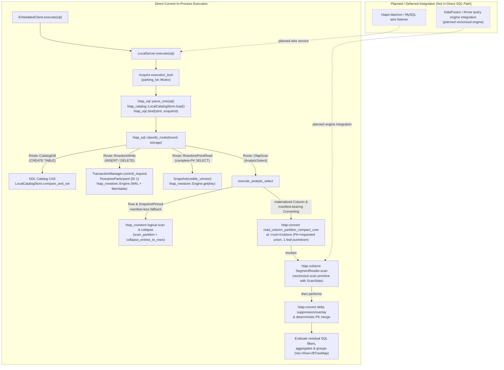
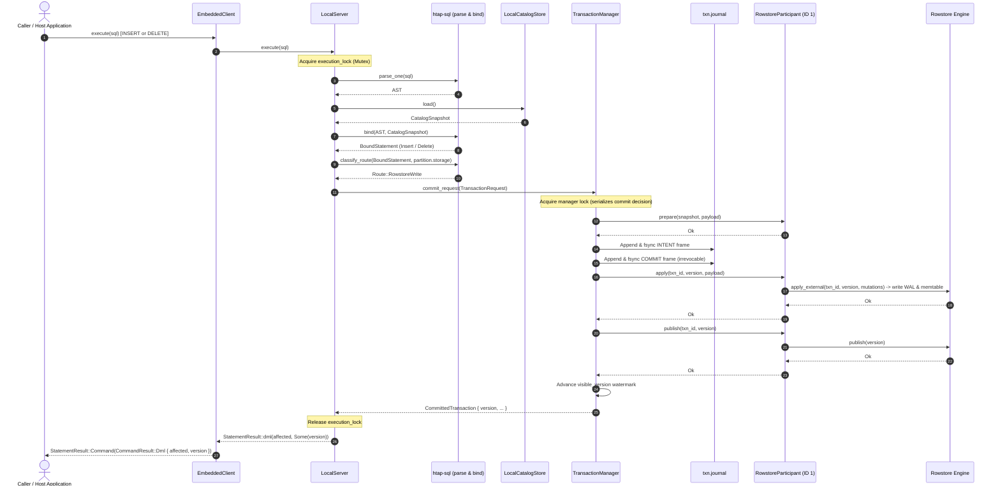

# Architecture

This document describes the intended system. Every component carries a status:

- `implemented` / `implemented (local MVP)` — built and covered by tests.
- `in progress` — partially built.
- `planned` / `deferred` — designed, not yet built in the local slice.

**Current state of the repository.** The cargo workspace skeleton, `htap-common`
(the `Version` MVCC domain, `FencingToken`, and shared error types),
`htap-rowstore` (WAL, memtable, SST writer/reader, and LSM row-store engine), and
`htap-colstore` (immutable encoded/compressed segments, typed zone maps, and vectorized scans)
are `implemented`. Phase 3 has a completed narrow local slice: sqlparser MySQL dialect,
strict binder (with typed `PointSelect` and `AnalyticSelect`), structural route classifier (`htap-sql`), durable catalog with reopen recovery
(`htap-catalog`), and synchronous `LocalServer` (`htap-server`) supporting `CREATE TABLE`, literal
`INSERT`, PK `DELETE`, complete-PK `SELECT` (strictly routing to `RowstorePointRead` and remaining separate and unchanged), and narrow analytical scans over logical rowstore
and base-plus-delta rows using server-root `<root>/colstore` for materialized `Column`/`Converting` partitions with projection-aware compact reads (PK+requested column union, single safe predicate-leaf pushdown into `SegmentReader`, delta suppression/overlay, deterministic PK ordering, and full residual SQL filter/aggregate/group evaluation) with reopen recovery.
Phase 4 has a completed local conversion MVP: partition-scoped row-to-column conversion (`htap-convert`)
with durable tablet columnar manifest envelopes, a four-phase state machine
(`SnapshotPinned -> SegmentsWritten -> ReadyToPublish -> Column`), atomic per-tablet manifest and
catalog publication, rowstore-authoritative base-plus-delta overlay, and online point writes/reads on
converting and columnar storage partitions.
Phase 5 has a completed local movement MVP (`htap-movement`): durable jobs (`HTAPJOB1`), CSV/JSONL
streaming import and full logical partition export materialization (exports materialize full logical partition before writing), and tablet snapshot clone/verify/repair (`HTAPMNF1`).
Phase 6 has a completed local coordination and placement MVP (`htap-coord`): synchronous `Coordinator`
trait, durable `LocalCoordinator` persisting at `COORDINATOR` (`HTAPCRD1`), deterministic sorted membership,
strictly monotonic fencing tokens (`FencingToken`), coordinator-fenced catalog CAS
(`fenced_catalog_compare_and_set`), deterministic placement planner (`plan_placement`), and coordinator-fenced
local replica staging and activation simulation (`stage_placement_addition`, `activate_placement_addition`,
`activate_placement_plan`).
Phase 7 has a completed local evidence MVP: Criterion microbenchmarks (`htap-bench`, `benches/local_mvp.rs`)
evaluating rowstore point get, colstore zone map scans, row-to-column conversion, CSV movement import,
coordinator placement planning, and coordinator leadership fenced CAS; and synchronous in-process embedded
client (`htap-client`, `EmbeddedClient`) providing an ergonomic SQL execution interface over `LocalServer`
with full test coverage in `crates/htap-client/tests/embedded_client.rs`. Root `README.md`, `docs/BENCHMARKS.md`,
and `docs/OPERATIONS.md` define the operational model, and `ci.sh` runs `cargo bench --workspace --no-run`.
Later components described below remain `planned` or `deferred` (explicitly deferred:
direct CatalogStore CAS and older movement repair APIs bypass coordinator fence; no Raft/`openraft`,
ZooKeeper backend, watches/locks/KV semantics, distributed consensus, concurrent shared-root writers / distributed coordination (concurrent shared-root operation remains unsupported),
remote physical movement, leader handoff, ongoing replication, capacity/rack placement, or live rebalance;
physical data migration for populated partition reorganization, physical rowstore reclamation, delete vectors, compaction,
autonomous background conversion scheduling, compound AND pushdown beyond one leaf, != pushdown, vectorized aggregation / operator pipelines, joins/CTEs/windows/ORDER/LIMIT/HAVING/OR/expressions/AVG/distinct,
multi-tablet/distributed scans, quotas/spill/cancellation, DataFusion/Arrow integration, MySQL wire protocol/`htapd` daemon,
sessions/`BEGIN`/`COMMIT`/`ROLLBACK`, `UPDATE`/non-partition `ALTER`/`DROP TABLE`, Docker image/Compose deployment, and broad MySQL compatibility;
note that metadata-only `Column -> Row` demotion via catalog CAS is implemented while physical reverse transcode and physical reclamation remain deferred).
See [`PROGRESS.md`](./PROGRESS.md).

---

## Component diagram

### Target / Planned Architecture Diagram (Qualified Intended State)

The following diagram illustrates the current active local MVP execution paths alongside the planned target architecture:

```mermaid
flowchart TD
    subgraph ActiveMVP ["Current Active Local MVP"]
        client["EmbeddedClient"] --> server["LocalServer"]
        server --> sql_pb["htap-sql parse/bind"]
        sql_pb --> catalog_bind["CatalogStore load/bind"]
        catalog_bind --> route_class["Route classifier"]

        route_class -->|"Route::CatalogDdl"| ddl_cas["LocalCatalogStore.compare_and_set"]
        route_class -->|"Route::RowstoreWrite"| txn_mgr["TransactionManager"]
        txn_mgr --> rowstore_part["RowstoreParticipant (ID 1)"]
        rowstore_part --> rowstore_engine["htap-rowstore Engine/WAL/Memtable/SST"]
        route_class -->|"Route::RowstorePointRead"| snap_read["visible snapshot"]
        snap_read --> engine_get["Engine.get"]
        route_class -->|"Route::OlapScan"| olap_exec["LocalServer OLAP executor"]
        olap_exec -->|"materialized Column & manifest-bearing Converting"| compact_read["htap-convert compact read"]
        compact_read -->|"invokes"| col_scan["htap-colstore SegmentReader.scan"]
        col_scan -->|"then performs"| delta_merge["htap-convert delta suppression/overlay & deterministic merge"]
        delta_merge --> logical_rows["logical rows/aggregates"]
        olap_exec -->|"Row & SnapshotPinned manifest-less Converting fallback"| row_scan["htap-rowstore logical scan / collapse"]
        row_scan --> logical_rows
    end

    subgraph PlannedTarget ["Planned / Deferred Target Architecture"]
        plan_wire["htapd/MySQL wire"]
        plan_df["DataFusion/Arrow"]
        plan_coord["distributed Coordinator Raft/ZooKeeper"]
        plan_remote["multi-tablet/remote serving"]
        plan_compact["delete vectors/compaction"]

        plan_wire -.->|"planned wire service"| plan_df
        plan_coord -.->|"planned cluster consensus"| plan_remote
        plan_df -.->|"planned distributed scan"| plan_remote
        plan_remote -.->|"planned maintenance"| plan_compact
    end

    classDef planned stroke-dasharray: 5 5;
    class plan_wire,plan_df,plan_coord,plan_remote,plan_compact planned;
```



The current active path operates entirely in-process within `LocalServer` without network overhead or distributed dependencies: queries submitted via `EmbeddedClient` are parsed and bound with `htap-sql` against `CatalogStore`, then classified into synchronous catalog DDL modifications via `LocalCatalogStore.compare_and_set`, 2PC transactional mutations routed through `TransactionManager` and `RowstoreParticipant (ID 1)` to the rowstore engine, single-row point lookups via visible snapshots, or local analytical scans (compact reads where `htap-convert` invokes `SegmentReader.scan` then performs delta suppression/overlay and deterministic merge for materialized `Column` and manifest-bearing `Converting` partitions, or rowstore logical scan/collapse fallback for `Row`, historical pre-base, and `SnapshotPinned` manifest-less partitions). In contrast, the planned target architecture—including the `htapd` MySQL wire protocol listener, DataFusion/Arrow vectorized queries, distributed coordination via Raft/ZooKeeper, multi-tablet remote partition serving, and delete vectors with background compaction—is deferred and strictly separated from active execution paths.

### Current In-Process Execution Call Flow (Implemented Local Slice)

In the implemented local slice, all SQL execution is synchronous and in-process. `EmbeddedClient` forwards calls directly to `LocalServer`, which acquires its execution lock, parses and binds the statement against the durable catalog, classifies the route, and delegates directly to the appropriate storage or transaction subsystem:



### DML Transaction Execution Sequence

Transactional mutations (`INSERT` and `DELETE`) execute through `LocalServer`'s single execution lock, 2PC `TransactionManager` logging, and rowstore participant application, returning the assigned monotonic MVCC version:



---

## Subsystem Boundaries: LocalServer, LocalConverter, and LocalCoordinator

It is important to emphasize that `LocalServer::open` does **not** create a persistent converter or instantiate `LocalCoordinator` (`crates/htap-coord`):
- `LocalServer` integrates only `LocalCatalogStore`, `htap_rowstore::Engine`, `TransactionManager` (with a single registered `RowstoreParticipant`), and `LocalDataMover`.
- `LocalServer::open` does not create a persistent converter; instead, `LocalServer::convert_table` creates a `LocalConverter` on demand under the server's `execution_lock` to execute partition conversion.
- `LocalCoordinator` is an independent cluster coordination and placement engine persisting its own state envelope at `<coord_root>/COORDINATOR` (`HTAPCRD1`).
Neither persistent converter background workers nor coordinator lease managers are created or managed by `LocalServer::open` or `EmbeddedClient`. They are standalone crate capabilities used directly in migration or coordination tasks.

---

## Process and role model

**Status: `implemented (local MVP)`** (synchronous `LocalServer` in-process execution façade and `EmbeddedClient` implemented for the narrow local slice; `htapd` daemon, network listeners, and MySQL wire protocol are planned/deferred).

The system architecture envisions a future **single binary, `htapd`** (planned), which can be run as:

- the **frontend role** — SQL surface, catalog, planner, transaction
  coordinator;
- the **backend role** — storage, execution, compaction;
- **both roles in one process**, planned for single-node development and deployments.

For the completed narrow local slice, `htap-server` provides `LocalServer` and `htap-client` provides `EmbeddedClient`,
synchronous in-process façades composing the durable catalog (`LocalCatalogStore`),
`htap-txn` transaction manager, and `htap-rowstore` LSM engine. Tables created via SQL DDL without `PARTITION BY` create a default single partition `p0`, while supported finite RANGE and LIST partitioning forms are parsed and bound through vendored `sqlparser` and routed through shared topology creation; the native non-SQL API (`LocalServer::create_partitioned_table`) remains available for programmatic definitions. In all cases, each individual partition currently requires exactly one bucket-0 row tablet and one healthy local leader replica (verified in
`crates/htap-server/tests/local_server.rs`). Sharding and placement capabilities in `htap-coord` and `htap-movement`
provide deterministic placement planning and local replica activation simulation, not sharded SQL serving across distributed nodes.
The current README demo and test suite use the `EmbeddedClient -> LocalServer` in-process façade to directly execute
`CREATE TABLE` (deterministic one-partition row topology), literal `INSERT`, PK `DELETE`,
and complete-PK `SELECT` with reopen recovery and error mapping, without networking or wire protocol overhead
(covered in `crates/htap-server/tests/local_server.rs` and `crates/htap-client/tests/embedded_client.rs`).

The frontend/backend boundary is preserved as an internal module boundary,
policed by crate dependencies. Splitting the two into separate processes is
therefore a **deployment choice, not a rewrite**.

---

## Dual-format storage

**Status: `implemented (local MVP)`** (`htap-rowstore`, `htap-colstore`, and local row-to-column conversion and Column-to-Row metadata demotion via `htap-convert` are implemented as local MVPs; physical data migration for populated partition reorganization, physical storage reclamation, delete vectors, compaction, autonomous conversion scheduler, and distributed conversion are planned/deferred).

| Format | Crate | Structure | Status |
| ------ | ----- | --------- | ------ |
| Row store (OLTP) | `htap-rowstore` | LSM: WAL, memtable, immutable sorted runs (SSTs), primary-key index, MVCC versions. | `implemented` |
| Column store (OLAP) | `htap-colstore` | Immutable segments of encoded (plain/dictionary), compressed (zstd) column blocks with typed zone maps and vectorized scanning. | `implemented` |

The `htap-colstore` implementation delivers the standalone columnar engine MVP:
durable binary segment files, plain and dictionary column encodings, optional zstd compression,
per-block CRC32C integrity checksums, typed zone maps (min, max, and nullability flags),
and vectorized scan execution with conservative pushdown pruning and selective column decoding
(verified in `crates/htap-colstore/tests/segment_roundtrip.rs`, `crates/htap-colstore/tests/scan.rs`,
and `crates/htap-colstore/tests/zone_map_skip.rs`).
Phase 4 integrates `htap-colstore` segments into partition-scoped conversion (`htap-convert`),
registering columnar segments in durable tablet manifests while keeping the rowstore authoritative
for online point mutations and post-conversion base-plus-delta queries.

Both formats share **one MVCC version domain** (`htap-common::Version`, which
is `implemented`). In the target architecture, a unified WAL across formats is envisioned.
In the current implementation, however, there is **no single shared WAL that atomically mutates
both row and column formats within a single transaction**: the **rowstore remains authoritative**
for all writes and commits through `TransactionManager` using `RowstoreParticipant` only
(`crates/htap-server/src/lib.rs`). Columnar storage is created via partition-scoped conversion
(`htap-convert`), and its durability and visibility are published separately via tablet manifests
(`HTAPTBM1`) and catalog metadata CAS updates. Current SQL statements touch the rowstore participant
exclusively; single transactions mutating both row and column representations simultaneously are
planned/deferred.

This separation preserves a unified MVCC version domain across storage formats without requiring
distributed two-phase commit between independent version spaces (see [ADR-004](./DECISIONS.md)).

---

## Freshness: delta store and merge-on-read

**Status: `implemented (local MVP)`** (authoritative rowstore base-plus-delta freshness overlay implemented for local conversion; delete vectors and background base compaction are planned/deferred).

A partition converted to or held in column format still accepts writes. In the Phase 4 local MVP,
those writes land directly in the authoritative **row store**, which acts as the live delta store:

- Historical reads prior to the conversion base version read directly from the rowstore.
- Materialized partition scans via the converter API (`LocalConverter::read_column_partition` / `htap_convert::read_column_partition`, verified in `crates/htap-convert/tests/materialization.rs`) scan the columnar base segments up to the conversion snapshot version and overlay rowstore mutations (`Put` and `Delete`) committed after that base version up to the target snapshot. Note that `read_column_partition` is a standalone converter query API, not SQL execution.
- Online transactional writes (`INSERT`, `DELETE`) and point reads (`SELECT` by primary key) execute directly against the row store (`Route::RowstoreWrite` and `Route::RowstorePointRead`), ensuring zero read or write interruption during and after conversion (verified in `crates/htap-server/tests/local_server.rs`).
- Bitmap delete vectors directly on columnar segments, physical rowstore reclamation, and background compaction folding deltas into new columnar segments are explicitly deferred.

---

## Query routing — the R5 guarantee, structurally enforced

**Status: `implemented (local MVP)`** (structural route classifier implemented for point lookups, DDL/DML, and narrow OLAP scans with compact base scan pushdown; full SQL breadth, vectorized aggregation / operator pipelines, compound pushdown beyond one leaf, and multi-partition routing are planned/deferred).

A router inspects the **bound** statement and the partition's **storage descriptor**:

- **Point lookups and short transactions that resolve fully against a primary key** take a dedicated fast path: index probe → row fetch. There is no plan-fragment construction and no vectorized operator pipeline. In `htap-sql`, complete-PK `SELECT` queries strictly bind to `PointSelect` and route to `Route::RowstorePointRead { key }` across all three storage formats (`Row`, `Column`, `Converting`), serving point reads directly from the authoritative rowstore without invoking OLAP execution or the converter (verified in `crates/htap-sql/tests/route.rs`, `crates/htap-sql/tests/parse_bind.rs`, `crates/htap-server/tests/local_server.rs`, and `crates/htap-client/tests/embedded_client.rs`). Complete-PK point read execution remains separate and unchanged.
- **Narrow OLAP Scans (`Route::OlapScan`):** `htap-sql` binds non-PK queries on a single unaliased table into typed `AnalyticSelect` structures routing to `Route::OlapScan`. `LocalServer` executes these narrow analytical scans over logical rowstore rows or the converter's rowstore-authoritative base-plus-delta view using server-root `<root>/colstore` for materialized `Column` and `Converting` partitions (validating catalog vs disk manifest generations).
  - **Supported OLAP SQL:** Exactly one unaliased table in `FROM`; plain projections (named columns or `*`, with optional aliases); AND-only typed filters (`=`, `!=`, `<`, `<=`, `>`, `>=`, `IS NULL`, `IS NOT NULL`) with SQL three-valued logic; aggregate functions `COUNT(*)`, `COUNT(column)`, `SUM(column)` (for `Int32`, `Int64`, and `Float64`), `MIN(column)`, and `MAX(column)`; deterministic `GROUP BY` with SQL NULL grouping; simple unqualified source/projected column `ORDER BY` with ASC/DESC and NULLS FIRST/LAST/default policy, global deterministic tie-break; evaluated against the current visible snapshot (`visible_version`).
  - **Base scan pushdown optimization:** For materialized `Column` and `Converting` partitions, `LocalServer` executes projection-aware compact reads (`read_column_partition_compact_core`) using the union of primary-key indices and requested source columns (from projections, `GROUP BY`, and filter leaves). It safely pushes down at most one eligible predicate leaf (`=`, `<`, `<=`, `>`, `>=`, `IS NULL`, `IS NOT NULL`) directly into columnar `SegmentReader::scan`. Stale base rows are suppressed via newest post-base rowstore deltas, mutations (`Put`/`Delete`) are overlaid, and rows are ordered by primary key deterministically before complete residual SQL filter, aggregate, and group evaluation.
  - **Internal execution evidence:** Columnar scan statistics and block pruning (`ScanStats`) are captured as internal execution evidence during compact reads, but the SQL layer continues to evaluate materialized logical rows; vectorized aggregation is not implemented.
- **Route Acceptance across Storage Formats:** `classify_route` accepts `StorageDescriptor::Row`, `StorageDescriptor::Column`, and `StorageDescriptor::Converting`:
  - `CREATE TABLE` and partition lifecycle `ALTER TABLE` route to `Route::CatalogDdl`.
  - Literal `INSERT` and PK `DELETE` route to `Route::RowstoreWrite` regardless of whether the partition is `Row`, `Column`, or `Converting`, preserving rowstore write-authority and zero mutation downtime.
  - Complete-PK `SELECT` routes to `Route::RowstorePointRead { key }` across all three storage formats, strictly bypassing analytical execution and the converter.
  - `AnalyticSelect` routes to `Route::OlapScan` across `Row`, `Column`, and `Converting` formats.
- **SQL DDL, Partition Lifecycle ALTER, and Native Admin API:**
  - **SQL DDL partition support:** Tables created via SQL DDL (`CREATE TABLE`) without partitioning clauses receive a default single-partition `StorageDescriptor::Row` topology (`partitions.len() == 1`, `tablets.len() == 1`, `bucket = 0`, name `"p0"`). MySQL partition DDL (`CREATE TABLE ... PARTITION BY RANGE [COLUMNS] (...)` and `PARTITION BY LIST [COLUMNS] (...)`, including `VALUES LESS THAN MAXVALUE` on the final range partition) is parsed into typed AST structures via vendored `sqlparser` and bound to validated catalog partition models. Unsupported partition forms (partition options, `ENGINE`/`COMMENT`/`TABLESPACE`, `SUBPARTITION`, `LIST DEFAULT`, expressions in partition keys, multi-column `COLUMNS`, and non-final `MAXVALUE`) are strictly rejected with parse or binder errors.
  - **SQL Partition Lifecycle ALTER:** `ALTER TABLE <table> ADD PARTITION`, `DROP PARTITION`, and `REORGANIZE PARTITION` are parsed into typed operations and executed with empty-partition safety gates: dropping or reorganizing populated source partitions is strictly rejected with `HtapError::InvalidArgument` via rowstore snapshot collapse checks before catalog mutation. Reorganized range sources must be contiguous and preserve the replaced span.
  - **Native admin API (`create_partitioned_table`, `alter_partitions`):** Partitioned tables can also be created via `LocalServer::create_partitioned_table` (finite `PartitionTopology::Range` or `PartitionTopology::List`) and altered via `LocalServer::alter_partitions(table_name, alteration)` supporting `PartitionAlteration::Add`, `Drop`, and `Reorganize` with candidate catalog validation, checked monotonic ID allocation without ID burn, and atomic catalog CAS.
  - **Catalog validation:** The catalog validates that the partition key column is non-null and is a member of the primary key (`primary_key.contains(&key_column)`). It strictly rejects empty topologies, duplicate partition names, overlapping ranges, unordered range bounds, duplicate list values, and key/value type mismatches.
  - **Local partition topology invariant:** Each defined partition is initialized with `StorageDescriptor::Row`, exactly one bucket-0 row tablet (`tablets.len() == 1`, `bucket = 0`), and one healthy local leader replica on node 1 (`NodeId(1)`). No hash buckets, sub-partitioning, or physical multi-node sharding are implemented.
  - **Multi-partition DML execution:** Multi-row `INSERT` routes each row by evaluating its partition key value against the catalog partition metadata (`route_partition_value`), validates partition storage format, and atomically commits all mutations across partitions in a single transaction payload and single commit version. Complete-PK `DELETE` locates the partition key value from the primary key, routes to the matching partition, and applies the deletion.
  - **Fast-path point lookups:** Complete-PK `SELECT` extracts the partition key value from the primary key, routes directly to the partition's row tablet, and takes the `Route::RowstorePointRead` path to invoke `Engine::get`. It strictly bypasses analytical planning and conversion.
  - **Multi-partition OLAP scans:** `AnalyticSelect` (`Route::OlapScan`) scans partitions of the table at a single visible snapshot and evaluates global or grouped projections, filters, and aggregates: conservative finite range/list partition pruning, bounded in-process partition scan workers, and deterministic global merge/order are implemented for narrow local OLAP; distributed fanout, disk spilling, query cancellation, and resource quotas remain deferred.
  - **Storage conversion & demotion:** `LocalServer::convert_table` performs conversion on single-partition tables. Table-wide conversion is available via `LocalServer::convert_table_to_column(table_name)` returning a `TableConversionReport`. Metadata demotion from Column back to Row storage is supported via `LocalServer::convert_table_to_row(table_name)`, which clears catalog `column_manifest` references via CAS while retaining rowstore data (authoritative throughout) and existing column segment files on disk. Explicit policy ticks (`conversion_tick`, `tick`) execute synchronously, resuming persisted jobs only without autonomous background scheduling. Startup validation on `LocalServer::open` fails closed (returning `HtapError::Corruption` or `HtapError::Io` depending on the cause) if catalog metadata and `<root>/colstore` manifests conflict.
  - **Deferred capabilities:** Populated partition data migration during reorganization, physical storage reclamation (space of dropped partitions or demoted column files is not physically reclaimed), delete vectors, background compaction, autonomous background conversion scheduler, hash tablets, distributed/remote partition serving across network nodes, replica failover, and network wire protocol remain deferred.
  - **Test evidence:** Verified by server partition tests in `crates/htap-server/tests/local_server.rs` (`test_sql_range_partitioning_ddl_and_maxvalue_routing`, `test_sql_list_partitioning_ddl_and_routing`, `test_server_sql_alter_partition_lifecycle`, `test_server_alter_partitions_drop_empty_and_populated_guard`, `test_server_alter_partitions_reorganize_empty_and_populated_guard`, `test_server_convert_table_multi_partition_reports_and_demotion_equivalence`, `test_server_conversion_tick_idempotent_and_resume_snapshot_pinned`, `test_server_open_fail_closed_missing_or_corrupt_manifest`, `test_partitioned_native_range_topology_catalog_reopen_continuation`, `test_partitioned_native_list_topology_catalog_reopen_continuation`, `test_partitioned_boundary_unmatched_null_type_errors`, `test_partitioned_multi_row_insert_spanning_partitions_one_version_point_delete`, `test_partitioned_composite_pk_partition_key_not_first`, `test_partitioned_olap_across_partitions_and_empty_aggregate`, `test_convert_table_multi_partition_guard`, `test_partitioned_empty_topology_rejection_no_catalog_mutation`), catalog recovery tests in `crates/htap-catalog/tests/catalog_recovery.rs` (`test_partitioning_legacy_decode_and_reopen`, `test_range_partitioning_routing_and_boundaries`, `test_list_partitioning_routing`, `test_partitioning_duplicate_violations`, `test_range_overlap_and_order_violations`, `test_partitioning_type_and_null_violations`, `test_partitioning_ownership_and_method_consistency`, `test_partitioning_cas_and_reopen_lifecycle`, `test_partition_alteration_add_range_and_list`, `test_partition_alteration_drop_range_and_list`, `test_partition_alteration_reorganize_contiguous`, `test_partition_alteration_cas_and_reopen`), parser tests in `crates/htap-sql/tests/parse_bind.rs` (`test_mysql_partition_ddl_parsed_and_bound`, `test_mysql_partition_ddl_negative_parser_and_binder`, `test_mysql_alter_partition_parsed_and_bound`, `test_mysql_alter_partition_negative`, `test_negative_create_table`), and conversion tests in `crates/htap-convert/tests/materialization.rs` (`test_demote_partition_to_row_clearing_manifest_and_retained_data`, `test_conversion_tick_resumes_snapshot_pinned`).
- **Explicitly Deferred OLAP & SQL Capabilities:** Direct SegmentReader pushdown optimization is implemented for the compact base path (single leaf pushdown). Simple unqualified source/projected column `ORDER BY` is implemented for `AnalyticSelect` with ASC/DESC and NULLS FIRST/LAST/default policy, global deterministic tie-break. Joins, CTEs (`WITH`), window functions (`OVER`), expressions, aliases if rejected, aggregate ordering in `ORDER BY`, broad MySQL ordering, `LIMIT`/`OFFSET`, `HAVING`, `OR`/`NOT`/arithmetic/casts, `AVG` and `DISTINCT` aggregates, compound AND pushdown beyond one leaf, `!=` pushdown, vectorized aggregation / operator pipelines, multi-tablet or distributed partition scans, resource quotas/spill/cancellation, DataFusion/Arrow integration, and full MySQL dialect breadth remain deferred.

This separation is enforced **by construction, not by a runtime heuristic**:
the route code path for point lookups (`Route::RowstorePointRead`) directly
invokes `Engine::get` on a visible snapshot and does not invoke OLAP or converter
functions, build plan fragments, or execute operator pipelines. While the server crate
(`htap-server`) links both transactional and analytical dependencies (`htap-rowstore`,
`htap-convert`, `htap-colstore`), the point-lookup execution path itself is strictly
isolated from analytical evaluation logic by structural route classification and match routing.
It is therefore impossible for a point lookup to accidentally acquire analytical-engine
overhead through a mis-tuned cost threshold. See [ADR-001](./DECISIONS.md).

---

## OLTP rowstore execution path

**Status: `implemented`** (`htap-rowstore`, `htap-txn`, `htap-sql`, and `htap-server`).

The transactional rowstore path provides ACID point operations, durable MVCC versioning, and crash-safe logging:

### Subsystem architecture and durability layers

`htap_rowstore::Engine` coordinates write-ahead logging, memory buffering, and immutable disk structures:
- **Write-ahead log (`Wal`):** Mutations are sequentially appended to WAL segment files (`{first_lsn:020}.wal`) at `<root>/rowstore/wal/`. Commits append a `WalRecord::Commit { txn_id, version }` and fsync to disk before acknowledgement.
- **Active and immutable memtables (`MemTable`):** Mutations land in an active in-memory memtable. When flushed or frozen, active memtables transition to immutable memtables (`Vec<Arc<MemTable>>`) pending disk serialization.
- **Immutable SST readers and manifest (`SstReader`, `Manifest`):** Frozen memtables are written to disk as immutable SST runs (`{sst_id}.sst`) with typed block indices, CRC32C checksums, and bloom filters. SST registrations are committed to `MANIFEST` at `<root>/rowstore/MANIFEST` via atomic temporary file replacement (`MANIFEST.tmp` write -> fsync -> rename -> directory fsync) bounded by `MAX_MANIFEST_PAYLOAD_BYTES`.
- **Durable visibility marker (`VISIBLE`):** Published transaction versions advance an external watermark persisted at `<root>/rowstore/VISIBLE` using the `HTAPVIS1` binary envelope (16-byte fixed format: 8-byte magic `b"HTAPVIS1"` + 8-byte little-endian visible version). Visibility writes execute atomically via `VISIBLE.tmp` write -> fsync -> rename -> directory fsync on every commit publish.

### Point read execution path (`PointSelect -> Route::RowstorePointRead -> Engine::get`)

1. **SQL parsing and binding:** `htap_sql::parse_one(sql)` parses MySQL dialect SQL. `htap_sql::bind(stmt, &catalog)` verifies column definitions and schema constraints. When a `SELECT` statement specifies a complete primary key via equality predicates (`WHERE pk_col = val`) without unhandled clauses, it binds to typed `BoundStatement::Select(PointSelect)`.
2. **Structural route classification:** `htap_sql::classify_route` inspects the bound statement and maps `PointSelect` to `Route::RowstorePointRead { key }` across all storage formats (`StorageDescriptor::Row`, `StorageDescriptor::Column`, `StorageDescriptor::Converting`), bypassing analytical planning and converter logic entirely.
3. **Snapshot acquisition:** `LocalServer::execute_select` acquires the server's current visible watermark: `snapshot = Snapshot::new(self.txn_manager.visible_version())`.
4. **Layered probe in `Engine::get`:** `LocalServer` invokes `self.engine.get(partition_id.as_u64(), &key, snapshot)`. Inside `Engine::get`, an engine read lock is acquired, and the effective version is computed as `effective_version = snapshot.version.min(read_guard.visible_version)`. `Engine::get` then searches layers in newest-to-oldest order:
   - Active memtable (`read_guard.active.get(...)`)
   - Immutable memtables in newest-to-oldest order (`read_guard.immutables`)
   - SST readers in newest-to-oldest order (`read_guard.ssts`)
5. **MVCC and tombstone semantics:**
   - If a layer returns `ValueKind::Put(row)`, that row is immediately returned.
   - If a layer returns `ValueKind::Delete` (a tombstone), `Engine::get` immediately returns `Ok(None)` without checking older layers or SSTs.
   - This strict early termination guarantees **no resurrection**: a deleted key can never expose an older historical value. If no layer yields a match, `Engine::get` returns `Ok(None)`.

### Transactional write execution path (`INSERT` / `DELETE` -> 2PC -> `RowstoreParticipant`)

1. **Binding and routing:** Literal `INSERT` and PK `DELETE` bind to `BoundStatement::Insert` or `BoundStatement::Delete` and classify as `Route::RowstoreWrite` across all partition storage descriptors (`Row`, `Column`, `Converting`).
2. **Transaction manager coordination:** `LocalServer::execute_insert` and `execute_delete` construct a `TransactionRequest` containing mutations (`Mutation::Put` or `Mutation::Delete`) and invoke `TransactionManager::commit_request`.
3. **Two-phase commit sequence:** Under the transaction manager's internal lock, mutations coordinate across registered participants. `LocalServer` registers a single participant: `RowstoreParticipant` with ID 1 (`ROWSTORE_PARTICIPANT_ID = 1`):
   - **Prepare:** `RowstoreParticipant::prepare` validates the mutation batch (non-empty, no duplicate keys).
   - **Intent logging:** `TransactionManager` appends and fsyncs an `INTENT` frame to `<root>/txn.journal`.
   - **Commit decision:** `TransactionManager` appends and fsyncs a `COMMIT` frame to `<root>/txn.journal`. Once fsynced, the transaction is irrevocably committed.
   - **Apply:** `RowstoreParticipant::apply` calls `Engine::apply_external`, writing mutations to the rowstore WAL and inserting them into the active memtable.
   - **Publish:** `RowstoreParticipant::publish` invokes `Engine::publish(version)`, persisting the new visible version to `VISIBLE` (`HTAPVIS1`) and advancing in-memory visibility.
   - **Watermark advance:** `TransactionManager` advances its internal `visible_version` watermark and returns `CommittedTransaction`.

### Concurrency, topology, and process lock boundaries

- **Single execution lock:** `LocalServer` serializes all SQL execution (`execute`) and table conversion (`convert_table`) via an internal `execution_lock` (`parking_lot::Mutex<()>`).
- **Single partition/tablet/leader topology:** `LocalServer` requires tables to have exactly one partition (`partitions.len() == 1`), exactly one tablet (`partition.tablets.len() == 1`), and exactly one healthy leader replica (`is_leader == true`, `healthy == true`). Any topology violation returns `HtapError::Unsupported`.
- **ProcessLock isolation:** `LocalServer::open` acquires an exclusive, non-blocking OS advisory `ProcessLock` (`<root>/LOCK` via `flock`). Low-level APIs in `htap-rowstore` (`Engine`, `Wal`, `MemTable`, `SstReader`), `htap-txn` (`TransactionManager`, `Journal`), and `htap-catalog` do **not** take the server's `ProcessLock` or `execution_lock`; their concurrency is governed by internal read-write locks and mutexes, enabling isolated unit testing and direct library embedding.

### Verification and test coverage

The OLTP rowstore execution path is verified by the following test suites:
- Point lookups, layered memtable/SST search, and tombstone masking: `crates/htap-rowstore/tests/engine.rs`.
- MVCC snapshot isolation, version visibility, and no-resurrection tombstone semantics: `crates/htap-rowstore/tests/mvcc_properties.rs`.
- Write-ahead log replay, torn-write truncation, and crash recovery: `crates/htap-rowstore/tests/wal_recovery.rs` and `crates/htap-rowstore/tests/wal_crash.rs`.
- SST block index, bloom filters, and CRC32C integrity: `crates/htap-rowstore/tests/sst.rs`.
- Durable `VISIBLE` watermark marker (`HTAPVIS1`) recovery across restarts: `crates/htap-rowstore/tests/external_visibility.rs`.
- 2PC protocol, journal `INTENT`/`COMMIT` framing, and `RowstoreParticipant` (ID 1) lifecycle: `crates/htap-txn/tests/rowstore_adapter.rs` and `crates/htap-txn/tests/journal.rs`.
- Server SQL binding, route classification, single-partition topology enforcement, process lock conflict rejection, and crash/reopen recovery: `crates/htap-server/tests/local_server.rs`.
- End-to-end client SQL DML and complete-PK point reads: `crates/htap-client/tests/embedded_client.rs`.

---

## OLAP execution paths

**Status: `implemented (local MVP)`** (`htap-sql`, `htap-colstore`, `htap-convert`, and `htap-server`).

Analytical queries execute via `Route::OlapScan` using two primary storage execution paths depending on the partition's storage format and conversion status:

### Query binding and route classification

Queries on single unaliased tables containing projections, AND-only filters, aggregates (`COUNT(*)`, `COUNT(col)`, `SUM`, `MIN`, `MAX`), or deterministic `GROUP BY` clauses bind to `BoundStatement::AnalyticSelect`. The router (`classify_route`) maps `AnalyticSelect` to `Route::OlapScan` for all three storage descriptors (`Row`, `Column`, `Converting`). `LocalServer::execute_analytic_select` handles execution against the current snapshot (`Snapshot::new(self.txn_manager.visible_version())`).

### Logical Row execution path

When `partition.storage` is `StorageDescriptor::Row`:
1. **Partition scan:** `LocalServer` calls `self.engine.scan_partition(partition.id.as_u64(), snapshot)`, collecting all MVCC versioned entries from active memtables, immutable memtables, and SSTs up to `snapshot.version`.
2. **Version collapse:** `htap_convert::collapse_entries_to_rows(&entries)` collapses version chains per primary key, retaining the newest visible version `<= snapshot.version`, filtering out tombstones (`ValueKind::Delete`), and producing logical `Row` records.
3. **Analytical evaluation:** `olap::execute_analytic_select(&select, rows)` evaluates where-clause filters, builds `BTreeMap` grouping buckets for `GROUP BY`, and computes aggregates in memory.

### Materialized Column and manifest-bearing Converting compact execution path

When `partition.storage` is `StorageDescriptor::Column` (or manifest-bearing `StorageDescriptor::Converting`):
1. **Manifest verification:** `LocalServer` verifies that the tablet's catalog manifest ref matches the on-disk manifest generation: `disk_manifest.generation == cat_manifest.generation`.
2. **Source-column planning:** `olap::plan_source_columns(&select)` inspects projected columns, filter leaves, and GROUP BY keys to produce the minimal subset of requested source column indices and an output projection mapping.
3. **Predicate pushdown selection:** `olap::select_pushdown_predicate(select.filter.as_ref())` inspects the AND-tree filter leaves and selects at most one eligible predicate leaf (`=`, `<`, `<=`, `>`, `>=`, `IS NULL`, `IS NOT NULL`) for pushdown into columnar block evaluation.
4. **Compact scan core (`htap_convert::read_column_partition_compact_core`):**
   - **Scan projection:** Unions requested source columns with table primary-key indices (`scan_projection`), ensuring primary keys are available for delta reconciliation even if omitted from the SQL projection.
   - **Columnar primitive scan:** Invokes `htap_colstore::SegmentReader::scan` on each segment listed in the tablet manifest using `scan_projection` and the pushed-down predicate leaf. Typed zone maps skip non-matching blocks, and block-skipping metrics are recorded in `ScanStats`.
   - **Rowstore post-base delta scan:** Scans `self.engine.scan_partition` at `snapshot`, identifying all mutations committed after the columnar base version (`entry.key.version > base_version`). The newest post-base mutation per user key is recorded into `post_base_puts` or `post_base_deletes`.
   - **Delta suppression and overlay (`htap-convert`):** Base rows decoded from columnar segments whose primary keys match `post_base_deletes` or `post_base_puts` are suppressed. Surviving base rows are placed into a `BTreeMap<Vec<u8>, Row>` keyed by encoded primary key. Post-base puts are projected to the requested columns and overlaid into the map.
   - **Deterministic row ordering:** Extracting values from the `BTreeMap` yields deterministically ordered compact rows by primary key along with execution `ScanStats`.
5. **Residual SQL evaluation:** `olap::execute_analytic_select_compact(&select, compact_res.rows, &mapping)` evaluates all residual SQL filter leaves not pushed down, evaluates groups via `BTreeMap`, and computes aggregate values (`COUNT`, `SUM`, `MIN`, `MAX`).

### Vectorized scan primitive vs. non-vectorized SQL aggregation

A critical architectural distinction exists between storage scanning and SQL execution:
- **`htap-colstore::SegmentReader` is a vectorized scan primitive:** It decodes compressed columnar blocks into columnar batches (`RecordBatch`) and uses typed zone maps for block-level pruning, returning `ScanStats` (candidate blocks, skipped blocks, decoded blocks, returned rows).
- **SQL layer materializes logical rows:** `htap-server::olap` converts columnar batches into row-oriented `Vec<Row>` and evaluates grouping and aggregation using standard Rust collection structures (`BTreeMap`). Vectorized aggregation, SIMD operator pipelines, and DataFusion integration are planned/deferred.

### Fallback behavior and defensive branches

- **Row format fallback:** Partitions with `StorageDescriptor::Row` always execute the rowstore scan and collapse path.
- **SnapshotPinned manifest-less fallback:** For partitions in `StorageDescriptor::Converting` without a published manifest, if the phase is `ConversionPhase::SnapshotPinned`, `LocalServer` falls back to the rowstore scan and collapse path. If in any later phase without a manifest, `LocalServer` rejects the query with `HtapError::InvalidArgument`.
- **Pre-base historical query fallback:** In `read_column_partition_compact_core` (and `read_column_partition`), if `target_snapshot.version < base_version`, the converter core directly falls back to scanning the rowstore and collapsing rows, because columnar segments only represent state at and after `base_version`.
- **Manifest-bearing Converting defensive branch:** In normal operation, the conversion process publishes the tablet manifest to the catalog only upon final cutover to `StorageDescriptor::Column`. However, if a converting partition in the catalog already references a valid manifest, `LocalServer` contains a defensive branch executing the compact columnar path.

### Verification and test coverage

The OLAP execution paths are verified by:
- Projection-aware compact reads, zone-map multiblock pruning, mutation overlay sequence, deterministic PK ordering, and pre-base equivalence: `crates/htap-convert/tests/materialization.rs`.
- Analytical queries on row and column formats, base-plus-delta equivalence, and predicate pushdown pruning stats: `crates/htap-server/tests/local_server.rs`.
- `AnalyticSelect` parsing, binding, and route classification: `crates/htap-sql/tests/parse_bind.rs` and `crates/htap-sql/tests/route.rs`.
- Columnar segment scan decoding and zone-map skipping: `crates/htap-colstore/tests/scan.rs` and `crates/htap-colstore/tests/zone_map_skip.rs`.

---

## Resource isolation

**Status: `planned`.**

The transactional and analytical paths get **separate thread pools and
separate memory budgets**, both configurable. A large analytical scan
therefore cannot starve concurrent point queries of either CPU or memory.

---

## Storage-format conversion (R2)

**Status: `implemented (local MVP)`** (`htap-convert`).

Conversion operates as a partition-scoped, crash-resumable state machine for local single-tablet partitions:

```text
StorageDescriptor::Row
        │
        ▼ (pin visible version V, allocate conversion generation)
ConversionPhase::SnapshotPinned
        │
        ▼ (write columnar segments, atomically persist MANIFEST)
ConversionPhase::SegmentsWritten
        │
        ▼ (advance catalog CAS with incremented generation)
ConversionPhase::ReadyToPublish
        │
        ▼ (final catalog CAS cutover to Column, clear conversion metadata)
StorageDescriptor::Column
```

### Conversion execution steps

1. **Topology validation and snapshot pinning (`SnapshotPinned`):**
   The converter validates that the partition contains exactly one tablet with one healthy leader replica.
   If in `StorageDescriptor::Row`, it pins snapshot version `V` from the rowstore's current visible version
   (or `Version(1)` if unwritten), allocates a new catalog generation, and updates the partition via catalog
   compare-and-set (CAS) to `StorageDescriptor::Converting { from: Row, to: Column }` with phase
   `ConversionPhase::SnapshotPinned`. If resuming an existing conversion, the persisted pinned snapshot
   version and generation are reused without taking a new snapshot.

2. **Columnar transcoding and atomic manifest write (`SegmentsWritten`):**
   The converter scans the rowstore at pinned snapshot version `V`, collapses MVCC versions and tombstones
   into logical rows, and encodes durable columnar segments (`htap-colstore`) into the tablet directory.
   It writes the tablet columnar manifest (`HTAPTBM1` binary envelope with CRC32C integrity checksum)
   atomically via temporary file replacement (`MANIFEST.tmp` -> `MANIFEST`).
   The catalog is then advanced via CAS to `ConversionPhase::SegmentsWritten`.

3. **Publication gating (`ReadyToPublish`):**
   The converter advances the catalog via CAS to `ConversionPhase::ReadyToPublish` with an incremented catalog
   generation, ensuring all segment and manifest writes are durably observable before final cutover.

4. **Atomic cutover (`Column`):**
   The final catalog CAS transitions the partition from `StorageDescriptor::Converting` in `ReadyToPublish`
   phase to `StorageDescriptor::Column`. The conversion descriptor is cleared and the tablet's
   `ColumnManifestRef` is registered in the catalog in a single atomic metadata update.

### System invariants during and after conversion

- **Atomic per-tablet publication:** Columnar segments and the tablet manifest are written to disk with
  checksum verification and atomic file renaming before catalog cutover. The manifest only ever references
  readable, durable segments, preventing orphaned or partially written files from becoming visible.
- **Rowstore authoritative base-plus-delta overlay:** The rowstore remains the authoritative source of truth.
  Queries reading full partitions via the converter API (`LocalConverter::read_column_partition` / `htap_convert::read_column_partition`, verified in `crates/htap-convert/tests/materialization.rs`; note this is a converter API, not SQL execution) read base rows from columnar segments
  up to the conversion base version `V`, and overlay rowstore mutations (`Put` and `Delete`) committed after
  version `V` up to the target snapshot. Historical reads for versions earlier than `V` are served directly
  from the rowstore.
- **Online point writes and reads:** Primary-key point lookups (`SELECT` by PK) and mutations (`INSERT`,
  `DELETE`) continue to execute online without interruption through `LocalServer` and `htap-sql` query routing
  (`Route::RowstoreWrite` and `Route::RowstorePointRead`), which operate directly on the rowstore regardless
  of whether the partition is `Row`, `Converting`, or `Column`.
- **Reverse conversion & metadata demotion:** Column->Row metadata demotion is implemented (`LocalServer::convert_table_to_row` / `demote_partition_to_row`), switching catalog metadata to `Row` and clearing `column_manifest` via atomic CAS, while keeping the rowstore authoritative and retaining existing columnar files on disk. Physical reverse transcoding and physical file reclamation remain deferred. (Note that `convert_table` remains single-partition and only converts Row to Column; table-wide conversion and demotion are driven via `convert_table_to_column` and `convert_table_to_row`.)

### Explicitly deferred features

- **Physical reverse transcoding & file reclamation:** Physical reverse data transcoding and physical storage/file reclamation (space of dropped partitions or demoted column files) remain deferred.
- **Autonomous background scheduler:** Conversion and demotion advance strictly via explicit synchronous calls (`conversion_tick`, `tick`, `convert_table_to_column`, `convert_table_to_row`); `tick` resumes persisted jobs only, with no autonomous background scheduling.
- **Delete vectors:** Per-segment bitmap delete vectors on columnar segments are deferred; deletions are
  tracked via rowstore tombstones in the base-plus-delta overlay.
- **Physical rowstore reclamation:** Converted rows remain in the rowstore SSTs and WAL; physical space
  reclamation / truncation of converted rowstore history is deferred.
- **Compaction:** Background merge-on-read compaction folding accumulated rowstore deltas into new columnar
  segments is deferred.
- **Vectorized aggregation, compound pushdown, and distributed OLAP scans:** Direct `SegmentReader` pushdown optimization is now implemented for the compact base path (projection-aware compact reads and single safe predicate leaf pushdown). Vectorized aggregation, vectorized operator pipelines, compound `AND` pushdown beyond one leaf, `!=` pushdown, joins, CTEs, windows, and multi-tablet/distributed scans remain deferred.
- **Full partition and table conversion semantics:** Conversions across multi-tablet sharded partitions,
  range/list partition boundaries, and distributed multi-node coordinated cutovers are deferred to Phase 5
  and Phase 6.

---

## Conversion and transaction boundaries

**Status: `implemented (local MVP)`** (`htap-convert`, `htap-txn`, `htap-catalog`, and `htap-server`).

Storage format conversion transitions tables from rowstore format to immutable columnar segments while preserving online transactional availability:

### Converter inputs and administrative invocation

`htap_convert::LocalConverter::new` takes four dependencies:
- `catalog: Arc<dyn CatalogStore>` for loading snapshots and advancing metadata via compare-and-set.
- `engine: Arc<Engine>` for rowstore scanning, version collapsing, and visible version inspection.
- `colstore_root: &Path` pointing to `<server_root>/colstore` where columnar segments and manifests reside.
- `options: SegmentOptions` defining block sizes, compression algorithms (zstd), and dictionary thresholds.

In `LocalServer`, conversion is exposed via:
- `LocalServer::convert_table(table_name)` for single-partition tables.
- `LocalServer::convert_table_to_column(table_name)` for converting all partitions of a table, returning a `TableConversionReport`.
- `LocalServer::convert_table_to_row(table_name)` for metadata demotion from Column back to Row storage.
- Synchronous policy ticks via `LocalServer::conversion_tick(policy)` and `LocalServer::tick()`. All calls serialize under `execution_lock`.

### Four-phase conversion state machine

Conversion executes a four-phase crash-resumable state machine:

```text
StorageDescriptor::Row
        │
        ▼ 1. Pin snapshot V, allocate generation g+1, catalog CAS
StorageDescriptor::Converting { phase: SnapshotPinned }
        │
        ▼ 2. Transcode rowstore at V to columnar segments, atomic MANIFEST
StorageDescriptor::Converting { phase: SegmentsWritten }
        │
        ▼ 3. Catalog CAS advance with incremented generation
StorageDescriptor::Converting { phase: ReadyToPublish }
        │
        ▼ 4. Final catalog CAS cutover with column_manifest registered
StorageDescriptor::Column
```

1. **`SnapshotPinned`:** The converter checks partition single-tablet topology, pins the conversion base version `V = engine.visible_version()` (or `Version(1)` if unwritten), and allocates a new catalog generation. It updates the catalog via CAS to `StorageDescriptor::Converting { from: Row, to: Column }` with `ConversionPhase::SnapshotPinned`. If resuming after a crash, existing pinned metadata is reused without creating a new snapshot.
2. **`SegmentsWritten`:** Scans the rowstore at pinned snapshot `V`, collapses MVCC versions into rows, and encodes immutable columnar segments (`htap-colstore`) in `<colstore_root>/tablets/{tablet_id}/`. It writes the tablet manifest (`HTAPTBM1` envelope with CRC32C checksum) to `MANIFEST.tmp`, fsyncs, and renames to `MANIFEST`. Catalog state advances via CAS to `ConversionPhase::SegmentsWritten`.
3. **`ReadyToPublish`:** Advances catalog CAS to `ConversionPhase::ReadyToPublish` with an incremented catalog generation, ensuring all segments and the manifest are durably discoverable before cutover.
4. **`Column`:** Advances catalog CAS to `StorageDescriptor::Column`, registering `column_manifest = Some(manifest_ref)` and clearing the conversion descriptor in a single atomic metadata update.

### Manifest and catalog CAS vs. rowstore WAL separation

Columnar manifests (`HTAPTBM1`) and catalog metadata CAS transitions are completely isolated from the rowstore WAL and the transaction journal (`txn.journal`):
- **No shared cross-format WAL:** There is no unified write-ahead log that writes across both formats. All transactional commits mutate the rowstore exclusively through `TransactionManager` and `RowstoreParticipant (ID 1)`.
- **Manifest publication:** Columnar segment durability is established by writing `MANIFEST` with format `HTAPTBM1`. The catalog references this manifest via `ColumnManifestRef { generation, path }`.

### Rowstore authority and delta freshness

The rowstore remains the single authority for all writes and point reads:
- rowstore remains authoritative and no dual-write is introduced;
- underlying storage semantics support online post-conversion writes via overlay;
- however, the synchronous LocalServer API serializes `convert_table` with execute calls while conversion runs, so no concurrent server-call guarantee is claimed.
- Columnar queries read base segments up to version `V` and merge rowstore deltas committed after `V`.

### Explicitly deferred conversion capabilities

- **No atomic cross-format transactions:** Transactions never mutate rowstore and columnstore simultaneously.
- **Metadata demotion vs. physical reverse transcode:** Metadata-only Column-to-Row demotion is implemented (`LocalServer::convert_table_to_row` / `demote_partition_to_row`), switching the catalog storage descriptor back to `Row` and clearing `column_manifest` via atomic CAS, while keeping the rowstore authoritative and retaining existing column segment files on disk. Physical reverse data transcoding and physical deletion/reclamation of column files remain deferred.
- **No autonomous background scheduler:** Conversion and demotion execute strictly via synchronous method calls (`conversion_tick`, `tick`, `convert_table_to_column`, `convert_table_to_row`); `tick()` resumes persisted jobs only without initiating new conversions, and no autonomous background scheduler thread or daemon is implemented.
- **Fail-closed startup storage validation:** `LocalServer::open` validates that catalog metadata for `Column` and `Converting` partitions matches `<root>/colstore` manifests and segments on disk, failing closed (returning `HtapError::Corruption` or `HtapError::Io` depending on the cause) on any mismatch.
- **No delete vectors:** Column segments have no bitmap delete vectors; deletions post-base are tracked as rowstore tombstones in the delta overlay.
- **No rowstore reclamation or compaction:** Converted rows are not purged from the rowstore, and deltas are not merged back into base columnar files via background compaction.

### Transaction boundary, 2PC journal, and crash recovery

- **Irrevocable commit boundary:** In `htap-txn`, the commit boundary is the fsync of the `COMMIT` record to `txn.journal`. Prior to this fsync, only an `INTENT` record exists; if the system crashes, uncommitted intents are rolled back.
- **Participant apply and publish:** Once `COMMIT` is fsynced, mutations are irrevocable. `RowstoreParticipant::apply` calls `Engine::apply_external` to write mutations to the rowstore WAL and memtable, and `RowstoreParticipant::publish` persists the new version to `VISIBLE` (`HTAPVIS1`).
- **Crash recovery:** On system restart, `TransactionManager::recover` inspects `txn.journal`. Committed transactions missing from participant state are reapplied, ensuring atomic durability across restarts.

### Verification and test coverage

Conversion and transaction boundaries are verified by:
- Tablet manifest envelope `HTAPTBM1` encoding, CRC32C validation, and generation tracking: `crates/htap-convert/tests/tablet_manifest.rs`.
- Conversion lifecycle, online mutation overlays, and snapshot isolation: `crates/htap-convert/tests/materialization.rs`.
- Catalog conversion state persistence, metadata roundtrips, and stale CAS rejection: `crates/htap-catalog/tests/catalog_recovery.rs`.
- Transaction journal INTENT/COMMIT frame recovery and `RowstoreParticipant` 2PC: `crates/htap-txn/tests/journal.rs` and `crates/htap-txn/tests/rowstore_adapter.rs`.
- Online writes during table conversion and post-reopen execution: `crates/htap-server/tests/local_server.rs`.

---

## Coordination

**Status: `implemented (local MVP)`** (`htap-coord` implements local durable coordination, membership, fencing, and fenced catalog CAS; distributed consensus backends like Raft/ZooKeeper are planned/deferred).

The synchronous `Coordinator` trait defines cluster coordination, membership tracking, scoped leadership election, fence validation, and atomic coordinator-fenced catalog compare-and-set updates:

```rust
pub trait Coordinator: Send + Sync {
    fn register_node(&self, node_id: NodeId) -> Result<()>;
    fn remove_node(&self, node_id: NodeId) -> Result<()>;
    fn list_nodes(&self) -> Result<Vec<NodeId>>;
    fn acquire_leadership(&self, scope: &str, holder: NodeId) -> Result<Leadership>;
    fn current_leadership(&self, scope: &str) -> Result<Option<Leadership>>;
    fn release_leadership(&self, scope: &str) -> Result<()>;
    fn replace_leadership(&self, scope: &str, holder: NodeId) -> Result<Leadership>;
    fn validate_fence(&self, scope: &str, token: FencingToken) -> Result<()>;
    fn fenced_catalog_compare_and_set(
        &self,
        scope: &str,
        token: FencingToken,
        catalog: &dyn CatalogStore,
        expected_generation: u64,
        next: CatalogSnapshot,
    ) -> Result<()>;
}
```

### Local coordinator implementation (`LocalCoordinator`)

The single-node implementation (`LocalCoordinator`) persists membership, scoped leadership leases, highest scope tokens, and next token allocator state at `<root>/COORDINATOR` using the `HTAPCRD1` binary envelope format (`HEADER_MAGIC = b"HTAPCRD1"`, `FORMAT_VERSION = 1`, 18-byte header with payload length and CRC32C checksum). Updates follow atomic staging semantics (`COORDINATOR.tmp` write -> fsync -> rename -> directory fsync).

Key operational guarantees:
- **Sorted membership:** `list_nodes` returns registered `NodeId` entries in deterministic ascending order.
- **Strictly monotonic tokens:** Fencing tokens (`FencingToken`) advance strictly monotonically on every leadership acquisition and replacement, and are persisted durably so that tokens are never reused across process restarts.
- **Fenced catalog compare-and-set:** `fenced_catalog_compare_and_set` executes under the coordinator's state lock, validating that the caller's fencing token matches the current active leader token for the target scope before invoking `CatalogStore::compare_and_set`. Stale leaders receive `HtapError::Fenced` and cannot mutate catalog state.

### Backend status and roadmap

| Backend | Status | Purpose |
| ------- | ------ | ------- |
| Local single-node (`LocalCoordinator`) | `implemented (local MVP)` | Single-node durable coordinator with `HTAPCRD1` envelopes, one-owner OS advisory `ProcessLock`, and fenced catalog CAS. |
| Embedded Raft (`openraft`) | `planned` | Distributed consensus default for multi-node deployments. |
| ZooKeeper | `planned` | Integration with existing external ensembles. |

### Architectural boundaries and explicitly deferred capabilities

- **Direct CatalogStore CAS and movement repair bypass fence:** Direct calls to `CatalogStore::compare_and_set` and older movement repair APIs (`htap_movement::repair_tablet`, not `repair_replica`) operate directly against catalog storage without coordinator fence validation. Fencing is strictly enforced when mutations route through `fenced_catalog_compare_and_set` or `activate_placement_addition`.
- **One-owner OS advisory ProcessLock:** `LocalCoordinator`'s root has a one-owner OS advisory `ProcessLock` (`<root>/LOCK` via `flock`), rejecting concurrent process opens with `HtapError::Conflict`; distributed consensus and concurrent multi-node coordination remain unsupported.
- **No distributed consensus:** Neither Raft (`openraft`) nor ZooKeeper backends are implemented. Coordination is single-node local only.
- **No watches, distributed locks, or KV store semantics:** The `Coordinator` trait focuses on membership, scoped leadership, and catalog CAS gating. General-purpose KV storage, ephemeral path watches, and lock lease expirations are deferred.
- **No remote physical movement or network transport:** Tablet movement and placement activation execute locally using `htap_movement::LocalDataMover`, local filesystem paths, and local rowstore engine snapshots.
- **No leader handoff, ongoing replication, capacity/rack placement, or live rebalance:** Leadership turnover immediately revokes previous tokens but executes no consensus handoff protocol; replication uses static snapshot clone packages rather than ongoing log replication; dynamic placement does not rebalance live clusters or consider rack topology or storage capacity.

---

## Sharding and placement

**Status: `implemented (local MVP)`** (the `htap-catalog`, `htap-movement`, and `htap-coord` crates implement single-node tablet sharding, clone packages, deterministic placement planning, and local replica activation simulation; multi-node network coordination, remote physical movement, and physical sharded SQL serving are planned/deferred).

```text
Table
  └── Partition        (range or list, on a partition key)
        └── Tablet     (hash bucketed, on a distribution key)
              └── Replica
```

The **tablet is the unit of placement, replication, movement, and repair**.

**Current LocalServer Single-Tablet Invariant vs. Placement Simulation:**
In `LocalServer`, each individual partition currently requires exactly one bucket-0 row tablet and one healthy local leader replica on node 1 (`NodeId(1)`), verified in `crates/htap-server/tests/local_server.rs`. Sharding and placement capabilities (`plan_placement`, `stage_placement_addition`, `activate_placement_addition`, `activate_placement_plan`) operate purely on catalog metadata, placement planning algorithms, and local replica snapshot clone/activation simulation (verified in `crates/htap-coord/tests/placement_movement.rs` and `crates/htap-movement/tests/tablet_simulation.rs`). They do not provide physical sharded SQL serving across multiple nodes.

**Catalog Partitioning Model vs. SQL and Execution Boundary:**
- The `htap-catalog` crate contains validated finite range and list partitioning metadata (`PartitioningDescriptor`, `PartitioningMethod::Range`, `PartitioningMethod::List`, `RangeBound`) and routing helpers (`route_partition_value`).
- Partitioned tables can be created via SQL DDL (`CREATE TABLE ... PARTITION BY RANGE/LIST`) or via the native non-SQL `LocalServer::create_partitioned_table` API. The catalog enforces that the partition key column is non-null and part of the primary key, validates range half-open intervals `[lower, upper)` with strictly increasing bounds and optional final `MAXVALUE`, validates disjoint list values, and rejects overlap, duplicate, and type errors.
- Multi-row `INSERT` routes rows across partitions by partition key and commits in one transaction payload/version; complete-PK `DELETE` and `SELECT` route by partition-key position and preserve the `Engine::get` fast path.
- Analytic `SELECT` executes across partitions at one snapshot: conservative finite range/list partition pruning, bounded in-process partition scan workers, and deterministic global merge/order are implemented for narrow local OLAP; distributed fanout, disk spilling, query cancellation, and resource quotas remain deferred.
- At the SQL boundary, supported MySQL partition DDL is parsed via vendored `sqlparser` into typed `MysqlPartitionBy` AST and bound into `BoundPartitioning`. Unpartitioned SQL `CREATE TABLE` creates a default single partition `p0`. Unsupported forms (partition options/ENGINE/COMMENT/TABLESPACE, SUBPARTITION, LIST DEFAULT, expressions, multi-column COLUMNS, non-final MAXVALUE) are strictly rejected with parse or binder errors.
- SQL and native partition lifecycle operations (`ALTER TABLE <table> ADD/DROP/REORGANIZE PARTITION` and `LocalServer::alter_partitions`) are implemented with empty-source rowstore collapse safety gates. Table-wide multi-partition conversion and demotion reports (`LocalServer::convert_table_to_column`, `LocalServer::convert_table_to_row`, `TableConversionReport`) are implemented. Populated-data migration, automatic split/merge, multi-tablet/distributed conversion and serving, physical storage reclamation (for dropped partitions or demoted column files), hash buckets / tablet sharding, and replica failover remain deferred.

### Deterministic placement planning (`plan_placement`)

The placement planner computes pure, deterministic, colocation-free replica placement plans over an immutable `CatalogSnapshot`, a candidate `NodeId` list, and a target replication factor:
1. **Canonical sorting:** Sorts candidate nodes and tablets in ascending order of their IDs to ensure identical plans regardless of input order.
2. **Colocation prevention:** Strictly validates that no node hosts multiple replicas of the same tablet.
3. **Greedy load balancing:** Preserves existing healthy replicas and assigns new replicas to candidate nodes with the lowest current replica count, breaking ties deterministically by smallest `NodeId`.
4. **Monotonic replica ID allocation:** Allocates new `ReplicaId` values starting from `max_existing_id + 1` with checked arithmetic overflow validation.

### Coordinator-mediated local replica activation

Replica activation (`activate_placement_addition`, `activate_placement_plan`) proceeds through coordinator-fenced phases using a caller-supplied scope:
1. **Staging (`stage_placement_addition`):** Under coordinator fence validation for the caller-supplied scope, registers target `ReplicaDescriptor` in the catalog with `is_leader = false` and `healthy = false` via `fenced_catalog_compare_and_set`.
2. **Logical clone & package verification:** Generates a logical snapshot clone package (an `HTAPMNF1` `MANIFEST` plus one `DATA` payload/checksum, never copying WAL/SST) via `htap_movement::clone_tablet` and verifies package checksums and metadata via `htap_movement::verify_package`.
3. **Activation (`activate_placement_addition`):** Transitions the target replica to `healthy = true` via `fenced_catalog_compare_and_set` under the caller-supplied scope. If cloning, verification, or fencing fails at any step, the target replica remains unready (`healthy = false`) in the catalog.
4. **Batch activation (`activate_placement_plan`):** Sequentially stages, clones, verifies, and activates all additions in a `PlacementPlan` using the caller-supplied scope.

### Hash bucketing contract

The hash bucketing contract is fixed explicitly and versioned: the bucket is
`crc32(concatenated per-column binary encodings) % tablet_count`, where the
modulus is the actual tablet count of that index in that partition. The
per-type byte encoding is a versioned contract rather than an implementation
detail — see finding 11 in [`RESEARCH.md`](./RESEARCH.md).

---

## Movement and coordinator boundaries

**Status: `implemented (local MVP)`** (`htap-movement`, `htap-coord`, `htap-catalog`, and `htap-server`).

Data movement and cluster coordination operate as independent subsystems that interact with catalog metadata, rowstore snapshots, and placement planning:

### Data movement and job lifecycle (`htap-movement`)

`htap_movement::LocalDataMover` manages batch data ingress, egress, and tablet snapshot cloning:
- **Durable jobs (`HTAPJOB1`):** Job states are tracked under `<movement_dir>/jobs/` using the `HTAPJOB1` binary envelope format with CRC32C checksums and atomic file staging (`.tmp` -> fsync -> rename).
- **Semantic idempotency (no exactly-once crash claim):** Mutations are batched and committed via `TransactionManager` before job progress counters are checkpointed. If a crash occurs between commit and checkpoint, uncheckpointed records will be replayed on resume. Because imports apply primary-key upserts (`Mutation::Put`), replay is semantically idempotent at the rowstore level, but no exactly-once execution across crashes is claimed. Identical job requests or already-completed jobs are safely skipped.
- **Streaming batch imports (CSV / JSONL):** Reads CSV or JSONLines sources in configurable batch sizes, parses records against table schema, and commits batches via `TransactionManager`.
- **Materialized partition exports:** Movement export APIs (`export`, `copy_to_csv*`, `copy_to_jsonl*`, not `export_partition`) materialize the entire logical partition into memory before streaming to disk, guaranteeing consistent snapshot isolation during export.
- **Tablet snapshot clone packages (`HTAPMNF1`):** `clone_tablet` creates a logical clone package consisting of an `HTAPMNF1` `MANIFEST` envelope plus a single serialized `DATA` payload with a CRC32C checksum (by scanning partition entries and collapsing MVCC versions and tombstones into logical rows). It **never copies rowstore WAL or SST files**. `verify_package` validates manifest envelope integrity, payload CRC32C, row count, and schema before activation.

### Server borrowing façade (`LocalServerDataMover`)

`LocalServer` integrates data movement via a non-owning borrowing façade:
- Calling `server.data_mover()` returns a `LocalServerDataMover<'_>` borrowing `&self.data_mover`, `&self.catalog`, `&self.txn_manager`, and `&self.engine`.
- Exposes high-level helper methods (`import`, `export`, `copy_to_csv*`, `copy_to_jsonl*`, `clone_tablet`, `verify_package`, `repair_tablet`) while keeping ownership and process locking under `LocalServer`.

### Local coordinator implementation (`htap-coord`)

`htap_coord::LocalCoordinator` provides local single-node cluster coordination and fencing:
- **State persistence (`HTAPCRD1`):** Coordinator state is stored at `<coord_root>/COORDINATOR` using the `HTAPCRD1` binary format (`HEADER_MAGIC = b"HTAPCRD1"`, CRC32C checksum, atomic temporary file replacement).
- **OS advisory ProcessLock:** Coordinator root directory is protected by an exclusive advisory `ProcessLock` (`<coord_root>/LOCK` via `flock`). Concurrent coordinator initialization on the same path returns `HtapError::Conflict`.
- **Sorted deterministic membership:** `list_nodes` returns registered `NodeId` values sorted in deterministic ascending order.
- **Monotonic fencing tokens (`FencingToken`):** Every leadership acquisition (`acquire_leadership`) or replacement (`replace_leadership`) issues a strictly monotonic fencing token. Next token IDs are persisted durably to ensure tokens never repeat across restarts.
- **Coordinator-fenced catalog CAS:** `fenced_catalog_compare_and_set` executes under coordinator lock, verifying that the caller's `FencingToken` matches current active leadership for the given scope before calling `CatalogStore::compare_and_set`. Stale tokens are rejected with `HtapError::Fenced`.

### Placement planning and local activation simulation

- **Pure deterministic placement planner (`plan_placement`):** Given an immutable `CatalogSnapshot`, a list of candidate `NodeId`s, and a replication factor, `plan_placement` computes a deterministic, colocation-free replica placement plan without side effects.
- **Coordinator-fenced staged activation simulation:**
  1. **Staging (`stage_placement_addition`):** Under coordinator fencing for the caller-supplied scope, adds a new replica descriptor to the catalog marked `is_leader = false` and `healthy = false` via `fenced_catalog_compare_and_set`.
  2. **Cloning & verification:** Generates an `HTAPMNF1` logical clone package (envelope `MANIFEST` plus one `DATA` payload/checksum, never copying WAL/SST) via `htap_movement::clone_tablet` and validates checksums via `htap_movement::verify_package`.
  3. **Activation (`activate_placement_addition`):** Updates the replica to `healthy = true` via `fenced_catalog_compare_and_set` under the caller-supplied scope.
  4. **Batch activation (`activate_placement_plan`):** Sequentially stages, clones, verifies, and activates all additions in a plan under the caller-supplied scope.
- **Simulation scope:** Placement planning and activation are metadata and local filesystem simulations. Physical sharded SQL routing across multiple nodes is not implemented.

### Direct catalog and legacy repair fence bypass

- Direct calls to `CatalogStore::compare_and_set` and older movement repair APIs (`htap_movement::repair_tablet` / `LocalServerDataMover::repair_tablet`, not `repair_replica`) bypass coordinator fence validation. Coordinator fencing is enforced only when mutations route through `fenced_catalog_compare_and_set` or `activate_placement_addition`.

### Explicitly deferred distributed capabilities

- **No distributed consensus:** Neither Raft (`openraft`) nor ZooKeeper backends are implemented.
- **No remote physical movement:** Movement and cloning operate solely on local filesystem paths without network transport.
- **No live peer replication:** Replication uses static snapshot clone packages rather than continuous log replication.
- **No leader handoff, rebalancing, or rack awareness:** Dynamic cluster rebalancing, capacity/rack-aware placement, and graceful leadership handoff protocols are deferred.

### Verification and test coverage

Movement and coordinator boundaries are verified by:
- Durable job lifecycle, crash resumption, and semantic idempotency: `crates/htap-movement/tests/jobs.rs`.
- CSV/JSONLines streaming imports and materialized exports: `crates/htap-movement/tests/import_export.rs`.
- Tablet snapshot clone package (`HTAPMNF1`) creation, verification, and repair: `crates/htap-movement/tests/tablet_simulation.rs`.
- Coordinator state persistence (`HTAPCRD1`), token monotonicity, and fenced catalog CAS: `crates/htap-coord/tests/local_coordinator.rs`.
- Pure placement planning, staged replica activation simulation, and stale fence rejection: `crates/htap-coord/tests/placement_movement.rs`.
- Server data mover façade integration and clone/verify/repair execution: `crates/htap-server/tests/local_server.rs`.
