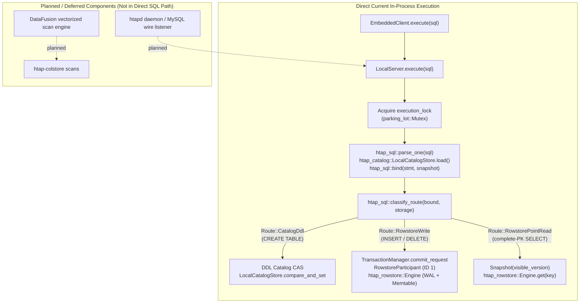

# Architecture

This document describes the intended system. Every component carries a status:

- `implemented` — built and covered by tests.
- `in progress` — partially built.
- `planned` — designed, not yet built.

**Current state of the repository.** The cargo workspace skeleton, `htap-common`
(the `Version` MVCC domain, `FencingToken`, and shared error types),
`htap-rowstore` (WAL, memtable, SST writer/reader, and LSM row-store engine), and
`htap-colstore` (immutable encoded/compressed segments, typed zone maps, and vectorized scans)
are `implemented`. Phase 3 has a completed narrow local slice: sqlparser MySQL dialect,
strict binder, structural rowstore route classifier (`htap-sql`), durable catalog with reopen recovery
(`htap-catalog`), and synchronous `LocalServer` (`htap-server`) supporting `CREATE TABLE`, literal
`INSERT`, PK `DELETE`, and complete-PK `SELECT` with reopen recovery.
Phase 4 has a completed local conversion MVP: partition-scoped row-to-column conversion (`htap-convert`)
with durable tablet columnar manifest envelopes, a four-phase state machine
(`SnapshotPinned -> SegmentsWritten -> ReadyToPublish -> Column`), atomic per-tablet manifest and
catalog publication, rowstore-authoritative base-plus-delta overlay, and online point writes/reads on
converting and columnar storage partitions.
Phase 5 has a completed local movement MVP (`htap-movement`): durable jobs (`HTAPJOB1`), CSV/JSONL
streaming import/export, and tablet snapshot clone/verify/repair (`HTAPMNF1`).
Phase 6 has a completed local coordination and placement MVP (`htap-coord`): synchronous `Coordinator`
trait, durable `LocalCoordinator` persisting at `COORDINATOR` (`HTAPCRD1`), deterministic sorted membership,
strictly monotonic fencing tokens (`FencingToken`), coordinator-fenced catalog CAS
(`fenced_catalog_compare_and_set`), deterministic placement planner (`plan_placement`), and coordinator-fenced
local replica staging and activation simulation (`stage_placement_addition`, `activate_placement_addition`,
`activate_placement_plan`).
Phase 7 has a completed local evidence MVP: Criterion microbenchmarks (`htap-bench`, `benches/local_mvp.rs`)
evaluating rowstore point get, colstore zone map scans, row-to-column conversion, CSV movement import,
coordinator placement planning, and coordinator leadership fenced CAS; and synchronous in-process embedded
client (`htap-client`, `EmbeddedClient`) providing an ergonomic SQL execution interface over `LocalServer`
with full test coverage in `crates/htap-client/tests/embedded_client.rs`. Root `README.md`, `docs/BENCHMARKS.md`,
and `docs/OPERATIONS.md` define the operational model, and `ci.sh` runs `cargo bench --workspace --no-run`.
Later components described below remain `planned` or `in progress` (explicitly deferred:
direct CatalogStore CAS and older movement repair APIs bypass coordinator fence; no Raft/`openraft`,
ZooKeeper backend, watches/locks/KV semantics, distributed consensus, concurrent shared-root writers / distributed coordination (concurrent shared-root operation remains unsupported),
remote physical movement, leader handoff, ongoing replication, capacity/rack placement, or live rebalance;
reverse `Column -> Row` conversion, delete vectors, physical rowstore reclamation, compaction,
SQL analytical scans, multi-partition routing, MySQL wire protocol/`htapd` daemon,
sessions/`BEGIN`/`COMMIT`/`ROLLBACK`, `UPDATE`/`ALTER`/`DROP`, Docker image/Compose deployment, and broad MySQL compatibility).
See [`PROGRESS.md`](./PROGRESS.md).

---

## Component diagram

### Target / Planned Architecture Diagram (Qualified Intended State)

The following ASCII diagram illustrates the planned multi-node target architecture, including the planned `htapd` daemon listener and planned DataFusion OLAP execution engine. These components are explicitly deferred or planned and are not part of the active SQL execution path in the current local MVP.

```text
                        +---------------------------+
                        |   client (EmbeddedClient  |
                        |   façade; wire planned)   |
                        +-------------+-------------+
                                      |
====================================  |  ==================================
 htapd / LocalServer (LocalServer implemented in htap-server; daemon planned)
======================================================================
                                      |
                        +-------------v-------------+
                        |  htap-sql                 |  in progress (narrow slice)
                        |  parse (sqlparser, MySQL) |
                        |  bind / catalog resolve   |
                        +-------------+-------------+
                                      |
                        +-------------v-------------+
                        |  query router             |  in progress (rowstore classifier)
                        +------+-------------+------+
                    PK point   |             |  everything else
                    lookup /   |             |
                    short txn  |             |
             +-----------------v--+       +--v---------------------+
             | OLTP fast path     |       | OLAP engine            |
             | index probe -> row |       | (DataFusion, vectorized|
             | fetch, no planner  |       |  plan fragments)       |
             | planned            |       | planned                |
             +---------+----------+       +-----------+------------+
                       |                              |
                       |   (no crate dependency)      |
                       +--------------+---------------+
                                      |
      +-------------------------------v-------------------------------+
      |  htap-txn : one MVCC version domain, one shared WAL  planned  |
      +-------------------------------+-------------------------------+
                                      |
              +-----------------------+-----------------------+
              |                                               |
   +----------v-----------+                       +-----------v----------+
   | htap-rowstore (OLTP) |                       | htap-colstore (OLAP) |
   | WAL, memtable,       |                       | immutable segments,  |
   | SSTs, PK index,      |<---- delta store ---->| column chunks,       |
   | MVCC snapshot engine |      + delete vec     | per-page zone maps   |
   | IMPLEMENTED          |                       | IMPLEMENTED          |
   +----------+-----------+                       +-----------+----------+
              |                                               |
              +-----------------------+-----------------------+
                                      |
      +-------------------------------v-------------------------------+
      | htap-convert : row -> col conversion (R2)  IMPLEMENTED (MVP)   |
      +---------------------------------------------------------------+

   +----------------------+  +----------------------+  +-----------------+
   | htap-catalog         |  | htap-coord (localMVP)|  | htap-movement   |
   | durable local store, |  | local | Raft(plan)   |  | placement,      |
   | topology, recovery   |  | ZK(plan) | fence CAS |  | repair (local)  |
   | in progress          |  | IMPLEMENTED (MVP)    |  | IMPLEMENTED     |
   +----------------------+  +----------------------+  +-----------------+

   +---------------------------------------------------------------+
   | htap-common : Version, FencingToken, error types  IMPLEMENTED |
   +---------------------------------------------------------------+
```

### Current In-Process Execution Call Flow (Implemented Local Slice)

In the implemented local slice, all SQL execution is synchronous and in-process. `EmbeddedClient` forwards calls directly to `LocalServer`, which acquires its execution lock, parses and binds the statement against the durable catalog, classifies the route, and delegates directly to the appropriate storage or transaction subsystem:



### DML Transaction Execution Sequence

Transactional mutations (`INSERT` and `DELETE`) execute through `LocalServer`'s single execution lock, 2PC `TransactionManager` logging, and rowstore participant application, returning the assigned monotonic MVCC version:

```mermaid
sequenceDiagram
    autonumber
    actor Caller as Caller / Host Application
    participant Client as EmbeddedClient
    participant Server as LocalServer
    participant Parser as htap-sql (parse & bind)
    participant Catalog as LocalCatalogStore
    participant TxnMgr as TransactionManager
    participant Journal as txn.journal
    participant Participant as RowstoreParticipant (ID 1)
    participant Engine as Rowstore Engine

    Caller->>Client: execute(sql) [INSERT or DELETE]
    Client->>Server: execute(sql)
    Note over Server: Acquire execution_lock (Mutex)
    Server->>Parser: parse_one(sql)
    Parser-->>Server: AST
    Server->>Catalog: load()
    Catalog-->>Server: CatalogSnapshot
    Server->>Parser: bind(AST, CatalogSnapshot)
    Parser-->>Server: BoundStatement (Insert / Delete)
    Server->>Parser: classify_route(BoundStatement, partition.storage)
    Parser-->>Server: Route::RowstoreWrite

    Server->>TxnMgr: commit_request(TransactionRequest)
    Note over TxnMgr: Acquire manager lock (serializes commit decision)
    TxnMgr->>Participant: prepare(snapshot, payload)
    Participant-->>TxnMgr: Ok
    TxnMgr->>Journal: Append & fsync INTENT frame
    TxnMgr->>Journal: Append & fsync COMMIT frame (irrevocable)
    TxnMgr->>Participant: apply(txn_id, version, payload)
    Participant->>Engine: apply(mutations) -> write WAL & memtable
    Engine-->>Participant: Ok
    Participant-->>TxnMgr: Ok
    TxnMgr->>Participant: publish(txn_id, version)
    Participant->>Engine: publish(version)
    Engine-->>Participant: Ok
    Participant-->>TxnMgr: Ok
    TxnMgr->>TxnMgr: Advance visible_version watermark
    TxnMgr-->>Server: CommittedTransaction { version, ... }
    Note over Server: Release execution_lock
    Server-->>Client: StatementResult::dml(affected, Some(version))
    Client-->>Caller: StatementResult::Command(CommandResult::Dml { affected, version })
```

---

## Subsystem Boundaries: LocalServer, LocalConverter, and LocalCoordinator

It is important to emphasize that `LocalServer::open` does **not** instantiate or supervise `LocalConverter` (`crates/htap-convert`) or `LocalCoordinator` (`crates/htap-coord`):
- `LocalServer` integrates only `LocalCatalogStore`, `htap_rowstore::Engine`, `TransactionManager` (with a single registered `RowstoreParticipant`), and `LocalDataMover`.
- `LocalConverter` is a partition-scoped conversion state machine that runs independently to transcode rowstore data into columnar segments (`htap-colstore`) and advance catalog metadata via CAS.
- `LocalCoordinator` is an independent cluster coordination and placement engine persisting its own state envelope at `<coord_root>/COORDINATOR` (`HTAPCRD1`).
Neither converter background workers nor coordinator lease managers are created or managed by `LocalServer` or `EmbeddedClient`. They are standalone crate capabilities used directly in migration or coordination tasks.

---

## Process and role model

**Status: `in progress`** (synchronous `LocalServer` façade and `EmbeddedClient` implemented for the narrow local slice; `htapd` daemon, network listeners, and MySQL wire protocol are planned).

The system architecture envisions a future **single binary, `htapd`** (planned), which can be run as:

- the **frontend role** — SQL surface, catalog, planner, transaction
  coordinator;
- the **backend role** — storage, execution, compaction;
- **both roles in one process**, planned for single-node development and deployments.

For the completed narrow local slice, `htap-server` provides `LocalServer` and `htap-client` provides `EmbeddedClient`,
synchronous in-process façades composing the durable catalog (`LocalCatalogStore`),
`htap-txn` transaction manager, and `htap-rowstore` LSM engine. The current README demo uses the
`EmbeddedClient -> LocalServer` in-process façade to directly execute
`CREATE TABLE` (deterministic one-partition row topology), literal `INSERT`, PK `DELETE`,
and complete-PK `SELECT` with reopen recovery, without networking or wire protocol overhead.

The frontend/backend boundary is preserved as an internal module boundary,
policed by crate dependencies. Splitting the two into separate processes is
therefore a **deployment choice, not a rewrite**.

---

## Dual-format storage

**Status: `in progress`** (`htap-rowstore`, `htap-colstore`, and local row-to-column conversion via `htap-convert` are `implemented`; reverse conversion, delta compaction, and distributed conversion are `planned`).

| Format | Crate | Structure | Status |
| ------ | ----- | --------- | ------ |
| Row store (OLTP) | `htap-rowstore` | LSM: WAL, memtable, immutable sorted runs (SSTs), primary-key index, MVCC versions. | `implemented` |
| Column store (OLAP) | `htap-colstore` | Immutable segments of encoded (plain/dictionary), compressed (zstd) column blocks with typed zone maps and vectorized scanning. | `implemented` |

The `htap-colstore` implementation delivers the standalone columnar engine MVP:
durable binary segment files, plain and dictionary column encodings, optional zstd compression,
per-block CRC32C integrity checksums, typed zone maps (min, max, and nullability flags),
and vectorized scan execution with conservative pushdown pruning and selective column decoding.
Phase 4 integrates `htap-colstore` segments into partition-scoped conversion (`htap-convert`),
registering columnar segments in durable tablet manifests while keeping the rowstore authoritative
for online point mutations and post-conversion base-plus-delta queries.

Both formats share **one MVCC version domain** (`htap-common::Version`, which
is `implemented`) and **one WAL**, so a single transaction can touch both
formats atomically.

This is the central architectural decision of the project. It is what makes R2
(storage-format conversion) and R5 (mixed OLTP/OLAP workloads) achievable:
without a shared version domain, a format swap would need a distributed
protocol between two independent version spaces, and a transaction spanning
both formats would need two-phase commit against itself. See
[ADR-004](./DECISIONS.md).

---

## Freshness: delta store and merge-on-read

**Status: `in progress`** (authoritative rowstore base-plus-delta overlay implemented for local conversion; delete vectors and background base compaction are planned).

A partition converted to or held in column format still accepts writes. In the Phase 4 local MVP,
those writes land directly in the authoritative **row store**, which acts as the live delta store:

- Historical reads prior to the conversion base version read directly from the rowstore.
- Materialized partition scans (`htap_convert::read_materialized_partition`) scan the columnar base segments up to the conversion snapshot version and overlay rowstore mutations (`Put` and `Delete`) committed after that base version up to the target snapshot.
- Online transactional writes (`INSERT`, `DELETE`) and point reads (`SELECT` by primary key) execute directly against the row store (`Route::RowstoreWrite` and `Route::RowstorePointRead`), ensuring zero read or write interruption during and after conversion.
- Bitmap delete vectors directly on columnar segments, physical rowstore reclamation, and background compaction folding deltas into new columnar segments are explicitly deferred.

---

## Query routing — the R5 guarantee, structurally enforced

**Status: `in progress`** (structural rowstore route classifier implemented for point lookups and DDL/DML; analytical execution and multi-partition routing are planned).

A router inspects the **bound** statement and the partition's **storage descriptor**:

- **Point lookups and short transactions that resolve fully against a primary key** take a dedicated fast path: index probe → row fetch. There is no plan-fragment construction and no vectorized operator pipeline. In the completed Phase 3 local slice, `htap_sql::classify_route` inspects the bound AST and catalog storage descriptor, routing complete-PK point reads strictly to `Route::RowstorePointRead { key }` and literal mutations to `Route::RowstoreWrite` (verified in `tests/route.rs` and `crates/htap-server/tests/local_server.rs`).
- **Route Acceptance across Storage Formats:** `classify_route` accepts `StorageDescriptor::Row`, `StorageDescriptor::Column`, and `StorageDescriptor::Converting`:
  - `CREATE TABLE` routes to `Route::CatalogDdl`.
  - Literal `INSERT` and PK `DELETE` route to `Route::RowstoreWrite` regardless of whether the partition is `Row`, `Column`, or `Converting`, preserving rowstore write-authority and zero mutation downtime.
  - Complete-PK `SELECT` routes to `Route::RowstorePointRead { key }` across all three storage formats (`Row`, `Column`, `Converting`), serving point reads directly from the authoritative rowstore.
- **Current SQL-Created Row Topology:** While `classify_route` accepts all three descriptors, tables created via SQL DDL (`CREATE TABLE`) in `LocalServer` are currently initialized exclusively with a single-partition `StorageDescriptor::Row` topology. Setting a partition to `Column` or `Converting` occurs via catalog updates or `LocalConverter` workflows.
- **No SQL Analytic Scans:** Analytical scans (vectorized column scans over `htap-colstore` segments or planned DataFusion execution) are not linked to the SQL execution façade. Statements requiring full table scans without complete PK equality predicates or specifying unsupported clauses (`ORDER BY`, `GROUP BY`, joins, aggregations, CTEs) are rejected with `HtapError::InvalidArgument` or `HtapError::Unsupported`.

This separation is enforced **by construction, not by a runtime heuristic**:
the OLTP fast path lives in a crate that has no dependency on the analytical
execution crate. It is therefore not possible for a point lookup to
accidentally acquire analytical-engine overhead through a mis-tuned cost
threshold — the code to do so is not linked into that path. See
[ADR-001](./DECISIONS.md).

---

## Resource isolation

**Status: `planned`.**

The transactional and analytical paths get **separate thread pools and
separate memory budgets**, both configurable. A large analytical scan
therefore cannot starve concurrent point queries of either CPU or memory.

---

## Storage-format conversion (R2)

**Status: `implemented (local MVP)`** (`htap-convert`).

Conversion operates as a partition-scoped, crash-resumable state machine for local single-tablet partitions:

```text
StorageDescriptor::Row
        │
        ▼ (pin visible version V, allocate conversion generation)
ConversionPhase::SnapshotPinned
        │
        ▼ (write columnar segments, atomically persist MANIFEST)
ConversionPhase::SegmentsWritten
        │
        ▼ (advance catalog CAS with incremented generation)
ConversionPhase::ReadyToPublish
        │
        ▼ (final catalog CAS cutover to Column, clear conversion metadata)
StorageDescriptor::Column
```

### Conversion execution steps

1. **Topology validation and snapshot pinning (`SnapshotPinned`):**
   The converter validates that the partition contains exactly one tablet with one healthy leader replica.
   If in `StorageDescriptor::Row`, it pins snapshot version `V` from the rowstore's current visible version
   (or `Version(1)` if unwritten), allocates a new catalog generation, and updates the partition via catalog
   compare-and-set (CAS) to `StorageDescriptor::Converting { from: Row, to: Column }` with phase
   `ConversionPhase::SnapshotPinned`. If resuming an existing conversion, the persisted pinned snapshot
   version and generation are reused without taking a new snapshot.

2. **Columnar transcoding and atomic manifest write (`SegmentsWritten`):**
   The converter scans the rowstore at pinned snapshot version `V`, collapses MVCC versions and tombstones
   into logical rows, and encodes durable columnar segments (`htap-colstore`) into the tablet directory.
   It writes the tablet columnar manifest (`HTAPTBM1` binary envelope with CRC32C integrity checksum)
   atomically via temporary file replacement (`MANIFEST.tmp` -> `MANIFEST`).
   The catalog is then advanced via CAS to `ConversionPhase::SegmentsWritten`.

3. **Publication gating (`ReadyToPublish`):**
   The converter advances the catalog via CAS to `ConversionPhase::ReadyToPublish` with an incremented catalog
   generation, ensuring all segment and manifest writes are durably observable before final cutover.

4. **Atomic cutover (`Column`):**
   The final catalog CAS transitions the partition from `StorageDescriptor::Converting` in `ReadyToPublish`
   phase to `StorageDescriptor::Column`. The conversion descriptor is cleared and the tablet's
   `ColumnManifestRef` is registered in the catalog in a single atomic metadata update.

### System invariants during and after conversion

- **Atomic per-tablet publication:** Columnar segments and the tablet manifest are written to disk with
  checksum verification and atomic file renaming before catalog cutover. The manifest only ever references
  readable, durable segments, preventing orphaned or partially written files from becoming visible.
- **Rowstore authoritative base-plus-delta overlay:** The rowstore remains the authoritative source of truth.
  Queries reading full partitions (`read_materialized_partition`) read base rows from columnar segments
  up to the conversion base version `V`, and overlay rowstore mutations (`Put` and `Delete`) committed after
  version `V` up to the target snapshot. Historical reads for versions earlier than `V` are served directly
  from the rowstore.
- **Online point writes and reads:** Primary-key point lookups (`SELECT` by PK) and mutations (`INSERT`,
  `DELETE`) continue to execute online without interruption through `LocalServer` and `htap-sql` query routing
  (`Route::RowstoreWrite` and `Route::RowstorePointRead`), which operate directly on the rowstore regardless
  of whether the partition is `Row`, `Converting`, or `Column`.
- **Reverse conversion:** Reverse `Column -> Row` conversion is **not implemented** and is not claimed.
  Attempting conversion in any direction other than `Row -> Column` returns `HtapError::Unsupported`.

### Explicitly deferred features

- **Delete vectors:** Per-segment bitmap delete vectors on columnar segments are deferred; deletions are
  tracked via rowstore tombstones in the base-plus-delta overlay.
- **Physical rowstore reclamation:** Converted rows remain in the rowstore SSTs and WAL; physical space
  reclamation / truncation of converted rowstore history is deferred.
- **Compaction:** Background merge-on-read compaction folding accumulated rowstore deltas into new columnar
  segments is deferred.
- **SQL analytical scans:** Vectorized SQL query scans over columnar or converting tables via `LocalServer`
  are deferred (non-point queries return `InvalidArgument` or `Unsupported`).
- **Full partition and table conversion semantics:** Conversions across multi-tablet sharded partitions,
  range/list partition boundaries, and distributed multi-node coordinated cutovers are deferred to Phase 5
  and Phase 6.

---

## Coordination

**Status: `in progress (local MVP)`** (`htap-coord` implements local durable coordination, membership, fencing, and fenced catalog CAS).

The synchronous `Coordinator` trait defines cluster coordination, membership tracking, scoped leadership election, fence validation, and atomic coordinator-fenced catalog compare-and-set updates:

```rust
pub trait Coordinator: Send + Sync {
    fn register_node(&self, node_id: NodeId) -> Result<()>;
    fn remove_node(&self, node_id: NodeId) -> Result<()>;
    fn list_nodes(&self) -> Result<Vec<NodeId>>;
    fn acquire_leadership(&self, scope: &str, holder: NodeId) -> Result<Leadership>;
    fn current_leadership(&self, scope: &str) -> Result<Option<Leadership>>;
    fn release_leadership(&self, scope: &str) -> Result<()>;
    fn replace_leadership(&self, scope: &str, holder: NodeId) -> Result<Leadership>;
    fn validate_fence(&self, scope: &str, token: FencingToken) -> Result<()>;
    fn fenced_catalog_compare_and_set(
        &self,
        scope: &str,
        token: FencingToken,
        catalog: &dyn CatalogStore,
        expected_generation: u64,
        next: CatalogSnapshot,
    ) -> Result<()>;
}
```

### Local coordinator implementation (`LocalCoordinator`)

The single-node implementation (`LocalCoordinator`) persists membership, scoped leadership leases, highest scope tokens, and next token allocator state at `<root>/COORDINATOR` using the `HTAPCRD1` binary envelope format (`HEADER_MAGIC = b"HTAPCRD1"`, `FORMAT_VERSION = 1`, 18-byte header with payload length and CRC32C checksum). Updates follow atomic staging semantics (`COORDINATOR.tmp` write -> fsync -> rename -> directory fsync).

Key operational guarantees:
- **Sorted membership:** `list_nodes` returns registered `NodeId` entries in deterministic ascending order.
- **Strictly monotonic tokens:** Fencing tokens (`FencingToken`) advance strictly monotonically on every leadership acquisition and replacement, and are persisted durably so that tokens are never reused across process restarts.
- **Fenced catalog compare-and-set:** `fenced_catalog_compare_and_set` executes under the coordinator's state lock, validating that the caller's fencing token matches the current active leader token for the target scope before invoking `CatalogStore::compare_and_set`. Stale leaders receive `HtapError::Fenced` and cannot mutate catalog state.

### Backend status and roadmap

| Backend | Status | Purpose |
| ------- | ------ | ------- |
| Local single-node (`LocalCoordinator`) | `implemented (local MVP)` | Single-node durable coordinator with `HTAPCRD1` envelopes, one-owner OS advisory `ProcessLock`, and fenced catalog CAS. |
| Embedded Raft (`openraft`) | `planned` | Distributed consensus default for multi-node deployments. |
| ZooKeeper | `planned` | Integration with existing external ensembles. |

### Architectural boundaries and explicitly deferred capabilities

- **Direct CatalogStore CAS and movement repair bypass fence:** Direct calls to `CatalogStore::compare_and_set` and older movement repair APIs (`htap_movement::repair_replica`) operate directly against catalog storage without coordinator fence validation. Fencing is strictly enforced when mutations route through `fenced_catalog_compare_and_set` or `activate_placement_addition`.
- **One-owner OS advisory ProcessLock:** `LocalCoordinator`'s root has a one-owner OS advisory `ProcessLock` (`<root>/LOCK` via `flock`), rejecting concurrent process opens with `HtapError::Conflict`; distributed consensus and concurrent multi-node coordination remain unsupported.
- **No distributed consensus:** Neither Raft (`openraft`) nor ZooKeeper backends are implemented. Coordination is single-node local only.
- **No watches, distributed locks, or KV store semantics:** The `Coordinator` trait focuses on membership, scoped leadership, and catalog CAS gating. General-purpose KV storage, ephemeral path watches, and lock lease expirations are deferred.
- **No remote physical movement or network transport:** Tablet movement and placement activation execute locally using `htap_movement::LocalDataMover`, local filesystem paths, and local rowstore engine snapshots.
- **No leader handoff, ongoing replication, capacity/rack placement, or live rebalance:** Leadership turnover immediately revokes previous tokens but executes no consensus handoff protocol; replication uses static snapshot clone packages rather than ongoing log replication; dynamic placement does not rebalance live clusters or consider rack topology or storage capacity.

---

## Sharding and placement

**Status: `in progress`** (the `htap-catalog`, `htap-movement`, and `htap-coord` crates implement single-node tablet sharding, clone packages, deterministic placement planning, and local replica activation simulation; multi-node network coordination is planned).

```text
Table
  └── Partition        (range or list, on a partition key)
        └── Tablet     (hash bucketed, on a distribution key)
              └── Replica
```

The **tablet is the unit of placement, replication, movement, and repair**.

### Deterministic placement planning (`plan_placement`)

The placement planner computes pure, deterministic, colocation-free replica placement plans over an immutable `CatalogSnapshot`, a candidate `NodeId` list, and a target replication factor:
1. **Canonical sorting:** Sorts candidate nodes and tablets in ascending order of their IDs to ensure identical plans regardless of input order.
2. **Colocation prevention:** Strictly validates that no node hosts multiple replicas of the same tablet.
3. **Greedy load balancing:** Preserves existing healthy replicas and assigns new replicas to candidate nodes with the lowest current replica count, breaking ties deterministically by smallest `NodeId`.
4. **Monotonic replica ID allocation:** Allocates new `ReplicaId` values starting from `max_existing_id + 1` with checked arithmetic overflow validation.

### Coordinator-mediated local replica activation

Replica activation proceeds through coordinator-fenced phases:
1. **Staging (`stage_placement_addition`):** Under coordinator fence validation for the tablet scope, registers target `ReplicaDescriptor` in the catalog with `is_leader = false` and `healthy = false` via `fenced_catalog_compare_and_set`.
2. **Logical clone & package verification:** Generates a snapshot clone package via `htap_movement::clone_tablet` and verifies package checksums and metadata via `htap_movement::verify_package` (`HTAPMNF1`).
3. **Activation (`activate_placement_addition`):** Transitions the target replica to `healthy = true` via `fenced_catalog_compare_and_set`. If cloning, verification, or fencing fails at any step, the target replica remains unready (`healthy = false`) in the catalog.
4. **Batch activation (`activate_placement_plan`):** Sequentially stages, clones, verifies, and activates all additions in a `PlacementPlan`.

### Hash bucketing contract

The hash bucketing contract is fixed explicitly and versioned: the bucket is
`crc32(concatenated per-column binary encodings) % tablet_count`, where the
modulus is the actual tablet count of that index in that partition. The
per-type byte encoding is a versioned contract rather than an implementation
detail — see finding 11 in [`RESEARCH.md`](./RESEARCH.md).
