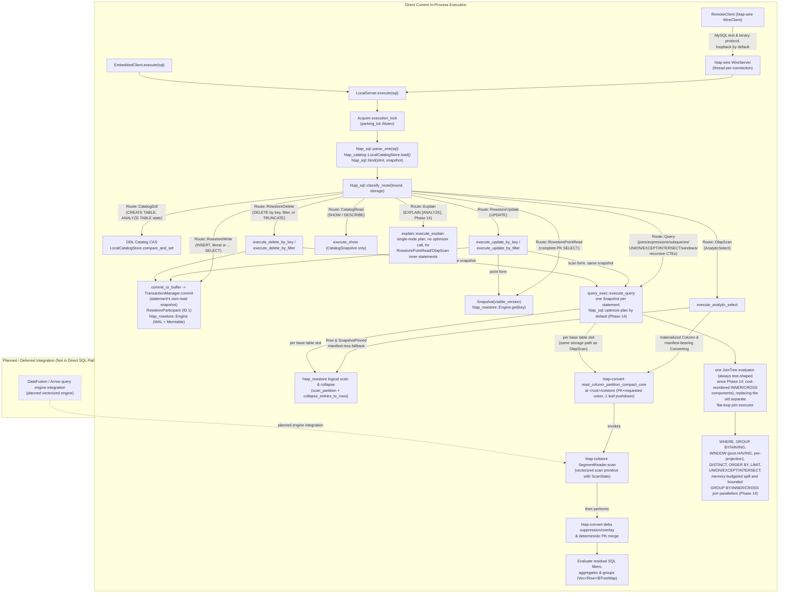
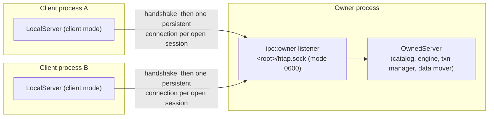

# Architecture

This document describes the intended system. Every component carries a status:

- `implemented` / `implemented (local MVP)` — built and covered by tests.
- `in progress` — partially built.
- `planned` / `deferred` — designed, not yet built in the local slice.

**Current state of the repository.** The cargo workspace skeleton, `htap-common`
(the `Version` MVCC domain, `FencingToken`, shared error types, and — since stage R — the shared durability
module: `fs::{sync_dir, atomic_publish, write_new_tmp_file, remove_file_if_exists, fsync_file,
read_file_exact_bounded}`, `envelope::{encode_envelope, decode_envelope, encode_bare_frame}`, and the checked
`bytecursor::ByteReader`, used by every crate below that publishes a durable file),
`htap-rowstore` (WAL, memtable, SST writer/reader, and LSM row-store engine), and
`htap-colstore` (immutable encoded/compressed segments, typed zone maps, and vectorized scans)
are `implemented`. Phase 3 has a completed narrow local slice: sqlparser MySQL dialect,
strict binder (with typed `PointSelect` and `AnalyticSelect`), structural route classifier (`htap-sql`), durable catalog with reopen recovery
(`htap-catalog`), and synchronous `LocalServer` (`htap-server`) supporting `CREATE TABLE`, literal
`INSERT`, PK `DELETE`, complete-PK `SELECT` (strictly routing to `RowstorePointRead` and remaining separate and unchanged), and narrow analytical scans over logical rowstore
and base-plus-delta rows using server-root `<root>/colstore` for materialized `Column`/`Converting` partitions with projection-aware compact reads (PK+requested column union, single safe predicate-leaf pushdown into `SegmentReader`, delta suppression/overlay, deterministic PK ordering, and full residual SQL filter/aggregate/group evaluation) with reopen recovery.
Phase 4 has a completed local conversion MVP: partition-scoped row-to-column conversion (`htap-convert`)
with durable tablet columnar manifest envelopes, a four-phase state machine
(`SnapshotPinned -> SegmentsWritten -> ReadyToPublish -> Column`), atomic per-tablet manifest and
catalog publication, rowstore-authoritative base-plus-delta overlay, and online point writes/reads on
converting and columnar storage partitions.
Phase 5 has a completed local movement MVP (`htap-movement`): durable jobs (`HTAPJOB1`), CSV/JSONL
streaming import and full logical partition export materialization (exports materialize full logical partition before writing), and tablet snapshot clone/verify/repair (`HTAPMNF1`).
Phase 6 has a completed local coordination and placement MVP (`htap-coord`): synchronous `Coordinator`
trait, durable `LocalCoordinator` persisting at `COORDINATOR` (`HTAPCRD1`), deterministic sorted membership,
strictly monotonic fencing tokens (`FencingToken`), coordinator-fenced catalog CAS
(`fenced_catalog_compare_and_set`), deterministic placement planner (`plan_placement`), and coordinator-fenced
local replica staging and activation simulation (`stage_placement_addition`, `activate_placement_addition`,
`activate_placement_plan`).
Phase 7 has a completed local evidence MVP: Criterion microbenchmarks (`htap-bench`, `benches/local_mvp.rs`)
evaluating rowstore point get, colstore zone map scans, row-to-column conversion, CSV movement import,
coordinator placement planning, and coordinator leadership fenced CAS; and synchronous in-process embedded
client (`htap-client`, `EmbeddedClient`) providing an ergonomic SQL execution interface over `LocalServer`
with full test coverage in `crates/htap-client/tests/embedded_client.rs`. Root `README.md`, `docs/BENCHMARKS.md`,
and `docs/OPERATIONS.md` define the operational model, and `ci.sh` runs `cargo bench --workspace --no-run`.
Phase 8 has a completed local network server MVP: a hand-written, synchronous MySQL text-protocol server
(`htap-wire`, `WireServer`), a standalone daemon binary (`htapd`) exposing a `LocalServer` root over TCP, and
`htap-client::RemoteClient` speaking the same protocol as a client, returning the same `StatementResult` shape
as `EmbeddedClient`. See the "Network layer (`htap-wire`, `htapd`)" section below.
Phase 9 has a completed local MVP for SQL breadth and cross-engine joins: a general query executor
(`htap-sql::query`/`expr`/`binder_query`, `htap-server::query_exec`) handling `INNER`/`LEFT`/`RIGHT`/`CROSS`
joins (left-deep chains, comma joins), aliases, qualified names, arithmetic/comparison/`AND`/`OR`/`NOT`/`IS
[NOT] NULL`/`IS [NOT] TRUE`/`FALSE`/`LIKE`/`IN`/`BETWEEN`/`CASE`/`CAST`, scalar functions, aggregates with
`DISTINCT`, `GROUP BY`/`HAVING`, `SELECT DISTINCT`, `ORDER BY`/`LIMIT`/`OFFSET`, `UNION`/`UNION ALL`, derived
tables, non-recursive CTEs, and uncorrelated scalar/`IN`/`EXISTS` subqueries, materializing every base table
side through the existing `scan_partition_compact` storage path at one MVCC snapshot per statement and
hash-joining in memory; a purely syntactic shape gate (`is_narrow_select_shape`) keeps complete-PK `SELECT`
on `Route::RowstorePointRead` and narrow single-table scans on `Route::OlapScan` unchanged, everything else
routes to the new `Route::Query`. `UPDATE` (point and filtered-scan forms, `Route::RowstoreUpdate`), `DROP
TABLE` (metadata-only, `Route::CatalogDdl`), and `SHOW TABLES`/`SHOW DATABASES`/`SHOW COLUMNS`/`DESCRIBE`
(`Route::CatalogRead`) are also implemented. The catalog envelope (`HTAPCAT1`) bumped to format version 2 to
persist an identifier high-water mark (`IdHighWater`) so dropped table/partition/tablet/replica ids are never
reissued; version-1 catalogs still decode. See the "Query routing" and "OLAP execution paths" sections below
and [`PROGRESS.md`](./PROGRESS.md).
Phase 10 has a completed local MVP for server-side sessions and explicit transactions
(`htap-server::session`, `htap-sql::variables`): `BEGIN`/`START TRANSACTION`/`COMMIT`/`ROLLBACK`,
`autocommit`, `@user`/`@@system` variables, and session-buffered uncommitted writes (never journaled) that
overlay reads until one `COMMIT` runs the existing 2PC path against the transaction's own pinned snapshot.
One `EmbeddedClient::open_session`/wire connection is one `Session`. See "Sessions and explicit transactions
(Phase 10)" below.
Phase 11 has a completed local MVP for the MySQL binary protocol and prepared statements
(`htap-wire::{binary_codec, prepared}`, `htap-sql::prepare`): `COM_STMT_PREPARE`/`EXECUTE`/`CLOSE`/`RESET`/
`SEND_LONG_DATA` (`COM_STMT_FETCH` and server-side cursors are cleanly rejected), `COM_RESET_CONNECTION` and
`COM_CHANGE_USER` (both respecting the ADR-018 `CommitOutcomePending` quarantine), reassembled/split messages
of 16 MiB or more with a real, configurable `max_allowed_packet` (default 64 MiB), an OS-CSPRNG handshake
scramble (`getrandom`, no fallback), `CLIENT_MULTI_STATEMENTS` (honored only when negotiated, sequential
execution with `SERVER_MORE_RESULTS_EXISTS`, stopping at the first error), and a shutdown path that
force-closes connections blocked mid-packet. `RemoteClient` gained `prepare`/`execute_prepared`/
`close_prepared`. See "Prepared statements and binary protocol (Phase 11)" below.
Phase 12 has a completed local MVP for transport security and per-user accounts: TLS (`rustls` 0.23 with the
`ring` crypto provider — `aws-lc-rs` needs `cmake`, confirmed unavailable in this environment), MySQL
compressed-packet framing (zlib via `flate2`, zstd via `zstd`), and a catalog-backed per-user account/privilege
model replacing the single shared `--password`. See "TLS and compression (Phase 12)" and "Accounts and
privileges (Phase 12)" below, ADR-020, ADR-021, and `docs/PROGRESS.md`.
Phase 13 has a completed local MVP for SQL query breadth on top of the Phase 9 general query executor
(`htap-sql::{query, expr, binder_query}`, `htap-server::query_exec`), no on-disk format change: `GROUP BY`/
`ORDER BY` ordinals, integer `DIV` (truncating, `Int64`-only, division-by-zero -> `NULL`), `EXCEPT`/
`INTERSECT` (`ALL` and `DISTINCT`, correct multiset semantics), `FULL OUTER`/`NATURAL`/`USING` joins with real
per-node column coalescing (`INNER`/`LEFT` -> left operand's own expression, `RIGHT` -> right operand's,
`FULL` -> `COALESCE` of both, recursing through an already-merged operand rather than re-flattening to
physical columns), and arbitrarily nested parenthesized join trees (`query::JoinTree`) bound directly from the
parsed `FROM` clause with bind-time offset-rebased `ON` conditions (regenerated fresh, never cached) for the
recursive tree evaluator, alongside a purely left-deep flat-lowering fast path (`lower_to_flat`) that at the
time kept every pre-Phase-13 query on a separate, unchanged flat executor — the two executors were pinned
equivalent by a mandatory differential test
(`crates/htap-server/tests/query_exec.rs::test_flat_and_tree_join_evaluators_match_for_lowerable_queries`).
**Superseded by Phase 14:** the flat-loop executor and `SelectBody`'s `joins`/`tree_only` fields were removed;
a flat `Vec<JoinSpec>` chain is now synthesized into the same tree shape at bind time
(`left_deep_join_tree`), so `evaluate_join_tree` is the only join execution path, and the differential test
above now pins a flat-written query and its explicitly-parenthesized equivalent to identical results under
that one evaluator rather than comparing two separate evaluators. See "Phase 14" below and ADR-023.
`DELETE` now accepts an arbitrary `WHERE` filter (`Route::RowstoreDelete`, one transaction, same payload cap
and privilege rule as filtered `UPDATE`); `TRUNCATE` binds to the same unfiltered-`DELETE` representation
(transactional, rollback-able, payload-capped — a disclosed deviation from real MySQL `TRUNCATE`);
`INSERT ... SELECT` binds a query source with an exact per-column static type match (no widening). Correlated
subqueries are supported one level deep only (`Expr::CorrelatedColumnRef`, the `SubqueryRunner` execution
callback trait, a per-statement `SubqueryBudget` capping total invocations and re-entrant nesting depth) in
`WHERE`/`SELECT`/`HAVING`, with an aggregate-query correlation restricted to the outer query's `GROUP BY`
keys; a reference that would need to skip a level is a specific bind error, never a silent mis-resolution.
`WITH RECURSIVE` supports one self-referencing two-branch `UNION`/`UNION ALL` CTE with a working-table
placeholder slot (never a real table lookup) and three independent caps (1000 iterations, 1,000,000
accumulated rows, ~256 MiB accumulated bytes), each naming which cap fired. Window functions (`ROW_NUMBER`,
`RANK`, `DENSE_RANK`, `NTILE`, `LAG`, `LEAD`, `FIRST_VALUE`, `LAST_VALUE`, and ordinary aggregates as window
functions) support `ROWS`, peer-based `RANGE`, and a project-specific value-offset `RANGE` (exactly one
numeric/`Timestamp` `ORDER BY` key, NULL order-key rows forming their own peer group, checked-arithmetic
boundary overflow) frame kinds, and are evaluated in a dedicated post-`HAVING`, pre-projection stage so a
window can combine with `GROUP BY`/aggregates (aggregate discovery scans window specs too), while `HAVING`
itself cannot reference a window's result (the window stage hasn't run yet when `HAVING` runs). See ADR-022
and [`PROGRESS.md`](./PROGRESS.md) for the full evidence map.
Phase 14 has a completed local MVP for cost-based optimization, `EXPLAIN`, spilling, and bounded parallelism on
top of the same general query executor, for `Route::Query` only — `Route::RowstorePointRead` and
`Route::OlapScan` are byte-for-byte unchanged. `ANALYZE TABLE t` (`Route::CatalogDdl`) records exact per-table
row count and per-column null count/min/max/capped-exact-distinct-count (`crates/htap-server/src/analyze.rs`),
published by catalog CAS of only the `stats` field; the `HTAPCAT1` envelope bumped format version 3 -> 4 to
carry `TableDescriptor.stats: Option<TableStats>` (version-3-and-earlier catalogs still decode with
`stats: None`). A storage-agnostic optimizer stage (`htap_sql::optimize`) estimates row counts and
selectivities from those statistics (falling back to disclosed defaults when absent), classifies predicates by
provenance and reorders `INNER`/`CROSS` join components (subset dynamic programming up to 8 relations, greedy
above that) under an always-on conservation validator that falls back to the identity plan on any internal
inconsistency, and is enabled by default for every general query. `EXPLAIN`/`EXPLAIN ANALYZE`
(`crates/htap-server/src/explain.rs`) renders this plan with each estimate's provenance, and — for a
point-lookup or narrow-scan statement — renders a single-node plan without invoking the optimizer at all,
preserving R5. `ANALYZE TABLE` is gated by `Session::is_ddl`'s "no DDL inside an open transaction" check
exactly like other catalog DDL, so it is rejected inside any open transaction (explicit or implicit
autocommit-off) and the transaction survives the rejection; `EXPLAIN ANALYZE` follows the transaction rules
of the statement it actually executes, while plain `EXPLAIN` (which only plans) remains permitted inside an
open transaction — see `crates/htap-server/tests/session.rs::{test_analyze_table_rejected_inside_explicit_transaction_and_txn_survives, test_explain_analyze_wrapping_ddl_rejected_inside_open_transaction, test_explain_analyze_wrapping_insert_rejected_inside_read_only_transaction}` and `crates/htap-server/tests/explain.rs::test_plain_explain_select_permitted_inside_open_transaction`.
A per-statement `MemoryBudget` (default 256 MiB, configurable) bounds each operator's own working memory
(hash tables, sort runs, aggregate state, partition buffers) — it does not bound the rows a non-pipelined
executor materializes between operators — and, when exceeded, triggers one level of disk
spilling — non-durable scratch under `<data-root>/spill/`, swept on `LocalServer::open` — for hash joins,
`GROUP BY`, `ORDER BY`, `DISTINCT`/`EXCEPT`/`INTERSECT`, and window partitions; a partition still over budget
after spilling fails cleanly rather than running unbounded, and never recurses into a second spill level.
This budget and spilling apply to `Route::Query` only: a single-table `SELECT` with `ORDER BY`, `GROUP BY`, or
a plain aggregate and no join routes to `Route::OlapScan` instead, which has no memory budget and never spills
(by design — several early spill tests were silently exercising this unbudgeted path and were rewritten to use
a shape that reaches the general executor). Hash-join spill partition count is sized from the input and the
remaining budget, capped at 128 (windows share this cap, to bound open file descriptors and the writer
buffers the budget doesn't count); `GROUP BY` and the set operators (`DISTINCT`/`EXCEPT`/`INTERSECT`/`UNION`)
each spill into their own fixed 16 partitions — unlike the hash join and window, this count does not scale
with input size or the remaining budget, so an input much larger than roughly 16x the budget fails with the
memory-budget error instead of spilling successfully (see "General query executor scope and deferred
features" in `docs/LIMITATIONS.md`); window spilling hash-partitions by the `PARTITION BY` key and
evaluates one window partition at a time (no `PARTITION BY` is a single partition). `GROUP BY` spill reserves
each partition's rows as they are read back and releases that reservation before in-memory aggregation (so the
same bytes are not charged twice on the way in), so peak memory during one partition's aggregation can
approach about twice the budget — a disclosed imprecision, not an exact bound. Bounded intra-query parallelism
(`std::thread::scope`, no new dependency, one shared worker budget per statement) parallelizes `GROUP BY` and
`INNER`/`CROSS` hash joins; `LEFT`/`RIGHT`/`FULL` joins stay single-threaded. `LocalServer` also exposes
test-telemetry accessors used by this evidence, not a supported monitoring API: `last_query_parallel_workers()`
(the largest worker count used by the caller thread's most recent query),
`last_query_optimizer_invocations()` (the optimizer invocation count for the caller thread's most recent
query, used to prove a correlated subquery is optimized once per statement, not per outer row — see
`crates/htap-server/tests/query_exec.rs::test_correlated_subquery_is_optimized_once_per_statement`), and one
per-operator spill accessor each for hash join, `GROUP BY`, sort, distinct, set-operation, and window
(`last_query_hash_join_spilled()`, `last_query_group_by_spilled()`, `last_query_sort_spilled()`,
`last_query_distinct_spilled()`, `last_query_set_operation_spilled()`, `last_query_window_spilled()`), each
reporting whether that specific operator kind spilled in the caller thread's most recent statement — every
spill test asserts its own named operator actually spilled. Float arithmetic (`+`/`-`/`*`/`/`) and `SUM`/`AVG`
overflow now return `HtapError::InvalidArgument("DOUBLE value is out of range in '<op>'")` (MySQL-compatible)
instead of producing a non-finite value; division by zero is unaffected and still yields `NULL`. This closes a
real risk, not a cosmetic one: `serde_json` (used for both row mutation payloads and catalog statistics)
cannot round-trip `NaN`/`Infinity`, so an unchecked non-finite float could be written and then fail to decode.
On the row path this was already caught — confusingly, but safely — by `RowstoreParticipant::decode_payload`
during 2PC `prepare`, before commit; the catalog statistics path had no equivalent protection and is now closed
by rejecting non-finite bounds during `ANALYZE TABLE` and by `TableStats::validate` (column count, null count,
distinct count, min/max type agreement, `min <= max`, and finiteness) on every catalog publish, with no format
change. `CAST(... AS DOUBLE)` from a string and non-finite float literals are rejected the same way, and the
narrow analytic scan path's own `SUM` accumulator (`crates/htap-server/src/olap.rs`) now carries the same
overflow check, closing what was previously an unverified, code-inspection-only gap. See
ADR-023, [`PROGRESS.md`](./PROGRESS.md)'s Phase 14 row, and "Query routing" below for the full contract,
including remaining disclosed gaps: the planned shared binder leaf-helper extraction
(`docs/PROBLEMS.md` P2) was not delivered in this phase, so the two binder entry points still each hold their
own copy of that logic; and window evaluation carries every materialized column of the joined input into its
spill partitions rather than only the columns the query needs, inflating partition size under a budget (a
column-trimming improvement is deferred).
Phase 15 has a completed local MVP for narrow rowstore compaction and garbage collection, `DROP TABLE`
physical artifact reclamation, and transaction journal checkpointing — no vectorized/columnar/query change,
`Route::RowstorePointRead`/`Route::OlapScan`/`Route::Query` byte-for-byte unchanged. `Engine::compact_once`
(`crates/htap-rowstore/src/engine.rs`) merges one *contiguous* run of the manifest's SST list at a time
(entry-count tiered selection, or an explicit id set for `DROP TABLE`'s forced priority path), splicing the
merged output into that run's original manifest position rather than prepending it, so a newer, unselected
SST always still wins a shared key — a live resurrection bug an initial draft had, fixed and pinned by
`crates/htap-rowstore/tests/compaction_ordering.rs`. Per key, every version above a computed GC horizon is kept
unconditionally, and among versions at or below it only the single newest survives (`Put` or `Delete`, never
elided). The rowstore `MANIFEST` envelope (`HTAPMAN1`) bumps to format version 3 to carry
`committed_version_high_water` and `gc_low_water`, both monotonic and refusing to publish a regression;
`Engine::get`/`scan_partition`/`prepare`'s first-writer-wins check reject a real (non-sentinel) snapshot below
`gc_low_water` with a clear error. `Engine::open` now takes an exclusive advisory lock on
`<rowstore>/LOCK` for the engine's whole lifetime, rejecting a second `Engine::open` on the same directory in
or out of process. A per-tablet lease set in `LocalDataMover` (already used for movement I/O mutual exclusion)
gates compaction the same way: `DROP TABLE`'s tablets get an all-or-nothing forced lease,
the ordinary tiered pass gets a best-effort partial lease that protects only the busy tablets' SSTs and still
makes progress on the rest. `DROP TABLE` marks its artifacts `pending_reclaim` in the same catalog CAS that
removes the table (`HTAPCAT1` bumps to format version 5); `LocalServer::reclaim_tick`/`compaction_tick`
delete column-store and movement artifacts (including that tablet's movement job records) and drive rowstore
purge confirmation to completion across as many ticks as it takes, removing the `pending_reclaim` entry only
once both are done. `TransactionManager::checkpoint()` (a new `HTAPTXC1` envelope) compacts `txn.journal` by
dropping resolved `Intent`/`Commit`/`Abort` records past a durable checkpoint baseline, triggered
opportunistically after a commit and finalized once at `LocalServer::open`; any error partway through the
journal rewrite unconditionally latches `RecoveryRequired` rather than risking a stale, untrusted handle. See
ADR-024 for the full design (including the bug the storage-review panel found and the accepted
non-durable-lease precondition), the "Rowstore compaction, garbage collection, and DROP TABLE reclaim (Phase
15)" and "Transaction journal checkpoint (Phase 15)" sections below, and `docs/PROGRESS.md`'s Phase 15 row for
the full test evidence. Disclosed, not fixed: the rowstore is one shared keyspace, so a busy (leased) tablet
blocks compaction of every SST that contains or spans it, not just its own rows; the explicit-SST-id
compaction path (used by `compaction_tick`'s convergence loop) compacts only the first contiguous run per
`compact_once` call, so a caller may need several calls to fully process one preview's candidate set; and the
movement/reclaim lease set is intentionally non-durable (see ADR-024's stated precondition).
Phase 16 has a completed local MVP for concurrent multiprocess use on one machine: opening an
already-owned root no longer fails outright. Whichever process wins `<root>/LOCK` (unchanged from Phase
6/`1083fbd`) becomes the owner, exactly as before; every other process that would have received
`HtapError::Conflict` instead becomes a client and forwards SQL and session work to the owner over a
length-prefixed JSON protocol on a Unix domain socket at `<root>/htap.sock` (mode `0600`, Unix-only — a
locked root on a non-Unix target still returns the ordinary `Conflict`, unchanged). See "Process and role
model" below for the owner/client process model and ADR-025 for the full design, including why an ambiguous
IPC outcome is a distinct error from `Conflict`/`DurablePending`, the ownership-graph and listener-shutdown
ordering, and why a bound statement is forwarded as a serialized AST rather than re-rendered SQL text. No
on-disk format change, no new durability invariant, and no distributed consensus: exactly one process (the
owner) still holds the one shared WAL and one shared MVCC version domain (ADR-004/008/009 unchanged); the
socket carries no durable state. `docs/PROBLEMS.md`'s P3 (two independent statement pipelines duplicating the
privilege check) is fixed as part of this phase's foundation work, ahead of adding the IPC forwarding surface
itself. See ADR-025, [`PROGRESS.md`](./PROGRESS.md)'s Phase 16 row, and `docs/LIMITATIONS.md`'s matching
section for the full contract and disclosed gaps (a client session cannot change its authenticated user; a
client-mode session that loses its connection is terminal and never silently reconnects; a socket path too
long for a Unix socket, or a non-socket file already at that path, leaves the owner in the pre-existing
lock-only fallback mode; administrative/data-mover/conversion/compaction/reclaim operations remain owner-only;
standalone subsystem opens that bypass `LocalServer` remain unsafe for concurrent use, unchanged by this
phase; a client-mode `LocalServer`'s configuration setters, both the `with_*` builder forms and their `set_*`
counterparts, are accepted no-ops, since that configuration lives in the owner process). A post-landing storage review plus an external review (batch D) found
13 defects the passing test suite had missed before this phase's status was set — the clearest were a
completely broken prepared-statement path for every client-mode session (the owner discarded the
`CatalogSnapshot` a visibility check needed) and outright process panics on roughly 30 owner-only methods for
a client-mode handle. 12 of the 13 were fixed; the remaining one (a `change_user` gate-ordering quirk on a
terminal client-mode session) is recorded as a limitation instead. A second storage re-review (batch E) then
found 8 more defects, including a security-relevant window (the socket used to be created with the process's
default umask permissions and tightened a moment later, inside a world-traversable data directory — another
local user connecting in that window would have gotten an unauthenticated superuser session) and a second
process-panic path batch D's own "client-mode panics are fixed" claim had missed: `open_session`/
`authenticate_session` still panicked, in client mode, against a dead or connection-saturated owner. Both are
fixed: the socket is now created inside a private, owner-only (`0700`) directory, tightened to `0600` there,
and only then atomically renamed into place, so no window exists at any permission level; `open_session` is
now fallible end to end, and the wire server reports the failure to the client instead of the process
unwinding. A third storage re-review (batch F) then found 7 more defects, two of them the same pattern as each
other: the batch E socket-permission fix and the batch D `open_session`/`authenticate_session` no-panic fix
had each shipped with a test that could not have caught a regression (one reimplemented the fix's own
publication logic instead of exercising the real startup path; the other landed with no dedicated test at
all), and replacing the first of those fake tests with a real one immediately exposed a further defect: the
private staging directory used to publish the socket was never removed on a successful start, leaking one per
server run, not only after a crash. Batch F also fixed a post-dispatch response-serialization failure that was
misreported as bad input instead of an unknown outcome, a failed write that left a connection looking usable
after bytes had already reached the owner, an owner-gone login that was misreported as bad credentials instead
of a transport failure, and a handshake read that failed spuriously on an interrupted system call instead of
retrying against its deadline. See ADR-025's "Post-review fixes (batch D)", "Post-review fixes (batch E)", and
"Post-review fixes (batch F)" sections and `docs/PROGRESS.md`'s Phase 16 row for the fix-by-fix test evidence.
Phase 17 (A6a/A6b) adds `DECIMAL` as a supported SQL type: a fixed-point value carrying its own precision and
scale, stored as a signed 64-bit integer scaled by a power of ten (maximum 18 digits), with exact arithmetic
(round-half-away-from-zero), a declared-precision check on every value, and derived *result* precision clamped
to the 18-digit maximum rather than the query being rejected (Amendment 4 — see ADR-026 in `docs/DECISIONS.md`,
"Derived `DECIMAL` precision and scale rules" below, and `docs/PROGRESS.md`'s Phase 17 row); nothing ever
silently becomes a float. A6a delivered this across the query
layer — literals, `CAST`, arithmetic, comparisons, ordering/hashing, and `SUM`/`AVG`/`MIN`/`MAX`/
`COUNT(DISTINCT)` (grouped and windowed) on both the row and columnar execution paths. A6b then lifted
persistence across all five of its tasks: `CREATE TABLE`/`INSERT`/literal coercion, the columnar segment format
(`HTAPCOL1` v1 -> v2, see above and ADR-008's addendum), the composite-key codec, the rowstore memtable's size
estimator, catalog recovery evidence, the movement crate's CSV/JSON-lines codec (task 4 — a value with more
fractional digits than the column's declared scale is rounded half-away-from-zero on import rather than
rejected, matching ordinary `INSERT`/`UPDATE` semantics; a decimal is a JSON string, not a JSON number, in
JSON-lines; see `docs/OPERATIONS.md` section 2 for the operator-facing statement), and the MySQL wire protocol
(task 5 — a `DECIMAL` result column and parameter both work over the text and binary protocols, bounded at the
engine's own 18-digit maximum, not arbitrary precision). See `docs/PROGRESS.md`'s Phase 17 row for the full
task-by-task test evidence and `docs/LIMITATIONS.md` for the disclosed gaps.

### Derived `DECIMAL` precision and scale rules (Phase 17)

These rules govern the *type* — precision and scale — of an arithmetic or aggregate result; they are
independent of whether a specific *value* fits that type (a value that overflows its declared precision is
always a hard error at evaluation time, on every path, never silently truncated, wrapped, or turned into a
float — `crates/htap-sql/src/expr.rs::expr::tests::test_decimal_arithmetic_overflow_and_precision_errors`,
`crates/htap-server/tests/decimal_aggregation.rs::test_decimal_sum_reports_precision_overflow`). All are
implemented in `crates/htap-sql/src/expr.rs::arithmetic_result_type` (per-operation arithmetic) and
`crates/htap-sql/src/binder_query.rs` (`SUM`/`AVG`), with the maximum precision (`MAX_DECIMAL_PRECISION = 18`)
defined in `crates/htap-common/src/types.rs`:

- **`+`/`-` (Add/Sub):** scale is the larger operand scale; precision is the larger operand's integer-digit
  count plus that scale plus one, clamped to 18. Verified in
  `expr::tests::decimal_arithmetic_and_comparison` (e.g. `DECIMAL(5,2) + INT32` derives `DECIMAL(13,2)`).
- **`*` (Mul):** precision is the sum of the operand precisions; scale is the sum of the operand scales; both
  clamped to 18. Verified in `expr::tests::test_decimal_required_precision_is_clamped_to_supported_bound` and
  `expr::tests::test_decimal_arithmetic_overflow_and_precision_errors` (the latter also shows the clamp-vs-
  value-error distinction: `DECIMAL(18,0) * DECIMAL(1,0)` derives a clamped `DECIMAL(18,0)`, and the actual
  19-digit product then fails the value's own precision check).
- **`/` (Div):** precision is always 18 (the maximum); scale is the dividend's (left operand's) scale plus
  four — MySQL's `div_precision_increment`, not derived from the divisor at all. Verified in
  `expr::tests::{d7_decimal_division_rounds_non_tie_remainders_correctly, d9_decimal_division_rounding_direction_uses_exact_quotient_sign, test_decimal_rounding_half_away_from_zero_for_rescale_division_and_cast}`.
- **`SUM`:** precision is 18 (the maximum); scale is the input's own scale, unchanged. **`AVG`:** precision is
  18; scale is the input's scale plus four (the same `div_precision_increment`, clamped to 18). Verified in
  `crates/htap-server/tests/decimal_aggregation.rs::{test_tpch_style_money_aggregation_uses_exact_decimal_precision, test_decimal_sum_avg_min_max_and_distinct_count}` and
  `crates/htap-server/tests/decimal_avg_rounding.rs::test_decimal_avg_rounds_half_away_from_zero`.
- **Clamped, not rejected.** An earlier, narrower position rejected a query whose *worst-case* derived
  precision exceeded 18 digits, which made ordinary money arithmetic like `SUM(amount_cents * 0.01)` or
  `DECIMAL(15,2) * DECIMAL(15,2)` (TPC-H's own shape) unrepresentable even though the actual values fit easily.
  ADR-026 (Amendment 4) reverses that in favor of clamping the derived type instead, which is MySQL's own
  behavior for an over-wide derived decimal; see ADR-026 for the full argument.
- **Predicate-literal semantics (not derivation, but load-bearing alongside it).** A comparison literal that is
  not exactly representable at a column's declared scale is handled by *exact boundary rewriting*, not
  rounding: `col > 5.555` on a `DECIMAL(_,2)` column rewrites to `col >= 5.56` (`ceil`), `col < 5.555` rewrites
  to `col <= 5.55` (`floor`) — exact, because no representable value lies strictly between the literal and its
  rounded neighbor. Equality against a non-representable literal matches no rows; inequality matches every
  non-null row. A literal outside the column's representable range (not just its scale) resolves to a constant
  true/false rather than being evaluated per row. An *assignment* (`INSERT`/`UPDATE SET`) still rounds
  half-away-from-zero, as MySQL does. A *partition bound* (`CREATE TABLE ... PARTITION BY`/`ALTER TABLE ...
  ADD`/`REORGANIZE PARTITION`) always rejects a non-representable literal outright, because a durable routing
  boundary must be exactly what the DDL wrote. Verified in
  `crates/htap-server/tests/decimal_deletion_regression.rs` (16 tests, including
  `test_decimal_comparison_filter_non_representable_literal_rewrites_boundary`,
  `test_decimal_equality_non_representable_literal_matches_no_rows`,
  `test_decimal_inequality_non_representable_literal_matches_all_non_null_rows`,
  `test_decimal_assignment_rounds_non_representable_literal`,
  `test_decimal_partition_bound_rejects_non_representable_literal`,
  `test_decimal_add_range_partition_rejects_non_representable_literal`,
  `test_decimal_add_list_partition_rejects_non_representable_literal`,
  `test_decimal_reorganize_range_partition_rejects_non_representable_literal`,
  `test_decimal_reorganize_list_partition_rejects_non_representable_literal`),
  `crates/htap-server/tests/decimal_columnar_pushdown.rs` (
  `test_columnar_decimal_strict_greater_than_rewrites_to_rounded_up_boundary`,
  `test_columnar_decimal_strict_less_than_rewrites_to_rounded_down_boundary`,
  `test_decimal_non_representable_strict_boundaries_match_before_and_after_conversion`), and
  `crates/htap-server/tests/decimal_out_of_range.rs` (
  `test_decimal_comparisons_above_representable_range`,
  `test_decimal_comparisons_below_representable_range`,
  `test_decimal_comparisons_at_representable_boundary`).

Later components described below remain `planned` or `deferred` (explicitly deferred:
direct CatalogStore CAS and older movement repair APIs bypass coordinator fence; no Raft/`openraft`,
ZooKeeper backend, watches/locks/KV semantics, distributed consensus, concurrent shared-root writers / distributed coordination (concurrent *direct storage access* to a shared root remains unsupported — Phase 16 above adds only local, same-host IPC forwarding for a second process, not a second storage writer),
remote physical movement, leader handoff, ongoing replication, capacity/rack placement, or live rebalance;
physical data migration for populated partition reorganization, delete vectors on columnar segments, background compaction folding rowstore deltas into new columnar segments (distinct from the rowstore's own LSM compaction, implemented as of Phase 15 — see above),
autonomous background conversion scheduling, compound AND pushdown beyond one leaf, != pushdown, vectorized aggregation / operator pipelines,
LIMIT BY, UPDATE with joins/subqueries/ORDER BY/LIMIT, non-partition ALTER,
vectorized/pipelined execution, worker-pool parallelism for `LEFT`/`RIGHT`/`FULL` joins (structural; the general
executor's `GROUP BY` and `INNER`/`CROSS` hash joins are parallelized and spillable as of Phase 14 — see above),
statistics histograms, per-partition (rather than table-level) statistics, automatic statistics staleness
detection, and recursive-CTE recursive terms as a permanent optimizer/parallelism barrier (by design, not a gap),
physical reclamation of demoted column files (`Column -> Row` demotion clears catalog metadata but leaves column segment files on disk; see below), semi-join rewrites of IN/EXISTS, broader string/date function coverage beyond the narrow `DATE`/`EXTRACT`/`INTERVAL` (year/month/day only)/three-argument-`SUBSTRING` slice implemented as of the TPC-H prerequisite work (see `docs/LIMITATIONS.md`'s "General query executor scope and deferred features"),
multi-tablet/distributed scans, quotas/cancellation, DataFusion/Arrow integration,
`SELECT ... FOR UPDATE`/locking reads, savepoints, XA,
idle-transaction timeout/reaping, MVCC garbage collection as a user-facing feature (the internal `gc_low_water` mechanism added in Phase 15 supports compaction only; there is no operator-facing GC command),
Docker image/Compose deployment, and broad MySQL compatibility (including MySQL implicit string<->number coercion: comparisons between incompatible types are bind errors; server-side cursors via `COM_STMT_FETCH`, arbitrary-precision DECIMAL over the wire protocol specifically (the engine's own bounded `DECIMAL` type, including a decimal result column over both the text and binary protocols, is implemented as of Phase 17 — see above — but only up to the engine's own 18-digit maximum, not arbitrary precision), and `TIME`-typed bound parameters also remain deferred — see "Prepared statements and binary protocol (Phase 11)" below);
note that metadata-only `Column -> Row` demotion via catalog CAS is implemented while physical reverse transcode and physical reclamation of demoted column files remain deferred — this is unrelated to Phase 15's `DROP TABLE` reclaim, which only reclaims a *dropped* table's artifacts, not a demoted table's retained column files).
See [`PROGRESS.md`](./PROGRESS.md).

---

## Component diagram

### Target / Planned Architecture Diagram (Qualified Intended State)

The following diagram illustrates the current active local MVP execution paths alongside the planned target architecture:

```mermaid
flowchart TD
    subgraph ActiveMVP ["Current Active Local MVP"]
        remote_client["RemoteClient"] --> wire_srv["htap-wire WireServer"]
        wire_srv --> server["LocalServer"]
        client["EmbeddedClient"] --> server
        server --> sql_pb["htap-sql parse/bind"]
        sql_pb --> catalog_bind["CatalogStore load/bind"]
        catalog_bind --> route_class["Route classifier"]

        route_class -->|"Route::CatalogDdl<br/>(incl. ANALYZE TABLE stats)"| ddl_cas["LocalCatalogStore.compare_and_set"]
        route_class -->|"Route::RowstoreWrite (INSERT)"| txn_mgr["TransactionManager"]
        route_class -->|"Route::RowstoreDelete (DELETE/TRUNCATE)"| rs_delete["point Get + tombstone, or query_exec scan +<br/>tombstones, then one Delete transaction"]
        rs_delete --> txn_mgr
        txn_mgr --> rowstore_part["RowstoreParticipant (ID 1)"]
        rowstore_part --> rowstore_engine["htap-rowstore Engine/WAL/Memtable/SST"]
        route_class -->|"Route::RowstorePointRead"| snap_read["visible snapshot"]
        snap_read --> engine_get["Engine.get"]
        route_class -->|"Route::OlapScan"| olap_exec["LocalServer OLAP executor"]
        olap_exec -->|"materialized Column & manifest-bearing Converting"| compact_read["htap-convert compact read"]
        compact_read -->|"invokes"| col_scan["htap-colstore SegmentReader.scan"]
        col_scan -->|"then performs"| delta_merge["htap-convert delta suppression/overlay & deterministic merge"]
        delta_merge --> logical_rows["logical rows/aggregates"]
        olap_exec -->|"Row & SnapshotPinned manifest-less Converting fallback"| row_scan["htap-rowstore logical scan / collapse"]
        row_scan --> logical_rows
        route_class -->|"Route::Query"| query_exec["htap-server query_exec (general executor);<br/>Phase 14: htap-sql::optimize cost-based plan by default"]
        query_exec -->|"per slot, one snapshot per statement"| compact_read
        query_exec -->|"per slot"| row_scan
        query_exec --> joins_ops["JoinTree evaluator (reordered INNER/CROSS<br/>components), filter, group/aggregate/having, window,<br/>distinct, order/limit, union/except/intersect in memory;<br/>memory-budgeted spill and bounded GROUP BY/<br/>INNER/CROSS join parallelism (Phase 14)"]
        route_class -->|"Route::RowstoreUpdate"| rs_update["point Get + rewrite, or query_exec scan +<br/>rewrite, then one Put transaction"]
        rs_update --> txn_mgr
        route_class -->|"Route::CatalogRead"| catalog_read["SHOW / DESCRIBE from CatalogSnapshot"]
        route_class -->|"Route::Explain (EXPLAIN [ANALYZE])"| explain_exec["htap-server explain: single-node plan for<br/>RowstorePointRead/OlapScan (no optimizer call),<br/>else optimizer plan with estimates"]
    end

    subgraph PlannedTarget ["Planned / Deferred Target Architecture"]
        plan_df["DataFusion/Arrow"]
        plan_coord["distributed Coordinator Raft/ZooKeeper"]
        plan_remote["multi-tablet/remote serving"]
        plan_compact["delete vectors / columnar delta compaction"]

        plan_coord -.->|"planned cluster consensus"| plan_remote
        plan_df -.->|"planned distributed scan"| plan_remote
        plan_remote -.->|"planned maintenance"| plan_compact
    end

    classDef planned stroke-dasharray: 5 5;
    class plan_df,plan_coord,plan_remote,plan_compact planned;
```



The current active path operates entirely in-process within `LocalServer` for `EmbeddedClient`, and over a loopback-by-default synchronous MySQL text- and binary-protocol connection (`htap-wire` `WireServer`, `htapd`) for `RemoteClient`, without distributed dependencies: queries are parsed and bound with `htap-sql` against `CatalogStore`, then classified into synchronous catalog DDL modifications via `LocalCatalogStore.compare_and_set`, 2PC transactional mutations routed through `TransactionManager` and `RowstoreParticipant (ID 1)` to the rowstore engine, single-row point lookups via visible snapshots, or local analytical scans (compact reads where `htap-convert` invokes `SegmentReader.scan` then performs delta suppression/overlay and deterministic merge for materialized `Column` and manifest-bearing `Converting` partitions, or rowstore logical scan/collapse fallback for `Row`, historical pre-base, and `SnapshotPinned` manifest-less partitions). In contrast, the planned target architecture—including DataFusion/Arrow vectorized queries, distributed coordination via Raft/ZooKeeper, multi-tablet remote partition serving, and delete vectors with columnar delta-to-base background compaction (the rowstore's own LSM compaction and DROP TABLE artifact reclaim are implemented as of Phase 15 — see "Rowstore compaction, garbage collection, and DROP TABLE reclaim (Phase 15)" below)—is deferred and strictly separated from active execution paths.

### Current In-Process Execution Call Flow (Implemented Local Slice)

In the implemented local slice, all SQL execution is synchronous and in-process. `EmbeddedClient` forwards calls directly to `LocalServer`, which acquires its execution lock, parses and binds the statement against the durable catalog, classifies the route, and delegates directly to the appropriate storage or transaction subsystem:



### DML Transaction Execution Sequence

Transactional mutations (`INSERT` and `DELETE`) execute through `LocalServer`'s single execution lock, 2PC `TransactionManager` logging, and rowstore participant application, returning the assigned monotonic MVCC version. Since Phase 10 (ADR-018), `commit_or_buffer`'s autocommit branch (used by both plain `LocalServer::execute` and a `Session` with `autocommit` on) calls `TransactionManager::commit` directly against the statement's own read snapshot, not `TransactionManager::commit_request`:

```mermaid
sequenceDiagram
    autonumber
    actor Caller as Caller / Host Application
    participant Client as EmbeddedClient
    participant Server as LocalServer
    participant Parser as htap-sql (parse & bind)
    participant Catalog as LocalCatalogStore
    participant TxnMgr as TransactionManager
    participant Journal as txn.journal
    participant RowstorePart as RowstoreParticipant (ID 1)
    participant Engine as Rowstore Engine

    Caller->>Client: execute(sql) [INSERT, or DELETE by key/filter/TRUNCATE]
    Client->>Server: execute(sql)
    Note over Server: Acquire execution_lock (Mutex)
    Server->>Parser: parse_one(sql)
    Parser-->>Server: AST
    Server->>Catalog: load()
    Catalog-->>Server: CatalogSnapshot
    Server->>Parser: bind(AST, CatalogSnapshot)
    Parser-->>Server: BoundStatement (Insert / Delete)
    Server->>Parser: classify_route(BoundStatement, partition.storage)
    Parser-->>Server: Route::RowstoreWrite (INSERT) or<br/>Route::RowstoreDelete (DELETE/TRUNCATE, since Phase 13)

    Server->>TxnMgr: commit(Transaction{statement's own read snapshot, TransactionRequest})
    Note over TxnMgr: Acquire manager lock (serializes commit decision);<br/>reject up front if recovery_required is latched (Phase 10)
    TxnMgr->>RowstorePart: prepare(snapshot, payload)
    Note over RowstorePart: first-writer-wins check runs here,<br/>before any journal write (Phase 10)
    RowstorePart-->>TxnMgr: Ok
    TxnMgr->>Journal: Append & fsync INTENT frame
    TxnMgr->>Journal: Append & fsync COMMIT frame (irrevocable)
    TxnMgr->>RowstorePart: apply(txn_id, version, payload)
    RowstorePart->>Engine: apply_external(txn_id, version, mutations) -> write WAL & memtable
    Engine-->>RowstorePart: Ok
    RowstorePart-->>TxnMgr: Ok
    TxnMgr->>RowstorePart: publish(txn_id, version)
    RowstorePart->>Engine: publish(version)
    Engine-->>RowstorePart: Ok
    RowstorePart-->>TxnMgr: Ok
    TxnMgr->>TxnMgr: Advance visible_version watermark
    TxnMgr-->>Server: CommittedTransaction { version, ... }
    Note over Server: Release execution_lock
    Server-->>Client: StatementResult::dml(affected, Some(version))
    Client-->>Caller: StatementResult::Command(CommandResult::Dml { affected, version })
```

---

## Subsystem Boundaries: LocalServer, LocalConverter, and LocalCoordinator

It is important to emphasize that `LocalServer::open` does **not** create a persistent converter or instantiate `LocalCoordinator` (`crates/htap-coord`):
- `LocalServer` integrates only `LocalCatalogStore`, `htap_rowstore::Engine`, `TransactionManager` (with a single registered `RowstoreParticipant`), and `LocalDataMover`.
- `LocalServer::open` does not create a persistent converter; instead, `LocalServer::convert_table` creates a `LocalConverter` on demand under the server's `execution_lock` to execute partition conversion.
- `LocalCoordinator` is an independent cluster coordination and placement engine persisting its own state envelope at `<coord_root>/COORDINATOR` (`HTAPCRD1`).
Neither persistent converter background workers nor coordinator lease managers are created or managed by `LocalServer::open` or `EmbeddedClient`. They are standalone crate capabilities used directly in migration or coordination tasks.

---

## Process and role model

**Status: `implemented (local MVP)`** (synchronous `LocalServer` in-process execution façade, `EmbeddedClient`, the network daemon `htapd`/`htap-wire`/`RemoteClient`, server-side sessions/explicit transactions (`htap-server::session`, Phase 10; see "Sessions and explicit transactions" below), the MySQL binary protocol/prepared statements (Phase 11; see "Prepared statements and binary protocol" below), and TLS/compression/per-user accounts (Phase 12; see "TLS and compression (Phase 12)" and "Accounts and privileges (Phase 12)" below) are implemented for the narrow local slice; roles, delegated administration, and host-based ACL beyond `%` remain planned/deferred).

The system now ships **a single binary, `htapd`** (ADR-007), which runs `LocalServer` behind a MySQL
text-protocol listener (`htap-wire`). `htapd` does not implement a selectable frontend/backend role split;
it is a single process exposing the same execution engine `EmbeddedClient` uses in-process, over the network
instead. The role split envisioned by ADR-007 remains:

- the **frontend role** — SQL surface, catalog, planner, transaction
  coordinator;
- the **backend role** — storage, execution, compaction;
- **both roles in one process** — implemented by `htapd`, which always runs both roles together; a
  selectable single-role mode remains planned.

For the completed narrow local slice, `htap-server` provides `LocalServer` and `htap-client` provides `EmbeddedClient`,
synchronous in-process façades composing the durable catalog (`LocalCatalogStore`),
`htap-txn` transaction manager, and `htap-rowstore` LSM engine. Tables created via SQL DDL without `PARTITION BY` create a default single partition `p0`, while supported finite RANGE and LIST partitioning forms are parsed and bound through vendored `sqlparser` and routed through shared topology creation; the native non-SQL API (`LocalServer::create_partitioned_table`) remains available for programmatic definitions. In all cases, each individual partition currently requires exactly one bucket-0 row tablet and one healthy local leader replica (verified in
`crates/htap-server/tests/local_server.rs`). Sharding and placement capabilities in `htap-coord` and `htap-movement`
provide deterministic placement planning and local replica activation simulation, not sharded SQL serving across distributed nodes.
The current README demo and test suite use the `EmbeddedClient -> LocalServer` in-process façade to directly execute
`CREATE TABLE` (deterministic one-partition row topology), literal `INSERT`, PK `DELETE`,
and complete-PK `SELECT` with reopen recovery and error mapping, without networking or wire protocol overhead
(covered in `crates/htap-server/tests/local_server.rs` and `crates/htap-client/tests/embedded_client.rs`).
The same `LocalServer` is also reachable over the network via `htapd` and `htap-wire::WireServer`, with
`htap-client::RemoteClient` (or any MySQL client) as the caller instead of `EmbeddedClient`, verified in
`crates/htap-wire/tests/wire_server.rs` and `crates/htap-client/tests/remote_client.rs`.

The frontend/backend boundary is preserved as an internal module boundary,
policed by crate dependencies. Splitting the two into separate processes is
therefore a **deployment choice, not a rewrite**.

### Concurrent multiprocess use: owner plus IPC (Phase 16)

**Status: `implemented (local MVP)`** (one owner process, any number of local client processes, forwarding
the SQL/session surface only; see ADR-025 and `docs/PROGRESS.md`'s Phase 16 row).

`LocalServer::open(root)` still races on the same `<root>/LOCK` advisory lock introduced in Phase 6
(`1083fbd`); nothing about how that race is decided changed. What changed is what happens to the loser: the
first process to win the lock is the **owner** and behaves exactly as `LocalServer` always has (one
`OwnedServer` storage core: catalog, engine, transaction manager, data mover). It additionally starts a
background IPC listener bound to `<root>/htap.sock` (a Unix domain socket, mode `0600`; created inside a
private, owner-only `0700` directory inside `<root>` (`<root>/.htap-ipc-<pid>-<id>/`, removed again once the
socket is published — see batch F below), tightened to `0600` there, then atomically renamed
into place, per batch E — see ADR-025), unless binding fails for a non-fatal reason (socket path too long,
permission error, or a non-socket file already at that path), in which case it falls back to the pre-Phase-16
lock-only behavior.
Every later process that opens the same root and loses the lock race becomes a **client**: it connects to
`<root>/htap.sock`, completes a version/root-identity handshake, and from then on every SQL/session
`LocalServer`/`Session` call on that handle (see the exact list below) is forwarded to the owner over a
length-prefixed JSON frame protocol instead of touching storage directly; every administrative, data-mover,
conversion, compaction, and reclaim call instead returns `HtapError::Unsupported` locally, without ever
reaching the wire. `LocalServer::is_owner()`/`is_listener_up()` let a caller distinguish a healthy owner, a
degraded lock-only owner, and a client.



One client-side `Session` (from `open_session`/`authenticate_session`) holds exactly one persistent
connection to the owner for its whole lifetime; the owner's listener constructs one real, owner-side `Session`
per accepted connection the same way `open_session` would, directly from its own storage-core handle. A
connection whose session still has an open transaction rolls that transaction back if the connection is lost.
The forwarding surface is exactly `execute`, `bootstrap_root_account`, `authenticate_session`, `open_session`,
and every session method reachable from an open session; administrative, data-mover, conversion, compaction,
and reclaim operations stay owner-only and return `HtapError::Unsupported` in client mode. See ADR-025 for the
full design (including the `Ambiguous` outcome for a request that may or may not have reached the owner, the
ownership-graph/listener-shutdown-before-lock-release ordering, and why a bound statement forwards as a
serialized AST rather than re-rendered SQL text) and `docs/LIMITATIONS.md` for the disclosed gaps.

---

## Network layer (`htap-wire`, `htapd`)

**Status: `implemented (local MVP)`** (hand-written synchronous MySQL text- and binary-protocol server and
daemon, with one `htap_server::Session` per connection for `BEGIN`/`COMMIT`/`ROLLBACK` and session variables (Phase 10;
see "Sessions and explicit transactions" below), the binary protocol and prepared statements (Phase 11;
see "Prepared statements and binary protocol" below), and TLS, MySQL compressed-packet framing, and
catalog-backed per-user accounts/privileges (Phase 12; see "TLS and compression (Phase 12)" and "Accounts and
privileges (Phase 12)" below); Docker packaging, roles, delegated administration, and `SIGHUP`-triggered
TLS cert reload remain planned/deferred).

`htap-wire` implements a hand-written, synchronous MySQL protocol on top of `Arc<LocalServer>`: one
accept thread plus one thread per connection (std::net, no async runtime), statements serialized by the
server's own `execution_lock`. Since Phase 10, each authenticated connection owns one `htap_server::Session`
for its whole lifetime, so a connection's statements auto-commit only while that session's `autocommit` is
on; `BEGIN`/`COMMIT`/`ROLLBACK`/`SET` sent as ordinary SQL behave exactly as they do for
`Session::execute` directly, and a connection that disconnects (`QUIT`, EOF, a framing error, or server
shutdown) has its open transaction rolled back explicitly, with the session's `Drop` as a safety net. It
supports handshake v10 with `mysql_native_password` (clients proposing another plugin get an
`AuthSwitchRequest`), `COM_QUERY` (text result sets), `COM_PING`, `COM_INIT_DB`, `COM_QUIT`,
`COM_STMT_PREPARE`/`EXECUTE`/`CLOSE`/`RESET`/`SEND_LONG_DATA` (binary protocol, Phase 11; see below),
`COM_RESET_CONNECTION`, and `COM_CHANGE_USER`. `COM_STMT_FETCH` (server-side cursors) and every other
command return a clean error (`ER_UNKNOWN_STMT_HANDLER`/1243 for an unknown statement id, `ERR 1047` for
anything else unimplemented). A small start-up compatibility shim (`htap_wire::shim`) now only answers
`USE <db>`, `SELECT 1`, `SELECT VERSION()`, `SELECT DATABASE()`/`SELECT SCHEMA()`, and the two MySQL
positional `SET CHARACTER SET <x>` / `SET CHARSET <x>` forms that `vendor/sqlparser` cannot parse into an AST
node at all; every other `SET`, `SELECT @@sysvar`, and `SELECT @uservar` now flows through the connection's
real `Session` and the `htap-sql::variables` registry instead of being faked in the shim (these two
shim-only forms are not usable inside a `CLIENT_MULTI_STATEMENTS` batch — see below — since the shim only
ever sees a single statement at a time). Result-set
terminators always use header `0xFE` (legacy EOF, or an OK-shaped packet when `CLIENT_DEPRECATE_EOF` is
negotiated); OK-packet `info` carries a private convention (empty for DDL, `version=<n>`/`version=none` for
DML) that lets `RemoteClient` recover the exact `CommandResult`. Because the wire layer passes every non-shim
statement through to the connection's `Session::execute` unchanged, the Phase 9 SQL breadth (joins, `UPDATE`,
`DROP TABLE`, `SHOW`/`DESCRIBE`) and the Phase 10 session/transaction surface are both available over the
wire with no additional wire-layer logic, verified end-to-end by
`crates/htap-wire/tests/wire_server.rs::test_general_sql_over_wire` and
`test_wire_begin_commit_rollback_round_trip`.

**Message size and `max_allowed_packet` (Phase 11).** A protocol message of 16 MiB or more is no longer
unsupported: `codec::read_message_with_stop` reassembles a message made of multiple 0xFFFFFF-length chunks
(continuing while a chunk's length is exactly the maximum, checking the running total before allocating more
memory), and `write_message` splits a large outbound message the same way (with a trailing empty packet on
an exact multiple of the chunk size), both used at every call site that may exceed 16 MiB. The limit itself,
`WireServerConfig::max_allowed_packet`, defaults to 64 MiB (MySQL's own default) and is configurable via
`htapd --max-allowed-packet <n>` / `HTAPD_MAX_ALLOWED_PACKET`; it is reported dynamically as
`@@max_allowed_packet` through `htap_sql::variables`/`Session::set_max_allowed_packet`. A message over the
configured limit is rejected with `ER_NET_PACKET_TOO_LARGE`/1153 (best effort — the limit is checked before
the full message is read) and the connection is closed. This is a wire-message-size limit, independent of
the roughly 4 MiB effective 2PC transaction payload cap described in `docs/LIMITATIONS.md`. Verified in
`crates/htap-wire/src/codec.rs` unit tests (`test_message_reassembly_at_exact_boundary_with_trailing_empty_packet`,
`test_message_reassembly_rejects_over_max_allowed_packet_before_full_read`,
`test_message_reassembly_rejects_sequence_id_mismatch_across_chunks`,
`test_write_message_splits_exact_multiple_and_non_multiple`,
`write_message_and_read_message_sequence_ids_wrap_at_256`) and
`crates/htap-wire/tests/wire_server.rs` (`test_wire_large_payload_over_16mb_round_trip`,
`test_wire_max_allowed_packet_rejects_oversize_query_and_closes_connection`,
`test_max_allowed_packet_variable_reflects_wire_config`).

**`COM_RESET_CONNECTION` and `COM_CHANGE_USER` (Phase 11).** Both call `htap_server::Session::reset()`, which
rolls back any open transaction, clears user variables, resets `autocommit` to on, and — the ADR-018
quarantine — leaves a session in `SessionState::CommitOutcomePending` untouched, returning the stored
`DurablePending`/`RecoveryRequired` error instead of resetting anything (`COM_QUIT` never goes through this
gate). On success, both also clear the connection's prepared-statement registry. `COM_CHANGE_USER`
additionally re-authenticates: it hashes the request's auth response against this connection's *current*
stored scramble — the original handshake scramble, or a later auth-switch's scramble if one has happened
since (see below) — or issues a fresh `AuthSwitchRequest` if the client proposes a different plugin, via the
same `verify_credentials` seam `htapd`'s single shared password already uses — the seam Phase 12 per-user ACL
will extend. When a plugin switch does happen, the fresh scramble it issues is now persisted onto the
connection's `Session` (Phase 11 fix pass) so a *later* `COM_CHANGE_USER` that itself needs no switch
authenticates against that same, still-current nonce, matching real client behavior (confirmed against
`mysql-28.0.2`'s `perform_auth_switch`, which updates its own stored nonce the moment it receives the
`AuthSwitchRequest`); before this fix, a later `COM_CHANGE_USER` always re-hashed against the *original*
handshake scramble even after a switch, and a real client would legitimately fail to authenticate. A failed
`COM_CHANGE_USER` sends `ER_ACCESS_DENIED` and closes the connection; a successful one behaves exactly like
`COM_RESET_CONNECTION`. Verified in `crates/htap-wire/tests/wire_server.rs`
(`test_wire_reset_connection_clears_state_and_prepared_statements`,
`test_wire_reset_connection_while_commit_outcome_pending_stays_quarantined`,
`test_wire_quit_allowed_while_commit_outcome_pending`, `test_wire_change_user_reauth_and_reset`,
`test_wire_change_user_wrong_password_closes_connection`,
`test_wire_change_user_while_commit_outcome_pending_stays_quarantined`,
`test_wire_change_user_reuses_switched_scramble_on_later_change_user`).

**`CLIENT_MULTI_STATEMENTS` (Phase 11).** The server advertises `CLIENT_MULTI_STATEMENTS`/
`CLIENT_MULTI_RESULTS`, but only honors a semicolon-separated `COM_QUERY` batch when the connecting client
actually negotiated the capability at handshake; otherwise multi-statement text is a syntax error exactly as
before. A negotiated batch (`htap_sql::parse_many`) runs each statement sequentially through
`Session::execute_statement`, setting `SERVER_MORE_RESULTS_EXISTS` on every result but the last, and stops at
the first error — including a `DurablePending`/`RecoveryRequired` outcome, which stops the batch rather than
continuing past an ambiguous commit. `COM_STMT_PREPARE` rejects multi-statement text even when the capability
is negotiated (a prepared statement is always exactly one statement). Verified in
`crates/htap-wire/tests/wire_server.rs`
(`test_wire_multi_statements_sequential_execution_and_more_results_flag`,
`test_wire_multi_statements_stops_on_first_error`, `test_wire_multi_statements_stops_on_durable_pending`,
`test_wire_multi_statements_rejected_without_capability`,
`test_wire_prepare_rejects_multi_statement_text_even_when_negotiated`) and
`crates/htap-wire/src/shim.rs::shim_never_matches_multi_statement_text`.

**Shutdown force-close (Phase 11).** `WireServer` now keeps a `live_connections` registry of `try_clone`d
`TcpStream`s (unregistered via an RAII `ConnectionGuard` on every connection-thread exit path, including a
panic); `shutdown()` sets the stop flag, calls `Shutdown::Both` on every live stream (so a connection thread
blocked mid-read on a partial packet is unblocked immediately rather than waiting for the rest of that
packet), and then joins every connection thread. A connection torn down this way has its open transaction
rolled back the same way any other disconnect does. The same `ConnectionGuard::drop` also decrements
`connection_count` (Phase 11 fix pass, finding 4): before this fix the decrement lived in the spawned
closure *after* `handle_connection` returned, so a panic inside that call skipped it and permanently leaked
the count, eventually wedging `max_connections`. Verified by
`crates/htap-wire/tests/wire_server.rs::test_shutdown_force_closes_connection_blocked_mid_packet`,
`test_shutdown_force_close_rolls_back_open_transaction` (both bounded-time tests), and
`crates/htap-wire/src/server.rs::connection_guard_decrements_count_and_unregisters_on_panic_unwind`.

**Status flags reflect real session state (Phase 11 fix pass).** Every OK and result-set-terminator packet's
`SERVER_STATUS_*` word now comes from the connection's actual `Session` state instead of a hardcoded
constant: `SERVER_STATUS_AUTOCOMMIT` follows the session's `autocommit` setting, and `SERVER_STATUS_IN_TRANS`
is set whenever a transaction is open (an explicit one, or an implicit one under `autocommit = 0`), on every
OK and EOF/terminator this server sends. `SERVER_MORE_RESULTS_EXISTS` (Phase 11, `CLIENT_MULTI_STATEMENTS`)
composes with these same flags rather than replacing them. Before this fix, every OK/EOF packet always
hardcoded `SERVER_STATUS_AUTOCOMMIT` and never set `SERVER_STATUS_IN_TRANS`, so `SET autocommit = 0` and open
transactions were invisible on the wire even though they were enforced correctly server-side. The
pre-session handshake packet (before a `Session` exists) still reports plain `SERVER_STATUS_AUTOCOMMIT`.
Verified by `crates/htap-wire/tests/wire_server.rs::test_wire_status_flags_reflect_autocommit_and_transaction_state`
and `crates/htap-wire/src/result_codec.rs` unit tests (`command_ok_reports_the_status_it_is_given`,
`more_results_flag_sets_server_more_results_exists`).

**Checked arithmetic and decode fuzzing (Phase 11 fix pass).** The lenenc-int/string decoders in
`codec.rs` use `checked_add`/`checked_mul` rather than raw arithmetic when computing buffer offsets and
lengths, turning a would-be panic or wrap-around on adversarial input into a clean decode error. This is
exercised by a deterministic 20k-iteration fuzz harness, `crates/htap-wire/tests/fuzz_decode.rs`, which feeds
pseudo-random byte sequences into `decode_execute`, `ChangeUserRequest::decode`, `HandshakeResponse41::decode`,
and `decode_binary_row`, asserting none of them ever panics (`fuzz_decode_execute_never_panics`,
`fuzz_change_user_request_decode_never_panics`, `fuzz_handshake_response41_decode_never_panics`,
`fuzz_decode_binary_row_never_panics`).

`htapd` (`crates/htapd`) is a thin binary: `htapd --root <dir> [--listen 127.0.0.1:3307]
[--max-connections 64] [--password <pw>] [--max-allowed-packet 67108864]`, opens `LocalServer::open(root)`,
starts a `WireServer`, and parks until killed (Ctrl-C/SIGTERM; there is no signal handler, so shutdown is a
hard process stop and storage recovers on next start per ADR-004/008/009). `htap-client::RemoteClient` is the
Rust-side counterpart, returning the same `StatementResult` that `EmbeddedClient` returns and mapping server
error codes back to `HtapError` categories; it also exposes `prepare`/`execute_prepared`/`close_prepared` (see
below).

### Security model

- **Loopback by default.** `WireServerConfig::listen` defaults to `127.0.0.1:3307`; binding a non-loopback
  address is an explicit opt-in and `htapd` logs a warning when it happens.
- **Per-user accounts (Phase 12).** The client-supplied username is authenticated against a catalog-backed
  account (`LocalServer::authenticate_session`), not logged-but-unchecked; see "Accounts and privileges (Phase
  12)" below for the full model. `COM_CHANGE_USER` re-authenticates against the same account store and can
  switch principal. `--password`/`HTAPD_PASSWORD` now only seeds the `root` account once, at first bootstrap
  (see below) — it is not consulted on every login the way it was before Phase 12.
- **TLS (Phase 12).** `htapd --tls-cert`/`--tls-key` enable `rustls`-negotiated TLS (`CLIENT_SSL`); query text
  and result rows travel encrypted once a client upgrades. TLS is opt-in: a server started without those flags
  still exchanges cleartext, and `--require-secure-transport` (reject any plaintext login) is itself opt-in.
  See "TLS and compression (Phase 12)" below.
- **CSPRNG scramble (Phase 11).** The handshake scramble now comes from the OS CSPRNG (`getrandom::fill`, no
  fallback), mapped to printable non-zero ASCII bytes; handshake fails cleanly if the OS RNG call itself
  fails. Verified by `crates/htap-wire/src/handshake.rs::scramble_is_printable_and_varies`.
- **Pre-authentication reads are bounded before allocation (Phase 11 fix pass).** The initial handshake
  response, either side of an auth-plugin switch, and a `COM_CHANGE_USER` auth-switch reply are all read
  through `server::read`, capped at `AUTH_PHASE_MAX_PACKET` (64 KiB) intersected with the connection's
  configured `max_allowed_packet` — checked against the message's *declared* length before anything is
  allocated. Before this bound, an unauthenticated peer could make every connection attempt allocate up to
  just under 16 MiB merely by declaring a large packet length and never sending the bytes. Verified by
  `crates/htap-wire/tests/wire_server.rs::test_pre_auth_oversize_handshake_rejected_before_allocation`.

Verified in `crates/htap-wire/src/*.rs` (unit tests, including `config_defaults_are_loopback_only`) and
`crates/htap-wire/tests/wire_server.rs` (`test_handshake_empty_password_ok`,
`test_handshake_wrong_password_rejected_1045`, `test_handshake_correct_password_ok`,
`test_auth_switch_to_native_password`, `test_ssl_request_rejected_and_pre41_rejected`,
`test_pre_auth_oversize_handshake_rejected_before_allocation`); see "TLS and compression (Phase 12)" and
"Accounts and privileges (Phase 12)" below for that phase's own test evidence.

---

## TLS and compression (Phase 12)

**Status: `implemented (local MVP)`** (`htap-wire::{tls, compression}`, `htapd`, `htap-wire::client`;
`SIGHUP`-triggered reload and `caching_sha2_password`-based auth remain planned/deferred).

- **TLS: `rustls` 0.23 with the `ring` crypto provider.** `aws-lc-rs` (rustls's other provider, and the `mysql`
  crate's `rustls-tls` feature) needs `cmake`, confirmed unavailable in this environment; the workspace pins
  `rustls` with `default-features = false, features = ["std", "ring", "tls12"]` and uses the `mysql` crate's
  `rustls-tls-ring` feature for its own dev-dependency interop test. `htapd --tls-cert <path> --tls-key <path>`
  (or `HTAPD_TLS_CERT`/`HTAPD_TLS_KEY`) load and validate the PEM cert/key pair — including that the key
  matches the certificate (`CertifiedKey::keys_match()`) — once at `WireServer::start`; a bad or missing
  path, or a mismatched cert/key pair, fails startup with a clear `io::Error` rather than silently disabling
  TLS. `--require-secure-transport`/`HTAPD_REQUIRE_SECURE_TRANSPORT` rejects a plaintext login before
  credentials are ever checked, and fails startup if set without `--tls-cert`/`--tls-key`.
- **Handshake mechanics.** `CLIENT_SSL` is advertised in the initial handshake only when TLS is configured
  (`advertised_capabilities`, per-connection, not the bare `SERVER_CAPABILITIES` constant). A client
  requesting `CLIENT_SSL` sends an `SSLRequest`, decoded strictly as a fixed 32-byte payload
  (`decode_ssl_request`; any other length is rejected as malformed, never treated as a truncated
  `HandshakeResponse41`). After the TLS handshake completes, the server reads a *second*, full
  `HandshakeResponse41` over the new TLS stream and uses only that response's capability flags downstream —
  the pre-TLS `SSLRequest`'s flags are never trusted beyond the `CLIENT_SSL` bit itself. Sequence ids continue
  across the upgrade (the same `SeqCounter::continue_after` pattern the auth-switch path already uses). A
  client requesting `CLIENT_SSL` against a server with no TLS configured gets today's existing rejection
  unchanged.
- **Cert hot-reload, no `SIGHUP`.** `WireServer::reload_tls_certs()` loads and validates a new cert/key pair
  and, only if that succeeds, atomically swaps the certificate served to *future* handshakes
  (`ReloadableCertResolver` over a `parking_lot::RwLock`); a failed reload leaves the previously active
  certificate in place, and already-open TLS connections keep the certificate they negotiated at connect time.
  There is no automatic trigger (no `SIGHUP` handler, no file-watcher) — reload is only reachable by calling
  `WireServer::reload_tls_certs()` directly (e.g. from an embedding host process or a future CLI/admin
  surface).
- **Client-side TLS.** `htap_wire::client::TlsMode`: `Disabled` (default), `Required { ca_cert: PathBuf,
  server_name: Option<String> }` (always performs the upgrade and fails the connection outright if the server
  doesn't offer `CLIENT_SSL` or certificate verification fails — no silent "try TLS, fall back to plaintext"),
  or `InsecureSkipVerifyDoNotUseInProduction` (skips certificate verification; named explicitly so it cannot
  be reached by accident).
- **Compression: MySQL compressed-packet framing.** `CLIENT_COMPRESS` (`0x0000_0020`, zlib via `flate2`'s
  `rust_backend`) and `CLIENT_ZSTD_COMPRESSION_ALGORITHM` (`0x0400_0000`, verified against `mysql_common`'s
  constant) are both advertised whenever `WireServerConfig::compression_enabled` (default `true`) is set;
  `htapd --disable-compression`/`HTAPD_DISABLE_COMPRESSION` turns advertisement off entirely, so a
  compression-requesting client capability is simply ignored by a server configured this way. zstd is
  preferred over zlib when a client offers both; the server clamps a client-requested zstd compression level
  to `1..=3` (`response.zstd_compression_level.unwrap_or(3).clamp(1, 3)`), narrower than MySQL's full `1..=5`
  range. Compression (like TLS) is negotiated once, at the initial handshake, and activates only *after* the
  authentication OK packet — never during the handshake itself, an `AuthSwitchRequest` round trip, or
  `COM_CHANGE_USER`'s re-authentication, which renegotiates neither TLS nor compression (both are
  connection-lifetime).
- **Framing (`CompressedStream<Conn>`, layered `TCP -> Conn (TLS or plain) -> CompressedStream -> codec.rs`).**
  A 7-byte header (3-byte LE compressed length, 1-byte independent compressed-sequence id, 3-byte LE
  uncompressed length) precedes each frame; `uncompressed_length == 0` marks an uncompressed ("raw") payload
  (used for anything at or below the 50-byte `MIN_COMPRESS_LENGTH` threshold, MySQL's own default, or anything
  that didn't actually shrink) — a raw frame with an empty payload is rejected outright rather than silently
  producing zero bytes. One compressed frame can carry multiple ordinary MySQL packets, and one logical
  message can span multiple frames, matching real MySQL's framing rather than a naive 1:1 packet-to-frame
  mapping. The compressed-sequence counter advances only when a received sequence id matches the expected one;
  a mismatch is rejected rather than resynchronized to the value actually received. A read that times out
  mid-frame (partial header or payload, for both zlib and zstd) resumes on the next call rather than losing
  already-read bytes, using the same stop-flag-polling discipline the rest of the connection loop uses — but
  any actual framing error (a sequence mismatch, a truncated or corrupt frame, or an empty raw frame)
  permanently latches the stream as failed, and every later read on that stream fails immediately rather than
  attempting to resynchronize on framing that is no longer trustworthy. Every response flushes its buffered
  writes as one or more frames before the connection waits for the next command.
- **Decompression is bounded by multiple independent limits, not by trusting the declared header length:** a
  frame whose declared `uncompressed_length` exceeds the connection's configured maximum is rejected before
  any decode attempt; decoding itself is read through `.take(uncompressed_length as u64 + 1)`, so it stops the
  instant one byte past the frame's own declared length would be produced, without ever allocating up to an
  attacker-declared size; an exact-length check after decode (the actual decoded byte count must equal the
  frame's declared `uncompressed_length`, not merely fit under it); and a codec-level window-size cap for zstd
  (`window_log_max(24)`, 16 MiB, independent of the connection's uncompressed-length limit, so a crafted frame
  cannot force an oversized decode window before the byte-count cap even applies). A frame failing any of
  these checks closes the connection.
- **Client-side compression.** `htap_wire::client::CompressionMode`: `Disabled` (default), `Zlib`, or
  `Zstd { level: u8 }`; `WireClient`/`RemoteClient` wrap their own stream in the same `CompressedStream`
  symmetrically once authentication succeeds.

Verified in `crates/htap-wire/tests/tls.rs` (11 tests: `test_wire_tls_handshake_round_trip`,
`test_wire_require_secure_transport_rejects_plaintext_login`,
`test_wire_client_tls_required_against_non_tls_server_fails`, `test_wire_tls_ca_mismatch_rejected`,
`test_mysql_crate_driver_interop_over_tls`, `test_wire_shutdown_force_closes_idle_tls_connection`,
`test_wire_tls_invalid_cert_path_fails_start`, `test_wire_tls_start_with_mismatched_cert_and_key_fails`,
`test_wire_tls_cert_reload_serves_new_cert_to_new_connections`,
`test_wire_tls_cert_reload_failure_keeps_old_cert`,
`test_wire_tls_cert_reload_mismatched_key_rejected_keeps_old_cert`), `crates/htap-wire/tests/compression.rs`
(10 tests: `test_wire_compression_zlib_round_trip`, `test_wire_compression_zstd_round_trip`,
`test_wire_compression_zstd_level_22_round_trip`, `test_wire_compression_large_payload_over_16mb_round_trip`,
`test_wire_compression_decompression_bomb_closes_connection`,
`test_wire_compression_disabled_by_server_config`,
`test_compression_request_to_disabled_server_uses_uncompressed_connection`,
`test_change_user_over_compressed_connection`, `test_mysql_crate_driver_interop_with_compression`,
`test_mysql_crate_driver_interop_with_tls_and_compression`), `crates/htap-wire/src/compression.rs` unit tests
(round trips below/above the compression threshold for both algorithms; resumable partial reads for both
zlib and zstd, `test_zstd_read_resumes_after_timeout_in_header`/`test_zstd_read_resumes_after_timeout_in_payload`;
oversize rejection; `test_zstd_window_larger_than_16mb_is_rejected`; `test_sequence_id_mismatch_rejected`;
`test_empty_raw_frame_rejected`), and `crates/htap-wire/src/handshake.rs`/`server.rs` unit tests for
`decode_ssl_request` and capability-bit toggling. See ADR-020 for the full design rationale and options
considered.

---

## Accounts and privileges (Phase 12)

**Status: `implemented (local MVP)`** (`htap-catalog::model` account/grant types, introduced at `HTAPCAT1`
format v3 in Phase 12 and carried forward unchanged by the Phase 14 v3 -> v4 bump (see the storage-format
compatibility table below for the current accepted range), `htap-server::privilege`, `htap-sql`
account-management statements; roles, delegated administration, host matching beyond `%`,
`caching_sha2_password`, and `ACCOUNT LOCK`/`UNLOCK` SQL syntax remain planned/deferred).

- **Storage.** `CatalogSnapshot` gained `accounts: Vec<Account>`, `grants: Vec<Grant>`, and
  `accounts_initialized: bool`, folded into the existing single-CAS `HTAPCAT1` envelope (`FORMAT_VERSION`
  bumped 2 -> 3) rather than a separate file, so that `DROP TABLE`'s grant cleanup stays atomic with the table
  removal. A payload tagged format version 3 must actually contain `accounts`, `grants`,
  `accounts_initialized`, and `id_high_water.account`; a v3-tagged payload missing any of them is rejected as
  `HtapError::Corruption` rather than silently defaulting (v1 and v2 payloads are unaffected and still decode
  with `#[serde(default)]` fallbacks, since they were never expected to carry these fields;
  `crates/htap-catalog/tests/catalog_recovery.rs::test_catalog_v3_payload_missing_security_fields_is_rejected`).
  `Account { id: AccountId, username, password_hash: Option<[u8; 20]>, locked, is_superuser }` is
  keyed by a stable `AccountId` (not a raw username), so a dropped-then-recreated username never resurrects a
  stale grant; `Grant { account: AccountId, scope: PrivilegeScope::{Global, Table(TableId)}, privileges:
  PrivilegeSet }`. `PrivilegeSet` is a hand-rolled `u16` bitflag type (`SELECT, INSERT, UPDATE, DELETE, CREATE,
  DROP, ALTER` — no `GRANT_OPTION` bit; delegation is rejected outright, see below). `Account`'s `Debug` impl
  is manual and redacts `password_hash` as `"<redacted>"` so a hash never reaches logs via `{:?}`. `LEGACY_FORMAT_VERSION`
  stayed at `1`, so this build decodes v1, v2, and v3 catalogs (all older shapes default to empty
  accounts/grants and `accounts_initialized = false` via `#[serde(default)]`); a v2-only (or v1-only) binary
  still refuses a v3 file. `compare_and_set` rejects any successor snapshot that would regress
  `accounts_initialized` from `true` to `false`, or regress the account id high-water mark, mirroring the
  `id_high_water` regression guard from Phase 9 (ADR-017). On Unix, the catalog temp file is created with mode
  `0600` before the atomic rename that publishes it, since the file now carries `SHA1(SHA1(password))` hashes.
- **Hashing.** Passwords are hashed `mysql_native_password`-style (`SHA1(SHA1(password))`, matching the wire
  protocol's own challenge/response math); an account with no password (`password_hash: None`) authenticates
  only against a zero-length auth response, and `IDENTIFIED BY ''` behaves identically — a non-empty stored
  hash never matches an empty response and vice versa. The final 20-byte hash comparison
  (`htap_common::password::constant_time_eq_20`) is constant-time (XOR-and-OR over all 20 bytes, no early
  exit); the hash itself is still an unsalted `SHA1(SHA1(password))` with no KDF work factor, so it remains
  offline-crackable if the catalog file leaks — only the comparison step is constant-time, not the hashing
  scheme.
- **SQL surface.** `CREATE USER [IF NOT EXISTS] <user> IDENTIFIED BY '<password>'`, `ALTER USER <user>
  IDENTIFIED BY '<password>'`, `DROP USER [IF EXISTS] <user>[, ...]`, `GRANT <privs> ON <scope> TO <user>`,
  `REVOKE <privs> ON <scope> FROM <user>` (`SELECT, INSERT, UPDATE, DELETE, CREATE, DROP, ALL`; `ALTER` is
  grantable only via `ALL`, there being no individually grantable `Action::Alter` in the vendored grammar), and
  `SHOW GRANTS [FOR <user>]` (without `FOR`, shows the calling account's own grants). Scope: `ON *.*` and
  `ON htap.*` (the one database this server reports) both bind to a `Global` grant; any other named database
  is `NotFound`; `ON tbl`/`ON htap.tbl` binds to a table-scoped grant, resolved against the catalog at bind
  time. A `Global` grant is treated as "every table" by the privilege check (matches real MySQL's `GRANT
  SELECT ON *.*` semantics). Only the `%` host is accepted (`'user'@'host'` with any other host is a bind-time
  `Unsupported` rejection); `WITH GRANT OPTION` parses (a disclosed vendor `sqlparser` patch) but is rejected
  at bind time — there is no delegated administration at all, not a half-implemented grant-option bit. Account
  DDL (`CREATE/ALTER/DROP USER`, `GRANT`, `REVOKE`) requires `Principal::Superuser` outright and is rejected
  inside an open explicit transaction, exactly like other DDL. `CREATE TABLE` by a non-superuser holding a
  global `CREATE` grant does **not** auto-grant any privilege on the table it just created (matches MySQL) —
  the creator needs a subsequent `GRANT` or a `Global` grant to see it. `DROP TABLE` and `DROP USER` both
  remove every `Grant` row scoped to the dropped table/account in the same catalog CAS as the drop. Dropping
  the last remaining superuser account is rejected (`HtapError::InvalidArgument`) as a guard against
  self-inflicted total lockout.
- **Vendor `sqlparser` patch (disclosed, unavoidable).** `IDENTIFIED BY` on `CREATE USER`/`ALTER USER`,
  `'user'@'host'`-shaped names on `DROP USER`, and a new `Statement::ShowGrants { for_ }` AST node did not
  exist in the vendored fork and were added; `GRANT`/`REVOKE` needed no vendor change (`Action`, `Privileges`,
  `Grantee`/`GranteeName::UserHost`, and `with_grant_option` were already present).
- **Bootstrap.** `WireServer::start` calls `LocalServer::bootstrap_root_account` once, before accepting any
  connection: if the catalog's `accounts_initialized` latch is already set, it adopts the existing `root`
  account (warning if a still-configured `--password`/`HTAPD_PASSWORD` no longer matches root's stored hash,
  rather than silently ignoring the mismatch); otherwise it creates one superuser `root` account from
  `--password` (or an empty password if none was given) and sets the latch. The latch never re-fires, even if
  every account is later dropped over SQL — recovery from a full lockout is exclusively the embedded,
  wire-unreachable `LocalServer::execute` API (already an implicit, unchecked superuser), analogous to
  `--skip-grant-tables`; there is no wire-reachable break-glass path, by design.
- **Authentication.** `LocalServer::authenticate_session(username, scramble, auth_response)` takes the
  challenge and response, never a plaintext password (`mysql_native_password` never gives the server one to
  compare) and verifies against the stored double-hash. Every failure path — unknown username, locked account,
  or wrong password — returns the identical `HtapError::PermissionDenied("access denied")`/MySQL 1045 at
  login, so a client cannot distinguish "no such user" from "wrong password." The unknown-user and
  locked-account paths also run the same dummy `verify_native_password_hash` call (against a fixed dummy hash)
  that a genuine wrong-password attempt runs, so the time taken by a failed login does not itself reveal
  whether the attempted username exists. Locked accounts are rejected at authentication; there is no SQL
  syntax yet to set the lock (`Account::locked` exists in the model and is enforced, but nothing sets it).
  Only `mysql_native_password` is supported: MySQL 9.x client tooling that removed the plugin entirely cannot
  connect; MySQL 8.x clients (and this server's own existing `AuthSwitchRequest` machinery from ADR-016/019)
  still work.
- **Enforcement.** `htap-server::privilege::check_privileges` runs under the same `execution_lock`-held
  catalog snapshot as bind and dispatch, in two passes: a pre-bind visibility check (`check_statement_visible`,
  masking a schema-probing error, such as a nonexistent-column error on a table the caller cannot see, before
  the AST is even bound), then a full privilege check after bind — both re-resolved from the just-loaded
  snapshot on every statement, never cached, so a mid-session `REVOKE` or account lock takes effect on the
  very next statement in the same session. `check_statement_visible` itself rejects `CREATE/ALTER/DROP USER`,
  `GRANT`, and `REVOKE` from a non-superuser with `PermissionDenied` before the statement is bound at all, so
  `GRANT`/`REVOKE` cannot be used as a schema-probing oracle the way binding first would allow; its AST table
  walker (`referenced_table_names`) covers `ALTER TABLE` and `DROP TABLE` targets in addition to
  `SELECT`/`INSERT`/`UPDATE`/`DELETE`. A principal holding *zero* privileges on a table sees exactly the same
  `HtapError::NotFound`/"doesn't exist" a genuinely absent table would produce, for every statement kind
  including DDL (existence-masking, avoiding a probing oracle); a principal holding *some* privilege but not
  the one a statement needs sees the new `HtapError::PermissionDenied` (MySQL 1142, uniformly). A `Global`
  grant satisfies every table-scoped check; `UPDATE` with a `WHERE` clause needs `SELECT` in addition to
  `UPDATE` (the filter itself reads rows). `SHOW TABLES` filters its result to tables the caller holds at
  least one privilege on. `PREPARE` applies the same existence-masking visibility check, via the same AST
  table walker resolving CTE references in definition order (so a CTE name cannot mask a real base-table
  reference it shadows), reusing the one `CatalogSnapshot` `check_statement_visible` returns (rather than a
  second, separately loaded snapshot) to resolve output-schema metadata, so a concurrent `GRANT`/`DROP TABLE`
  cannot land between the visibility check and schema resolution within one `PREPARE` call; `EXECUTE`
  re-checks privileges independently of `PREPARE`, since a `REVOKE` may have landed in between. A
  multi-statement batch and `COM_STMT_EXECUTE` both inherit enforcement automatically, because both still
  funnel through the same `Session::execute_statement` entry point ADR-018/019 already established — there is
  no separate enforcement path to keep in sync. `Session::eval_scalar_expr` (the `SET @x = expr` /
  `SET <dynamic var> = expr` right-hand side) takes `execution_lock` before loading the catalog and calling
  `check_statement_visible`, matching every other statement path. `LocalServer::execute` (no session) does not
  call `check_privileges` at all: it remains the pre-existing, wire-unreachable, implicit-superuser embedded
  path, unchanged by this phase.
- **New error variant.** `HtapError::PermissionDenied` maps to MySQL `1142`/`42000` in
  `htap-wire::error_map::map_htap_error`, the single exhaustive match site over `HtapError` variants.

Verified in `crates/htap-catalog/tests/catalog_recovery.rs` (`test_catalog_v3_round_trip_with_accounts_and_grants`,
`test_catalog_v2_envelope_decodes_with_empty_accounts`, `test_catalog_v2_envelope_without_account_fields_decodes`,
`test_catalog_v3_rejects_dangling_grant`, `test_catalog_v3_rejects_duplicate_username`,
`test_catalog_cas_rejects_accounts_initialized_regression`,
`test_catalog_cas_rejects_regressing_account_high_water`, `test_catalog_future_version_rejected`,
`test_catalog_file_permissions_restricted_after_publish`, `test_partition_alterations_preserve_account_state`,
`test_catalog_v3_payload_missing_security_fields_is_rejected`),
`crates/htap-catalog/src/model.rs` unit tests (`test_account_and_grant_validation_failures`,
`test_allocate_account_and_account_debug_redaction`), `vendor/sqlparser/src/parser/mod.rs::tests::test_user_management_statements`
(including `test_user_management_password_display_escaping`, covering escaped quoted-literal round-tripping of
`IDENTIFIED BY` passwords containing a single quote or backslash),
`crates/htap-sql/tests/parse_bind.rs` (`test_bind_account_management_statements`,
`test_bind_account_management_rejections`, `test_grant_table_vs_global_grantee_binding`,
`test_grant_grantee_parsing_regression`), `crates/htap-server/tests/accounts.rs` (16 tests),
`crates/htap-server/tests/bootstrap.rs::bootstrap_adopts_existing_root_account`,
`crates/htap-server/tests/privileges.rs` (extended to 20 tests, the full privilege matrix across point reads,
analytic scans, general-query joins/subqueries/CTEs, `INSERT`/`UPDATE`/`DELETE`, `SHOW TABLES`/`SHOW GRANTS`,
and prepared statements, plus `test_prebind_visibility_masks_alter_table_targets` and an extended
`test_account_ddl_requires_superuser`), `crates/htap-server/tests/session.rs` (`test_authenticate_session_*`,
`test_change_user_*`, `test_account_ddl_rejected_inside_open_transaction`), and
`crates/htap-wire/tests/accounts.rs` (10 tests, end-to-end over the wire including a real `mysql` crate driver
login as a catalog account). See ADR-021 for the full design rationale and options considered.

---

## Prepared statements and binary protocol (Phase 11)

**Status: `implemented (local MVP)`** (`htap-wire::{binary_codec, prepared}`, `htap-sql::prepare`,
`htap-client::RemoteClient`; `COM_STMT_FETCH`/server-side cursors, arbitrary-precision `DECIMAL` over the wire
(the engine's own bounded `DECIMAL` type, including a decimal result column over both the text and binary
protocols, is implemented as of Phase 17 — see above — but only up to the engine's own 18-digit maximum),
`TIME`-typed bound parameters, and unsigned 64-bit values above `i64::MAX` remain planned/deferred. Per-user
ACL is implemented as of Phase 12 — see "Accounts and privileges (Phase 12)" below — including for
`COM_STMT_PREPARE`/`EXECUTE`).

- **Parameterization is AST-level substitution, not text re-render.** `htap_sql::prepare` walks the parsed
  `sqlparser` AST once to find every `?` placeholder (`count_placeholders`/`substitute_placeholders` share one
  walk, so they can never disagree with each other) and, at `EXECUTE` time, replaces each placeholder `Expr`
  node in place with a literal `Expr` built directly from the bound `Value` — the statement text is never
  re-rendered and reparsed, avoiding double-escaping and float/`i64::MIN` precision edge cases. The walk
  covers every position the binder accepts a literal in: INSERT VALUES rows, UPDATE SET/WHERE, DELETE WHERE,
  SELECT projection/WHERE/HAVING/GROUP BY/ORDER BY/JOIN ON, subquery bodies (scalar/IN/EXISTS), derived
  tables, CTE bodies, UNION branches, and `LIMIT`/`OFFSET`. Separately, `checked_placeholder_count`
  cross-checks the walk's count against a raw tokenizer scan of the original SQL text; a `?` sitting in a
  position the walk does not recognize (an identifier, a DDL default, a `SET` target) makes the two counts
  disagree, and the statement is rejected as `HtapError::Unsupported` rather than silently
  under-substituted. Only `INSERT`/`UPDATE`/`DELETE`/`SELECT` can be prepared; `SET`, transaction control,
  DDL, and `SHOW` are rejected as `Unsupported` at `PREPARE` time.
- **`PREPARE` response metadata is best-effort.** `resolve_prepare_output_schema` returns the real output
  schema only when every placeholder's type is statically inferable from local context (a target column's
  type in an INSERT/UPDATE cell, or the other operand's column type in a simple comparison/`BETWEEN`/`IN`/
  `LIKE`); it then probes the statement with representative non-NULL values of those types through the real,
  unmodified binder, so the reported schema matches what executing the prepared statement would actually
  return. Any inference gap (e.g. `SELECT ? AS x`, a join, or an ambiguous position) yields `num_columns = 0`
  and generic parameter definitions rather than guessing. `INSERT`/`UPDATE`/`DELETE` always report
  `num_columns = 0`. `infer_placeholder_type_hints` (`htap_sql::prepare`) covers a placeholder in every
  expression shape `ORDER BY`/`LIMIT` accept it in — a bare column, `CASE`, `LIKE`, `IN` list, `BETWEEN`, or
  function call — and, defensively (Phase 11 fix pass, finding 5), falls back to `num_columns = 0` rather than
  an internal error if a hint count ever disagreed with `count_placeholders` for some future expression shape.
  Verified by `crates/htap-sql/tests/prepare.rs::test_case_in_order_by_resolves_output_schema_without_error`
  and `test_hint_count_matches_placeholder_count_for_every_supported_shape`, and
  `crates/htap-wire/tests/wire_server.rs::test_wire_prepare_and_execute_case_in_order_by`.
- **Per-statement parameter-type cache (`new_params_bound_flag = 0`).** libmysqlclient-based connectors
  (the C API, Python `mysqlclient`, PHP `mysqli`) commonly re-execute a prepared statement with
  `new_params_bound_flag = 0`, meaning "reuse the last `EXECUTE` that actually sent types." Each prepared
  statement caches the last `(type, unsigned)` list seen with the flag set to 1; a flag-0 `EXECUTE` reuses it,
  a flag-0 `EXECUTE` with no cache (or a length mismatch) is a clean protocol error, and `COM_STMT_RESET`
  clears the cache.
- **Binary parameter type matrix.** `binary_codec::decode_execute` decodes `TINY`, `SHORT`, `INT24` (the wire
  4-byte form; "24" is only the SQL display width), `LONG`, `LONGLONG` (unsigned values above `i64::MAX`
  rejected cleanly — there is no `UInt64` `Value` variant in the engine; documented as a first-class
  limitation), `YEAR`, `FLOAT`, `DOUBLE`, `NEWDECIMAL`/`DECIMAL` (kept as validated text and substituted as a
  numeric literal so the binder's own numeric-literal handling applies — as of Phase 17 that binder can bind
  the literal exactly into a `DECIMAL(p, s)` target column, up to the engine's bounded 18-digit maximum; this
  is still a text pass-through into that bounded fixed-point type, not arbitrary-precision arithmetic. A
  decimal *result* column is also implemented over both the text and binary result-row protocols as of Phase
  17 (`crates/htap-wire/src/{result_codec,binary_codec}.rs`), bounded at the same 18 digits — see "`DECIMAL`
  type (Phase 17) scope and deferred features" in `docs/LIMITATIONS.md`), `VARCHAR`/`VAR_STRING`/
  `STRING`/`ENUM`/`SET`/`TINY_BLOB`/`MEDIUM_BLOB`/`LONG_BLOB`/`BLOB`, `DATE`/`DATETIME`/`TIMESTAMP` (decoded to
  integer microseconds), and `NULL`. `TIME` and any other type code are a clean decode error naming the
  unsupported type. Binary `DATE`/`DATETIME`/`TIMESTAMP` values are range-validated on decode (Phase 11 fix
  pass, finding 6): year `0..=9999`, month/day valid for the calendar (including leap years), and
  hour/minute/second/microseconds each in their valid range, all as clean decode errors rather than a
  panic or silently wrapped value; a zero date (`0000-00-00`) maps to `0000-01-01` as MySQL's own client
  libraries do. The same range is enforced on encode: a `Value::Timestamp` outside the wire format's
  `0..=9999`-year range is a clean `io::Error` for that result rather than a truncated year, and
  `RemoteClient`/`WireClient` surface it as an ordinary error. Verified by
  `crates/htap-wire/src/binary_codec.rs` unit tests (`decode_binary_datetime_rejects_invalid_calendar_fields`,
  `decode_binary_datetime_zero_month_and_day_together_is_the_sentinel`,
  `encode_binary_datetime_rejects_year_outside_0_to_9999`,
  `encode_binary_row_propagates_out_of_range_timestamp_error`,
  `encode_execute_request_propagates_out_of_range_timestamp_error`). A `VARCHAR`/`VAR_STRING`-family
  parameter's raw bytes decode as `Value::String` when
  valid UTF-8 and `Value::Bytes` otherwise (the wire format cannot distinguish a bound Rust `String` from a
  bound `Vec<u8>` any other way); the binder accepts a string literal for a `BYTES` column (`INSERT`,
  `UPDATE`, and `WHERE` comparisons) and the integer literals `0`/`1` for a `BOOL` column, closing the gap
  this ambiguity would otherwise create. Timestamps bind as integer microseconds, matching the binder's own
  `TIMESTAMP` literal handling (not a datetime string).
- **`COM_STMT_SEND_LONG_DATA` has no response, by protocol.** Its errors (an out-of-range parameter index, or
  exceeding the connection's long-data byte cap) poison the statement instead, and the stored error surfaces
  at the next `EXECUTE` rather than being silently dropped or reported out of band.
- **Per-connection limits.** A connection's `PreparedStatementRegistry` holds at most 4096 statements
  (`MAX_PREPARED_STATEMENTS`); total buffered `SEND_LONG_DATA` bytes across every parameter of every
  statement are capped by the connection's configured `max_allowed_packet` (see above). Statement ids are
  assigned from a wrapping `u32` counter; when it wraps back onto an id still in use (a long-lived
  connection with a still-open statement near the old id), insertion now skips past every id still occupied
  rather than overwriting it (Phase 11 fix pass, finding 9). Verified by
  `crates/htap-wire/src/prepared.rs::insert_skips_ids_still_in_use_when_next_id_wraps`.
- **`RemoteClient` and `WireClient`.** `htap_wire::client::WireClient` gained `prepare`, `execute_prepared`,
  `close_stmt`, and `query_multi`; `htap_client::RemoteClient` gained `prepare(sql) -> PreparedStatement`,
  `execute_prepared`, and `close_prepared`, mirroring the shape `EmbeddedClient`'s literal-SQL execution
  already returns.

Verified in `crates/htap-wire/src/binary_codec.rs` unit tests (full parameter type matrix, NULL-bitmap
offset, `new_params_bound_flag` caching, unsigned `LONGLONG` boundary, `TIME`/unknown-type rejection, invalid
`DECIMAL` text, `VAR_STRING` UTF-8/non-UTF-8 decoding, binary row round-trip for every result column type,
`DATE`/`DATETIME`/`TIMESTAMP` calendar-range validation on decode and encode); `crates/htap-wire/tests/fuzz_decode.rs`
(20k-iteration fuzz of `decode_execute`/`ChangeUserRequest::decode`/`HandshakeResponse41::decode`/
`decode_binary_row`, asserting no panics); `crates/htap-wire/src/prepared.rs` unit tests (registry
insert/close/reset, statement cap, long-data accumulation/clearing/poisoning, id-wraparound skip);
`crates/htap-sql/tests/prepare.rs` (placeholder count/tokenizer agreement across ≥15 statement shapes
including subqueries/derived tables/CTEs/UNION/`LIMIT`, substitution binding identically to literal SQL,
output-schema resolution positive/`None` cases, `i64::MIN`/non-finite-float edge cases, exact-numeric-text
`DECIMAL` substitution via `test_numeric_text_decimal_round_trips_exactly_into_bigint_column`/
`test_numeric_text_negative_decimal_with_fraction_round_trips`/`test_numeric_text_validates_strictly`,
placeholder-in-`ORDER BY` coverage via `test_case_in_order_by_resolves_output_schema_without_error`/
`test_hint_count_matches_placeholder_count_for_every_supported_shape`); `crates/htap-wire/tests/wire_server.rs`
(`test_prepared_statement_unsupported_kinds_rejected`,
`test_prepared_statement_unknown_id_and_close_and_reset`, `test_prepared_statement_send_long_data`,
`test_prepared_statement_param_type_cache_new_params_bound_zero`,
`test_prepared_statement_in_transaction_and_commit_outcome_pending`,
`test_prepared_statements_mysql_crate_interop_all_types`,
`test_prepare_placeholder_in_limit_and_subquery`, `test_wire_prepare_and_execute_case_in_order_by`,
`test_wire_prepared_decimal_param_round_trips_exactly_into_bigint_column`); and
`crates/htap-client/tests/prepared.rs` (`test_remote_prepared_statement_matches_embedded_literal_execution`,
`test_remote_prepared_statement_close_then_execute_errors`).

---

## Dual-format storage

**Status: `implemented (local MVP)`** (`htap-rowstore`, `htap-colstore`, and local row-to-column conversion and Column-to-Row metadata demotion via `htap-convert` are implemented as local MVPs; the rowstore's own LSM compaction and `DROP TABLE` physical artifact reclamation are implemented as narrow local MVPs as of Phase 15 (see "Rowstore compaction, garbage collection, and DROP TABLE reclaim (Phase 15)" below); physical data migration for populated partition reorganization, delete vectors, delta-to-base background compaction folding rowstore deltas into new columnar segments, autonomous conversion scheduler, and distributed conversion remain planned/deferred).

| Format | Crate | Structure | Status |
| ------ | ----- | --------- | ------ |
| Row store (OLTP) | `htap-rowstore` | LSM: WAL, memtable, immutable sorted runs (SSTs), primary-key index, MVCC versions. | `implemented` |
| Column store (OLAP) | `htap-colstore` | Immutable segments of encoded (plain/dictionary), compressed (zstd) column blocks with typed zone maps and vectorized scanning. | `implemented` |

The `htap-colstore` implementation delivers the standalone columnar engine MVP:
durable binary segment files, plain and dictionary column encodings, optional zstd compression,
per-block CRC32C integrity checksums, typed zone maps (min, max, and nullability flags),
and vectorized scan execution with conservative pushdown pruning and selective column decoding
(verified in `crates/htap-colstore/tests/segment_roundtrip.rs`, `crates/htap-colstore/tests/scan.rs`,
and `crates/htap-colstore/tests/zone_map_skip.rs`).
Phase 4 integrates `htap-colstore` segments into partition-scoped conversion (`htap-convert`),
registering columnar segments in durable tablet manifests while keeping the rowstore authoritative
for online point mutations and post-conversion base-plus-delta queries.
Phase 17 adds `DECIMAL` as an eighth column type (`FORMAT_VERSION` 1 -> 2, `MIN_DECODABLE_VERSION` unchanged
at 1, so version 1 segments — none of which can contain a decimal column — still decode via the widened
`1..=2` accepted range); decimal reuses the existing 8-byte little-endian plain-value layout already used for
`Int64`/`Timestamp`, with precision and scale sourced from the footer's schema rather than stored per block. A
segment tagged below `DECIMAL_INTRODUCTION_VERSION` (2) whose schema declares a decimal column is rejected as
`HtapError::Corruption` rather than decoded. See ADR-008's decimal addendum in `docs/DECISIONS.md` for the full
contract (including the per-envelope reasoning for why no other durable format needed a matching bump) and
`docs/PROGRESS.md`'s Phase 17 row for the test evidence.

Both formats share **one MVCC version domain** (`htap-common::Version`, which
is `implemented`). In the target architecture, a unified WAL across formats is envisioned.
In the current implementation, however, there is **no single shared WAL that atomically mutates
both row and column formats within a single transaction**: the **rowstore remains authoritative**
for all writes and commits through `TransactionManager` using `RowstoreParticipant` only
(`crates/htap-server/src/lib.rs`). Columnar storage is created via partition-scoped conversion
(`htap-convert`), and its durability and visibility are published separately via tablet manifests
(`HTAPTBM1`) and catalog metadata CAS updates. Current SQL statements touch the rowstore participant
exclusively; single transactions mutating both row and column representations simultaneously are
planned/deferred.

This separation preserves a unified MVCC version domain across storage formats without requiring
distributed two-phase commit between independent version spaces (see [ADR-004](./DECISIONS.md)).

### Storage-format compatibility matrix (stage R)

**Status: `implemented`.** All six whole-file envelopes share one wire layout — `magic[8] |
format_version:u16 LE | payload_len:u32 LE | crc32c:u32 LE | payload[payload_len]` — decoded and encoded
through `htap_common::envelope::{encode_envelope, decode_envelope}` (`crates/htap-common/src/envelope.rs`).
The WAL and the txn journal use a separate, header-less bare frame (`payload_len:u32 LE | crc32c:u32 LE |
payload`, `encode_bare_frame`) with their own, deliberately different, recovery semantics. This table is the
compatibility contract stage R's refactor was built to preserve byte-for-byte; every row is a runtime constant
in the named source file, not an assertion.

| Magic | Crate / file | Versions written | Versions accepted on read | CRC covers | Size-check mode | Payload cap | Truncated-tail behavior |
| --- | --- | --- | --- | --- | --- | --- | --- |
| `HTAPCAT1` | `htap-catalog/src/local.rs` (catalog snapshot) | 5 | 1..=5 | payload only | `TruncatedThenTrailing` (two distinct errors) | 64 MiB | Rejected as `HtapError::Corruption` with a truncated- or trailing-bytes message; version 1-4 payloads missing newer fields (including Phase 14's `TableDescriptor.stats` and Phase 15's `pending_reclaim`) decode via `#[serde(default)]`; a version-5-labeled payload missing `pending_reclaim` is rejected instead, since a v5 writer always includes it. |
| `HTAPCRD1` | `htap-coord/src/lib.rs` (coordinator state) | 1 | 1..=1 | payload only | `TruncatedThenTrailing` | 64 MiB | Rejected as `HtapError::Corruption`. |
| `HTAPJOB1` | `htap-movement/src/job.rs` (movement job) | 1 | 1..=1 | payload only | `TruncatedThenTrailing` | 16 MiB | Rejected as `HtapError::Corruption`. |
| `HTAPMNF1` | `htap-movement/src/tablet.rs` (tablet package manifest) | 1 | 1..=1 | payload only | `TruncatedThenTrailing` | 16 MiB | Rejected as `HtapError::Corruption`. |
| `HTAPTBM1` | `htap-convert/src/lib.rs` (tablet column manifest) | 1 | 1..=1 | payload only | `TruncatedThenTrailing` | 64 MiB | Rejected as `HtapError::Corruption`. |
| `HTAPMAN1` | `htap-rowstore/src/manifest.rs` (rowstore manifest) | 3 (v1 legacy still written by `encode_v1`, used only in tests) | 1..=3 | payload only | **`ExactMatch`** (one "manifest size mismatch" error, no separate truncated/trailing message) | 64 MiB | Rejected as `HtapError::Corruption("manifest size mismatch: ...")`; this is the one envelope that gates WAL/SST manifest recovery and deliberately kept its stricter, single-message check instead of being unified onto the other five's two-step check. Version 3 (Phase 15) adds `committed_version_high_water`/`gc_low_water`; both watermarks are derived from existing state for v1/v2 payloads (`gc_low_water` defaults to `Version::INITIAL`) and a v3 payload's external-apply ledger max version exceeding its own `committed_version_high_water` is additionally rejected as `Corruption` at decode time. |
| `HTAPTXC1` | `htap-txn/src/checkpoint.rs` (transaction journal checkpoint baseline) | 1 | 1..=1 | payload only | `TruncatedThenTrailing` | 1 KiB (`CHECKPOINT_MAX_PAYLOAD_BYTES`) | Rejected as `HtapError::Corruption`; absent file (never checkpointed yet) is `Ok(None)`, treated as baseline `(0, Version::INITIAL)`. New in Phase 15 — see "Transaction journal checkpoint (Phase 15)" below. |
| Bare frame (WAL) | `htap-rowstore/src/wal.rs::{encode_frame, read_segment}` | n/a (no magic/version) | n/a | payload only | n/a (length-vs-remaining-bytes check) | 64 MiB (`MAX_PAYLOAD_BYTES`) | `read_segment` stops at the first bad frame with no torn-vs-mid-log distinction; everything before the bad frame is kept. |
| Bare frame (journal) | `htap-txn/src/journal.rs::{encode_frame, decode_frame_slice}` | n/a | n/a | payload only | n/a | 16 MiB default (`DEFAULT_MAX_FRAME_SIZE`, configurable via `JournalOptions::with_max_frame_size`) | Distinguishes a repairable torn final frame (`FrameStatus::TornFinal`, safe to truncate-and-repair) from mid-log corruption (`FrameStatus::Corrupt`, refused) via `has_valid_frame_ahead` look-ahead. As of Phase 15, `Journal::open_for_bootstrap` (crate-private) temporarily raises the effective size ceiling to 2 GiB during `TransactionManager::open`/`recover`, so a full journal can still be read and folded against a checkpoint baseline before `finalize_open` re-enforces the configured `max_journal_size`. |

`htap-colstore/src/segment.rs` (`HTAPCOL1`) and `htap-rowstore/src/sst.rs` (`HTAPSST1`) are not whole-file
envelopes in this shape (magic-only header, format version in a trailing footer, per-block framing) and were
not migrated onto `decode_envelope`; stage R only replaced their hand-written little-endian field reads with
`htap_common::bytecursor::ByteReader`, leaving their header/footer/block control flow untouched.

`HTAPCOL1` has its own version scheme, separate from the table above: `FORMAT_VERSION` (written) is `2` as of
Phase 17 (previously `1`), `MIN_DECODABLE_VERSION` (the legacy floor, unchanged) is `1`, so the accepted range
on read is `1..=2`, and `DECIMAL_INTRODUCTION_VERSION` is `2` — the version a segment must be at least, keyed
separately from the legacy floor, for its schema to legally declare a `DECIMAL` column. See "Column store
(OLAP) (`htap-colstore`)" below and ADR-008's decimal addendum in `docs/DECISIONS.md` for the full contract,
including why every other envelope in the table above did not need a matching bump.

`htap-rowstore/src/wal.rs::fsync_dir` is a directory-fsync helper with the same intent as the five migrated
`sync_dir` copies but is not `cfg(unix)`-gated (unconditional on every platform); it was deliberately left
un-migrated rather than unified onto either behavior, since non-Unix targets are untested here (see
[`docs/PROBLEMS.md`](./PROBLEMS.md) P1).

Verified against a golden-bytes test per envelope (see [`docs/PROGRESS.md`](./PROGRESS.md), Stage R row) and
`docs/DECISIONS.md`'s stage R note.

---

## Rowstore compaction, garbage collection, and DROP TABLE reclaim (Phase 15)

**Status: `implemented (local MVP)`** (`htap-rowstore`, `htap-movement`, `htap-catalog`, `htap-server`; a narrow
local slice — see disclosed limitations below).

### `Engine::compact_once` and candidate selection

`Engine::compact_once(input: CompactionInput) -> Result<CompactionReport>` (`crates/htap-rowstore/src/engine.rs`)
runs under `commit_lock` for its whole duration, mirroring `flush_locked`. Candidate selection
(`select_compaction_candidates`) groups SSTs into tiers by `floor(log_4(entry_count.max(1)))` — not byte size,
since neither `SstMetadata` nor `ManifestSstEntry` carries one — and picks the smallest tier with four or more
members, capped by `EngineOptions::{max_compaction_input_ssts, max_compaction_input_entries}` (defaults 16 and
2,000,000). `DROP TABLE`'s forced-priority path additionally selects any SST that might contain a dropped
partition, bypassing the four-member tier minimum (a single isolated SST is a valid forced-priority run of
length 1). `CompactionInput.protected_partition_ids` excludes any SST overlapping those partitions from
selection entirely — this is what lets a busy (leased) tablet make the rest of a tier's candidates still
progress. `CompactionInput.explicit_sst_ids`, when set, uses exactly those ids (minus protected ones) instead
of re-selecting; the caller (`compaction_tick`) may need several `compact_once` calls to fully process one
preview's candidate set, since only one contiguous manifest sub-run is compacted per call.

**Contiguous-run selection and in-place splice (the critical fix — see ADR-024, decision 1).** Every selected
set of SST ids must form one contiguous run in the manifest's current order; `compact_once` verifies this
against both the manifest and `read_state.ssts` before merging and again before swapping, returning
`HtapError::Corruption` rather than silently proceeding if either check fails. The merged output is spliced
into that run's *original* start index in both the manifest's SST list and `read_state.ssts` — never
prepended — so an SST that was newer than the run stays newer and one that was older stays older. An initial
draft prepended the output to index 0, which could make a genuinely newer, unselected SST's `Put` or `Delete`
lose to older compacted data for a shared key; this is pinned as a named regression by
`crates/htap-rowstore/tests/compaction_ordering.rs` (`test_non_newest_compaction_run_keeps_newer_ssts_authoritative`,
`test_selected_tombstone_never_resurrects_older_unselected_value`).

**Tombstone retention rule (unchanged in intent from the original design, reconfirmed against the ordering
fix).** Per key, every version strictly above `input.gc_horizon` is kept unconditionally; among versions at or
below the horizon, only the single newest survives — whether it is a `Put` or a `Delete`, never elided. This is
safe under any partial-compaction schedule, including one that only ever compacts non-adjacent sub-runs around
a busy tablet (`test_scattered_dropped_partition_is_purged_over_contiguous_passes`,
`test_sandwiched_partition_becomes_exactly_absent_in_one_pass`). Full-coverage tombstone elision remains
explicitly deferred.

`Engine::preview_compaction_candidates(dropped_partition_ids, protected_partition_ids) ->
CompactionPreview{ sst_ids, partition_ids }` reports the exact SST ids `compact_once` would touch and the exact
partition ids present in them (falling back to each SST's conservative min/max partition range only if a
selected SST cannot be scanned) — used by `compaction_tick` to know precisely which tablets it needs a lease
for before calling `compact_once` for real. `Engine::partitions_possibly_present_in_ssts`/
`partitions_possibly_present_in_memtables` support purge confirmation (below) with the same exact-presence
contract, closing an earlier conservative-range check that could never report a sandwiched dropped partition
as fully absent.

### Manifest watermarks (`HTAPMAN1` format version 3)

The rowstore `MANIFEST` gains `committed_version_high_water` and `gc_low_water` (both `Version`), published in
the same atomic-publish call as every SST-set change (flush or compaction), under `commit_lock`. Both only
ever rise: `committed_version_high_water` advances to `max(existing, read_state.committed_version)` on every
publish; `gc_low_water` advances to `max(existing, input.gc_horizon)` only on a compaction pass that actually
publishes (a no-op or preview pass never advances it). `Manifest::atomic_publish` refuses — returns an error
without writing — rather than clamps if either new value would be lower than what is currently on disk,
mirroring `checkpoint::publish_checkpoint`'s precedent below. `Engine::open`'s recovered committed version is
`max(manifest high-water, every SST's max_version, every replayed WAL commit)`, never dropping the SST/WAL
terms even though the manifest term is new. `Engine::get`, `scan_partition`, and `prepare`'s first-writer-wins
check reject a real (non-`u64::MAX`-sentinel) snapshot below `gc_low_water` with a clear error instead of
silently returning collapsed, no-longer-fully-versioned data — closing the "a pinned movement read below the
horizon gets wrong data" finding for every caller at once, verified by
`crates/htap-rowstore/tests/gc_low_water.rs::test_gc_low_water_rejects_old_snapshots_and_persists_across_reopen`.
v1/v2 manifests still decode (`gc_low_water` defaults to `Version::INITIAL`, the high-water is derived exactly
as before); a v3 payload additionally cross-checks its external-apply ledger's max version against
`committed_version_high_water`, rejecting the combination as `Corruption` if the ledger is ahead — that
combination cannot arise from any code path that writes v3.

**`gc_horizon` is clamped to `visible_version` before use, with no exemption on the write side (storage-review
"X batch" fix, re-clamped in a follow-up "Y batch" pass).** `compact_once` computes
`effective_gc_horizon = input.gc_horizon.min(read_state.visible_version)` and uses that one clamped value both
to decide which versions collapse and to advance `gc_low_water`, on every publishing pass. An earlier draft
already clamped the horizon for the collapse decision but carried a write-side exemption that skipped raising
`gc_low_water` whenever a caller passed the `u64::MAX` "collapse everything" sentinel (reasoning it was purely
a write-side signal) — so a `u64::MAX`-horizon compaction could actually collapse versions while the read-side
floor never rose to cover them, letting a real snapshot at an older, now-collapsed version silently read stale
data instead of being rejected with the "below GC low-water" error. The exemption was removed first ("X batch"
fix), but that fix clamped to `committed_version`, not `visible_version`; a second review found this could
raise `gc_low_water` *above* `visible_version` whenever `apply_external` had advanced `committed_version`
without yet publishing it (a 2PC/external-apply commit is committed before it is made visible), rejecting
every fresh snapshot with "below GC low-water" even though no snapshot can ever exceed `visible_version`
anyway. The clamp now uses `visible_version` ("Y batch" fix); `committed_version` is unaffected and still feeds
`committed_version_high_water` (above) on every publish. `crates/htap-rowstore/tests/horizon_clamp.rs::{test_infinite_gc_horizon_is_clamped_to_committed_version, test_infinite_gc_horizon_does_not_exceed_visible_version}` — the first test's committed and visible versions happen to coincide, so it does not by itself distinguish the two watermarks; the second builds a committed-ahead-of-visible scenario with `apply_external`/no `publish`, proving the horizon and thus `gc_low_water` never exceed `visible_version`.

**`gc_low_water` is mirrored into `read_state`, so readers never take `commit_lock` (storage-review fix).** An
initial implementation had `Engine::get`/`scan_partition` read `gc_low_water` via
`self.commit_lock.lock().manifest.gc_low_water` — a lock-order hazard for the hot read path, since the
documented rule is `commit_lock` before `read_state`, never the reverse, and a pure reader taking `commit_lock`
at all could block behind a concurrent writer. `ReadState` now carries its own `gc_low_water` field, mirrored
from `commit_guard.manifest.gc_low_water` under `commit_lock` at the exact points `read_state.ssts` is already
swapped (`Engine::open`'s initial load, `flush_locked`, `compact_once`), so `get`/`scan_partition` only ever
acquire `read_state.read()`. Verified by a real concurrent-thread test:
`crates/htap-rowstore/tests/concurrent_reads.rs::test_concurrent_reads_do_not_deadlock_with_flush_and_compaction`.

### The engine's own directory lock

`Engine::open` now acquires an exclusive advisory `flock` on `<rowstore>/LOCK` for the engine's entire
lifetime, so a second `Engine::open` on the same directory — in the same process or a different one — fails.
This is a separate lock file from the server's root `<root>/LOCK`; the root lock is always acquired first
(`LocalServer::open`), so the two cannot form an ordering cycle. Every test helper that used to open a second,
unlocked `Engine` directly against a live server's rowstore directory (unsafe: two independent manifest
writers) was audited and fixed to drop the prior engine handle first.

### Movement/reclaim lease exclusion and `flush_roll_and_gc`

`LocalDataMover`'s per-tablet lease set (`crates/htap-movement/src/job.rs`) is shared by movement I/O and both
compaction paths: `try_acquire_reclaim_lease` (all-or-nothing, for `DROP TABLE`'s small forced-priority
tablet set) and `acquire_reclaim_leases_best_effort` (partial, for the ordinary size-tiered pass — acquires
whichever tablets are free and reports the rest as denied, so one busy tablet does not stall the whole tick).
A lease is always acquired *before* the engine call it protects, never after — see ADR-024, decision 3, for
the full lock-ordering argument and the accepted non-durable-lease precondition. `Engine::flush_roll_and_gc()`
drains memtables through the existing `flush_locked` (publishing the manifest), force-rolls the WAL to a fresh
segment, and garbage-collects WAL segments up to the newly committed version, all under one `commit_lock`
acquisition — used by purge confirmation (below) so no replayable row of an already-compacted, dropped
partition survives a crash-and-restart from an un-rolled WAL segment
(`crates/htap-rowstore/tests/wal_purge.rs::test_wal_gc_does_not_resurrect_purged_partition_after_reopen`).

**Exports hold their tablet lease for the whole scan-and-write (storage-review "X batch" fix).**
`copy_to_csv_writer`/`copy_to_jsonl_writer`/`export_to_file` (`crates/htap-movement/src/export.rs`) acquire the
same per-tablet movement lease `acquire_tablet_leases` returns and hold it as an RAII guard for the export's
entire pinned-snapshot scan and write, not just around individual steps. This makes export and reclaim
mutually exclusive on the same tablet in either direction: an export attempted while a reclaim lease is held
fails with `HtapError::Conflict`, and a reclaim lease cannot be acquired while an export is in flight.
Verified by `crates/htap-movement/tests/export_leasing.rs::exports_hold_tablet_leases_against_reclaim`.

### `DROP TABLE` physical reclamation and `pending_reclaim` (`HTAPCAT1` format version 5)

`execute_drop_table` appends one `PendingReclaim{ table_id, table_name, catalog_generation,
dropped: Vec<DroppedPartitionArtifact{partition_id, tablet_id}>, created_at_unix_ms,
colstore_and_movement_reclaimed: false, rowstore_purge_confirmed: false }` onto `CatalogSnapshot.pending_reclaim`
in the *same* CAS that removes the table/partition/tablet/replica rows — never a follow-up write.
`CatalogSnapshot::validate` rejects a `(partition_id, tablet_id)` pair overlapping a still-live row, or
duplicated across entries. `LocalServer::reclaim_tick()` (and the best-effort call `execute_drop_table` itself
makes right after its CAS) reclaims column-store and movement artifacts for each entry's tablets — an entire
`colstore/tablet-<id>/` directory plus any movement package/job directories referencing that tablet
(`LocalDataMover::delete_tablet_movement_artifacts`) — under the tablet's reclaim lease, and sets
`colstore_and_movement_reclaimed = true` once every tablet in the entry is either reclaimed or already
absent. `LocalServer::compaction_tick()` additionally treats every `!rowstore_purge_confirmed` entry's
partitions as forced-priority `dropped_partition_ids`, compacts them (holding the forced lease for the whole
tick), and — once `partitions_possibly_present_in_ssts`/`_in_memtables` both report absent (calling
`flush_roll_and_gc` once if only the memtable check still shows presence) — sets
`rowstore_purge_confirmed = true`. An entry is removed from the catalog only once both flags are true, which
may take several `compaction_tick` calls for a large or contended table. `LocalServer::open` runs a
crash-recovery pass (`auto_fail_abandoned_jobs = true`) that fails any `Running` movement job record found at
startup before attempting reclaim — sound because `ProcessLock` exclusivity proves any such record is
provably abandoned dead work with no live reader (the crash that orphaned it also killed the only process that
could have been reading it).

**`delete_tablet_movement_artifacts` fsyncs its parent directories (storage-review "X batch" fix).** After
removing a tablet's package directory and its referencing job directories,
`LocalDataMover::delete_tablet_movement_artifacts` now calls `sync_dir` on the tablets directory, the jobs
directory, and the movement root, so a crash immediately after deletion cannot leave those removed entries
resurrectable from stale directory metadata on reopen — the same temp-write/fsync/rename/sync-dir contract
(ADR-008/009) every other owned-state deletion in this workspace already follows.

### GC horizon

`compaction_tick()` computes one GC horizon per call, under `execution_lock` for the tick's entire duration,
as `min(TransactionManager::visible_version(), the minimum over every currently-registered pinned session
snapshot, the minimum over every in-flight conversion's snapshot_version)`, then subtracts a configurable,
default-zero `LocalServer::with_gc_horizon_retention_slack`. `CompactionTickReport` reports both the resulting
`gc_horizon` and which of the three sources limited it (`GcHorizonSource::{VisibleVersion, PinnedSession,
Conversion}`), for operability. Neither a rowstore-conversion `base_version` nor a movement job's
`pinned_version` field is used as a horizon source: the former was proven unnecessary by tracing every
compact-read caller's actual snapshot usage, and the latter was found unsound (a movement job's default
`pinned_version: None` is never written back to its durable job record once a fresh snapshot is resolved in
memory, so a horizon source reading it would silently miss the common case) — both are replaced by the
lease-based structural exclusion above. See ADR-024 for the full derivation and the monotonicity argument.

**Convergence cap fallback (storage-review fix).** Before calling `compact_once`, `compaction_tick` runs a
convergence loop (bounded at `MAX_ITERATIONS = 8`): each pass previews the candidate SSTs, requests best-effort
leases for their tablets, and adds every denied tablet's partitions to `protected_partition_ids` for the next
pass, repeating until a pass adds no new protection. If the loop still has not stabilized when the cap is
reached, `compaction_tick` skips the `compact_once` call for that tick entirely (an unstable candidate set
could otherwise select an SST whose protection status changes mid-rewrite) but still runs
`flush_roll_and_gc`, purge confirmation, the removal CAS, and `reclaim_tick_locked` exactly as it would on a
converged tick — only the SST-rewriting step is skipped, not the whole tick's other maintenance work — and
reports `ran: true` with `reason: Some("compaction candidate protection did not converge")` rather than
silently doing nothing or returning an error. Verified by
`crates/htap-server/tests/compaction_convergence.rs::leased_dropped_tablets_are_all_protected_in_one_tick`.

**`entries_purged` only counts confirmed CAS successes (storage-review "X batch" fix).**
`CompactionTickReport.entries_purged` used to count every `pending_reclaim` entry the tick attempted to mark
`rowstore_purge_confirmed`, regardless of whether the catalog CAS actually landed — a lost race against a
concurrent catalog writer (`HtapError::Conflict`, silently retried on the next tick) could make the report
overstate how many entries were durably confirmed. It is now assigned only inside the CAS's `Ok(())` branch,
so it reports `confirmed.len()` on success and `0` on a lost race, never an attempted-but-unpublished count.

### Disclosed limitations

- **Shared-keyspace protection is per SST, not per row.** The rowstore is one shared keyspace; a flushed SST
  can hold rows from every partition written since the previous flush. A movement- or reclaim-leased (busy)
  partition therefore blocks compaction of *every* SST that contains or spans it, not just that partition's
  own rows. Partial progress around a busy tablet is possible only for SSTs that do not include that
  partition at all.
- **The explicit-SST-id compaction path compacts only the first contiguous run per `compact_once` call.**
  After removing protected ids, `compaction_tick`'s convergence loop may need several calls to fully process
  one preview's candidate set, and a scattered dropped partition purges over as many contiguous sub-run
  passes as it takes.
- **Compaction is explicit-tick-only and blocks all SQL for its duration**, matching `conversion_tick`'s
  existing operational model — there is no background compaction thread, and no SQL statement to trigger a
  flush or a tick (tests force SSTs by dropping the server, opening the engine directly, flushing, and
  reopening the server).
- **Movement/reclaim leases are non-durable**, lost on crash — sound today only because nothing that survives
  such a crash can still be reading the tablet the lease protected (see ADR-024's stated precondition, which
  a future resumable-movement-job feature would break).
- **A resurrected row from an un-rolled WAL segment is a disk leak, not visible corruption** — it lands under
  a partition id that is never reused, so no live query can reach it, but `flush_roll_and_gc` only runs when
  purge confirmation actually calls it, not on every compaction.
- **A `compact_once` error after its manifest publish leaves the in-memory manifest stale until reopen
  (liveness only, no data loss).** `compact_once` writes and fsyncs `MANIFEST` before assigning the new value
  to `commit_guard.manifest`; if something between those two steps fails (e.g. the `EngineIoOp::
  CompactionAfterManifestPublish` test fault-injection point, modeling a directory-fsync-adjacent error), the
  on-disk file already reflects the new SST set and watermarks, but the in-memory copy does not. A later flush
  builds its own new manifest from the stale in-memory copy and tries to publish it; `Manifest::atomic_publish`'s
  regression-refusal check (decision 2 above) compares against the file actually on disk and correctly refuses
  the resulting apparent regression, so no corruption occurs — but every flush is refused until the engine is
  reopened (a fresh `Engine::open` re-reads `MANIFEST` from disk, resolving the staleness).
- **A flush's new SST reader can fail to open after the manifest already lists it (liveness only, no data
  loss).** `flush_locked` publishes the manifest (adding the new SST) before calling `SstReader::open` on that
  same SST; if the open fails, the function returns `Err` with the manifest already updated but
  `read_state.ssts` never getting the new reader inserted. A later `compact_once` that selects a run including
  that SST id finds `read_guard.ssts` missing a reader for an id the manifest lists, and fails safely with
  `HtapError::Corruption("manifest references an SST absent from read state during compaction")` rather than
  silently compacting a truncated view — until the engine is reopened, which reloads both structures from the
  same on-disk manifest and is therefore always consistent again.
- **An undecodable movement job directory is skipped by reclaim, never deleted or reported (liveness only).**
  `LocalDataMover::delete_tablet_movement_artifacts`'s job-directory scan now skips (rather than fails on) a
  `JOB` file it cannot decode while looking for records belonging to the target tablet — closing a finding
  that one corrupt, *unrelated* tablet's job directory could otherwise block reclamation of a different,
  healthy tablet. The corrupt directory itself is left in place indefinitely; there is no separate sweep or
  report for it. Verified by
  `crates/htap-movement/tests/corrupt_job_isolation.rs::corrupt_unrelated_job_does_not_block_tablet_artifact_reclamation`.

---

## Transaction journal checkpoint (Phase 15)

**Status: `implemented (local MVP)`** (`htap-txn`).

`txn.journal` previously only ever grew (see `docs/LIMITATIONS.md`'s prior "no compaction" bullet); a
long-running root could eventually make `LocalServer::open` fail once `max_journal_size` was exceeded, even
though every individual append had succeeded. `TransactionManager::checkpoint()` closes this for the journal
itself (the separate `MANIFEST` v2 external-apply-ledger cap, `MAX_APPLIED_EXTERNAL_TXNS`, is untouched and
remains a distinct, still-open limitation — the two must not be conflated).

**`txn.checkpoint` (`HTAPTXC1`, format version 1).** `crates/htap-txn/src/checkpoint.rs` persists
`CheckpointBaseline{ txn_id_high_water, version_high_water }` adjacent to `txn.journal`, built on the same
shared `htap_common::envelope`/`fs` helpers every other durable file in this workspace uses (temp write ->
`sync_all` -> rename -> `sync_dir`). An absent file (never checkpointed) is `Ok(None)`, treated as baseline
`(0, Version::INITIAL)`; a corrupt file is `HtapError::Corruption`, never silently falls back to zero.
`publish_checkpoint` itself refuses to write a baseline that regresses either field below what is currently on
disk.

**`TransactionManager::checkpoint() -> Result<CheckpointReport>`**, under `decision_lock` for its entire body
(mirroring `commit`/`abort`): refuses (`compacted: false`, not `Err`) before `recover()` has ever run, or while
latched/poisoned. It re-derives the fold of every journal record against the current baseline
(`fold_and_verify`, a lock-free helper shared with `recover()`), cross-checks that every participant whose
`committed_version()` reports a concrete value equals the fold's effective maximum exactly (refusing without
touching disk on a mismatch), computes the set of still-unresolved `Intent` records (verbatim — never
synthesizing an `Abort`), and — only if anything is droppable or either high-water mark advanced — publishes
the new baseline *first*, then atomically rewrites `txn.journal` to exactly the retained records, then reopens
the live `Journal` handle. **Any error from the rewrite step or the subsequent reopen unconditionally latches
`RecoveryCause::JournalIo`** before attempting any cleanup — including when a defensive re-open of the old
handle (for file-descriptor safety only, never for trust) happens to succeed — because a rewrite error leaves
the durability of the replacement unknown regardless of what happens next. See ADR-024, decision 4, for the
full rationale and the exact regression this closes.

**Bootstrap and finalization.** `Journal::open_for_bootstrap` (crate-private) temporarily raises the effective
open-time size ceiling to 2 GiB (`RECOVERY_BOOTSTRAP_MAX_BYTES`) so `TransactionManager::open`/`recover()` can
still read and fold a journal that has grown past its configured `max_journal_size` before a checkpoint has
had a chance to shrink it. `LocalServer::open` calls `TransactionManager::finalize_open()` immediately after
`recover()`: a best-effort `checkpoint()`, then one more `Journal::open_with_options` at the *configured*
(non-bootstrapped) size limit — the call that fails with `Corruption` if the checkpoint could not shrink the
file enough. A post-commit opportunistic trigger (`commit()`'s success path, after its decision-lock guard is
dropped) calls `checkpoint()` best-effort whenever the journal's valid byte count exceeds half of
`configured_max_journal_size` (`with_checkpoint_trigger_bytes`), so a long-running workload keeps the journal
small without ever needing an explicit operator action; the trigger's own failure never fails the commit that
triggered it.

**`checkpoint()` reads records through the bootstrap ceiling, not the live handle's own configured limit
(storage-review "X batch" fix).** `checkpoint()` calls
`journal.recover_records_with_max_journal_size(self.configured_max_journal_size.max(RECOVERY_BOOTSTRAP_MAX_BYTES))`
rather than the journal handle's own `options().max_journal_size`. An earlier draft read through the handle's
own limit, which by the time `checkpoint()` runs after `finalize_open` is the *configured* limit — so a
journal one oversized commit had already pushed past that limit could never be read back for checkpointing at
all, and the opportunistic post-commit trigger above would fail on every subsequent commit instead of
shrinking the file. Reading through `max(configured_max_journal_size, RECOVERY_BOOTSTRAP_MAX_BYTES)` instead —
not a fixed 2 GiB cap, which would itself refuse a journal between 2 GiB and a larger configured
`max_journal_size` — lets a journal within that ceiling but over the configured limit still be folded and
rewritten back under it, exactly like the initial `open`/`recover()` bootstrap read already did. No test
covers the more-than-2-GiB case, since it would require constructing a journal over 2 GiB. Verified by
`manager::tests::test_checkpoint_compacts_journal_that_exceeds_configured_limit` (an oversized commit is
checkpointed back under the configured limit, then a normal, non-bootstrap `Journal::open_with_options` accepts
the result) and `manager::tests::test_finalize_open_restores_configured_journal_limit` (a bootstrap-ceiling
reopen must not itself rewrite the journal; only `finalize_open`'s subsequent checkpoint-then-reopen does).

Verified by `crates/htap-txn/src/{checkpoint.rs,manager.rs}` unit tests (`checkpoint_round_trips`,
`absent_checkpoint_returns_none`, `corrupted_checkpoint_crc_is_rejected`,
`future_checkpoint_version_is_rejected`, `publish_refuses_regressing_txn_id_high_water`,
`publish_refuses_regressing_version_high_water`, `checkpoint_envelope_matches_golden_bytes`,
`checkpoint_with_trailing_bytes_is_rejected`, `truncated_checkpoint_is_rejected`,
`test_checkpoint_shrinks_journal_after_commits`, `test_checkpoint_reopen_has_fewer_records`,
`test_small_journal_limit_is_sustained_by_opportunistic_checkpointing`,
`test_recovery_uses_checkpoint_baseline_high_water_marks`, `test_checkpoint_refused_before_recovery`,
`test_checkpoint_rejects_participant_version_mismatch`,
`test_checkpoint_crash_after_baseline_before_rewrite_preserves_evidence`,
`test_checkpoint_crash_mid_rewrite_recovers_torn_replacement`,
`test_checkpoint_crash_after_rewrite_before_handle_reopen_preserves_evidence`,
`test_checkpoint_compacts_journal_that_exceeds_configured_limit`,
`test_finalize_open_restores_configured_journal_limit`) and
`crates/htap-server/tests/reclaim.rs::test_open_finalizes_and_compacts_oversized_transaction_journal` (a real
end-to-end oversized-journal self-heal through `LocalServer::open`).

---

## Catalog identifier high-water mark (Phase 9)

**Status: `implemented (local MVP)`** (`htap-catalog`).

`DROP TABLE` (see "Query routing" above) removes a table and its partitions/tablets/replicas from the
catalog in one CAS. As of Phase 15, that same CAS also marks the dropped tablets `pending_reclaim`, and
`LocalServer::reclaim_tick`/`compaction_tick` physically reclaim the rowstore data and columnar segments that
belonged to those partitions/tablets over as many ticks as it takes (see "Rowstore compaction, garbage
collection, and DROP TABLE reclaim (Phase 15)" above) — reclamation is real but eventual and tier-driven, not
instant, so a dropped identifier's bytes may still be on disk, unreachable, for a time after the `DROP TABLE`
statement returns. To guarantee a dropped identifier can never be reissued and accidentally alias that
still-unreclaimed data in the meantime, `CatalogSnapshot`
persists `id_high_water: IdHighWater { table, partition, tablet, replica }` (`crates/htap-catalog/src/model.rs`):
every allocator (`CREATE TABLE`, `ALTER TABLE ADD/REORGANIZE PARTITION`, and `DROP TABLE`'s own bookkeeping)
allocates the next id from `max(persisted high-water, live maximum id currently in the catalog) + 1`, and
persists the new high-water mark in the same catalog CAS as the mutation.

- **Format version bump:** The catalog envelope (`HTAPCAT1`) `FORMAT_VERSION` bumped from 1 to 2
  (`crates/htap-catalog/src/local.rs`) to carry this field.
- **Backward read compatibility:** A version-1 catalog still decodes (`LEGACY_FORMAT_VERSION = 1`); its
  counters default to zero and `CatalogSnapshot::id_high_water()` falls back to the live maximum id actually
  present in the snapshot, so old catalogs remain safe to reopen. The next CAS rewrites the file as version 2.
- **Fail-loud forward compatibility:** A version-1-only binary refuses to decode a version-2 (or any other
  unrecognized) catalog envelope rather than silently truncating or misinterpreting the high-water field.
  Conversely, `decode_snapshot` rejects a version-2 payload that omits the `id_high_water` JSON key as
  `HtapError::Corruption` (`"catalog format version 2 payload is missing id_high_water"`) — only version-1
  payloads may omit it; a version-2 file is expected to always carry it explicitly.
- **One-time legacy migration on open:** `LocalServer::open` calls `migrate_legacy_id_high_water`
  (`crates/htap-server/src/lib.rs`) after storage validation, while still holding the root `ProcessLock`. If
  the persisted mark is exactly all zeros (a genuine format-v1 catalog that has never been through a v2 CAS),
  the tablet counter is raised to the highest `colstore/tablet-N` (or `tablet_N`) directory actually present
  on disk, merged with the live in-catalog maximum, and persisted via one catalog CAS (bumping the
  generation, and rewriting the file as version 2). This is necessary because a v1 build allowed `ALTER TABLE
  ... DROP PARTITION` (empty partitions only), whose tablet directories can remain under `colstore/`; the
  live in-catalog maximum alone cannot see a tablet id that no partition currently references, so without
  this migration a reissued tablet id could later collide with a stale on-disk manifest and trip fail-closed
  startup validation. Partition ids only need the live maximum, because rowstore data of a partition dropped
  under version 1 is always logically empty (`DROP PARTITION` requires it). A catalog with no data ever
  written (mark stays all zeros) skips the CAS entirely. **Known remaining gap:** this migration seeds only
  the *tablet* counter from disk; it does not recover *replica* ids removed along with a v1-era `DROP
  PARTITION`'s tablets from any on-disk trace (there is no per-replica directory under `colstore/` to scan).
  A movement snapshot package lives at `<root>/movement/tablets/<source_tablet_id>/<target_replica_id>/
  <job_id>`, so a reissued replica id could in principle coincide with a stale package directory — narrow in
  practice (it also requires reusing the same job id), and documented as an open gap in
  `docs/LIMITATIONS.md`, not fixed here.
- **CAS regression guard:** `LocalCatalogStore::compare_and_set` (`crates/htap-catalog/src/local.rs`) rejects
  (`HtapError::InvalidArgument`, leaving the on-disk file untouched) any successor snapshot whose effective
  `id_high_water()` is lower, component-wise, than the current file's — so a future code path that builds a
  successor with `CatalogSnapshot::new` and forgets to carry the mark forward fails loudly instead of
  silently reopening the reuse hazard.
- **Replica ids in `htap-coord`:** Because a `ReplicaId` names a movement snapshot package directory on disk
  (see "Sharding and placement"), it must never be reissued either. `plan_placement`
  (`crates/htap-coord/src/placement.rs`) allocates new replica ids starting from
  `snapshot.id_high_water().replica + 1` rather than the live maximum, and `stage_placement_addition` raises
  the persisted mark in the snapshot it stages so the next allocation (local or via a future `plan_placement`
  call) still starts above every replica id ever used.
- **Scope:** This closes the identifier-reuse hazard for `DROP TABLE` and `ALTER TABLE ... DROP PARTITION`
  (and, via `htap-coord`, for removed replicas). As of Phase 15, `DROP TABLE`'s rowstore, columnar, and
  movement-package data is physically reclaimed (see above) — but only eventually, tier-driven, and only for
  `DROP TABLE`; `ALTER TABLE ... DROP PARTITION` (which only ever operated on empty partitions) allocates no
  new `pending_reclaim` entry and reclaims nothing, remaining a documented gap (see `docs/LIMITATIONS.md`).
  This identifier-reuse guard therefore still matters even after Phase 15: reclamation can lag well behind the
  `DROP TABLE` statement's own return, and a new table/partition/tablet/replica must never be allocated an id
  that still names unreclaimed data on disk.

Verified in `crates/htap-catalog/tests/catalog_recovery.rs`
(`test_catalog_v1_envelope_decodes_and_counters_fall_back_to_live_max`,
`test_catalog_id_high_water_prevents_reuse_after_removal`,
`test_catalog_cas_rejects_regressing_id_high_water`,
`test_catalog_v2_payload_without_id_high_water_is_rejected`, and `test_corruption_and_truncation`, which uses
format version 4 as the unsupported/future version); `crates/htap-server/tests/query_exec.rs`
(`test_drop_table_reopen_and_no_id_reuse`,
`test_legacy_catalog_seeds_tablet_high_water_from_colstore_inventory`); and
`crates/htap-coord/tests/placement_movement.rs::test_plan_placement_allocates_above_id_high_water`.

**Format version 3 (Phase 12).** `FORMAT_VERSION` bumped again, 2 -> 3, to add `accounts`, `grants`, and
`accounts_initialized` — see "Accounts and privileges (Phase 12)" above for the account/privilege model itself
and ADR-021 for the design rationale. Unlike the v1-to-v2 bump, `LEGACY_FORMAT_VERSION` was *not* advanced (it
stays `1`): this build's `decode_snapshot` accepts any version in `1..=3` inclusive, because a v1 or v2
payload omitting the new account fields needs no special-cased fallback the way a v1 payload omitting
`id_high_water` did — `#[serde(default)]` alone is sufficient, since there is no legacy-omission ambiguity to
resolve for a boolean latch and two empty vectors. A v4 (or any other unrecognized) envelope is still rejected
by the same fail-loud version check. Verified by `crates/htap-catalog/tests/catalog_recovery.rs`
(`test_catalog_v3_round_trip_with_accounts_and_grants`, `test_catalog_v2_envelope_decodes_with_empty_accounts`,
`test_catalog_v2_envelope_without_account_fields_decodes`, `test_catalog_future_version_rejected`).

---

## Freshness: delta store and merge-on-read

**Status: `implemented (local MVP)`** (authoritative rowstore base-plus-delta freshness overlay implemented for local conversion; delete vectors on columnar segments and delta-to-base background compaction (folding accumulated rowstore deltas forward into new columnar segments) are planned/deferred; the rowstore's own LSM compaction, which physically collapses superseded MVCC versions and reclaims dropped-partition bytes generically across every partition including converted ones, is implemented as of Phase 15 — see "Rowstore compaction, garbage collection, and DROP TABLE reclaim (Phase 15)" above).

A partition converted to or held in column format still accepts writes. In the Phase 4 local MVP,
those writes land directly in the authoritative **row store**, which acts as the live delta store:

- Historical reads prior to the conversion base version read directly from the rowstore.
- Materialized partition scans via the converter API (`LocalConverter::read_column_partition` / `htap_convert::read_column_partition`, verified in `crates/htap-convert/tests/materialization.rs`) scan the columnar base segments up to the conversion snapshot version and overlay rowstore mutations (`Put` and `Delete`) committed after that base version up to the target snapshot. Note that `read_column_partition` is a standalone converter query API, not SQL execution.
- Online transactional writes (`INSERT` via `Route::RowstoreWrite`; `DELETE` — point-key, filtered, or `TRUNCATE` since Phase 13 — via `Route::RowstoreDelete`) and point reads (`SELECT` by primary key, `Route::RowstorePointRead`) execute directly against the row store, ensuring zero read or write interruption during and after conversion (verified in `crates/htap-server/tests/local_server.rs`).
- Bitmap delete vectors directly on columnar segments and background compaction folding deltas into new columnar segments (advancing a conversion's base forward) are explicitly deferred. Generic rowstore-side physical reclamation of superseded MVCC versions (the rowstore's own LSM compaction, unrelated to the columnar base) is implemented as of Phase 15 — see above — but it collapses old row versions in place; it does not fold deltas into the columnar base or advance `ConversionDescriptor.snapshot_version`.

---

## Query routing — the R5 guarantee, structurally enforced

**Status: `implemented (local MVP)`** (structural route classifier implemented for point lookups, DDL/DML, narrow OLAP scans with compact base scan pushdown, and — as of Phase 9 — the general query path (`Route::Query`), `UPDATE` (`Route::RowstoreUpdate`), and catalog reads (`Route::CatalogRead`); as of Phase 14, the general query path also has statistics-driven cost-based join reordering, `EXPLAIN`/`EXPLAIN ANALYZE`, memory-bounded execution with disk spilling, and bounded intra-query parallelism for `GROUP BY`/`INNER`/`CROSS` joins — see "Phase 14" above and ADR-023; vectorized aggregation / operator pipelines, compound pushdown beyond one leaf, and worker-pool parallelism for `LEFT`/`RIGHT`/`FULL` joins remain planned/deferred — spilling for these join kinds is not itself kind-restricted in code, but is exercised by a test only for `INNER` joins, see "Phase 14" above).

A router inspects the **bound** statement and the partition's **storage descriptor**:

- **Point lookups and short transactions that resolve fully against a primary key** take a dedicated fast path: index probe → row fetch. There is no plan-fragment construction and no vectorized operator pipeline. In `htap-sql`, complete-PK `SELECT` queries strictly bind to `PointSelect` and route to `Route::RowstorePointRead { key }` across all three storage formats (`Row`, `Column`, `Converting`), serving point reads directly from the authoritative rowstore without invoking OLAP execution or the converter (verified in `crates/htap-sql/tests/route.rs`, `crates/htap-sql/tests/parse_bind.rs`, `crates/htap-server/tests/local_server.rs`, and `crates/htap-client/tests/embedded_client.rs`). Complete-PK point read execution remains separate and unchanged. This guarantee is preserved structurally even with the general query path present: `bind_select` (`crates/htap-sql/src/binder.rs`) applies a purely syntactic shape test, `is_narrow_select_shape`, *before* any deep binding — one unaliased table, no joins/CTEs/subqueries/set operations, no `LIMIT`/`HAVING`/`DISTINCT`, a plain-column or single-aggregate projection, an AND-only filter of `column op literal` / `IS [NOT] NULL` leaves, and plain unqualified `GROUP BY`/`ORDER BY`. A statement matching that shape keeps binding through the strict `PointSelect`/`AnalyticSelect` binders (so a complete-PK lookup still routes to `Route::RowstorePointRead` and a narrow scan still routes to `Route::OlapScan`, pruning/pushdown/scan-worker behavior unchanged); a narrow-shaped statement that fails deep binding reports that binder's error rather than silently falling through to the general path. Anything with a join, alias, `LIMIT`, subquery, or an unsupported clause on what looks like a PK lookup fails the shape test up front and binds through the general query binder instead — clauses are never silently dropped. Pinned by `crates/htap-sql/tests/route.rs::test_point_read_fast_path_pinned_against_general_query_path`.
- **The general query path (`Route::Query`, Phase 9, extended Phase 13):** Every statement that does not match `is_narrow_select_shape` binds to `BoundStatement::Query(BoundQuery)` (joins including `FULL OUTER`/`NATURAL`/`USING` and arbitrarily nested join trees, aliases, qualified names, expressions including integer `DIV`, aggregates with `GROUP BY`/`ORDER BY` ordinals/`HAVING`, `DISTINCT`, `ORDER BY`/`LIMIT`/`OFFSET`, `UNION`/`UNION ALL`/`EXCEPT`/`INTERSECT`, derived tables, non-recursive and recursive (`WITH RECURSIVE`) CTEs, uncorrelated and depth-1 correlated scalar/`IN`/`EXISTS` subqueries, and window functions) and routes to `Route::Query` for every storage descriptor. `htap-server::query_exec` executes it; see "General query executor" under "OLAP execution paths" below for the execution model, snapshot rule, determinism contract, and limits.
- **`UPDATE` (`Route::RowstoreUpdate`, Phase 9):** `UPDATE t [alias] SET col = expr, ... [WHERE ...]` binds to `BoundStatement::Update` and routes to `Route::RowstoreUpdate { key }` for every storage descriptor (rowstore authoritative for mutations); `key` carries the encoded primary key for a complete-PK `WHERE`, `None` for the scan form. See "Transactional write execution path" below.
- **`DROP TABLE` / `SHOW` (Phase 9):** `DROP TABLE [IF EXISTS] t` routes to `Route::CatalogDdl`; `SHOW TABLES`/`SHOW DATABASES`/`SHOW COLUMNS FROM t`/`DESCRIBE t`/`DESC t` route to `Route::CatalogRead` and are answered purely from the loaded `CatalogSnapshot`, with no rowstore or colstore access.
- **Narrow OLAP Scans (`Route::OlapScan`):** `htap-sql` binds non-PK queries on a single unaliased table into typed `AnalyticSelect` structures routing to `Route::OlapScan`. `LocalServer` executes these narrow analytical scans over logical rowstore rows or the converter's rowstore-authoritative base-plus-delta view using server-root `<root>/colstore` for materialized `Column` and `Converting` partitions (validating catalog vs disk manifest generations).
  - **Supported OLAP SQL:** Exactly one unaliased table in `FROM`; plain projections (named columns or `*`, with optional aliases); AND-only typed filters (`=`, `!=`, `<`, `<=`, `>`, `>=`, `IS NULL`, `IS NOT NULL`) with SQL three-valued logic; aggregate functions `COUNT(*)`, `COUNT(column)`, `SUM(column)` (for `Int32`, `Int64`, and `Float64`), `MIN(column)`, and `MAX(column)`; deterministic `GROUP BY` with SQL NULL grouping; simple unqualified source/projected column `ORDER BY` with ASC/DESC and NULLS FIRST/LAST/default policy, global deterministic tie-break; evaluated against the current visible snapshot (`visible_version`).
  - **Base scan pushdown optimization:** For materialized `Column` and `Converting` partitions, `LocalServer` executes projection-aware compact reads (`read_column_partition_compact_core`) using the union of primary-key indices and requested source columns (from projections, `GROUP BY`, and filter leaves). It safely pushes down at most one eligible predicate leaf (`=`, `<`, `<=`, `>`, `>=`, `IS NULL`, `IS NOT NULL`) directly into columnar `SegmentReader::scan`. Stale base rows are suppressed via newest post-base rowstore deltas, mutations (`Put`/`Delete`) are overlaid, and rows are ordered by primary key deterministically before complete residual SQL filter, aggregate, and group evaluation.
  - **Internal execution evidence:** Columnar scan statistics and block pruning (`ScanStats`) are captured as internal execution evidence during compact reads, but the SQL layer continues to evaluate materialized logical rows; vectorized aggregation is not implemented.
- **Route Acceptance across Storage Formats:** `classify_route` accepts `StorageDescriptor::Row`, `StorageDescriptor::Column`, and `StorageDescriptor::Converting`:
  - `CREATE TABLE` and partition lifecycle `ALTER TABLE` route to `Route::CatalogDdl`.
  - Literal `INSERT` routes to `Route::RowstoreWrite`; `DELETE` (point-key, or, since Phase 13, an arbitrary filter/`TRUNCATE`) routes separately to `Route::RowstoreDelete { key: Option<Vec<u8>> }`, mirroring `Route::RowstoreUpdate`. Both are accepted regardless of whether the partition is `Row`, `Column`, or `Converting`, preserving rowstore write-authority and zero mutation downtime.
  - Complete-PK `SELECT` routes to `Route::RowstorePointRead { key }` across all three storage formats, strictly bypassing analytical execution and the converter.
  - `AnalyticSelect` routes to `Route::OlapScan` across `Row`, `Column`, and `Converting` formats.
  - The general `Query` (joins, expressions, subqueries, set operations) routes to `Route::Query`; `Update` routes to `Route::RowstoreUpdate { key }`; `DropTable` routes to `Route::CatalogDdl`; `Show` routes to `Route::CatalogRead` — all across `Row`, `Column`, and `Converting` formats (verified in `crates/htap-sql/tests/route.rs::test_route_classification`).
- **SQL DDL, Partition Lifecycle ALTER, and Native Admin API:**
  - **SQL DDL partition support:** Tables created via SQL DDL (`CREATE TABLE`) without partitioning clauses receive a default single-partition `StorageDescriptor::Row` topology (`partitions.len() == 1`, `tablets.len() == 1`, `bucket = 0`, name `"p0"`). MySQL partition DDL (`CREATE TABLE ... PARTITION BY RANGE [COLUMNS] (...)` and `PARTITION BY LIST [COLUMNS] (...)`, including `VALUES LESS THAN MAXVALUE` on the final range partition) is parsed into typed AST structures via vendored `sqlparser` and bound to validated catalog partition models. Unsupported partition forms (partition options, `ENGINE`/`COMMENT`/`TABLESPACE`, `SUBPARTITION`, `LIST DEFAULT`, expressions in partition keys, multi-column `COLUMNS`, and non-final `MAXVALUE`) are strictly rejected with parse or binder errors.
  - **SQL Partition Lifecycle ALTER:** `ALTER TABLE <table> ADD PARTITION`, `DROP PARTITION`, and `REORGANIZE PARTITION` are parsed into typed operations and executed with empty-partition safety gates: dropping or reorganizing populated source partitions is strictly rejected with `HtapError::InvalidArgument` via rowstore snapshot collapse checks before catalog mutation. Reorganized range sources must be contiguous and preserve the replaced span.
  - **Native admin API (`create_partitioned_table`, `alter_partitions`):** Partitioned tables can also be created via `LocalServer::create_partitioned_table` (finite `PartitionTopology::Range` or `PartitionTopology::List`) and altered via `LocalServer::alter_partitions(table_name, alteration)` supporting `PartitionAlteration::Add`, `Drop`, and `Reorganize` with candidate catalog validation, checked monotonic ID allocation without ID burn, and atomic catalog CAS.
  - **Catalog validation:** The catalog validates that the partition key column is non-null and is a member of the primary key (`primary_key.contains(&key_column)`). It strictly rejects empty topologies, duplicate partition names, overlapping ranges, unordered range bounds, duplicate list values, and key/value type mismatches.
  - **Local partition topology invariant:** Each defined partition is initialized with `StorageDescriptor::Row`, exactly one bucket-0 row tablet (`tablets.len() == 1`, `bucket = 0`), and one healthy local leader replica on node 1 (`NodeId(1)`). No hash buckets, sub-partitioning, or physical multi-node sharding are implemented.
  - **Multi-partition DML execution:** Multi-row `INSERT` routes each row by evaluating its partition key value against the catalog partition metadata (`route_partition_value`), validates partition storage format, and atomically commits all mutations across partitions in a single transaction payload and single commit version. Complete-PK `DELETE` locates the partition key value from the primary key, routes to the matching partition, and applies the deletion.
  - **Fast-path point lookups:** Complete-PK `SELECT` extracts the partition key value from the primary key, routes directly to the partition's row tablet, and takes the `Route::RowstorePointRead` path to invoke `Engine::get`. It strictly bypasses analytical planning and conversion.
  - **Multi-partition OLAP scans:** `AnalyticSelect` (`Route::OlapScan`) scans partitions of the table at a single visible snapshot and evaluates global or grouped projections, filters, and aggregates: conservative finite range/list partition pruning, bounded in-process partition scan workers, and deterministic global merge/order are implemented for narrow local OLAP; distributed fanout, disk spilling, query cancellation, and resource quotas remain deferred.
  - **Storage conversion & demotion:** `LocalServer::convert_table` performs conversion on single-partition tables. Table-wide conversion is available via `LocalServer::convert_table_to_column(table_name)` returning a `TableConversionReport`. Metadata demotion from Column back to Row storage is supported via `LocalServer::convert_table_to_row(table_name)`, which clears catalog `column_manifest` references via CAS while retaining rowstore data (authoritative throughout) and existing column segment files on disk. Explicit policy ticks (`conversion_tick`, `tick`) execute synchronously, resuming persisted jobs only without autonomous background scheduling. Startup validation on `LocalServer::open` fails closed (returning `HtapError::Corruption` or `HtapError::Io` depending on the cause) if catalog metadata and `<root>/colstore` manifests conflict.
  - **Deferred capabilities:** Populated partition data migration during reorganization, physical storage reclamation for `ALTER TABLE ... DROP/REORGANIZE PARTITION` (which only ever operates on empty source partitions, so this is a currently-inert gap, not an observed data leak) or demoted column files, delete vectors, delta-to-base background compaction, autonomous background conversion scheduler, hash tablets, distributed/remote partition serving across network nodes, replica failover, and an inter-node distributed-serving network protocol remain deferred (the client-facing MySQL wire protocol is implemented; see the "Network layer" section above). `DROP TABLE`'s own artifacts *are* physically reclaimed as of Phase 15 — see "Rowstore compaction, garbage collection, and DROP TABLE reclaim (Phase 15)" above — this bullet is about the separate `ALTER TABLE` partition-lifecycle path.
  - **Test evidence:** Verified by server partition tests in `crates/htap-server/tests/local_server.rs` (`test_sql_range_partitioning_ddl_and_maxvalue_routing`, `test_sql_list_partitioning_ddl_and_routing`, `test_server_sql_alter_partition_lifecycle`, `test_server_alter_partitions_drop_empty_and_populated_guard`, `test_server_alter_partitions_reorganize_empty_and_populated_guard`, `test_server_convert_table_multi_partition_reports_and_demotion_equivalence`, `test_server_conversion_tick_idempotent_and_resume_snapshot_pinned`, `test_server_open_fail_closed_missing_or_corrupt_manifest`, `test_partitioned_native_range_topology_catalog_reopen_continuation`, `test_partitioned_native_list_topology_catalog_reopen_continuation`, `test_partitioned_boundary_unmatched_null_type_errors`, `test_partitioned_multi_row_insert_spanning_partitions_one_version_point_delete`, `test_partitioned_composite_pk_partition_key_not_first`, `test_partitioned_olap_across_partitions_and_empty_aggregate`, `test_convert_table_multi_partition_guard`, `test_partitioned_empty_topology_rejection_no_catalog_mutation`), catalog recovery tests in `crates/htap-catalog/tests/catalog_recovery.rs` (`test_partitioning_legacy_decode_and_reopen`, `test_range_partitioning_routing_and_boundaries`, `test_list_partitioning_routing`, `test_partitioning_duplicate_violations`, `test_range_overlap_and_order_violations`, `test_partitioning_type_and_null_violations`, `test_partitioning_ownership_and_method_consistency`, `test_partitioning_cas_and_reopen_lifecycle`, `test_partition_alteration_add_range_and_list`, `test_partition_alteration_drop_range_and_list`, `test_partition_alteration_reorganize_contiguous`, `test_partition_alteration_cas_and_reopen`), parser tests in `crates/htap-sql/tests/parse_bind.rs` (`test_mysql_partition_ddl_parsed_and_bound`, `test_mysql_partition_ddl_negative_parser_and_binder`, `test_mysql_alter_partition_parsed_and_bound`, `test_mysql_alter_partition_negative`, `test_negative_create_table`), and conversion tests in `crates/htap-convert/tests/materialization.rs` (`test_demote_partition_to_row_clearing_manifest_and_retained_data`, `test_conversion_tick_resumes_snapshot_pinned`).
- **Explicitly Deferred OLAP & SQL Capabilities:** Direct SegmentReader pushdown optimization is implemented for the compact base path (single leaf pushdown), used by both `Route::OlapScan` and, per slot, by `Route::Query`. Simple unqualified source/projected column `ORDER BY` is implemented for the narrow `AnalyticSelect` path with ASC/DESC and NULLS FIRST/LAST/default policy, global deterministic tie-break; the general query path (`Route::Query`, Phase 9, extended Phase 13) additionally supports joins (including `FULL OUTER`/`NATURAL`/`USING` and arbitrarily nested join trees), CTEs (`WITH`, including `WITH RECURSIVE`), expressions (including integer `DIV`), aliases, `ORDER BY`/`GROUP BY` of expressions/aliases/ordinals, aggregate ordering, `LIMIT`/`OFFSET`, `HAVING`, `OR`/`NOT`/arithmetic/casts, `AVG` and `DISTINCT` aggregates, window functions, correlated subqueries (one level deep), and `EXCEPT`/`INTERSECT` — see "General query executor" below and `docs/PROGRESS.md`'s Phase 13 row. Phase 14 added `ANALYZE TABLE`, a cost-based optimizer stage (`htap_sql::optimize`, enabled by default), `EXPLAIN`/`EXPLAIN ANALYZE`, memory-bounded execution with disk spilling, and bounded parallelism for `GROUP BY`/`INNER`/`CROSS` joins to the general query path only — see "Phase 14" above, ADR-023, and `docs/PROGRESS.md`'s Phase 14 row. Still deferred on every path: `LIMIT BY`, compound `AND` pushdown beyond one leaf, `!=` pushdown, vectorized aggregation / operator pipelines, worker-pool parallelism for `LEFT`/`RIGHT`/`FULL` joins (memory-bounded spilling for these join kinds is not itself kind-restricted in code, but is exercised by a test only for `INNER` joins), memory-bounded spilling for non-equi/`CROSS` joins (a genuine gap — evaluated by an in-memory nested loop with no budget check at all), statistics histograms and per-partition statistics, multi-tablet or distributed partition scans, resource quotas/cancellation, DataFusion/Arrow integration, and full MySQL dialect breadth.

This separation is enforced **by construction, not by a runtime heuristic**:
the route code path for point lookups (`Route::RowstorePointRead`) directly
invokes `Engine::get` on a visible snapshot and does not invoke OLAP or converter
functions, build plan fragments, or execute operator pipelines. While the server crate
(`htap-server`) links both transactional and analytical dependencies (`htap-rowstore`,
`htap-convert`, `htap-colstore`), the point-lookup execution path itself is strictly
isolated from analytical evaluation logic by structural route classification and match routing.
It is therefore impossible for a point lookup to accidentally acquire analytical-engine
overhead through a mis-tuned cost threshold. See [ADR-001](./DECISIONS.md).

---

## OLTP rowstore execution path

**Status: `implemented`** (`htap-rowstore`, `htap-txn`, `htap-sql`, and `htap-server`).

The transactional rowstore path provides ACID point operations, durable MVCC versioning, and crash-safe logging:

### Subsystem architecture and durability layers

`htap_rowstore::Engine` coordinates write-ahead logging, memory buffering, and immutable disk structures:
- **Write-ahead log (`Wal`):** Mutations are sequentially appended to WAL segment files (`{first_lsn:020}.wal`) at `<root>/rowstore/wal/`. Commits append a `WalRecord::Commit { txn_id, version }` and fsync to disk before acknowledgement.
- **Active and immutable memtables (`MemTable`):** Mutations land in an active in-memory memtable. When flushed or frozen, active memtables transition to immutable memtables (`Vec<Arc<MemTable>>`) pending disk serialization.
- **Immutable SST readers and manifest (`SstReader`, `Manifest`):** Frozen memtables are written to disk as immutable SST runs (`{sst_id}.sst`) with typed block indices, CRC32C checksums, and bloom filters. SST registrations are committed to `MANIFEST` at `<root>/rowstore/MANIFEST` via atomic temporary file replacement (`MANIFEST.tmp` write -> fsync -> rename -> directory fsync) bounded by `MAX_MANIFEST_PAYLOAD_BYTES`.
- **Durable visibility marker (`VISIBLE`):** Published transaction versions advance an external watermark persisted at `<root>/rowstore/VISIBLE` using the `HTAPVIS1` binary envelope (16-byte fixed format: 8-byte magic `b"HTAPVIS1"` + 8-byte little-endian visible version). Visibility writes execute atomically via `VISIBLE.tmp` write -> fsync -> rename -> directory fsync on every commit publish.

### Point read execution path (`PointSelect -> Route::RowstorePointRead -> Engine::get`)

1. **SQL parsing and binding:** `htap_sql::parse_one(sql)` parses MySQL dialect SQL. `htap_sql::bind(stmt, &catalog)` verifies column definitions and schema constraints. When a `SELECT` statement specifies a complete primary key via equality predicates (`WHERE pk_col = val`) without unhandled clauses, it binds to typed `BoundStatement::Select(PointSelect)`.
2. **Structural route classification:** `htap_sql::classify_route` inspects the bound statement and maps `PointSelect` to `Route::RowstorePointRead { key }` across all storage formats (`StorageDescriptor::Row`, `StorageDescriptor::Column`, `StorageDescriptor::Converting`), bypassing analytical planning and converter logic entirely.
3. **Snapshot acquisition:** `LocalServer::execute_select` acquires the server's current visible watermark: `snapshot = Snapshot::new(self.txn_manager.visible_version())`.
4. **Layered probe in `Engine::get`:** `LocalServer` invokes `self.engine.get(partition_id.as_u64(), &key, snapshot)`. Inside `Engine::get`, an engine read lock is acquired, and the effective version is computed as `effective_version = snapshot.version.min(read_guard.visible_version)`. `Engine::get` then searches layers in newest-to-oldest order:
   - Active memtable (`read_guard.active.get(...)`)
   - Immutable memtables in newest-to-oldest order (`read_guard.immutables`)
   - SST readers in newest-to-oldest order (`read_guard.ssts`)
5. **MVCC and tombstone semantics:**
   - If a layer returns `ValueKind::Put(row)`, that row is immediately returned.
   - If a layer returns `ValueKind::Delete` (a tombstone), `Engine::get` immediately returns `Ok(None)` without checking older layers or SSTs.
   - This strict early termination guarantees **no resurrection**: a deleted key can never expose an older historical value. If no layer yields a match, `Engine::get` returns `Ok(None)`.

### Transactional write execution path (`INSERT` / `DELETE` -> 2PC -> `RowstoreParticipant`)

1. **Binding and routing:** Literal `INSERT` (or, since Phase 13, `INSERT ... SELECT`) binds to `BoundStatement::Insert` and classifies as `Route::RowstoreWrite`; `DELETE` (point-key, or, since Phase 13, an arbitrary filter/`TRUNCATE`) binds to `BoundStatement::Delete` and classifies separately as `Route::RowstoreDelete` — across all partition storage descriptors (`Row`, `Column`, `Converting`).
2. **Transaction manager coordination:** `LocalServer::execute_insert` and `execute_delete` construct a `TransactionRequest` containing mutations (`Mutation::Put` or `Mutation::Delete`) and route it through `commit_or_buffer` (shared with `UPDATE`, `Session`'s buffering branch, and `Session::commit`'s own final 2PC step), which in autocommit mode builds `Transaction::new(next_txn_id, statement_snapshot.version)` and calls `TransactionManager::commit` directly against the statement's own read snapshot — never `TransactionManager::commit_request` (Phase 10 fix, ADR-018: `commit_request`'s own `begin()` would instead pin a fresh snapshot at commit time, which could let a concurrent writer's commit go undetected as a conflict).
3. **Two-phase commit sequence:** Under the transaction manager's internal lock, mutations coordinate across registered participants. `LocalServer` registers a single participant: `RowstoreParticipant` with ID 1 (`ROWSTORE_PARTICIPANT_ID = 1`):
   - **Prepare:** `RowstoreParticipant::prepare` delegates to `Engine::prepare`, which validates the mutation
     batch (non-empty, no duplicate keys) and, since Phase 10 (ADR-018), also runs the first-writer-wins
     conflict check here — before any journal write — rather than only later in `apply_prepared_locked`. A
     second Phase 10 fix pass moved the applied-external-transactions ledger capacity check
     (`MAX_APPLIED_EXTERNAL_TXNS`) here too: a real 2PC/direct-commit prepare (non-`u64::MAX` snapshot) now
     rejects with `HtapError::InvalidArgument` if the ledger is already full, before any Intent/Commit record
     is journaled, instead of only discovering the full ledger at apply time after the commit decision was
     already durable (`test_ledger_full_commit_rejected_at_prepare_before_journal_growth`).
   - **Intent logging:** `TransactionManager` appends and fsyncs an `INTENT` frame to `<root>/txn.journal`.
   - **Commit decision:** `TransactionManager` appends and fsyncs a `COMMIT` frame to `<root>/txn.journal`. Once fsynced, the transaction is irrevocably committed.
   - **Apply:** `RowstoreParticipant::apply` calls `Engine::apply_external`, writing mutations to the rowstore WAL and inserting them into the active memtable.
   - **Publish:** `RowstoreParticipant::publish` invokes `Engine::publish(version)`, persisting the new visible version to `VISIBLE` (`HTAPVIS1`) and advancing in-memory visibility.
   - **Watermark advance:** `TransactionManager` advances its internal `visible_version` watermark and returns `CommittedTransaction`.

### `UPDATE` execution path (Phase 9, `Route::RowstoreUpdate` -> 2PC -> `RowstoreParticipant`)

`UPDATE t [alias] SET col = expr, ... [WHERE ...]` binds to `BoundStatement::Update` and always commits
through the same `TransactionManager` / `RowstoreParticipant (ID 1)` path as `INSERT`/`DELETE` — there is no
separate write path for updated rows:

- **Point form (complete-PK `WHERE`):** `execute_update_by_key` reads the row at the statement's snapshot
  (`Engine::get`), applies the assignments left to right against the progressively updated row (so `SET a =
  a + 1, b = a` observes the new `a`), enforces `NOT NULL` on the result, and commits a single
  `Mutation::Put` under the same key through `commit_or_buffer` (one `TransactionRequest`, one version in
  autocommit; buffered into the open transaction's write set otherwise). Zero
  matches (row absent) return `affected 0, version None` without a transaction.
- **Scan form (no complete-PK `WHERE`, or a non-PK filter):** `execute_update_by_filter` scans every
  partition of the table at one snapshot via the general query executor's `scan_base_table` helper (same
  `Row`/`Column`/`Converting` storage paths `Route::Query` uses), evaluates the filter (if any) per row,
  applies assignments, re-encodes the primary key, and routes each rewritten row to its partition. All
  rewritten rows commit as `Mutation::Put`s in **one** transaction (inherits the 2PC transaction's effective
  payload limit — nominally `htap_txn::participant::MAX_PAYLOAD_SIZE` (16 MiB) of raw mutation JSON, but the
  durable journal `Intent` frame re-encodes that payload as a JSON number array inside a 16 MiB frame, so the
  effective cap is about 4 MiB of raw payload; see "Isolation" under "Sessions and explicit transactions"
  below and `docs/LIMITATIONS.md` — with no chunking across multiple transactions); zero matches
  commit no transaction (`affected 0, version None`).
- **Value coercion and rejections:** Assignment values are coerced to the target column type at bind time
  (numeric widening/narrowing, literal folding); `NOT NULL` is enforced. The binder rejects (as
  `HtapError::Unsupported`) assigning a primary-key or partition-key column, subqueries in the `SET` list,
  and `UPDATE ... FROM`/`JOIN`/`ORDER BY`/`LIMIT`.
- **Known concurrency gap:** `LocalServer::execute` (and therefore `UPDATE`) serializes under
  `execution_lock`, but the borrowing façade `LocalServerDataMover`'s methods (`import`, `repair_tablet`) do
  **not** take `execution_lock` (see "Subsystem Boundaries" and "Movement and coordinator boundaries" above).
  A caller that shares one `LocalServer` across threads and interleaves an `UPDATE`'s read-modify-write with
  a concurrent `data_mover().import(...)` or `repair_tablet(...)` call on the same table can race; this is a
  pre-existing asymmetry, not new to `UPDATE`, but `UPDATE`'s two-step read-then-write shape makes it visible
  for the first time. No fix is in scope for Phase 9.

Verified in `crates/htap-server/tests/query_exec.rs` (`test_update_by_primary_key_and_reopen_recovery`,
`test_update_by_filter_across_partitions_and_storage_formats_with_reopen`,
`test_update_by_primary_key_on_column_and_converting_partitions` — point `UPDATE` against a `Column`
partition plus reopen, and against a partition mid-conversion (`Converting`/`SnapshotPinned`), verifying the
delta survives a subsequent `conversion_tick` that resumes and completes the conversion).

### Concurrency, topology, and process lock boundaries

- **Single execution lock:** `LocalServer` serializes all SQL execution (`execute`) and table conversion (`convert_table`) via an internal `execution_lock` (`parking_lot::Mutex<()>`).
- **Single partition/tablet/leader topology:** `LocalServer` requires tables to have exactly one partition (`partitions.len() == 1`), exactly one tablet (`partition.tablets.len() == 1`), and exactly one healthy leader replica (`is_leader == true`, `healthy == true`). Any topology violation returns `HtapError::Unsupported`.
- **ProcessLock isolation:** `LocalServer::open` acquires an exclusive, non-blocking OS advisory `ProcessLock` (`<root>/LOCK` via `flock`). Low-level APIs in `htap-rowstore` (`Wal`, `MemTable`, `SstReader`), `htap-txn` (`TransactionManager`, `Journal`), and `htap-catalog` do **not** take the server's root `ProcessLock` or `execution_lock`; their concurrency is governed by internal read-write locks and mutexes, enabling isolated unit testing and direct library embedding. As of Phase 15, `htap_rowstore::Engine::open` is the one exception: it acquires its own, separate exclusive lock at `<rowstore>/LOCK` for the engine's lifetime (a second `Engine::open` against the same rowstore directory fails) — this is not the server's root `ProcessLock`, and `LocalServer` always acquires the root lock first, so the two cannot form an ordering cycle; see "Rowstore compaction, garbage collection, and DROP TABLE reclaim (Phase 15)" above.

### Verification and test coverage

The OLTP rowstore execution path is verified by the following test suites:
- Point lookups, layered memtable/SST search, and tombstone masking: `crates/htap-rowstore/tests/engine.rs`.
- MVCC snapshot isolation, version visibility, and no-resurrection tombstone semantics: `crates/htap-rowstore/tests/mvcc_properties.rs`.
- Write-ahead log replay, torn-write truncation, and crash recovery: `crates/htap-rowstore/tests/wal_recovery.rs` and `crates/htap-rowstore/tests/wal_crash.rs`.
- SST block index, bloom filters, and CRC32C integrity: `crates/htap-rowstore/tests/sst.rs`.
- Durable `VISIBLE` watermark marker (`HTAPVIS1`) recovery across restarts: `crates/htap-rowstore/tests/external_visibility.rs`.
- 2PC protocol, journal `INTENT`/`COMMIT` framing, and `RowstoreParticipant` (ID 1) lifecycle: `crates/htap-txn/tests/rowstore_adapter.rs` and `crates/htap-txn/tests/journal.rs`.
- Server SQL binding, route classification, single-partition topology enforcement, process lock conflict rejection, and crash/reopen recovery: `crates/htap-server/tests/local_server.rs`.
- End-to-end client SQL DML and complete-PK point reads: `crates/htap-client/tests/embedded_client.rs`.
- `UPDATE` (point form via `Route::RowstorePointRead`-shaped snapshot Get + Put, and scan form via the
  general query executor's `scan_base_table`), both committing through the same `RowstoreParticipant`, across
  `Row`, `Column`, and mid-conversion `Converting` partitions: `crates/htap-server/tests/query_exec.rs`
  (`test_update_by_primary_key_and_reopen_recovery`,
  `test_update_by_filter_across_partitions_and_storage_formats_with_reopen`,
  `test_update_by_primary_key_on_column_and_converting_partitions`).

---

## Sessions and explicit transactions (Phase 10)

**Status: `implemented (local MVP)`** (`htap-server::session`, `htap-sql::variables`/`expr`, `htap-client`,
`htap-wire`; `SELECT ... FOR UPDATE`/locking reads, prepared statements, savepoints, XA, and idle-transaction
timeout/reaping remain planned/deferred — see `docs/LIMITATIONS.md`).

### Model

A [`Session`] (`crates/htap-server/src/session.rs`) is opened against an `Arc<LocalServer>` via
`LocalServer::open_session` (or `EmbeddedClient::open_session`) and owns at most one open transaction at a
time. Uncommitted writes never touch the rowstore WAL, the transaction journal, or the memtable: they live
only in the session's own in-memory `WriteSet`, keyed by `(partition_id, encoded primary key)`, so a crash or
process exit before `COMMIT` is equivalent to an implicit `ROLLBACK` — there is nothing durable to undo.
`COMMIT` builds one `TransactionRequest` from the accumulated write set and runs it through the existing 2PC
path exactly once, against the transaction's own pinned snapshot (`TransactionManager::commit`, never
`commit_request`; see "Bug fixes" below). One `EmbeddedClient::open_session` call, or one `htap-wire`
connection, is one `Session` for its whole lifetime; `RemoteClient` is the same connection-scoped session
reached over the network. `EmbeddedClient::execute`/`LocalServer::execute` keep auto-committing every
statement exactly as before Phase 10, with the same public signature and behavior, and never see another
session's buffered writes; their underlying commit mechanism picked up the same autocommit snapshot fix
described under "Bug fixes" below, since it shares `commit_or_buffer`'s autocommit branch with a `Session`.

### Statements and autocommit

`Session::execute` intercepts these before binding:

- `BEGIN` / `START TRANSACTION [READ ONLY | READ WRITE] [WITH CONSISTENT SNAPSHOT]` — pins
  `Snapshot::new(txn_manager.visible_version())` as the read snapshot. `BEGIN` while a transaction is already
  open implicitly commits it first (on implicit-commit failure, no new transaction starts).
- `COMMIT` / `ROLLBACK` — see "Poisoning and commit-time revalidation" below.
- `SET autocommit = <0|1|ON|OFF|TRUE|FALSE>` — turning it on while a transaction is open commits that
  transaction first (MySQL semantics); turning it on redundantly leaves an open transaction untouched.
- `SET @x = expr[, @y = expr, ...]` — evaluated with a table-less `EvalContext` against this session's own
  variables (`@x`/`@@sysvar` read back through the same session, e.g. `SET @b = @a + 1`).
- `SET [SESSION] TRANSACTION ISOLATION LEVEL REPEATABLE READ` — the only level accepted; any other requested
  level is rejected with `HtapError::Unsupported`, never silently downgraded.
- `SET [SESSION] TRANSACTION READ ONLY | READ WRITE` — sets the default for the *next*
  `BEGIN`/`START TRANSACTION` only, even when written as `SESSION`, because the vendored parser's AST does
  not distinguish a session-persistent default from a next-transaction-only one.
- `SET NAMES ...`, known read-only variables (`sql_mode`, `character_set_*`, `time_zone`, ...) as no-ops, and
  `GLOBAL` scope rejected — MySQL connectors send these unconditionally on connect.
- `SET CHARACTER SET <x>` / `SET CHARSET <x>` — answered by the `htap-wire` shim, not the session, because
  `vendor/sqlparser` has no AST node for these MySQL-specific positional forms at all and fails to parse them
  before a session ever sees them (`SET NAMES <x>` parses fine and reaches the session as `Set::SetNames`).

With `autocommit` off (MySQL-compatible default: on), the first statement after `Idle`/`COMMIT`/`ROLLBACK`
implicitly opens a transaction. `@name` user variables and `@@name` system variables resolve through
`htap_sql::variables::{system_variable_value, SessionVarsView}` (the single registry that replaced the old
ad hoc `htap_wire::shim::system_variable` table) in every context — `SELECT @x`, `SELECT @@autocommit`,
inside `WHERE`/`SET`, and via `LocalServer::execute` with no session (which reports MySQL-compatible process
defaults through `DefaultVariables`, since there is nowhere to store a user variable without a session).
Variable result column types are inferred from the runtime `Value` returned, not fixed at bind time. DDL
(`CREATE TABLE`, `DROP TABLE`, `ALTER TABLE ... PARTITION`) inside any open transaction, explicit or implicit,
is rejected with `HtapError::Unsupported` and does not poison the transaction.

### Isolation

Snapshot isolation with first-writer-wins, write skew permitted, reported to clients as `REPEATABLE READ`
(there is no weaker or stronger level to request; see `validate_isolation_level`). One snapshot is pinned at
`BEGIN` (or at the first statement under `autocommit = 0`) and reused for every statement in the transaction.
Uncommitted writes are buffered in session memory only, overlaid below relational operators
(`crate::session::overlay_rows`) for point reads, narrow analytic scans, the general executor, and `UPDATE`,
across `Row`, `Column`, and `Converting` partitions — read-your-own-writes, never visible to any other session
or to autocommit statements on the same server until `COMMIT`. The 2PC transaction payload cap
(`htap_txn::MAX_PAYLOAD_SIZE`, 16 MiB of raw mutation JSON) is enforced incrementally, per statement, in
`WriteSet::try_merge`, all-or-nothing (a statement that would overflow it fails before partially updating the
write set). A second Phase 10 fix pass found that the durable journal `Intent` frame re-encodes each
participant's payload bytes as a JSON number array (`serde_json`'s default `Vec<u8>` encoding), which is
roughly 3-4x larger than the raw payload, inside a journal frame bounded at 16 MiB
(`DEFAULT_MAX_FRAME_SIZE`) — so a write set that passes the 16 MiB raw check can still produce an oversize
`Intent` frame. `TransactionManager::commit` now also checks a conservative, never-underestimating bound
(`intent_frame_size_bound`) on the total payload before prepare, and `Session::commit` runs the same check
before removing the transaction (so it stays open on rejection); the effective cap this leaves on raw
mutation payload bytes is about 4 MiB (see `docs/LIMITATIONS.md`), not the nominal 16 MiB. Covered by
`crates/htap-server/tests/session.rs::test_commit_of_write_set_exceeding_intent_frame_is_rejected_and_txn_stays_open`
and `test_autocommit_oversize_insert_rejected_cleanly_before_any_journal_write`.

### Conflicts and poisoning

A write-write conflict detected at `COMMIT` returns `HtapError::Conflict` (MySQL 1213). A read inside the
transaction that hits a stale snapshot against a columnar base published mid-transaction (see
`scan_partition_compact`) is also a `Conflict`, but detected at read time; either kind poisons the
transaction — every further ordinary statement fails with the same stored message, and `COMMIT` returns that
message and discards the transaction in the same call (there is no separate "poisoned but still open" state;
a `ROLLBACK` afterward is a no-op against an already-`Idle` session). Ordinary statement errors (`NOT NULL`,
type mismatch, ...) do not poison, matching MySQL's behavior for a failed statement inside a transaction. At
`COMMIT`, every buffered partition is revalidated against a freshly reloaded catalog, so a concurrent `DROP
TABLE` or partition `ALTER` since the writes were buffered is caught as a `Conflict` rather than silently
applied to a partition the transaction no longer recognizes. An infrastructure failure before the commit
decision point (e.g. a catalog load I/O error) leaves the transaction open exactly as it was, so `COMMIT` can
simply be retried.

### `DurablePending`, `RecoveryRequired`, and the recovery latch

If the underlying 2PC commit itself returns `DurablePending` (the commit record is durably journaled, but
apply/publish did not conclusively finish), the session that issued *that* commit enters an outcome-pending
state that rejects every further statement — including `ROLLBACK` and `BEGIN` — with the original
`DurablePending` error (MySQL 1105/HY000, never 1213/`Conflict`, since a client that retries on 1213 could
double-apply an already-applied write).

Independently, `TransactionManager` latches "recovery required" (`RecoveryLatch`, storing the earliest
unresolved transaction's id, version, reason, and a `RecoveryCause`) the moment any `commit` call returns
`DurablePending`. A second Phase 10 fix pass corrected what every *other* later `commit` — from any session,
on any thread — is rejected with: not the blocking transaction's own `DurablePending` (this transaction did
no work and definitely did not commit, so treating it as ambiguous overstates the problem), but
`HtapError::RecoveryRequired { blocking_txn, reason }`, also mapped to MySQL 1105/HY000 and never 1213
(`recovery_required_never_maps_to_the_retryable_conflict_code`). `abort()` on an unrelated transaction is
rejected the same way while the latch's `cause` is `RecoveryCause::JournalIo` (see below); it is still
permitted while the cause is `RecoveryCause::ParticipantIo`, because in that case the journal itself is known
sound.

A third Phase 10 fix pass widened where a `RecoveryCause::JournalIo` latch gets set: it is no longer only a
`Commit`-boundary outcome. `commit`'s own `Intent` append/sync and `abort`'s `Abort` append/sync now latch the
manager the same way whenever the failure is a real `HtapError::Io` (never for a pure validation/oversize-frame
rejection, e.g. `encode_frame` refusing a frame bigger than `max_frame_size` — only this one transaction is
rejected then, and a smaller retry still works normally)
(`test_intent_append_failure_latches_manager_as_journal_io`, `test_abort_append_failure_latches_manager_as_journal_io`).
Unlike a `DurablePending`-triggered latch, an `Intent`/`Abort` I/O failure is itself a clean, definite abort for
*that* transaction — only the manager-wide latch (protecting every other later transaction from an
untrustworthy journal handle) is new here.

**Journal-level poisoning, independent of the manager's latch:** `Journal` (`crates/htap-txn/src/journal.rs`)
now has its own `poisoned: Option<String>` state, set when: an `append`'s or `sync`'s `fsync` fails (poisoned
unconditionally, even if the following best-effort truncate back to the pre-write offset succeeds — a failed
fsync alone makes the kernel's page-cache state for that file handle unknowable, regardless of whether a later
fsync on the same fd would succeed); a failed `write_all`'s best-effort truncate-back-to-offset itself also
fails (the file may then hold stale bytes past `valid_end`); or an append wrote bytes but then failed to fsync
(truncated best-effort first, then poisoned unconditionally regardless of whether that truncate succeeded).
While poisoned, every `append`/`append_nosync`/`sync` call is rejected immediately (`Journal::is_poisoned`,
`Journal::poison_reason`); only a fresh `Journal::open`/`open_with_options` (a brand-new file handle and scan)
clears it. A failed `write_all` also truncates the file back to its pre-append offset even outside the
poisoning paths, matching the `Journal::append_nosync` truncate-on-failure behavior already documented below
(`test_truncate_failure_poisons_journal`,
`test_append_sync_failure_then_shorter_frame_reopen_succeeds_or_is_rejected`).

**`RecoveryCause` — whether `recover()` may clear the latch in-process or must wait for a fresh reopen:**
- **`RecoveryCause::ParticipantIo`** — the commit record itself was already durably appended and fsynced;
  the failure was in a participant's own `apply`/`publish` step. `TransactionManager::recover()` replays the
  durable commit with the exact stored payload and either completes it (it appears in `committed_txns`) or
  conclusively shows it never applied (it appears in `unresolved_txns`); either outcome is trustworthy
  in-process, so the latch clears as soon as `recover()` reaches it
  (`test_latch_via_participant_apply_failure_clears_in_process_recover`).
- **`RecoveryCause::JournalIo`** — the journal append or sync itself failed at the commit decision boundary.
  An in-process resync afterward proves nothing: fsync succeeding after an earlier fsync failed does not
  establish that the earlier write was durable. Only a fresh reopen — a brand-new `TransactionManager` built
  from a brand-new file open and scan, exactly what a real process restart does — clears this latch
  (`test_latch_via_commit_sync_hook_survives_in_process_recover_until_reopen`).

**`recover()` refuses outright under a `JournalIo` latch or a poisoned journal (third Phase 10 fix pass):**
Before doing anything else, `recover()` now checks whether the manager is already latched with
`RecoveryCause::JournalIo` *or* the underlying `Journal` is separately marked poisoned (see above); either
condition makes it return `HtapError::RecoveryRequired` immediately and apply nothing — it never attempts a
replay in that state. If the journal is poisoned but the manager was not already latched (e.g. poisoning
happened through some path that did not itself latch), `recover()` latches defensively with the journal's own
poison reason before returning. This makes the earlier "an in-process resync afterward proves nothing" rule
absolute: a `JournalIo` latch (whichever of `Intent`/`Commit`/`Abort` caused it) or a poisoned journal is
therefore cleared only by reopening — a fresh `Journal`/`TransactionManager`, not by calling `recover()` again
on the same handle (`test_in_process_recover_under_journal_io_latch_is_rejected_and_applies_nothing`).

**`recover()` hardening (second Phase 10 fix pass):**
- `recover()` now fsyncs the journal itself immediately after reading records back, before replaying any
  `Commit` record into a participant: an ordinary file read proves nothing about durability by itself if the
  underlying page was never actually synced. If this sync fails, `recover()` itself fails **and latches the
  manager as `RecoveryCause::JournalIo`** (the underlying `Journal` also poisons itself via `Journal::sync`;
  third Phase 10 fix pass), consistent with the front-loaded check above rejecting every subsequent `recover()`
  call until a fresh reopen.
- After replay, `recover()` cross-checks every registered participant's own durable `committed_version()`
  (for `RowstoreParticipant`, `Engine::committed_version()`) against the journal's own replayed
  `max_version`. A participant strictly ahead means a durable commit record has gone missing from this very
  journal; strictly behind means replay did not fully apply the journal's committed transactions. Either
  direction now fails `recover()` with `HtapError::Corruption` rather than silently starting up on a state
  the journal cannot account for
  (`test_recover_detects_engine_ahead_of_journal_as_corruption`). This exact-match check is only sound under a
  documented contract on [`TxnParticipant::committed_version`]: every `TransactionManager` commit registered
  against this journal must touch **every** participant that overrides `committed_version` to return `Some`
  (i.e. that participant's `apply` runs for every committed transaction, not just some of them) — a
  participant that overrides it but is only sometimes included in a transaction's participant set would fall
  behind and be reported as corruption even though nothing is actually wrong; such a participant should return
  `None` instead.
- `next_txn_id` is restored via `fetch_max`, not a plain store, since `begin()`'s own id allocation does not
  take the manager's `decision_lock` and can race a concurrent `recover()`; `fetch_max` guarantees recovery
  only ever raises the counter, never lowers it below an id already handed to a live transaction.
- A failed journal append (`Journal::append_nosync`) now truncates the file back to the pre-append offset, so
  a partial frame from a failed write can never leave the journal in a state that looks like middle-of-log
  corruption on the next open (`test_append_nosync_failure_truncates_partial_write_and_journal_stays_openable`).

This latch exists because a later commit could otherwise allocate the next MVCC version ahead of the
still-pending one, which `apply_external`/`publish` would then reject, compounding the ambiguity recovery has
to reason about. Operationally, both latch causes' *software* state is cleared by restarting the process (see
`docs/OPERATIONS.md`): `LocalServer::open` runs `TransactionManager::recover()` against a fresh journal
replay, which always clears the latch regardless of `RecoveryCause`. A `RecoveryCause::ParticipantIo` latch
can additionally be cleared without restarting by calling `recover()` directly in-process
(`test_commit_while_manager_latched_by_other_session_keeps_txn_open` covers a session's `COMMIT` observing
the latch from another session/thread). That mechanical clearing is not the same as proving the underlying
disk state is durable: if the `JournalIo` cause was itself an `fsync` failure, restarting the *process* alone
reopens a fresh file descriptor that cannot see the earlier descriptor's error and may still be sitting on an
unflushed page cache — see the reboot-vs-restart guidance in `docs/LIMITATIONS.md` and `docs/OPERATIONS.md`
before treating a bare process restart as sufficient in that specific case.

### Bug fixes made in the course of this work

- **Prepare-time conflict detection.** The first-writer-wins check previously ran only in
  `Engine::apply_prepared_locked`, *after* the transaction's Commit journal record was already fsynced —
  latent before Phase 10 because `execution_lock` serialized whole statements, but sessions widen the window
  between a pinned snapshot and `COMMIT` far beyond one statement. `Engine::prepare` now runs the same check
  (`Engine::check_first_writer_wins`) before returning a `PreparedTransaction`, so a stale-snapshot conflict
  is rejected before any durable journal write; the apply-time check remains as defense in depth (documented
  as unreachable for the 2PC path, still relevant for the legacy direct `Engine::commit`, which sessions and
  `TransactionManager` must never call).
- **Autocommit snapshot fix.** This one is not session-specific: `commit_or_buffer`'s autocommit branch
  (`ExecMode::Autocommit`, used identically by plain `LocalServer::execute` with no session at all and by a
  `Session` with `autocommit` on) now commits an `INSERT`/`DELETE`/`UPDATE` against the statement's own read
  snapshot (`Transaction::new` + `TransactionManager::commit`) rather than the fresh snapshot
  `TransactionManager::commit_request`'s own `begin()` would otherwise assign at commit time, which
  previously could lose a concurrent `copy_from_*`/import commit landing between the read and the commit
  decision. Sessions motivated finding it, but the fix applies to every autocommit statement.
- **`TransactionManager` recovery latch, `RecoveryRequired`, and `recover()` hardening.** See
  "`DurablePending`, `RecoveryRequired`, and the recovery latch" above (second and third Phase 10 fix passes).
- **Effective transaction payload cap.** See "Isolation" above (second Phase 10 fix pass): the journal
  `Intent` frame's JSON-number-array payload encoding, not the nominal `MAX_PAYLOAD_SIZE`, is the binding
  limit, and it is now checked before prepare as well as incrementally per statement. A third Phase 10 fix
  pass (a) scaled `intent_frame_size_bound`'s conservative overhead by participant count
  (`INTENT_PER_PARTICIPANT_OVERHEAD_BYTES = 128` bytes per participant, on top of the existing fixed 512-byte
  overhead), since a transaction with many small-payload participants can add more JSON punctuation overhead
  than one fixed constant covers, and (b) added `TransactionManager::max_frame_size()` so `WriteSet::try_merge`
  and `Session::commit` bound the estimated frame against this manager's own journal's actual configured
  `max_frame_size` instead of assuming `DEFAULT_MAX_FRAME_SIZE`. See `docs/LIMITATIONS.md` for the resulting
  effective single-participant byte cap.
- **Applied-external-transactions ledger capacity checked at prepare.** See "Transactional write execution
  path" above (second Phase 10 fix pass): a full ledger is now rejected before any journal write, not only
  discovered at apply time after the commit decision was already durable.

### Sequence: `BEGIN` → statements → `COMMIT`

```mermaid
sequenceDiagram
    autonumber
    actor Caller as Caller (EmbeddedClient / wire connection)
    participant Session as htap_server::Session
    participant Server as LocalServer
    participant TxnMgr as TransactionManager
    participant RowstorePart as RowstoreParticipant (ID 1)

    Caller->>Session: execute("BEGIN")
    Session->>Server: pin Snapshot::new(visible_version) under execution_lock
    Server-->>Session: OpenTxn { snapshot, write_set: empty }

    Caller->>Session: execute("INSERT ...")
    Session->>Server: dispatch_bound(bound, ExecMode::Txn)
    Note over Session: buffered into open_txn.write_set;<br/>no WAL, no journal write

    Caller->>Session: execute("SELECT ... WHERE pk = ?")
    Session->>Server: dispatch_bound(bound, ExecMode::Txn)
    Note over Server: read snapshot overlaid with write_set<br/>("read your own writes")

    Caller->>Session: commit()
    Session->>Server: reload catalog, revalidate touched partitions
    alt catalog still valid
        Session->>TxnMgr: TransactionManager::commit(Transaction{snapshot.version, TransactionRequest})
        TxnMgr->>RowstorePart: prepare(snapshot, payload) [first-writer-wins, pre-journal]
        RowstorePart-->>TxnMgr: Ok
        TxnMgr->>TxnMgr: append & fsync Intent, then Commit journal frames
        TxnMgr->>RowstorePart: apply, then publish
        RowstorePart-->>TxnMgr: Ok
        TxnMgr-->>Session: CommittedTransaction
        Session-->>Caller: Ok (session now Idle)
    else concurrent DROP TABLE / ALTER
        Session-->>Caller: HtapError::Conflict (transaction discarded)
    end
```

### Test evidence

Verified in `crates/htap-server/tests/session.rs` (session lifecycle, read-your-own-writes overlays across
storage formats, poisoning/revalidation, `DurablePending` quarantine, and reopen recovery — see
`docs/PROGRESS.md` for the full test name list — plus the second fix pass's
`test_commit_while_manager_latched_by_other_session_keeps_txn_open`,
`test_commit_of_write_set_exceeding_intent_frame_is_rejected_and_txn_stays_open`, and
`test_autocommit_oversize_insert_rejected_cleanly_before_any_journal_write`),
`crates/htap-server/tests/session_concurrency.rs`, and `crates/htap-server/tests/session_recovery.rs`;
`crates/htap-txn/tests/two_phase_commit.rs`
(`test_conflict_detected_before_journal_commit_not_after`, `test_stale_snapshot_non_conflicting_key_still_commits`,
`test_commit_after_durable_pending_is_rejected_until_recovery`,
`test_latch_via_commit_sync_hook_survives_in_process_recover_until_reopen`,
`test_latch_via_participant_apply_failure_clears_in_process_recover`,
`test_ledger_full_commit_rejected_at_prepare_before_journal_growth`,
`test_recover_detects_engine_ahead_of_journal_as_corruption`);
`crates/htap-txn/tests/journal.rs::test_append_nosync_failure_truncates_partial_write_and_journal_stays_openable`;
`crates/htap-wire/src/error_map.rs::recovery_required_never_maps_to_the_retryable_conflict_code`;
`crates/htap-sql/tests/query_bind.rs`
(`test_user_and_system_variable_binding`, `test_global_scope_rejected`) and
`crates/htap-sql/tests/route.rs::test_narrow_shape_gate_excludes_variables`;
`crates/htap-client/tests/session.rs`; and `crates/htap-wire/tests/wire_server.rs`
(`test_wire_begin_commit_rollback_round_trip`, `test_wire_rollback_on_disconnect`,
`test_wire_concurrent_sessions_conflict_returns_1213`, `test_wire_set_autocommit_and_user_variable_round_trip`,
`test_wire_sysvar_reads_now_reflect_session_state`).

---

## OLAP execution paths

**Status: `implemented (local MVP)`** (`htap-sql`, `htap-colstore`, `htap-convert`, and `htap-server`).

Analytical queries execute either via the narrow `Route::OlapScan` path (single unaliased table) using two
primary storage execution paths depending on the partition's storage format and conversion status, or — as
of Phase 9 — via the general `Route::Query` executor described in "General query executor" below, which
reuses the same per-partition storage paths for every base table side of a join:

### Query binding and route classification

Queries on single unaliased tables containing projections, AND-only filters, aggregates (`COUNT(*)`, `COUNT(col)`, `SUM`, `MIN`, `MAX`), or deterministic `GROUP BY` clauses bind to `BoundStatement::AnalyticSelect`. The router (`classify_route`) maps `AnalyticSelect` to `Route::OlapScan` for all three storage descriptors (`Row`, `Column`, `Converting`). `LocalServer::execute_analytic_select` handles execution against the current snapshot (`Snapshot::new(self.txn_manager.visible_version())`).

### Logical Row execution path

When `partition.storage` is `StorageDescriptor::Row`:
1. **Partition scan:** `LocalServer` calls `self.engine.scan_partition(partition.id.as_u64(), snapshot)`, collecting all MVCC versioned entries from active memtables, immutable memtables, and SSTs up to `snapshot.version`.
2. **Version collapse:** `htap_convert::collapse_entries_to_rows(&entries)` collapses version chains per primary key, retaining the newest visible version `<= snapshot.version`, filtering out tombstones (`ValueKind::Delete`), and producing logical `Row` records.
3. **Analytical evaluation:** `olap::execute_analytic_select(&select, rows)` evaluates where-clause filters, builds `BTreeMap` grouping buckets for `GROUP BY`, and computes aggregates in memory.

### Materialized Column and manifest-bearing Converting compact execution path

When `partition.storage` is `StorageDescriptor::Column` (or manifest-bearing `StorageDescriptor::Converting`):
1. **Manifest verification:** `LocalServer` verifies that the tablet's catalog manifest ref matches the on-disk manifest generation: `disk_manifest.generation == cat_manifest.generation`.
2. **Source-column planning:** `olap::plan_source_columns(&select)` inspects projected columns, filter leaves, and GROUP BY keys to produce the minimal subset of requested source column indices and an output projection mapping.
3. **Predicate pushdown selection:** `olap::select_pushdown_predicate(select.filter.as_ref())` inspects the AND-tree filter leaves and selects at most one eligible predicate leaf (`=`, `<`, `<=`, `>`, `>=`, `IS NULL`, `IS NOT NULL`) for pushdown into columnar block evaluation.
4. **Compact scan core (`htap_convert::read_column_partition_compact_core`):**
   - **Scan projection:** Unions requested source columns with table primary-key indices (`scan_projection`), ensuring primary keys are available for delta reconciliation even if omitted from the SQL projection.
   - **Columnar primitive scan:** Invokes `htap_colstore::SegmentReader::scan` on each segment listed in the tablet manifest using `scan_projection` and the pushed-down predicate leaf. Typed zone maps skip non-matching blocks, and block-skipping metrics are recorded in `ScanStats`.
   - **Rowstore post-base delta scan:** Scans `self.engine.scan_partition` at `snapshot`, identifying all mutations committed after the columnar base version (`entry.key.version > base_version`). The newest post-base mutation per user key is recorded into `post_base_puts` or `post_base_deletes`.
   - **Delta suppression and overlay (`htap-convert`):** Base rows decoded from columnar segments whose primary keys match `post_base_deletes` or `post_base_puts` are suppressed. Surviving base rows are placed into a `BTreeMap<Vec<u8>, Row>` keyed by encoded primary key. Post-base puts are projected to the requested columns and overlaid into the map.
   - **Deterministic row ordering:** Extracting values from the `BTreeMap` yields deterministically ordered compact rows by primary key along with execution `ScanStats`.

   **Key-codec invariant this overlay depends on (Phase 17).** `htap_common::keycodec::encode_key` encodes a
   `DECIMAL` key component as its raw unscaled `i64` (sign-flipped big-endian, identical in shape to the
   existing `Int64`/`Float64` branches — no digit-alignment across scales). This is order-preserving **only**
   because every value ever encoded at a given key position shares that column's one declared scale for the
   table's entire lifetime: a column's declared type cannot change after `CREATE TABLE`, and every write path
   (literal `INSERT`, `INSERT ... SELECT`, `UPDATE`) coerces a decimal value to the target column's scale
   before it ever reaches the key codec, rather than passing through the literal text's own apparent scale.
   The base-plus-delta overlay above depends on this: base rows (decoded from columnar segments, scale from the
   segment's own footer schema) and post-base rowstore deltas (scale from the rowstore write path's coercion)
   are matched by comparing encoded key bytes for equality, so a decimal key component that disagreed on scale
   between the two sides would silently fail to match rather than erroring. `htap-common/src/keycodec.rs`'s own
   module documentation states this invariant explicitly; `test_decimal_encoding_uses_normalized_unscaled_value`
   proves two differently-spelled literals for the same number ("1" and "1.00") normalize to identical stored
   key bytes, and `test_decimal_encoding_preserves_unscaled_order` proves the resulting byte order matches
   numeric order across negative, zero, and positive values.
5. **Residual SQL evaluation:** `olap::execute_analytic_select_compact(&select, compact_res.rows, &mapping)` evaluates all residual SQL filter leaves not pushed down, evaluates groups via `BTreeMap`, and computes aggregate values (`COUNT`, `SUM`, `MIN`, `MAX`).

### Vectorized scan primitive vs. non-vectorized SQL aggregation

A critical architectural distinction exists between storage scanning and SQL execution:
- **`htap-colstore::SegmentReader` is a vectorized scan primitive:** It decodes compressed columnar blocks into columnar batches (`RecordBatch`) and uses typed zone maps for block-level pruning, returning `ScanStats` (candidate blocks, skipped blocks, decoded blocks, returned rows).
- **SQL layer materializes logical rows:** `htap-server::olap` converts columnar batches into row-oriented `Vec<Row>` and evaluates grouping and aggregation using standard Rust collection structures (`BTreeMap`). Vectorized aggregation, SIMD operator pipelines, and DataFusion integration are planned/deferred.

### Fallback behavior and defensive branches

- **Row format fallback:** Partitions with `StorageDescriptor::Row` always execute the rowstore scan and collapse path.
- **SnapshotPinned manifest-less fallback:** For partitions in `StorageDescriptor::Converting` without a published manifest, if the phase is `ConversionPhase::SnapshotPinned`, `LocalServer` falls back to the rowstore scan and collapse path. If in any later phase without a manifest, `LocalServer` rejects the query with `HtapError::InvalidArgument`.
- **Pre-base historical query fallback:** In `read_column_partition_compact_core` (and `read_column_partition`), if `target_snapshot.version < base_version`, the converter core directly falls back to scanning the rowstore and collapsing rows, because columnar segments only represent state at and after `base_version`.
- **Manifest-bearing Converting defensive branch:** In normal operation, the conversion process publishes the tablet manifest to the catalog only upon final cutover to `StorageDescriptor::Column`. However, if a converting partition in the catalog already references a valid manifest, `LocalServer` contains a defensive branch executing the compact columnar path.

### General query executor (Phase 9, extended Phase 13)

**Status: `implemented (local MVP)`** (`htap-sql::{query, expr, binder_query}`, `htap-server::query_exec`).

`BoundStatement::Query(BoundQuery)` — every statement that fails the narrow-shape gate described under
"Query routing" above — routes to `Route::Query` and executes in `crates/htap-server/src/query_exec.rs`,
whose module doc is the source of truth for this contract. Summary:

- **Model:** Every base table side of a join is materialized as logical rows through the same storage path
  the narrow `Route::OlapScan` executor uses (`scan_partition_compact`): `Row` partitions from the LSM
  rowstore, `Column` and manifest-bearing `Converting` partitions from columnar segments with the rowstore
  delta overlaid, `SnapshotPinned` manifest-less `Converting` partitions falling back to the rowstore path
  (the same fallback rules as `Route::OlapScan`). Execution then runs as separate, sequential stages over
  those materialized rows: (1) uncorrelated subqueries, executed once, and correlated subqueries (Phase 13,
  depth-1 only), executed per outer row via the `SubqueryRunner` callback against the statement's single
  pinned snapshot; (2) per-slot column projection, partition pruning, and single-leaf predicate pushdown
  derived from that slot's own `WHERE` conjuncts; (3) joins — since Phase 14, every join shape (flat left-deep
  or an explicitly nested/parenthesized `query::JoinTree`) is synthesized into the same tree shape at bind
  time (`left_deep_join_tree` for the flat form) and executed by the single `evaluate_join_tree` evaluator
  (hash join on equi-conjuncts — NULL keys never match — nested loop for residual `ON` predicates, with
  per-row match tracking for `LEFT`/`RIGHT`/`FULL` null padding); a differential test still pins a
  flat-written query and its explicitly-parenthesized equivalent to identical results under that one
  evaluator (Phase 13 originally ran two separate evaluators — a flat one and a recursive tree one — pinned
  equivalent by the same test; Phase 14 removed the flat-loop executor and `SelectBody`'s `joins`/`tree_only`
  fields, see "Phase 14" above and ADR-023). Before executing a general query, `htap_sql::optimize` (enabled
  by default, Phase 14) may reorder an `INNER`/`CROSS` join component using table statistics, choose each new
  join's hash-build side, and select a more selective single-leaf pushdown candidate when more than one
  exists — `optimize` never changes the result set (an always-on conservation validator falls back to the
  identity plan on any internal inconsistency) and is never invoked at all for `Route::RowstorePointRead`/
  `Route::OlapScan`. `NATURAL`/`USING` joins resolve to real per-node column coalescing rather than picking
  one physical column; (4) `WHERE`; (5) `GROUP BY` /
  aggregation (aggregate discovery also scans window specs, Phase 13); (6) a pre-window projection (so
  `HAVING` can resolve projection aliases); (7) `HAVING` (Phase 13: rejects a reference to a window's result,
  since the window stage hasn't run yet); (8) windows (Phase 13: `ROW_NUMBER`/`RANK`/`DENSE_RANK`/`NTILE`/
  `LAG`/`LEAD`/`FIRST_VALUE`/`LAST_VALUE`/aggregates-as-window, `ROWS`/peer/value-offset `RANGE` frames) —
  evaluated only over rows that survived `HAVING`; (9) the final projection, now able to read window results;
  (10) `DISTINCT`; (11) `ORDER BY`; (12) `LIMIT`/`OFFSET`; (13) `UNION`/`UNION ALL`/`EXCEPT`/`INTERSECT`
  (Phase 13 added the last two, with correct occurrence-count multiset semantics). `WITH RECURSIVE` (Phase
  13) is a distinct query-body shape (`QueryBody::RecursiveQueryBody`) executed as its own bounded
  fixed-point loop before this pipeline runs on the result, not an extra pipeline stage.
- **Snapshot:** One MVCC `Snapshot` (`Snapshot::new(txn_manager.visible_version())`) is taken per statement
  and reused for every slot, every partition, and every subquery, so all sides of a cross-engine join observe
  the same committed version — this is what makes the join correct across a `Row` table and a converted
  `Column`/`Converting` table in the same query. Partition pruning only chooses which partitions are
  scanned; it never suppresses the rowstore delta overlay inside a scanned partition.
- **Pruning/pushdown and the outer-join exception:** Per-slot partition pruning and single-leaf predicate
  pushdown are derived from single-table `WHERE` conjuncts exactly as in `Route::OlapScan`, except on the
  null-supplying side of an outer join, where a conjunct that would incorrectly filter unmatched rows before
  the join is kept as a residual filter instead of being pushed into the scan.
- **Determinism:** Without `ORDER BY`, output order is slot-0 rows in scan order (partition order, then
  primary-key order within a partition), each joined with its matching right rows in the right input's scan
  order, with unmatched preserved rows of an outer join emitted after the matched output; groups are emitted
  in ascending order of their `GROUP BY` key tuple.
- **Limits:** As of Phase 14, a per-statement `MemoryBudget` (default 256 MiB, `LocalServer::with_query_memory_budget`)
  bounds hash-equi-joins, `GROUP BY`, `ORDER BY`, `DISTINCT`/`EXCEPT`/`INTERSECT`, and window partitions,
  spilling one level deep to non-durable scratch under `<data-root>/spill/`; a partition still over budget
  after that one level fails cleanly rather than growing unbounded (never recursing into a second level). This
  budget applies to `Route::Query` only — see "Phase 14" above for the scope caveat, the 128/16 partition
  caps (the `GROUP BY`/set-operator 16 is fixed, not budget-scaled — a disclosed limitation for large inputs),
  per-operator spill telemetry, and float-overflow behavior. Recursive-CTE working tables remain
  bounded only by the explicit iteration/row/byte caps on `WITH RECURSIVE` (Phase 13), not by the memory
  budget. Non-equi joins and `CROSS` joins (no usable equality key) still run an in-memory nested loop with no
  memory budget check. Bounded intra-query parallelism (`std::thread::scope`, `LocalServer::query_parallelism`,
  default `available_parallelism()`) covers `GROUP BY` above a size threshold and `INNER`/`CROSS` hash joins
  with the build side on the right; `LEFT`/`RIGHT`/`FULL` joins, and every other stage (filter, `ORDER BY`,
  `DISTINCT`, set operations, windows), still run single-threaded — unlike `Route::OlapScan`'s bounded
  in-process partition scan workers, which remain a separate, unaffected mechanism (each slot's own partition
  scan still uses those scan workers internally regardless of the above). See "Phase 14" above and ADR-023.

`UPDATE`'s scan form (`execute_update_by_filter`) and, since Phase 13, filtered `DELETE`'s scan form
(`execute_delete_by_filter`) and `INSERT ... SELECT`'s source materialization both reuse this executor's
`scan_base_table` helper at the statement's snapshot to find matching rows before mutating; see
"Transactional write execution path" below.

Verified in `crates/htap-sql/src/expr.rs` unit tests (`three_valued_logic_tables`,
`numeric_promotion_and_overflow`, `like_in_between_case_cast`, `scalar_functions`,
`subquery_and_aggregate_context`, `expr_type_inference`); `crates/htap-sql/tests/query_bind.rs`
(`test_join_binding_kinds_aliases_and_wildcards`, `test_join_binding_errors`,
`test_expressions_functions_and_type_checks`, `test_aggregates_group_by_having_and_grouping_rules`,
`test_order_by_limit_distinct`, `test_subqueries_ctes_derived_tables_and_union`,
`test_update_drop_show_binding`, `test_bound_predicate_evaluation_with_joined_rows`);
`crates/htap-sql/tests/route.rs` (`test_route_classification`,
`test_point_read_fast_path_pinned_against_general_query_path`); `crates/htap-server/tests/query_exec.rs`
(`test_joins_across_row_column_and_converting_tables`,
`test_outer_joins_null_padding_residual_on_and_null_keys`,
`test_expressions_aggregates_having_order_limit_distinct`,
`test_union_derived_tables_ctes_and_subqueries`, `test_partition_pruning_and_pushdown_through_general_path`,
`test_single_snapshot_across_engines_and_freshness`, `test_general_query_over_reopened_server`); and
`crates/htap-server/tests/local_server.rs::test_analytic_unsupported_clauses` (rewritten to show which
clauses now bind and execute, and which remain rejected). Phase 13's join-tree, window, correlated-subquery,
recursive-CTE, `DELETE`-by-filter/`TRUNCATE`, `INSERT ... SELECT`, `EXCEPT`/`INTERSECT`, and ordinal/`DIV`
evidence is listed in full in `docs/PROGRESS.md`'s Phase 13 row and `docs/LIMITATIONS.md`'s "Verification and
test coverage — Phase 13 additions" (not duplicated here to avoid two lists drifting apart).

### Verification and test coverage

The OLAP execution paths are verified by:
- Projection-aware compact reads, zone-map multiblock pruning, mutation overlay sequence, deterministic PK ordering, and pre-base equivalence: `crates/htap-convert/tests/materialization.rs`.
- Analytical queries on row and column formats, base-plus-delta equivalence, and predicate pushdown pruning stats: `crates/htap-server/tests/local_server.rs`.
- `AnalyticSelect` parsing, binding, and route classification: `crates/htap-sql/tests/parse_bind.rs` and `crates/htap-sql/tests/route.rs`.
- Columnar segment scan decoding and zone-map skipping: `crates/htap-colstore/tests/scan.rs` and `crates/htap-colstore/tests/zone_map_skip.rs`.
- The general query executor (joins, expressions, subqueries, set operations, cross-engine snapshot
  consistency): `crates/htap-server/tests/query_exec.rs` (see "General query executor" above for the full
  list of test names).

---

## Resource isolation

**Status: `planned`.**

The transactional and analytical paths get **separate thread pools and
separate memory budgets**, both configurable. A large analytical scan
therefore cannot starve concurrent point queries of either CPU or memory.

---

## Storage-format conversion (R2)

**Status: `implemented (local MVP)`** (`htap-convert`).

Conversion operates as a partition-scoped, crash-resumable state machine for local single-tablet partitions:

```text
StorageDescriptor::Row
        │
        ▼ (pin visible version V, allocate conversion generation)
ConversionPhase::SnapshotPinned
        │
        ▼ (write columnar segments, atomically persist MANIFEST)
ConversionPhase::SegmentsWritten
        │
        ▼ (advance catalog CAS with incremented generation)
ConversionPhase::ReadyToPublish
        │
        ▼ (final catalog CAS cutover to Column, clear conversion metadata)
StorageDescriptor::Column
```

### Conversion execution steps

1. **Topology validation and snapshot pinning (`SnapshotPinned`):**
   The converter validates that the partition contains exactly one tablet with one healthy leader replica.
   If in `StorageDescriptor::Row`, it pins snapshot version `V` from the rowstore's current visible version
   (or `Version(1)` if unwritten), allocates a new catalog generation, and updates the partition via catalog
   compare-and-set (CAS) to `StorageDescriptor::Converting { from: Row, to: Column }` with phase
   `ConversionPhase::SnapshotPinned`. If resuming an existing conversion, the persisted pinned snapshot
   version and generation are reused without taking a new snapshot.

2. **Columnar transcoding and atomic manifest write (`SegmentsWritten`):**
   The converter scans the rowstore at pinned snapshot version `V`, collapses MVCC versions and tombstones
   into logical rows, and encodes durable columnar segments (`htap-colstore`) into the tablet directory.
   It writes the tablet columnar manifest (`HTAPTBM1` binary envelope with CRC32C integrity checksum)
   atomically via temporary file replacement (`MANIFEST.tmp` -> `MANIFEST`).
   The catalog is then advanced via CAS to `ConversionPhase::SegmentsWritten`.

3. **Publication gating (`ReadyToPublish`):**
   The converter advances the catalog via CAS to `ConversionPhase::ReadyToPublish` with an incremented catalog
   generation, ensuring all segment and manifest writes are durably observable before final cutover.

4. **Atomic cutover (`Column`):**
   The final catalog CAS transitions the partition from `StorageDescriptor::Converting` in `ReadyToPublish`
   phase to `StorageDescriptor::Column`. The conversion descriptor is cleared and the tablet's
   `ColumnManifestRef` is registered in the catalog in a single atomic metadata update.

### System invariants during and after conversion

- **Atomic per-tablet publication:** Columnar segments and the tablet manifest are written to disk with
  checksum verification and atomic file renaming before catalog cutover. The manifest only ever references
  readable, durable segments, preventing orphaned or partially written files from becoming visible.
- **Rowstore authoritative base-plus-delta overlay:** The rowstore remains the authoritative source of truth.
  Queries reading full partitions via the converter API (`LocalConverter::read_column_partition` / `htap_convert::read_column_partition`, verified in `crates/htap-convert/tests/materialization.rs`; note this is a converter API, not SQL execution) read base rows from columnar segments
  up to the conversion base version `V`, and overlay rowstore mutations (`Put` and `Delete`) committed after
  version `V` up to the target snapshot. Historical reads for versions earlier than `V` are served directly
  from the rowstore.
- **Online point writes and reads:** Primary-key point lookups (`SELECT` by PK) and mutations (`INSERT` via
  `Route::RowstoreWrite`, `DELETE` via `Route::RowstoreDelete`) continue to execute online without
  interruption through `LocalServer` and `htap-sql` query routing (plus `Route::RowstorePointRead` for point
  reads), which operate directly on the rowstore regardless of whether the partition is `Row`, `Converting`,
  or `Column`.
- **Reverse conversion & metadata demotion:** Column->Row metadata demotion is implemented (`LocalServer::convert_table_to_row` / `demote_partition_to_row`), switching catalog metadata to `Row` and clearing `column_manifest` via atomic CAS, while keeping the rowstore authoritative and retaining existing columnar files on disk. Physical reverse transcoding and physical file reclamation remain deferred. (Note that `convert_table` remains single-partition and only converts Row to Column; table-wide conversion and demotion are driven via `convert_table_to_column` and `convert_table_to_row`.)

### Explicitly deferred features

- **Physical reverse transcoding & demoted-file reclamation:** Physical reverse data transcoding and physical reclamation of demoted (`Column -> Row`) column files remain deferred. This is unrelated to `DROP TABLE`'s own artifact reclamation, implemented as of Phase 15 (see "Rowstore compaction, garbage collection, and DROP TABLE reclaim (Phase 15)" above): demotion clears catalog metadata but keeps the table and its column files, which a future `convert_table_to_column` may reference again.
- **Autonomous background scheduler:** Conversion and demotion advance strictly via explicit synchronous calls (`conversion_tick`, `tick`, `convert_table_to_column`, `convert_table_to_row`); `tick` resumes persisted jobs only, with no autonomous background scheduling.
- **Delete vectors:** Per-segment bitmap delete vectors on columnar segments are deferred; deletions are
  tracked via rowstore tombstones in the base-plus-delta overlay.
- **Delta-to-base background compaction:** Background merge-on-read compaction folding accumulated rowstore
  deltas into new columnar segments (advancing a conversion's base forward) is deferred. As of Phase 15, the
  rowstore's own LSM compaction (`Engine::compact_once`, unrelated to columnar conversion) does physically
  collapse superseded MVCC versions and reclaim disk space in the rowstore generically, including for
  converted tables' historical row versions — see "Rowstore compaction, garbage collection, and DROP TABLE
  reclaim (Phase 15)" above — but it never touches the columnar base or `ConversionDescriptor.snapshot_version`.
- **Vectorized aggregation, compound pushdown, and distributed OLAP scans:** Direct `SegmentReader` pushdown optimization is now implemented for the compact base path (projection-aware compact reads and single safe predicate leaf pushdown). This narrow `AnalyticSelect`/`Route::OlapScan` path itself still only supports a single unaliased table with no joins/CTEs/windows (those route through the general `Route::Query` path instead — see "General query executor scope and deferred features" in `docs/LIMITATIONS.md` for the full contract); vectorized aggregation, vectorized operator pipelines, compound `AND` pushdown beyond one leaf, `!=` pushdown, and multi-tablet/distributed scans remain deferred on every path.
- **Full partition and table conversion semantics:** Conversions across multi-tablet sharded partitions,
  range/list partition boundaries, and distributed multi-node coordinated cutovers are deferred to Phase 5
  and Phase 6.

---

## Conversion and transaction boundaries

**Status: `implemented (local MVP)`** (`htap-convert`, `htap-txn`, `htap-catalog`, and `htap-server`).

Storage format conversion transitions tables from rowstore format to immutable columnar segments while preserving online transactional availability:

### Converter inputs and administrative invocation

`htap_convert::LocalConverter::new` takes four dependencies:
- `catalog: Arc<dyn CatalogStore>` for loading snapshots and advancing metadata via compare-and-set.
- `engine: Arc<Engine>` for rowstore scanning, version collapsing, and visible version inspection.
- `colstore_root: &Path` pointing to `<server_root>/colstore` where columnar segments and manifests reside.
- `options: SegmentOptions` defining block sizes, compression algorithms (zstd), and dictionary thresholds.

In `LocalServer`, conversion is exposed via:
- `LocalServer::convert_table(table_name)` for single-partition tables.
- `LocalServer::convert_table_to_column(table_name)` for converting all partitions of a table, returning a `TableConversionReport`.
- `LocalServer::convert_table_to_row(table_name)` for metadata demotion from Column back to Row storage.
- Synchronous policy ticks via `LocalServer::conversion_tick(policy)` and `LocalServer::tick()`. All calls serialize under `execution_lock`.

### Four-phase conversion state machine

Conversion executes a four-phase crash-resumable state machine:

```text
StorageDescriptor::Row
        │
        ▼ 1. Pin snapshot V, allocate generation g+1, catalog CAS
StorageDescriptor::Converting { phase: SnapshotPinned }
        │
        ▼ 2. Transcode rowstore at V to columnar segments, atomic MANIFEST
StorageDescriptor::Converting { phase: SegmentsWritten }
        │
        ▼ 3. Catalog CAS advance with incremented generation
StorageDescriptor::Converting { phase: ReadyToPublish }
        │
        ▼ 4. Final catalog CAS cutover with column_manifest registered
StorageDescriptor::Column
```

1. **`SnapshotPinned`:** The converter checks partition single-tablet topology, pins the conversion base version `V = engine.visible_version()` (or `Version(1)` if unwritten), and allocates a new catalog generation. It updates the catalog via CAS to `StorageDescriptor::Converting { from: Row, to: Column }` with `ConversionPhase::SnapshotPinned`. If resuming after a crash, existing pinned metadata is reused without creating a new snapshot.
2. **`SegmentsWritten`:** Scans the rowstore at pinned snapshot `V`, collapses MVCC versions into rows, and encodes immutable columnar segments (`htap-colstore`) in `<colstore_root>/tablets/{tablet_id}/`. It writes the tablet manifest (`HTAPTBM1` envelope with CRC32C checksum) to `MANIFEST.tmp`, fsyncs, and renames to `MANIFEST`. Catalog state advances via CAS to `ConversionPhase::SegmentsWritten`.
3. **`ReadyToPublish`:** Advances catalog CAS to `ConversionPhase::ReadyToPublish` with an incremented catalog generation, ensuring all segments and the manifest are durably discoverable before cutover.
4. **`Column`:** Advances catalog CAS to `StorageDescriptor::Column`, registering `column_manifest = Some(manifest_ref)` and clearing the conversion descriptor in a single atomic metadata update.

### Manifest and catalog CAS vs. rowstore WAL separation

Columnar manifests (`HTAPTBM1`) and catalog metadata CAS transitions are completely isolated from the rowstore WAL and the transaction journal (`txn.journal`):
- **No shared cross-format WAL:** There is no unified write-ahead log that writes across both formats. All transactional commits mutate the rowstore exclusively through `TransactionManager` and `RowstoreParticipant (ID 1)`.
- **Manifest publication:** Columnar segment durability is established by writing `MANIFEST` with format `HTAPTBM1`. The catalog references this manifest via `ColumnManifestRef { generation, path }`.

### Rowstore authority and delta freshness

The rowstore remains the single authority for all writes and point reads:
- rowstore remains authoritative and no dual-write is introduced;
- underlying storage semantics support online post-conversion writes via overlay;
- however, the synchronous LocalServer API serializes `convert_table` with execute calls while conversion runs, so no concurrent server-call guarantee is claimed.
- Columnar queries read base segments up to version `V` and merge rowstore deltas committed after `V`.

### Explicitly deferred conversion capabilities

- **No atomic cross-format transactions:** Transactions never mutate rowstore and columnstore simultaneously.
- **Metadata demotion vs. physical reverse transcode:** Metadata-only Column-to-Row demotion is implemented (`LocalServer::convert_table_to_row` / `demote_partition_to_row`), switching the catalog storage descriptor back to `Row` and clearing `column_manifest` via atomic CAS, while keeping the rowstore authoritative and retaining existing column segment files on disk. Physical reverse data transcoding and physical deletion/reclamation of column files remain deferred.
- **No autonomous background scheduler:** Conversion and demotion execute strictly via synchronous method calls (`conversion_tick`, `tick`, `convert_table_to_column`, `convert_table_to_row`); `tick()` resumes persisted jobs only without initiating new conversions, and no autonomous background scheduler thread or daemon is implemented.
- **Fail-closed startup storage validation:** `LocalServer::open` validates that catalog metadata for `Column` and `Converting` partitions matches `<root>/colstore` manifests and segments on disk, failing closed (returning `HtapError::Corruption` or `HtapError::Io` depending on the cause) on any mismatch.
- **No delete vectors:** Column segments have no bitmap delete vectors; deletions post-base are tracked as rowstore tombstones in the delta overlay.
- **No delta-to-base background compaction:** Rowstore deltas accumulated after a conversion's base snapshot are never merged back into new base columnar files; `ConversionDescriptor.snapshot_version` never advances on its own. As of Phase 15, the rowstore's own LSM compaction (`Engine::compact_once`, generic, unrelated to columnar conversion) does physically collapse superseded MVCC versions and reclaim dropped-partition bytes in the rowstore, including for converted tables — see "Rowstore compaction, garbage collection, and DROP TABLE reclaim (Phase 15)" above — but it never touches the columnar base or the conversion's own state.

### Transaction boundary, 2PC journal, and crash recovery

- **Irrevocable commit boundary:** In `htap-txn`, the commit boundary is the fsync of the `COMMIT` record to `txn.journal`. Prior to this fsync, only an `INTENT` record exists; if the system crashes, uncommitted intents are rolled back.
- **Participant apply and publish:** Once `COMMIT` is fsynced, mutations are irrevocable. `RowstoreParticipant::apply` calls `Engine::apply_external` to write mutations to the rowstore WAL and memtable, and `RowstoreParticipant::publish` persists the new version to `VISIBLE` (`HTAPVIS1`).
- **Crash recovery:** On system restart, `TransactionManager::recover` inspects `txn.journal`. Committed transactions missing from participant state are reapplied, ensuring atomic durability across restarts.

### Verification and test coverage

Conversion and transaction boundaries are verified by:
- Tablet manifest envelope `HTAPTBM1` encoding, CRC32C validation, and generation tracking: `crates/htap-convert/tests/tablet_manifest.rs`.
- Conversion lifecycle, online mutation overlays, and snapshot isolation: `crates/htap-convert/tests/materialization.rs`.
- Catalog conversion state persistence, metadata roundtrips, and stale CAS rejection: `crates/htap-catalog/tests/catalog_recovery.rs`.
- Transaction journal INTENT/COMMIT frame recovery and `RowstoreParticipant` 2PC: `crates/htap-txn/tests/journal.rs` and `crates/htap-txn/tests/rowstore_adapter.rs`.
- Online writes during table conversion and post-reopen execution: `crates/htap-server/tests/local_server.rs`.

---

## Coordination

**Status: `implemented (local MVP)`** (`htap-coord` implements local durable coordination, membership, fencing, and fenced catalog CAS; distributed consensus backends like Raft/ZooKeeper are planned/deferred).

The synchronous `Coordinator` trait defines cluster coordination, membership tracking, scoped leadership election, fence validation, and atomic coordinator-fenced catalog compare-and-set updates:

```rust
pub trait Coordinator: Send + Sync {
    fn register_node(&self, node_id: NodeId) -> Result<()>;
    fn remove_node(&self, node_id: NodeId) -> Result<()>;
    fn list_nodes(&self) -> Result<Vec<NodeId>>;
    fn acquire_leadership(&self, scope: &str, holder: NodeId) -> Result<Leadership>;
    fn current_leadership(&self, scope: &str) -> Result<Option<Leadership>>;
    fn release_leadership(&self, scope: &str) -> Result<()>;
    fn replace_leadership(&self, scope: &str, holder: NodeId) -> Result<Leadership>;
    fn validate_fence(&self, scope: &str, token: FencingToken) -> Result<()>;
    fn fenced_catalog_compare_and_set(
        &self,
        scope: &str,
        token: FencingToken,
        catalog: &dyn CatalogStore,
        expected_generation: u64,
        next: CatalogSnapshot,
    ) -> Result<()>;
}
```

### Local coordinator implementation (`LocalCoordinator`)

The single-node implementation (`LocalCoordinator`) persists membership, scoped leadership leases, highest scope tokens, and next token allocator state at `<root>/COORDINATOR` using the `HTAPCRD1` binary envelope format (`HEADER_MAGIC = b"HTAPCRD1"`, `FORMAT_VERSION = 1`, 18-byte header with payload length and CRC32C checksum). Updates follow atomic staging semantics (`COORDINATOR.tmp` write -> fsync -> rename -> directory fsync).

Key operational guarantees:
- **Sorted membership:** `list_nodes` returns registered `NodeId` entries in deterministic ascending order.
- **Strictly monotonic tokens:** Fencing tokens (`FencingToken`) advance strictly monotonically on every leadership acquisition and replacement, and are persisted durably so that tokens are never reused across process restarts.
- **Fenced catalog compare-and-set:** `fenced_catalog_compare_and_set` executes under the coordinator's state lock, validating that the caller's fencing token matches the current active leader token for the target scope before invoking `CatalogStore::compare_and_set`. Stale leaders receive `HtapError::Fenced` and cannot mutate catalog state.

### Backend status and roadmap

| Backend | Status | Purpose |
| ------- | ------ | ------- |
| Local single-node (`LocalCoordinator`) | `implemented (local MVP)` | Single-node durable coordinator with `HTAPCRD1` envelopes, one-owner OS advisory `ProcessLock`, and fenced catalog CAS. |
| Embedded Raft (`openraft`) | `planned` | Distributed consensus default for multi-node deployments. |
| ZooKeeper | `planned` | Integration with existing external ensembles. |

### Architectural boundaries and explicitly deferred capabilities

- **Direct CatalogStore CAS and movement repair bypass fence:** Direct calls to `CatalogStore::compare_and_set` and older movement repair APIs (`htap_movement::repair_tablet`, not `repair_replica`) operate directly against catalog storage without coordinator fence validation. Fencing is strictly enforced when mutations route through `fenced_catalog_compare_and_set` or `activate_placement_addition`.
- **One-owner OS advisory ProcessLock:** `LocalCoordinator`'s root has a one-owner OS advisory `ProcessLock` (`<root>/LOCK` via `flock`), rejecting concurrent process opens with `HtapError::Conflict`; distributed consensus and concurrent multi-node coordination remain unsupported.
- **No distributed consensus:** Neither Raft (`openraft`) nor ZooKeeper backends are implemented. Coordination is single-node local only.
- **No watches, distributed locks, or KV store semantics:** The `Coordinator` trait focuses on membership, scoped leadership, and catalog CAS gating. General-purpose KV storage, ephemeral path watches, and lock lease expirations are deferred.
- **No remote physical movement or network transport:** Tablet movement and placement activation execute locally using `htap_movement::LocalDataMover`, local filesystem paths, and local rowstore engine snapshots.
- **No leader handoff, ongoing replication, capacity/rack placement, or live rebalance:** Leadership turnover immediately revokes previous tokens but executes no consensus handoff protocol; replication uses static snapshot clone packages rather than ongoing log replication; dynamic placement does not rebalance live clusters or consider rack topology or storage capacity.

---

## Sharding and placement

**Status: `implemented (local MVP)`** (the `htap-catalog`, `htap-movement`, and `htap-coord` crates implement single-node tablet sharding, clone packages, deterministic placement planning, and local replica activation simulation; multi-node network coordination, remote physical movement, and physical sharded SQL serving are planned/deferred).

```text
Table
  └── Partition        (range or list, on a partition key)
        └── Tablet     (hash bucketed, on a distribution key)
              └── Replica
```

The **tablet is the unit of placement, replication, movement, and repair**.

**Current LocalServer Single-Tablet Invariant vs. Placement Simulation:**
In `LocalServer`, each individual partition currently requires exactly one bucket-0 row tablet and one healthy local leader replica on node 1 (`NodeId(1)`), verified in `crates/htap-server/tests/local_server.rs`. Sharding and placement capabilities (`plan_placement`, `stage_placement_addition`, `activate_placement_addition`, `activate_placement_plan`) operate purely on catalog metadata, placement planning algorithms, and local replica snapshot clone/activation simulation (verified in `crates/htap-coord/tests/placement_movement.rs` and `crates/htap-movement/tests/tablet_simulation.rs`). They do not provide physical sharded SQL serving across multiple nodes.

**Catalog Partitioning Model vs. SQL and Execution Boundary:**
- The `htap-catalog` crate contains validated finite range and list partitioning metadata (`PartitioningDescriptor`, `PartitioningMethod::Range`, `PartitioningMethod::List`, `RangeBound`) and routing helpers (`route_partition_value`).
- Partitioned tables can be created via SQL DDL (`CREATE TABLE ... PARTITION BY RANGE/LIST`) or via the native non-SQL `LocalServer::create_partitioned_table` API. The catalog enforces that the partition key column is non-null and part of the primary key, validates range half-open intervals `[lower, upper)` with strictly increasing bounds and optional final `MAXVALUE`, validates disjoint list values, and rejects overlap, duplicate, and type errors.
- Multi-row `INSERT` routes rows across partitions by partition key and commits in one transaction payload/version; complete-PK `DELETE` and `SELECT` route by partition-key position and preserve the `Engine::get` fast path.
- Analytic `SELECT` executes across partitions at one snapshot: conservative finite range/list partition pruning, bounded in-process partition scan workers, and deterministic global merge/order are implemented for narrow local OLAP; distributed fanout, disk spilling, query cancellation, and resource quotas remain deferred.
- At the SQL boundary, supported MySQL partition DDL is parsed via vendored `sqlparser` into typed `MysqlPartitionBy` AST and bound into `BoundPartitioning`. Unpartitioned SQL `CREATE TABLE` creates a default single partition `p0`. Unsupported forms (partition options/ENGINE/COMMENT/TABLESPACE, SUBPARTITION, LIST DEFAULT, expressions, multi-column COLUMNS, non-final MAXVALUE) are strictly rejected with parse or binder errors.
- SQL and native partition lifecycle operations (`ALTER TABLE <table> ADD/DROP/REORGANIZE PARTITION` and `LocalServer::alter_partitions`) are implemented with empty-source rowstore collapse safety gates. Table-wide multi-partition conversion and demotion reports (`LocalServer::convert_table_to_column`, `LocalServer::convert_table_to_row`, `TableConversionReport`) are implemented. Populated-data migration, automatic split/merge, multi-tablet/distributed conversion and serving, physical storage reclamation (for dropped partitions or demoted column files), hash buckets / tablet sharding, and replica failover remain deferred.

### Deterministic placement planning (`plan_placement`)

The placement planner computes pure, deterministic, colocation-free replica placement plans over an immutable `CatalogSnapshot`, a candidate `NodeId` list, and a target replication factor:
1. **Canonical sorting:** Sorts candidate nodes and tablets in ascending order of their IDs to ensure identical plans regardless of input order.
2. **Colocation prevention:** Strictly validates that no node hosts multiple replicas of the same tablet.
3. **Greedy load balancing:** Preserves existing healthy replicas and assigns new replicas to candidate nodes with the lowest current replica count, breaking ties deterministically by smallest `NodeId`.
4. **Monotonic replica ID allocation (Phase 9: high-water mark, not just live max):** Allocates new
   `ReplicaId` values starting from `snapshot.id_high_water().replica + 1` (not merely the highest replica id
   currently present in the catalog), with checked arithmetic overflow validation — because a `ReplicaId`
   names a movement snapshot package directory on disk (see "Movement and coordinator boundaries" below), an
   id belonging to a removed replica must never be reissued even if no live replica currently references it.
   Verified in `crates/htap-coord/tests/placement_movement.rs::test_plan_placement_allocates_above_id_high_water`.

### Coordinator-mediated local replica activation

Replica activation (`activate_placement_addition`, `activate_placement_plan`) proceeds through coordinator-fenced phases using a caller-supplied scope:
1. **Staging (`stage_placement_addition`):** Under coordinator fence validation for the caller-supplied scope, registers target `ReplicaDescriptor` in the catalog with `is_leader = false` and `healthy = false` via `fenced_catalog_compare_and_set`, and raises the staged snapshot's persisted `id_high_water.replica` to at least the new replica's id (see "Catalog identifier high-water mark" above), so a subsequently removed-and-recreated replica never reuses this id.
2. **Logical clone & package verification:** Generates a logical snapshot clone package (an `HTAPMNF1` `MANIFEST` plus one `DATA` payload/checksum, never copying WAL/SST) via `htap_movement::clone_tablet` and verifies package checksums and metadata via `htap_movement::verify_package`.
3. **Activation (`activate_placement_addition`):** Transitions the target replica to `healthy = true` via `fenced_catalog_compare_and_set` under the caller-supplied scope. If cloning, verification, or fencing fails at any step, the target replica remains unready (`healthy = false`) in the catalog.
4. **Batch activation (`activate_placement_plan`):** Sequentially stages, clones, verifies, and activates all additions in a `PlacementPlan` using the caller-supplied scope.

### Hash bucketing contract

The hash bucketing contract is fixed explicitly and versioned: the bucket is
`crc32(concatenated per-column binary encodings) % tablet_count`, where the
modulus is the actual tablet count of that index in that partition. The
per-type byte encoding is a versioned contract rather than an implementation
detail — see finding 11 in [`RESEARCH.md`](./RESEARCH.md).

---

## Movement and coordinator boundaries

**Status: `implemented (local MVP)`** (`htap-movement`, `htap-coord`, `htap-catalog`, and `htap-server`).

Data movement and cluster coordination operate as independent subsystems that interact with catalog metadata, rowstore snapshots, and placement planning:

### Data movement and job lifecycle (`htap-movement`)

`htap_movement::LocalDataMover` manages batch data ingress, egress, and tablet snapshot cloning:
- **Durable jobs (`HTAPJOB1`):** Job states are tracked under `<movement_dir>/jobs/` using the `HTAPJOB1` binary envelope format with CRC32C checksums and atomic file staging (`.tmp` -> fsync -> rename).
- **Semantic idempotency (no exactly-once crash claim):** Mutations are batched and committed via `TransactionManager` before job progress counters are checkpointed. If a crash occurs between commit and checkpoint, uncheckpointed records will be replayed on resume. Because imports apply primary-key upserts (`Mutation::Put`), replay is semantically idempotent at the rowstore level, but no exactly-once execution across crashes is claimed. Identical job requests or already-completed jobs are safely skipped.
- **Streaming batch imports (CSV / JSONL):** Reads CSV or JSONLines sources in configurable batch sizes, parses records against table schema, and commits batches via `TransactionManager`.
- **Materialized partition exports:** Movement export APIs (`export`, `copy_to_csv*`, `copy_to_jsonl*`, not `export_partition`) materialize the entire logical partition into memory before streaming to disk, guaranteeing consistent snapshot isolation during export.
- **Tablet snapshot clone packages (`HTAPMNF1`):** `clone_tablet` creates a logical clone package consisting of an `HTAPMNF1` `MANIFEST` envelope plus a single serialized `DATA` payload with a CRC32C checksum (by scanning partition entries and collapsing MVCC versions and tombstones into logical rows). It **never copies rowstore WAL or SST files**. `verify_package` validates manifest envelope integrity, payload CRC32C, row count, and schema before activation.

### Server borrowing façade (`LocalServerDataMover`)

`LocalServer` integrates data movement via a non-owning borrowing façade:
- Calling `server.data_mover()` returns a `LocalServerDataMover<'_>` borrowing `&self.data_mover`, `&self.catalog`, `&self.txn_manager`, and `&self.engine`.
- Exposes high-level helper methods (`import`, `export`, `copy_to_csv*`, `copy_to_jsonl*`, `clone_tablet`, `verify_package`, `repair_tablet`) while keeping ownership and process locking under `LocalServer`.
- **Does not take `execution_lock`:** unlike `LocalServer::execute` and `LocalServer::convert_table`, `LocalServerDataMover`'s methods do not acquire the server's `execution_lock`. A caller sharing one `LocalServer` across threads can therefore interleave `import`/`repair_tablet` with a concurrent `execute()` call (including `UPDATE`'s read-modify-write) on the same table without serialization from this facade; see the "`UPDATE` execution path" subsection of "OLTP rowstore execution path" above for the concrete hazard this creates.

### Local coordinator implementation (`htap-coord`)

`htap_coord::LocalCoordinator` provides local single-node cluster coordination and fencing:
- **State persistence (`HTAPCRD1`):** Coordinator state is stored at `<coord_root>/COORDINATOR` using the `HTAPCRD1` binary format (`HEADER_MAGIC = b"HTAPCRD1"`, CRC32C checksum, atomic temporary file replacement).
- **OS advisory ProcessLock:** Coordinator root directory is protected by an exclusive advisory `ProcessLock` (`<coord_root>/LOCK` via `flock`). Concurrent coordinator initialization on the same path returns `HtapError::Conflict`.
- **Sorted deterministic membership:** `list_nodes` returns registered `NodeId` values sorted in deterministic ascending order.
- **Monotonic fencing tokens (`FencingToken`):** Every leadership acquisition (`acquire_leadership`) or replacement (`replace_leadership`) issues a strictly monotonic fencing token. Next token IDs are persisted durably to ensure tokens never repeat across restarts.
- **Coordinator-fenced catalog CAS:** `fenced_catalog_compare_and_set` executes under coordinator lock, verifying that the caller's `FencingToken` matches current active leadership for the given scope before calling `CatalogStore::compare_and_set`. Stale tokens are rejected with `HtapError::Fenced`.

### Placement planning and local activation simulation

- **Pure deterministic placement planner (`plan_placement`):** Given an immutable `CatalogSnapshot`, a list of candidate `NodeId`s, and a replication factor, `plan_placement` computes a deterministic, colocation-free replica placement plan without side effects.
- **Coordinator-fenced staged activation simulation:**
  1. **Staging (`stage_placement_addition`):** Under coordinator fencing for the caller-supplied scope, adds a new replica descriptor to the catalog marked `is_leader = false` and `healthy = false` via `fenced_catalog_compare_and_set`.
  2. **Cloning & verification:** Generates an `HTAPMNF1` logical clone package (envelope `MANIFEST` plus one `DATA` payload/checksum, never copying WAL/SST) via `htap_movement::clone_tablet` and validates checksums via `htap_movement::verify_package`.
  3. **Activation (`activate_placement_addition`):** Updates the replica to `healthy = true` via `fenced_catalog_compare_and_set` under the caller-supplied scope.
  4. **Batch activation (`activate_placement_plan`):** Sequentially stages, clones, verifies, and activates all additions in a plan under the caller-supplied scope.
- **Simulation scope:** Placement planning and activation are metadata and local filesystem simulations. Physical sharded SQL routing across multiple nodes is not implemented.

### Direct catalog and legacy repair fence bypass

- Direct calls to `CatalogStore::compare_and_set` and older movement repair APIs (`htap_movement::repair_tablet` / `LocalServerDataMover::repair_tablet`, not `repair_replica`) bypass coordinator fence validation. Coordinator fencing is enforced only when mutations route through `fenced_catalog_compare_and_set` or `activate_placement_addition`.

### Explicitly deferred distributed capabilities

- **No distributed consensus:** Neither Raft (`openraft`) nor ZooKeeper backends are implemented.
- **No remote physical movement:** Movement and cloning operate solely on local filesystem paths without network transport.
- **No live peer replication:** Replication uses static snapshot clone packages rather than continuous log replication.
- **No leader handoff, rebalancing, or rack awareness:** Dynamic cluster rebalancing, capacity/rack-aware placement, and graceful leadership handoff protocols are deferred.

### Verification and test coverage

Movement and coordinator boundaries are verified by:
- Durable job lifecycle, crash resumption, and semantic idempotency: `crates/htap-movement/tests/jobs.rs`.
- CSV/JSONLines streaming imports and materialized exports: `crates/htap-movement/tests/import_export.rs`.
- Tablet snapshot clone package (`HTAPMNF1`) creation, verification, and repair: `crates/htap-movement/tests/tablet_simulation.rs`.
- Coordinator state persistence (`HTAPCRD1`), token monotonicity, and fenced catalog CAS: `crates/htap-coord/tests/local_coordinator.rs`.
- Pure placement planning, staged replica activation simulation, and stale fence rejection: `crates/htap-coord/tests/placement_movement.rs`.
- Server data mover façade integration and clone/verify/repair execution: `crates/htap-server/tests/local_server.rs`.
