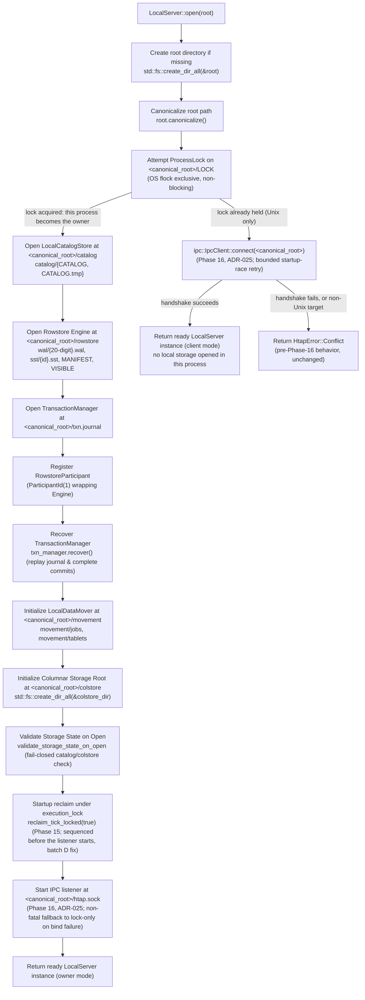

# Operational & Persistence Architecture

This document describes the on-disk storage layout, crash-recovery boundaries, and operational characteristics of `LocalServer` and `LocalCoordinator`.

---

## 1. Current Status: Hardened Local Embedded MVP

**The HTAP database engine is a hardened local embedded MVP, not a production-ready standalone database.**

The core engine (`LocalServer` / `LocalCoordinator`) is an in-process, synchronous Rust library; as of Phase 8 it can also be reached over the network via the `htapd` daemon and the `htap-wire` MySQL text- and binary-protocol server (binary protocol/prepared statements added in Phase 11), itself a plain synchronous process with no supervisor integration (see section 6, "Running `htapd`"). Core storage, transaction, and persistence paths have received critical hardening, but **production readiness is not claimed**.

### Completed Hardening Units

- **C1 — WAL-GC Transaction Identity Replay (Fixed: `f7a4975`):** Rowstore `MANIFEST` v2 records an external apply ledger of external transaction IDs and applied versions. Even after WAL prefix pruning, exact re-applies remain idempotent and conflicting identity reuse is rejected.
- **C2 — Durable Commit Reversibility (Fixed: `88cc314`):** Transaction decisions are irrevocable once the commit record is synced to `txn.journal`. Post-decision failures return `DurablePending` rather than rolling back or reporting aborts.
- **H1 — Manager Decision Serialization (Fixed: `88cc314`):** Transaction manager operations are serialized under a single lock across prepare, intent, version allocation, commit, participant apply, publish, and recovery.
- **H2 — Engine Post-WAL Failures Surface as DurablePending (Fixed: `c5ee281`):** Once a WAL commit is durable, post-decision memtable, flush, and publication errors return `DurablePending`. Committed state is retained, failed flushes are retried before new data is admitted, and reopen recovery completes visibility.
- **H5/M2 — Owned Persistence Bounds and Internal Path Validation (Fixed: `b7ff200`):** Shared bounded reader (`read_file_exact_bounded`) enforces size limits on all owned envelopes before allocation. Internal movement job/package IDs and conversion segment relative paths are strictly validated.
- **Exclusive Root Ownership (Fixed: `1083fbd`):** Non-blocking advisory file lock (`<root>/LOCK` via `flock`) and path canonicalization enforce single-process root ownership.

---

## 2. Important Operational Boundaries & Non-Features

The following operational facilities and production features are **explicitly not implemented or open**:

- **No Daemon Supervisor Management:** No `systemd` units or init scripts are provided; `htapd` (below) is a
  plain foreground process with no signal handler beyond the OS default (Ctrl-C/SIGTERM stop it hard).
- **TLS and per-user accounts are implemented (Phase 12), but not roles or delegated administration:**
  `htapd`/`htap-wire` support optional TLS and catalog-backed per-user accounts/privileges; see "Running
  `htapd`" below for the full security contract. There is no role-based access control (RBAC), no delegation
  (`WITH GRANT OPTION` is rejected), and only the `%` host is accepted.
- **No Authentication or Security Boundary for In-Process Use:** `LocalServer`/`EmbeddedClient` calls have no
  user credentials, authentication handshakes, or RBAC — the caller is trusted the way any embedded library
  is trusted.
- **Narrow OLAP SQL path, plus a separate general query executor:** `LocalServer` executes narrow single-table analytical scans (`Route::OlapScan`: plain projections, AND-only typed filters, `COUNT(*)`, `COUNT(col)`, `SUM(Int32/Int64/Float64)`, `MIN/MAX`, deterministic `GROUP BY` with SQL NULL grouping, and simple unqualified source/projected column `ORDER BY` with ASC/DESC and NULLS FIRST/LAST/default policy, global deterministic tie-break) over logical rowstore and base-plus-delta rows using server-root `<root>/colstore` for materialized `Column`/`Converting` partitions. For `Column` and `Converting` partitions, `LocalServer` executes projection-aware compact reads (PK + requested column union), safely pushing down one eligible predicate leaf directly into `SegmentReader::scan`, suppressing stale base rows via post-base rowstore deltas, and evaluating residual SQL logic. ScanStats/pruning is available as internal execution evidence, but SQL still uses materialized logical rows and vectorized aggregation is not implemented. Complete-PK `RowstorePointRead` remains separate and unchanged. This narrow path itself has no joins, CTEs, windows, expressions beyond a plain column, or `HAVING`/`OR`/arithmetic — those are handled instead by the separate general query executor (`Route::Query`, `htap-server::query_exec`), which implements joins (including `FULL OUTER`/`NATURAL`/`USING` and nested join trees), CTEs (including `WITH RECURSIVE`), expressions, aliases, full `ORDER BY`/`GROUP BY` (including ordinals), `LIMIT`/`OFFSET`, `HAVING`, `OR`/`NOT`/arithmetic/casts, `AVG`/`DISTINCT` aggregates, window functions, correlated subqueries (one level deep), `UNION`/`EXCEPT`/`INTERSECT`, `DELETE` by filter, `TRUNCATE`, and `INSERT ... SELECT` — see `docs/ARCHITECTURE.md`'s Phase 9/13 paragraphs and `docs/LIMITATIONS.md`'s "General query executor scope and deferred features" for the full contract. Direct `SegmentReader` pushdown optimization is implemented for the compact base path. As of Phase 14, the general `Route::Query` executor also has `ANALYZE TABLE` statistics, a statistics-driven cost-based optimizer (`htap_sql::optimize`, enabled by default), `EXPLAIN`/`EXPLAIN ANALYZE`, a per-statement memory budget with disk spilling, and bounded parallelism for `GROUP BY`/`INNER`/`CROSS` hash joins — see "Cost-based optimization, `EXPLAIN`, spilling, and parallelism (Phase 14)" in `README.md` and ADR-023 in `docs/DECISIONS.md`. Compound `AND` pushdown beyond one leaf, `!=` pushdown, vectorized operator pipelines, worker-pool parallelism above the per-slot scan for `LEFT`/`RIGHT`/`FULL` joins (their equi-hash spilling is not itself kind-restricted in code, but is exercised by a test only for `INNER` joins), memory-bounded spilling for non-equi/`CROSS` joins (a genuine gap — evaluated by an in-memory nested loop with no budget check at all), multi-tablet/distributed scans, resource quotas/cancellation, DataFusion/Arrow, and full MySQL breadth remain unsupported on every path.
- **No High Availability (HA) or Distributed Consensus:** No Raft (`openraft`), ZooKeeper ensemble backend, network heartbeats, ephemeral sessions, remote RPC replica serving, or active failover exists.
- **One-Owner Multiprocess-Exclusive Mode, Now With IPC Forwarding for Later Processes (Phase 16, ADR-025):**
  Root locking (`<root>/LOCK`) still enforces that only one operating system process ever touches a server
  root's storage directly — concurrent shared-root writers or readers at the storage layer are still strictly
  unsupported, unchanged. What changed: the process that wins that lock (the **owner**) also starts a
  background IPC listener bound to `<root>/htap.sock` (a Unix domain socket, Unix-only), and a later process
  that loses the lock race no longer just fails — it becomes an IPC **client** and forwards SQL and session
  calls to the owner over that socket instead of touching storage itself. `LocalServer::is_owner()` reports
  which mode a given handle is in, and `LocalServer::is_listener_up()` reports whether the owner's listener is
  actually accepting connections (a healthy owner) or has fallen back to lock-only mode (a degraded owner —
  see below); a client-mode `LocalServer` reports `is_listener_up() == false` as well, since the query is
  about *this* handle's own listener, not the remote owner's.
  - **Trust boundary.** The published socket is mode `0600` (owner read/write only), matching the same
    same-OS-user trust model already documented for `<root>/LOCK` — this is not a security boundary against
    another local user with filesystem access to the whole root, only against accidental cross-process
    interference. A storage re-review (batch E) found that the original implementation bound the socket
    directly at `<root>/htap.sock` with the process's default file-creation mask and only tightened it to
    `0600` a moment later; since the root directory is itself world-traversable, another local user who
    connected in that window would have gotten an unauthenticated superuser session. The socket is now
    created inside a private, owner-only (`0700`) directory, tightened there, and atomically renamed into
    place, closing the window entirely — no peer-credential checking is needed to fix this specific gap (see
    ADR-025's "Post-review fixes (batch E)" section). That private directory itself is removed right after the
    rename publishes the socket, and any left behind by a crashed prior owner are cleaned up at the start of
    the next `LocalServer::open` on that root — a batch F storage re-review found the successful-path removal
    was missing, so every server that ever started, not only a crashed one, leaked one of these directories
    into `<root>` until this fix (see ADR-025's "Post-review fixes (batch F)" section).
  - **Long-socket-path fallback.** If `<root>/htap.sock`'s absolute path is too long for this kind of Unix
    domain socket, or a non-socket file already occupies that path, the owner logs a warning and falls back to
    the pre-Phase-16 lock-only mode: it keeps working normally for itself, but a second opener on that root
    gets the ordinary `HtapError::Conflict` (lock contention), not IPC forwarding, exactly as it would have
    before this phase. `is_listener_up()` reports `false` in this case.
  - **Listener-health query.** Use `server.is_owner()` and `server.is_listener_up()` together to distinguish a
    healthy owner (`true`, `true`) from a degraded, lock-only owner (`true`, `false`) from a client
    (`false`, `false`) — a monitoring or diagnostic caller should treat `(true, false)` as "storage is fine,
    but a second process on this root will get `Conflict` instead of forwarding," not as an error.
  - Standalone subsystem opens (`Engine::open`, `LocalCatalogStore::open`, `LocalDataMover::new`) do not
    acquire this lock, do not participate in the owner/client split, and remain unsafe for direct concurrent
    use — unchanged by this phase. See "Concurrent multiprocess use: owner plus IPC (Phase 16)" in
    `docs/ARCHITECTURE.md`, ADR-025, and `docs/LIMITATIONS.md`'s "Owner plus IPC (Phase 16) scope and deferred
    features" for the full contract.
- **`txn.journal` Is Checkpointed (Phase 15); the `MANIFEST` v2 External-Apply Ledger's Hard Cap Is Separate and Unaddressed:** `TransactionManager::checkpoint()` compacts `txn.journal` by dropping resolved `Intent`/`Commit`/`Abort` records past a durable baseline (`txn.checkpoint`, `HTAPTXC1`) — see section 3 below for the full contract. The rowstore `MANIFEST` v2 external-apply ledger has no compaction or coordinated retention and still enforces a hard cap (`MAX_APPLIED_EXTERNAL_TXNS = 1_000_000`). Once full, new external applies fail with `HtapError::InvalidArgument` (there is no `HtapError::CapacityExceeded` variant); a Phase 10 fix pass moved this check into `Engine::prepare` as well, so a real 2PC/direct-commit transaction is rejected before any journal write rather than only at apply time. Do not conflate the two — checkpointing the journal does not touch the ledger's cap.
- **Possible Later Flush-Boundary Duplicate SST Publication After Crash:** Crashes occurring after an SST is written but before reader registration, manifest update, or checkpoint advance can cause duplicate SST publication on subsequent cycles, requiring future staged flush recovery.
- **No Power-Loss Proof:** Integration crash tests prove recovery across process `SIGKILL` termination, not physical machine power loss, host kernel panics, or write cache invalidation.
- **Whole-Dataset Materialization in Conversion, Export, and Clone:** HTAP conversion (`htap-convert`), data export (`htap-movement`, where exports materialize the full logical partition before writing), and tablet snapshot cloning materialize entire datasets into memory or intermediate files without streaming.
- **External CopyOptions Paths Remain Caller-Controlled by Design:** While internal persistence files and paths are bounded and validated (`b7ff200`), external import/export paths specified via `CopyOptions` are caller-controlled by design and must be validated by the host application.
- **Catalog Format Version 2 (Phase 9), Extended by Format Version 5 (Phase 15) — `DROP TABLE` Reclaims Disk
  Space Eventually, Not Instantly:** `DROP TABLE` removes a table and its partitions/tablets/replicas from
  the catalog in one CAS. As of Phase 15, that same CAS also marks the dropped tablets `pending_reclaim`
  (`HTAPCAT1` `FORMAT_VERSION` bumped 4 -> 5), and `LocalServer::reclaim_tick`/`compaction_tick` physically
  reclaim the rowstore data and columnar segment files belonging to those tablets over as many maintenance
  calls as it takes — see section 3 below (compaction/GC) for the full contract, including the operator knobs
  `with_gc_horizon_retention_slack` and the explicit `compaction_tick()`/`reclaim_tick()` calls themselves,
  and `docs/LIMITATIONS.md`'s "Rowstore compaction, garbage collection, and DROP TABLE reclaim scope and
  deferred features" for the disclosed gaps (tier-driven, not instant; a busy/leased tablet can delay
  progress; `ALTER TABLE ... DROP/REORGANIZE PARTITION` and demoted column files are not reclaimed by this
  path). To guarantee a dropped identifier is never reissued while unreclaimed data may still be on disk,
  `CatalogSnapshot` persists an identifier high-water mark
  (`IdHighWater { table, partition, tablet, replica }`), and the `HTAPCAT1` catalog envelope
  `FORMAT_VERSION` bumped from 1 to 2 to carry it. A version-1 catalog still decodes (counters fall back to
  the live maximum id present in the snapshot) and is rewritten as version 2 on the next CAS; a
  version-1-only binary refuses to open a version-2 (or version-5) catalog rather than misinterpreting it —
  operators downgrading `htapd`/`LocalServer` to a pre-Phase-9 binary against a root that has been opened by a
  later binary will see that refusal, not silent corruption. Opening a genuinely unmigrated
  version-1 root performs a one-time migration write (one extra catalog CAS / generation bump, while the
  process still holds `<root>/LOCK`) that seeds the tablet high-water counter from the `colstore/` on-disk
  inventory — see section 3 below for the exact contract. **Known gap:** that migration does not recover
  replica ids removed by a pre-Phase-9 `ALTER TABLE ... DROP PARTITION`; a reissued replica id could in
  principle collide with a stale movement snapshot package directory under `movement/tablets/`, though this
  requires also reusing the same movement job id and is narrow in practice.
- **Catalog Format Version 3 (Phase 12) — Accounts, Grants, and File Permissions:** `HTAPCAT1`
  `FORMAT_VERSION` bumped again, 2 -> 3, to add `accounts`, `grants`, and an `accounts_initialized` latch (see
  "Accounts and per-user privileges" under section 6 below). A v1 or v2 catalog still decodes with empty
  accounts/grants; a v2-only (or older) binary refuses a v3 file. Because the catalog file now carries
  password hashes (`SHA1(SHA1(password))`, offline-crackable if leaked), `CATALOG.tmp` is created with Unix
  file mode `0600` before the atomic rename that publishes it — operators should still treat the whole root
  directory as access-restricted, the same as any other single-owner embedded database, not rely on the file
  mode alone.
- **Table Partitioning & Multi-Partition Execution Operational Boundary:**
  - `LocalServer` supports partitioned tables defined via SQL DDL (`CREATE TABLE ... PARTITION BY RANGE/LIST`) or through the native non-SQL API (`LocalServer::create_partitioned_table`) using `PartitionedTableDefinition` with finite `PartitionTopology::Range` (half-open `[lower, upper)` intervals with optional `MAXVALUE`) or `PartitionTopology::List` (disjoint value sets).
  - Unpartitioned SQL DDL (`CREATE TABLE`) creates tables with a default single partition `p0`. Typed MySQL partition DDL is supported via vendored `sqlparser`, while unsupported forms (options, subpartitions, expressions, multi-column COLUMNS, non-final MAXVALUE) are rejected.
  - Catalog validation guarantees that the partition key column is non-null and a member of the primary key, validates range bounds ordering and disjointness, verifies list value sets, and rejects duplicate partition names, type mismatches, and empty topologies.
  - Local topology invariant: Each partition currently consists of exactly one bucket-0 row tablet and one healthy local leader replica on node 1 (`NodeId(1)`). Hash buckets, tablet sharding, dynamic rebalancing, and physical multi-node sharding are not implemented.
  - Multi-row `INSERT` routes rows by partition key and commits all mutations across partitions in a single transaction payload and version step. Complete-PK `DELETE` and `SELECT` route by partition-key position; complete-PK `SELECT` strictly preserves the rowstore `Engine::get` fast path.
  - Analytic `SELECT` evaluates queries across partitions at one visible snapshot: conservative finite range/list partition pruning, bounded in-process partition scan workers, and deterministic global merge/order are implemented for narrow local OLAP; distributed fanout, disk spilling, query cancellation, and resource quotas remain deferred.
  - Format conversion & demotion: `convert_table` is guarded to single-partition tables. Table-wide conversion is available via `convert_table_to_column` (Row->Column) and metadata demotion via `convert_table_to_row` (Column->Row, which clears catalog `column_manifest` references via CAS while retaining rowstore data and column segment files on disk). Synchronous explicit ticks (`conversion_tick`, `tick`) execute policy steps; `tick` resumes persisted jobs only, with no autonomous background scheduler daemon implemented.
  - Partition lifecycle DDL: Supported via SQL `ALTER TABLE <table> ADD/DROP/REORGANIZE PARTITION` and native `LocalServer::alter_partitions` on empty sources with rowstore collapse verification. Populated DROP/REORGANIZE partitions are rejected. Populated partition data migration during reorganization, physical storage reclamation for this `ALTER TABLE` path (empty partitions only, so currently inert) or demoted column files, hash tablets, distributed serving, and replica failover remain deferred. `DROP TABLE`'s own artifacts are reclaimed as of Phase 15 (see "Important Operational Boundaries & Non-Features" above) — unrelated to this `ALTER TABLE` path.

---

## 3. LocalServer Filesystem Layout & Initialization Flow

### Initialization Flow (`LocalServer::open`)

When opening or recovering a database instance at a given `root` path, `LocalServer::open(root)` executes an ordered, crash-safe sequence:



### Filesystem Layout

`LocalServer` manages five dedicated sub-paths and an advisory lock file under the canonical root directory:

```text
<root>/
├── LOCK                                      # Exclusive process advisory lock and diagnostic PID/start-time (1083fbd)
├── htap.sock                                 # Owner-only IPC listener socket, mode 0600, Unix-only (Phase 16, ADR-025)
├── catalog/
│   ├── CATALOG                               # Durable catalog snapshot state (bounded envelope b7ff200)
│   └── CATALOG.tmp                           # Staging file for atomic replacement
├── rowstore/
│   ├── wal/
│   │   └── {20-digit}.wal                    # Framed write-ahead log segments (e.g. 00000000000000000001.wal, CRC32C)
│   ├── sst/
│   │   └── {id}.sst                          # Immutable Sorted String Tables (blocks, bloom filter, CRC32C)
│   ├── MANIFEST                              # MANIFEST v2 with external apply ledger (f7a4975, b7ff200)
│   └── VISIBLE                               # Monotonically increasing visible version watermark (b7ff200)
├── colstore/                                 # Server columnar storage root for materialized partitions (b62c705)
│   └── <tablet_id>/
│       ├── MANIFEST                          # Durable columnar tablet manifest envelope (HTAPTBM1)
│       └── *.seg                             # Columnar segment files
├── txn.journal                               # 2PC transaction manager write-ahead log (irrevocable 88cc314, bounded b7ff200)
├── txn.checkpoint                            # Durable checkpoint baseline for txn.journal (HTAPTXC1, Phase 15)
├── spill/                                    # Phase 14: non-durable query spill scratch, swept in full on every open
│   └── <statement-id>/
│       └── *.spill                           # Length-prefixed spill rows (magic HTAPSPIL; no CRC/fsync/version contract)
└── movement/
    ├── jobs/
    │   └── <job-id>/
    │       ├── JOB                           # Durable movement job envelope (HTAPJOB1, bounded b7ff200)
    │       └── JOB.tmp                       # Staging file for atomic job envelope replacement
    └── tablets/
        └── <source>/<target>/<job>/
            ├── MANIFEST                      # Tablet package manifest envelope (HTAPMNF1, CRC32C)
            └── DATA                          # Tablet snapshot rowstore data
```

### Component Details

0. **`LOCK` (`ProcessLock` — `1083fbd`):**
   - **Lock Lifetime:** Acquired during `LocalServer::open(root)` (and `LocalCoordinator::open`) and held continuously by the `ProcessLock` instance for the lifetime of the server. Dropping the server instance releases the OS-level file lock (`flock unlock`).
   - **Contention Behavior:** The lock is acquired non-blockingly (`try_lock_exclusive`). `LocalCoordinator::open` still fails immediately with `HtapError::Conflict` if another process or thread holds the lock, with diagnostic metadata read from `<root>/LOCK` (`pid=<pid>;start_time=<epoch_secs>`). As of Phase 16 (ADR-025), `LocalServer::open` instead attempts to become an IPC client of the current owner when the lock is already held (see the `htap.sock` bullet below); it falls back to the same immediate `HtapError::Conflict` only when IPC forwarding itself is unavailable (no listener, a degraded lock-only owner, a non-Unix target, or a handshake failure).
   - **Symlink Aliases:** `ProcessLock::acquire` operates on the canonicalized root path (`root.canonicalize()`). Accessing the same root via symlink aliases resolves to the exact same physical lock file, preventing multi-process lock bypass.
   - **Low-Level Subsystem APIs Do Not Acquire the Root Lock:** Standalone subsystem instances (`htap_catalog::LocalCatalogStore::open`, `htap_movement::LocalDataMover::new`) do **not** acquire `<root>/LOCK`. They remain unsafe for direct concurrent shared-root use. As of Phase 15, `htap_rowstore::Engine::open` acquires its *own*, separate exclusive lock at `<rowstore>/LOCK` for the engine's lifetime — a second `Engine::open` against the same rowstore directory (in or out of process) fails — but this is a rowstore-directory-only lock, not a substitute for the server's root lock; `LocalServer` always acquires `<root>/LOCK` first, so the two cannot form an ordering cycle.
   - **`htap.sock` (Phase 16, ADR-025, Unix-only):** After winning `<root>/LOCK`, opening every subsystem, and
     running startup reclaim (`reclaim_tick_locked(true)`, still under `execution_lock`), `LocalServer::open`
     starts a background IPC listener bound to `<root>/htap.sock` — this ordering (reclaim before the listener
     accepts connections, fixed in the batch D storage-review pass; see ADR-025) means a client can never
     execute a statement while startup reclaim is still deleting a dropped table's tablet directories. It
     removes a stale socket file left by a provably-dead previous owner (found already-a-socket at that
     path — safe, since this process just won the exclusive lock) before binding. As of batch E (a storage
     re-review finding), the socket is bound inside a private, owner-only (`0700`) directory (`<root>/.htap-ipc-<pid>-<id>/`),
     tightened to `0600` there, and only then atomically renamed to `<root>/htap.sock` — no window
     exists at any permission level where another local user could reach an unauthenticated socket, unlike
     the original bind-then-chmod sequence directly at the published path. The private staging directory
     itself is removed right after the rename publishes the socket — on every successful start, not only after
     a crash — and `LocalServer::open` also sweeps `<root>` for any private directories left by a crashed
     prior owner and removes them before creating a new one (fixed as of batch F: the successful-path removal
     was missing before this, so every server that ever started, not only a crashed one, leaked one of these
     directories; see ADR-025's "Post-review fixes (batch F)" section). A bind failure for any other
     reason (a canonicalize failure, a stale-socket removal failure, a permission error, a path too long for
     this kind of socket, or a non-socket file already at that path) is non-fatal: the owner falls back to
     lock-only mode, exactly as it always has, with a warning log. The listener is torn down — stop flag,
     force-close every live connection, unbounded join of the accept and every connection thread, then
     socket-file removal — before `<root>/LOCK` is released, so a stale socket never outlives its owner's
     lock. The owner also bounds its handshake read to a single absolute 5-second deadline across the whole
     frame (also true on the client's connect path) — as of batch E, a peer trickling bytes one at a time can
     no longer reset that deadline on every byte received and hold a connection thread indefinitely; an
     established session (past the handshake) has no deadline at all, so a long-running statement or an idle
     session is never cut off.

1. **`catalog/` (`LocalCatalogStore` — `b7ff200`):**
   - Tracks table definitions, schema, partition descriptors, tablets, and replica topologies.
   - Enforces optimistic concurrency control using integer generations (`compare_and_set`).
   - Mutations stage to `catalog/CATALOG.tmp`, call `sync_all()`, and atomically rename to `catalog/CATALOG`, followed by directory `sync_all()`. Read via bounded exact reader.
   - **Format version 2 (Phase 9):** The `HTAPCAT1` envelope persists `id_high_water` (highest allocated
     table/partition/tablet/replica id) so identifiers of tables removed via `DROP TABLE` are never reissued.
     A version-1 file still decodes (counters fall back to the live maximum) and is rewritten as version 2 on
     the next CAS; a version-1-only binary refuses to open a version-2 file. See "Important Operational
     Boundaries & Non-Features" above.
   - **Format version 5 (Phase 15):** `FORMAT_VERSION` bumped 4 -> 5 to add `pending_reclaim: Vec<PendingReclaim>`,
     tracking dropped-table artifact reclamation (see "Important Operational Boundaries & Non-Features" above
     and section 3's `rowstore/` and compaction/GC entries below). Versions 1-4 still decode with
     `pending_reclaim: []`; a version-5-labeled payload missing the key is rejected as `HtapError::Corruption`.
   - **One-time legacy migration on first open of a version-1 root:** If `LocalServer::open` finds a
     genuinely unmigrated version-1 catalog (persisted `id_high_water` still all zeros), it performs one
     extra catalog CAS during startup — after storage validation, while still holding `<root>/LOCK` — that
     raises the tablet high-water counter to the highest `colstore/tablet-*` directory actually present on
     disk (to account for tablets whose partitions were removed by a pre-Phase-9 `ALTER TABLE ... DROP
     PARTITION`) and rewrites the catalog file as version 2. This is a one-time write: the catalog generation
     advances by one, and subsequent opens of the same root are no-ops for this step because the mark is no
     longer all zeros. A caller that snapshots or backs up a root immediately after this first Phase-9 open
     will see one extra generation bump compared to the last version-1-binary write. Known gap: this
     migration recovers tablet ids from disk but not replica ids removed the same way — see "Important
     Operational Boundaries & Non-Features" above and `docs/LIMITATIONS.md`.

2. **`rowstore/` (`htap_rowstore::Engine` — `f7a4975`, `c5ee281`, `b7ff200`):**
   - **`rowstore/wal/{20-digit}.wal`:** Framed write-ahead log files recording transactional row mutations (`Put` and `Delete`). Files are named using 20-digit zero-padded sequence numbers (e.g. `00000000000000000001.wal`). Each entry is a header-less bare frame (`payload_len:u32 LE | crc32c:u32 LE | payload`, no magic or version — see the storage-format compatibility table in `docs/ARCHITECTURE.md`); the log sequence number comes from the frame's position, not a per-frame field.
   - **`rowstore/sst/{id}.sst`:** Immutable SST files containing ordered key-value pairs organized into indexed blocks with Bloom filters.
   - **`rowstore/MANIFEST`:** Manifest v3 format (as of Phase 15; v2 previously) storing active SST sets, an
     external transaction apply ledger (`f7a4975`), and — new in v3 — `committed_version_high_water` and
     `gc_low_water`, both monotonic and refusing to publish a regression. Bounded read protects against
     allocation attacks (`b7ff200`). Prevents identity replay across WAL GC. Note: hard cap of 1,000,000
     entries (`MAX_APPLIED_EXTERNAL_TXNS`) on the external-apply ledger without compaction, unrelated to and
     unaddressed by the v3 watermarks. A v1/v2 manifest still decodes (`gc_low_water` defaults to
     `Version::INITIAL`); a v3 payload whose ledger max version exceeds its own `committed_version_high_water`
     is rejected as `HtapError::Corruption`.
   - **`rowstore/LOCK` (Phase 15):** A separate exclusive advisory lock, held by `Engine::open` for the
     engine's lifetime — see item 0 above.
   - **`rowstore/VISIBLE`:** Tracks the monotonically advanced `visible_version`. Records applied but uncommitted/unpublished remain invisible across crashes until published. Post-WAL failures surface as `DurablePending` (`c5ee281`).
   - **Compaction and garbage collection (Phase 15):** `LocalServer::compaction_tick()` is an explicit,
     synchronous maintenance operation (matching `conversion_tick`'s existing operational model — no
     background thread, no SQL trigger) that runs `Engine::compact_once` over contiguous, entry-count-tiered
     SST runs, collapsing MVCC versions below a computed GC horizon and physically purging dropped-partition
     bytes. `LocalServer::with_gc_horizon_retention_slack(slack)` is an operator knob (default 0) subtracted
     from the computed horizon for extra safety margin; `EngineOptions::{with_max_compaction_input_ssts,
     with_max_compaction_input_entries}` bound one tick's per-pass work. Operators should expect
     `compaction_tick()` to block all SQL for its duration, same as `conversion_tick`, and to make partial (not
     full) progress on a root with a busy movement/reclaim-leased tablet — see `docs/LIMITATIONS.md`'s
     "Rowstore compaction, garbage collection, and DROP TABLE reclaim scope and deferred features" for the
     disclosed gaps.

3. **`txn.journal` (`htap_txn::TransactionManager` — `88cc314`, `b7ff200`):**
   - 2-Phase Commit (2PC) coordination journal tracking transaction lifecycle: `Prepare`, `Commit`, `Abort`.
   - Irrevocable commit boundary: once the commit record is fsynced, abort is rejected.
   - Manager decision serialization: all transitions serialized under one manager lock (`88cc314`).
   - Post-commit append/sync/apply/publish failures return `DurablePending` to the caller that hit them.
   - Read via bounded streaming frame validation with fixed probe buffers (`b7ff200`).
   - A failed journal append (`Journal::append_nosync`, used for the unsynced `Commit` frame write) truncates
     the file back to its pre-append offset, so a partial write from a crashed or short `write_all` cannot
     make the journal look like unrecoverable middle-of-log corruption on the next open.
   - **Recovery-required latch (Phase 10, corrected and widened by two follow-up fix passes):** once any
     `commit` call returns `DurablePending`, the manager latches "recovery required," recording a
     `RecoveryCause` of `ParticipantIo` (the commit record was already durable; only the participant's own
     `apply`/`publish` failed) or `JournalIo` (the journal append or sync itself failed). A third fix pass
     widened `JournalIo` beyond the `Commit` boundary: a failed `Intent` or `Abort` append/sync now latches the
     manager the same way (only for a real I/O error, never a pure oversize-frame rejection). Every *other*
     later `commit` — from any session, in-process or over the wire — is rejected with
     `HtapError::RecoveryRequired { blocking_txn, reason }` (a distinct error from the blocking transaction's
     own `DurablePending`; both map to MySQL 1105/`HY000`, never 1213/`40001`). `abort()` of an unrelated
     transaction is also rejected with `RecoveryRequired` while the latch's cause is `JournalIo`.
     `TransactionManager::recover()` can in principle clear the latch in-process only when the cause is
     `ParticipantIo`; a `JournalIo` latch — or the underlying `Journal` independently reporting itself
     poisoned (see below) — makes `recover()` refuse outright with `RecoveryRequired` and apply nothing,
     rather than attempt any replay, so it clears only on a fresh reopen (a brand-new `TransactionManager` from
     a brand-new file open and scan — an in-process resync after a failed sync proves nothing about whether
     the original write was durable). **In practice, even a `ParticipantIo` latch is only cleared by restarting
     the process**, because `LocalServer` calls `recover()` solely during `LocalServer::open` startup, never
     during normal operation — there is no other in-process trigger that would call it. Operationally this is
     an outage, not necessarily a corruption: restarting the process (`LocalServer::open` calls `recover()`
     during startup — see section 5, "Reopen Recovery Guarantees") always clears the latch regardless of its
     cause; see ADR-018 and "Sessions and explicit transactions (Phase 10)" in `docs/ARCHITECTURE.md`.
   - **Journal poisoning, independent of the manager latch:** `Journal` itself now tracks a `poisoned` state
     (set when an `append`'s or `sync`'s `fsync` fails, when the best-effort truncate after a failed write
     itself fails, or when an append wrote bytes but then failed to fsync). While poisoned, every further
     `append`/`append_nosync`/`sync` on that handle fails immediately; only a fresh `Journal::open` clears it.
     **After a journal `fsync` error, simply restarting the process is not proof of durability:** a new file
     descriptor from a fresh `open` will not report the earlier descriptor's `fsync` error, and the record that
     failed to sync may still be sitting only in the OS page cache. The safe operator action is to reboot the
     host (or otherwise ensure the page cache backing the journal's filesystem volume is dropped) before
     reopening, not just restart the process on the same still-warm cache. See "Reopen Recovery Guarantees"
     below for what happens if the journal and rowstore have genuinely diverged.
   - **Effective transaction payload cap is about 4 MiB, not the nominal 16 MiB `MAX_PAYLOAD_SIZE`:** the
     durable `Intent` frame JSON-encodes each participant's payload as a number array, which is larger than
     the raw payload and is itself bounded by the journal's 16 MiB frame limit. `TransactionManager::commit`
     rejects an oversize request with `HtapError::InvalidArgument` before prepare; see `docs/LIMITATIONS.md`
     for the exact figure. An operator seeing this error on a large `INSERT`/`UPDATE`/explicit-transaction
     `COMMIT` should reduce the statement's mutation payload size — there is no chunking.
   - **Checkpointed as of Phase 15; `max_journal_size` still checked only at open.** `txn.journal`'s total size
     is checked against `max_journal_size` (default 64 MiB, `DEFAULT_MAX_JOURNAL_SIZE`) only in
     `Journal::open_with_options`/`Journal::scan` (i.e. at `open` and during `recover()`), never on an ordinary
     `append`. `TransactionManager::checkpoint()` now compacts the journal by dropping resolved `Intent`/
     `Commit`/`Abort` records past a durable baseline (`txn.checkpoint`, `HTAPTXC1` — see item 3a below),
     fired opportunistically after a commit once the journal's valid byte count exceeds half of
     `configured_max_journal_size` (`TransactionManager::with_checkpoint_trigger_bytes`), and finalized once at
     `LocalServer::open` via `finalize_open()` (called immediately after `recover()`). This closes the
     unconditional-growth case for the common workload, but a workload dominated by long-lived,
     still-unresolved `Intent`s has nothing to drop and can still eventually make a later `LocalServer::open`
     fail with `HtapError::Corruption`; `checkpoint()`/`finalize_open()` also both refuse outright (not
     partially) while recovery is required or the journal is poisoned. See `docs/LIMITATIONS.md`'s
     "Transaction journal checkpoint scope and deferred features".
   - **3a. `txn.checkpoint` (`HTAPTXC1`, Phase 15):** A sibling file to `txn.journal`, in the same directory,
     persisting `CheckpointBaseline{ txn_id_high_water, version_high_water }` via the same
     temp-write/`sync_all`/rename/`sync_dir` pattern as every other durable file in this workspace. Absent
     (never checkpointed) decodes as `Ok(None)`, treated as baseline `(0, Version::INITIAL)`; a corrupt file is
     `HtapError::Corruption`. `publish_checkpoint` itself refuses to write a baseline that regresses either
     field. Any error partway through the journal-rewrite step of `checkpoint()` (after the baseline is
     already published) unconditionally latches `RecoveryCause::JournalIo` — including when a defensive
     re-open of the old handle happens to succeed — so operators should treat a checkpoint failure as an
     outage requiring `recover()`/reopen, never a bare retry of `checkpoint()` on the same handle.
   - **`Journal::open_for_bootstrap` (Phase 15):** During `TransactionManager::open`/`recover()`, the
     effective read-time size ceiling is temporarily raised to `max(configured max_journal_size,
     RECOVERY_BOOTSTRAP_MAX_BYTES)` (2 GiB) so an already-oversized journal can still be read and folded once
     before `finalize_open` re-enforces the configured `max_journal_size`. As of the "X batch" fix (X4),
     `checkpoint()` itself also reads through this same ceiling rather than the live journal handle's own,
     possibly smaller, configured limit — an earlier draft read through the handle's own limit, which after
     `finalize_open` is the configured one, so a journal an oversized commit had already pushed past it could
     never be checkpointed again on any later opportunistic trigger, not just at bootstrap. A follow-up "Y
     batch" review corrected the ceiling's own description: it is the *larger* of the configured limit and 2
     GiB, not a fixed 2 GiB cap — a fixed cap would itself refuse to read a journal larger than 2 GiB but
     smaller than a larger-than-2-GiB configured limit, the same class of failure X4 was fixing, just moved.
     No test covers the more-than-2-GiB case, since it would require constructing a journal over 2 GiB. If
     that one checkpoint cannot shrink the file below the configured limit, `finalize_open` (and therefore
     `LocalServer::open`) fails with `HtapError::Corruption` — the fix is to reduce the workload's rate of
     long-lived open transactions, not to raise `max_journal_size` further, since a larger cap only delays the
     same failure.

4. **`movement/` (`htap_movement::LocalDataMover` — `b7ff200`):**
   - Tracks data movement jobs (CSV/JSONL import/export, tablet snapshot migrations).
   - **`movement/jobs/<job-id>/{JOB, JOB.tmp}`:** Individual job metadata envelopes protected by the `HTAPJOB1` envelope with bounded reading and CRC32C verification. Updates use atomic staging (`JOB.tmp` -> `JOB`).
   - **`movement/tablets/<source>/<target>/<job>/{MANIFEST, DATA}`:** Tablet snapshot clone packages containing manifest envelope (`HTAPMNF1`) and data dump.
   - Internal job IDs and package paths are strictly validated (`b7ff200`). External `CopyOptions` paths remain caller-controlled.

5. **`colstore/` (`<root>/colstore` — `b62c705`):**
   - Columnar storage root for materialized partitions.
   - Houses per-tablet directories (`colstore/<tablet_id>/`) containing immutable columnar segments (`*.seg`) and tablet manifests (`MANIFEST` in `HTAPTBM1` envelope format with CRC32C checksums).
   - Used by `LocalServer::convert_table`, `LocalServer::convert_table_to_column`, `convert_table_to_row` (which retains columnar segment files on disk during demotion), and `LocalServer` analytical scans (`Route::OlapScan`) over `Column` and `Converting` partitions, utilizing projection-aware compact reads with safe single-leaf predicate pushdown into `SegmentReader::scan` and rowstore base-plus-delta overlay. Manifest generation on disk is validated against catalog metadata before execution, and startup validation (`validate_storage_state_on_open`) fails closed (returning `HtapError::Corruption` or `HtapError::Io` depending on the cause) if catalog and disk states diverge.
6. **`spill/` (Phase 14, `crates/htap-server/src/spill.rs`):**
   - Non-durable scratch space for the general query executor's (`Route::Query`) memory-bounded hash joins,
     `GROUP BY`, `ORDER BY`, `DISTINCT`/`EXCEPT`/`INTERSECT`, and window functions, used only when a statement's
     data exceeds its `MemoryBudget` (default 256 MiB). This applies to `Route::Query` only: a single-table
     `SELECT` with `ORDER BY`, `GROUP BY`, or a plain aggregate and no join routes to the narrow
     `Route::OlapScan` path instead, which has no memory budget and never spills, by design. One level of
     spilling only — hash-join partition count is sized from the input and the remaining budget, capped at 128
     (windows share this cap, to bound open file descriptors and the writer buffers the budget doesn't count);
     `GROUP BY` and the set operators each spill into their own fixed 16 partitions — unlike the hash join and
     window, not scaled by input size or the remaining budget, so an input much larger than roughly 16x the
     budget fails with the memory-budget error instead of spilling successfully (a deferred improvement); a
     partition that still doesn't fit (skew, or the cap) fails with the memory-budget error rather than
     recursing.
   - One subdirectory per statement (`spill/<statement-id>/`), containing length-prefixed row files tagged
     with a minimal header (magic `HTAPSPIL`, kind/operator tags) — **deliberately not** an
     `htap_common::envelope` file: no CRC, no fsync guarantee, no accepted-version-range contract, since this
     is disposable scratch, never a durable artifact.
   - A statement's own `SpillDir` removes every file it created (best-effort, log-and-continue) when the
     statement finishes, via `Drop`. `LocalServer::open` additionally removes `<root>/spill/` in full after
     acquiring the root `<root>/LOCK`, so an abandoned directory left by a killed process never accumulates or
     confuses a later statement. **Disclosed, not fixed:** this sweep only logs a failure to remove the
     directory rather than returning an error, and `SpillWriter::create` opens with `create_new(true)`, so a
     stale file the sweep failed to remove can collide once with a statement id reused after a process
     restart, failing that one statement with an `AlreadyExists` I/O error. The collision heals on its own
     once that statement id has been consumed by the next spilling statement.
   - `SpillWriter` itself has no custom `Drop`: finishing a writer (flushing it so a write failure surfaces to
     the query) before the file is read back is enforced by convention at each of its call sites, not by the
     type. A `SpillWriter` dropped without an explicit `.finish()` call still flushes via its inner
     `BufWriter`'s own drop, but silently discards any I/O error rather than returning it. All current call
     sites call `.finish()` explicitly; this is a call-site convention, not a compiler-checked guarantee.
   - Spill scratch carries **no durability guarantee of any kind** and is unrelated to the WAL/rowstore/
     catalog/manifest durability invariants elsewhere in this document; a crash mid-spill simply loses the
     in-flight query, which was never reported as committed.

### Query execution settings (Phase 14, `LocalServer` builder methods; no `htapd` CLI flag yet)

These are configured in Rust via `LocalServer` builder methods (`with_*`) or their `set_*`/getter
counterparts, the same pattern the pre-existing `scan_workers` setting already uses; unlike
`--max-allowed-packet` and similar `htapd` flags documented in "Running `htapd`" below, none of these three
has an `htapd` command-line flag or environment variable yet:

| Setting | Default | Method |
| --- | --- | --- |
| Per-statement memory budget for spillable stages | 256 MiB | `with_query_memory_budget`/`set_query_memory_budget`/`query_memory_budget()` |
| Intra-query parallelism worker budget | `std::thread::available_parallelism()` (falls back to 1) | `with_query_parallelism`/`set_query_parallelism`/`query_parallelism()` |
| Exact-distinct-value cap per column for `ANALYZE TABLE` | 200,000 | `with_analyze_distinct_limit`/`set_analyze_distinct_limit`/`analyze_distinct_limit()` (past the cap, `distinct_count` is reported as unknown rather than approximated) |

`LocalServer` also exposes test-telemetry accessors, not a stable monitoring API: `last_query_parallel_workers()`,
`last_query_optimizer_invocations()`, and one per-operator spill accessor each for hash join, `GROUP BY`, sort,
distinct, set-operation, and window (`last_query_hash_join_spilled()`, `last_query_group_by_spilled()`,
`last_query_sort_spilled()`, `last_query_distinct_spilled()`, `last_query_set_operation_spilled()`,
`last_query_window_spilled()`), each reporting whether that operator kind spilled in the caller thread's most
recent statement.

---

## 4. LocalCoordinator Filesystem Layout

The `LocalCoordinator` manages cluster membership, scoped leadership leases, and monotonic fencing tokens independently under its own root directory:

```text
<coord_root>/
├── LOCK                    # Exclusive process advisory lock and diagnostic PID/start-time (1083fbd)
├── COORDINATOR             # Durable coordinator state envelope (HTAPCRD1, bounded b7ff200)
└── COORDINATOR.tmp         # Staging file for atomic publish
```

### Binary Envelope Specification (`HTAPCRD1`)

Coordinator state is stored in a versioned binary envelope:
- **Header Magic (8 bytes):** `b"HTAPCRD1"`
- **Format Version (2 bytes):** `0x0001` (little-endian `u16`)
- **Payload Length (4 bytes):** Little-endian `u32` (capped at 64 MiB by bounded reader `b7ff200`)
- **Checksum (4 bytes):** Little-endian `u32` CRC32C over the payload bytes
- **Payload:** JSON-serialized state tracking registered cluster nodes, active leases, and high-water mark issued fencing tokens (HTAPCRD1 fields are little-endian JSON).

---

## 5. Backup & Recovery Boundaries

### Safe Local Backup Boundaries

Because `LocalServer` writes across multiple internal components (`catalog`, `rowstore`, and `txn.journal`):

1. **Quiescent / Offline Backup (Recommended):**
   - Completely shut down or drop the `LocalServer` instance within the host application.
   - Once all locks are released and file handles closed, take a filesystem-level copy (e.g., `tar`, `cp -a`, or filesystem snapshot) of the entire root directory.

2. **Online / Running Backup:**
   - **Do not** perform arbitrary file-by-file copies of an active server root. Doing so risks capturing torn states between `txn.journal`, `rowstore/wal/{20-digit}.wal`, and `MANIFEST`.
   - If online backup is necessary, rely on filesystem-level point-in-time snapshots (such as ZFS or LVM snapshots) that provide crash-consistent atomic snapshots across the storage volume.

### Reopen Recovery Guarantees

When reopening an existing directory via `LocalServer::open(path)`:
1. **Catalog Recovery:** Loads `CATALOG` with bounded reader validation (`b7ff200`), validates snapshot structure, and initializes optimistic concurrency control at the recorded generation. Interrupted `.tmp` files are ignored.
2. **Rowstore LSM Recovery:**
   - Reads `MANIFEST` (v3 as of Phase 15, v2 previously) and restores the external transaction apply ledger before WAL replay (`f7a4975`).
   - Replays WAL records up to the last clean boundary, repairs torn tails caused by abrupt process death, reconstructs active memtables, and reads the `VISIBLE` version watermark.
   - Post-WAL errors returning `DurablePending` are retried and completed during recovery (`c5ee281`).
   - **Recovered committed version (Phase 15):** `max(MANIFEST.committed_version_high_water, every SST's own
     max_version, every replayed WAL commit)` — the manifest term is additive, never replacing the SST/WAL
     terms, so a manifest that is stale relative to the WAL (a crash between a WAL commit and the next flush)
     still recovers correctly. `Engine::open` also acquires its own exclusive `<rowstore>/LOCK` at this point
     (see item 0 in section 3 above).
3. **Transaction Manager Recovery:**
   - Replays `txn.journal` using bounded streaming frame inspection (`b7ff200`).
   - Treats committed records as irrevocable (`88cc314`).
   - Matches prepared and committed states, re-applies committed operations across participants idempotently via the external ledger (`f7a4975`), and completes unpublished transactions.
   - **fsync-before-replay:** `recover()` fsyncs the journal file it just read from before replaying any
     `Commit` record into a participant, since an ordinary file read alone does not prove the record was ever
     actually synced to disk. If this sync fails, `recover()` (and therefore `LocalServer::open`) fails and
     latches the manager as `RecoveryCause::JournalIo` (the underlying `Journal` also poisons itself); a
     second `LocalServer::open` attempt against the same still-warm page cache does not resolve this — see the
     reboot guidance in "Recovery-required latch" and "Journal poisoning" above.
   - **`recover()` refuses outright, applying nothing, if already latched `JournalIo` or if the journal is
     poisoned:** this check runs before any replay work, so a caller cannot make partial progress by calling
     `recover()`/reopening repeatedly against the same unrecovered journal state; only a genuinely fresh
     `Journal`/`TransactionManager` (a real reopen, and after a `fsync` failure specifically, ideally after a
     host reboot — see above) clears it.
   - **Post-replay corruption cross-check:** after replay completes, `recover()` compares every registered
     participant's own durable `committed_version()` (for the rowstore, `Engine::committed_version()`)
     against the journal's own replayed maximum commit version. A mismatch in either direction —
     `committed_version()` ahead of the journal (a durable commit record has gone missing from `txn.journal`)
     or behind it (replay did not fully apply what the journal records) — fails `LocalServer::open` with
     `HtapError::Corruption` rather than starting up on a state the journal cannot account for. **Operator
     action:** this is a genuine data-consistency problem between `rowstore/` and `txn.journal`, not a
     transient fault; it means one of the two was modified or lost independently of the other (e.g. by
     restoring `rowstore/` and `txn.journal` from backups taken at different times — see "Safe Local Backup
     Boundaries" above). Do not attempt to "fix" it by deleting `txn.journal` or a WAL segment. Investigate
     with the exact `Corruption` message (it states which side and by how much), consult the most recent
     consistent backup or snapshot of the whole root, and treat the affected root as needing manual recovery
     rather than routine restart.
   - `next_txn_id` is restored via `fetch_max` (never regressing it, even if a `begin()` call races the
     replay in-process).
   - **Checkpoint finalization (Phase 15):** immediately after `recover()` returns, `LocalServer::open` calls
     `TransactionManager::finalize_open()`, which best-effort checkpoints the journal (see item 3 in section 3
     above) and then re-enforces the *configured* `max_journal_size` (not the temporary 2 GiB bootstrap
     ceiling `open_for_bootstrap` used to read the journal in the first place). If the journal was oversized
     and the checkpoint could not shrink it enough, `LocalServer::open` fails with `HtapError::Corruption` at
     this step, not silently at some later commit.
4. **Fencing Token Monotonicity:** On reopening `LocalCoordinator`, persisted high-water tokens are restored, ensuring subsequent leadership acquisitions yield strictly greater fencing tokens than any token issued prior to restart.

---

## 6. Running `htapd`

`htapd` (`crates/htapd`) is a thin binary that opens a `LocalServer` root and serves it over the MySQL text
and binary protocols via `htap-wire::WireServer` (see ADR-016, ADR-019, and the "Network layer" / "Prepared
statements and binary protocol" sections of [`ARCHITECTURE.md`](./ARCHITECTURE.md) for the protocol
implementation itself). Since Phase 10, each authenticated connection owns one `htap_server::Session` for
its lifetime (`BEGIN`/`COMMIT`/`ROLLBACK`, `autocommit`, session variables — see ADR-018), rolled back
explicitly on `QUIT`/EOF/a framing error/server shutdown, with the session's own `Drop` as a safety net.
Since Phase 11, `COM_RESET_CONNECTION` and `COM_CHANGE_USER` also route through that same session's
`reset()`, respecting the ADR-018 `CommitOutcomePending` quarantine. The start-up compatibility shim
(`htap_wire::shim`) now only answers `USE`/`SELECT 1`/`VERSION()`/`DATABASE()`/`SCHEMA()` and the two `SET
CHARACTER SET`/`SET CHARSET` positional forms `vendor/sqlparser` cannot parse; every other `SET` and
`SELECT @@sysvar`/`SELECT @uservar` now goes through the connection's real session.

```text
htapd --root <dir> [--listen 127.0.0.1:3307] [--max-connections 64] [--password <pw>]
       [--max-allowed-packet 67108864] [--tls-cert <path> --tls-key <path>]
       [--require-secure-transport] [--disable-compression]
```

`--max-allowed-packet` (default 64 MiB, MySQL's own default) bounds every protocol message — including a
prepared statement's buffered `COM_STMT_SEND_LONG_DATA` bytes — and can also be set via
`HTAPD_MAX_ALLOWED_PACKET`; the flag wins if both are set. It is reported dynamically to clients as
`@@max_allowed_packet`.

### TLS certificate provisioning and reload (Phase 12)

- `--tls-cert <path>`/`--tls-key <path>` (or `HTAPD_TLS_CERT`/`HTAPD_TLS_KEY`) must both be set together;
  either PEM file missing, unreadable, malformed, or a cert/key pair that don't match each other fails
  `WireServer::start` outright with a clear `io::Error` — TLS is never silently disabled because of a bad
  cert.
- **Non-loopback binds should set `--require-secure-transport`/`HTAPD_REQUIRE_SECURE_TRANSPORT`.** This
  rejects a plaintext login before credentials are ever checked, and itself fails startup if TLS isn't
  configured — it exists specifically so an operator binding `htapd` beyond `127.0.0.1` has a way to refuse
  cleartext connections outright rather than relying on every client remembering to opt into TLS.
- **Reload:** `WireServer::reload_tls_certs()` loads and validates a new cert/key pair (including that they
  match) and, only if that succeeds, atomically swaps the certificate served to new TLS handshakes; a failed
  reload leaves the previously active certificate in place and does not affect already-open connections
  either way. There is no `SIGHUP` handler or file-watcher wired into the `htapd` binary itself — calling
  `reload_tls_certs()` is only reachable by an embedding host process holding the `WireServer` (e.g. a
  supervisor that owns the daemon as a library, not the standalone `htapd` binary as shipped). Rotating a
  certificate against the standalone `htapd` binary today means restarting the process with the new
  `--tls-cert`/`--tls-key` paths.
- **Compression toggle:** MySQL protocol compression (zlib/zstd) is negotiated automatically and is
  independent of TLS; `--disable-compression`/`HTAPD_DISABLE_COMPRESSION` turns off advertisement entirely (a
  compression-requesting client's capability bits are then simply ignored).

### Lifecycle

1. **Startup:** `htapd` parses arguments, opens `LocalServer::open(root)` (identical root layout and
   recovery guarantees to any other `LocalServer` — see sections 1-5 above), then starts a `WireServer` bound
   to `--listen`; `WireServer::start` itself calls `bootstrap_root_account` once, before spawning the accept
   thread (see "Root account lifecycle and break-glass recovery" below). It then logs `"htapd ready"` (via
   `tracing`, controlled by `RUST_LOG`), and parks the main thread until the process is killed. There is no
   signal handler; Ctrl-C or SIGTERM stops the
   process unconditionally.
2. **Root lock is exclusive, but a second process is no longer just rejected (Phase 16, ADR-025):**
   `LocalServer::open` acquires the same `<root>/LOCK` advisory lock as any other caller (section 3.0 above);
   exactly one process ever touches storage directly. A second `htapd` (bound to a different `--listen`
   address, since the first `htapd`'s socket already owns its own) or `EmbeddedClient` pointed at the same root
   no longer fails outright: `LocalServer::open` transparently becomes an IPC client and forwards SQL/session
   calls (including the `bootstrap_root_account` call `WireServer::start` makes) to the first `htapd` over
   `<root>/htap.sock` — no source change to the `htapd` binary itself was needed for this (batches A-C).
   `htap-wire` and `htap-client` did later need small changes once `open_session`/`authenticate_session` became
   fallible in client mode instead of panicking (batch E) and once an owner-gone login was distinguished from a
   real credential failure (batch F) — see ADR-025's "Post-review fixes (batch E)" and "(batch F)" sections. The
   second `htapd` still fails to start with `HtapError::Conflict` only when IPC forwarding itself is
   unavailable (no listener, a degraded lock-only owner, a non-Unix target, or a handshake failure), or with a
   plain bind error if it reuses the same `--listen` address as the first.
3. **Shutdown:** There is no graceful drain API exposed by the binary itself. Stop the process (Ctrl-C /
   SIGTERM); in-flight statements are not drained, but storage is crash-safe by construction
   (ADR-004/008/009), so committed state is recovered on the next start exactly as after a `SIGKILL` of any
   other `LocalServer` host process. `WireServer::shutdown` (used by tests, not by the `htapd` binary itself)
   performs an orderly stop: it sets a flag, stops accepting, calls `Shutdown::Both` on every live connection
   via a `live_connections` registry (Phase 11), and joins every connection thread — a connection thread
   blocked mid-read on a partial packet is force-closed immediately rather than left waiting indefinitely for
   the rest of that packet. A connection torn down this way has its open transaction rolled back the same as
   any other disconnect.
4. **Logging:** Structured logs via `tracing-subscriber`, controlled by the `RUST_LOG` environment variable
   (defaults to `info`). `htapd` logs the listen address, root path, whether a password is required, and
   warns if bound to a non-loopback address.

### Root account lifecycle and break-glass recovery (Phase 12)

- **First start:** `bootstrap_root_account` runs once, from `WireServer::start` — not from bare
  `LocalServer::open` — before `htapd` accepts any connection. The first time it runs against a root
  directory, it creates one superuser `root` account from `--password`/`HTAPD_PASSWORD` (or an empty password
  if neither is set) and sets the catalog's `accounts_initialized` latch. This is the only time `--password`
  seeds a login credential. (An embedded-only caller that never starts a `WireServer` — i.e. `EmbeddedClient`/
  `LocalServer::execute` with no `htapd` — never bootstraps an account and keeps using the pre-Phase-12
  implicit-superuser behavior for every session it opens.)
- **Every later open:** the latch is already set, so `bootstrap_root_account` adopts the existing `root`
  account unchanged — it does **not** reset `root`'s password to match a currently configured `--password`,
  and it does **not** recreate `root` if an administrator has since dropped it. If a still-configured
  `--password`/`HTAPD_PASSWORD` no longer matches the stored `root` password hash, `htapd` logs a warning
  explaining that the config password no longer controls login and pointing at `ALTER USER root IDENTIFIED
  BY '<new password>'` to change it instead.
- **Changing `root`'s password operationally:** connect as `root` (or any other superuser) and run `ALTER
  USER root IDENTIFIED BY '<new password>'`; `--password`/`HTAPD_PASSWORD` is not consulted again after the
  first bootstrap.
- **Break-glass recovery from a full lockout** (every account dropped or locked, or the `root` password
  lost): there is **no wire-reachable recovery path** by design — a wire connection is always authenticated
  against a catalog account. Recovery is the embedded, in-process `LocalServer::execute` API run directly
  against the same root directory (e.g. a short Rust program or `cargo run` against a debug binary that opens
  `LocalServer::open(root)` and calls `.execute("ALTER USER root IDENTIFIED BY '...'")` or
  `.execute("CREATE USER ...")` as needed) — this path is always an implicit, unchecked superuser and has no
  `check_privileges` gate, analogous to MySQL's `--skip-grant-tables`. It requires filesystem access to the
  root directory. As of Phase 16 (ADR-025), this **no longer requires stopping `htapd` first**: opening the
  same root while `htapd` is running returns a client-mode `LocalServer` that forwards `.execute(...)` over
  `<root>/htap.sock` to the running owner, where each call still runs as an unchecked superuser (the owner's
  per-connection session for a plain `execute` call defaults to `Principal::Superuser`, exactly like the
  in-process case) — so this recovery path works identically whether or not `htapd` is currently running,
  as long as IPC forwarding is reachable. If forwarding is unavailable (see the "Root lock is exclusive"
  bullet above), stopping `htapd` first and reopening the root directly still works, as it always has.
- **Catalog file permissions:** the catalog file now carries password hashes; `CATALOG`/`CATALOG.tmp` are
  created with Unix mode `0600`. This does not substitute for restricting access to the whole root directory
  (the process's own working data), which should remain readable only by the account `htapd` runs as.

### Security contract

Identical to the "Security model", "TLS and compression (Phase 12)", and "Accounts and privileges (Phase 12)"
subsections of `docs/ARCHITECTURE.md`:

- Default bind is `127.0.0.1:3307` (loopback only); binding elsewhere is an explicit `--listen` opt-in and
  triggers a startup warning. Prefer also setting `--require-secure-transport` for a non-loopback bind (see
  above).
- Per-user accounts (Phase 12): the client-supplied username is authenticated against a catalog account, not
  logged-but-unchecked. `COM_CHANGE_USER` re-authenticates against the account store and can switch principal.
  See "Root account lifecycle and break-glass recovery" above and "Accounts and privileges (Phase 12)" in
  `docs/ARCHITECTURE.md` for the full model (only the `%` host, no roles, no delegated administration,
  `mysql_native_password` only).
- TLS (Phase 12) is opt-in via `--tls-cert`/`--tls-key`; without it, the `mysql_native_password` handshake
  still hashes the password exchange, but query text and result rows are cleartext. Do not bind a
  non-loopback address without either TLS or a trusted network/SSH tunnel.
- The handshake scramble comes from the OS CSPRNG (`getrandom::fill`, no fallback; Phase 11), replacing the
  previously seeded xorshift generator.
- Every pre-authentication read (the handshake response, either side of an auth-plugin switch, and a
  `COM_CHANGE_USER` auth-switch reply) is bounded by `min(max_allowed_packet, 64 KiB)`, checked against the
  message's declared length before anything is allocated: an unauthenticated peer cannot make a connection
  attempt allocate more than that merely by declaring a large length and never sending the bytes.

Verified in `crates/htap-wire/tests/wire_server.rs` (`test_handshake_empty_password_ok`,
`test_handshake_wrong_password_rejected_1045`, `test_handshake_correct_password_ok`,
`test_shutdown_joins_and_frees_port`, `test_shutdown_force_closes_connection_blocked_mid_packet`,
`test_shutdown_force_close_rolls_back_open_transaction`, `test_wire_change_user_reauth_and_reset`,
`test_wire_reset_connection_clears_state_and_prepared_statements`,
`test_pre_auth_oversize_handshake_rejected_before_allocation`), `crates/htap-wire/src/server.rs`
(`config_defaults_are_loopback_only`), `crates/htap-wire/src/handshake.rs::scramble_is_printable_and_varies`,
`crates/htap-wire/tests/tls.rs`, `crates/htap-wire/tests/compression.rs`,
`crates/htap-wire/tests/accounts.rs`, and `crates/htap-server/tests/{accounts,bootstrap}.rs` (root bootstrap,
adoption, and no-resurrection-after-drop).
