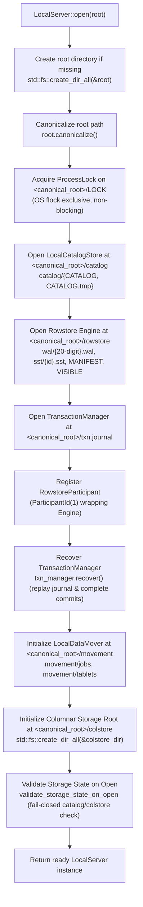

# Operational & Persistence Architecture

This document describes the on-disk storage layout, crash-recovery boundaries, and operational characteristics of `LocalServer` and `LocalCoordinator`.

---

## 1. Current Status: Hardened Local Embedded MVP

**The HTAP database engine is a hardened local embedded MVP, not a production-ready standalone database.**

The core engine (`LocalServer` / `LocalCoordinator`) is an in-process, synchronous Rust library; as of Phase 8 it can also be reached over the network via the `htapd` daemon and the `htap-wire` MySQL text- and binary-protocol server (binary protocol/prepared statements added in Phase 11), itself a plain synchronous process with no supervisor integration (see section 6, "Running `htapd`"). Core storage, transaction, and persistence paths have received critical hardening, but **production readiness is not claimed**.

### Completed Hardening Units

- **C1 — WAL-GC Transaction Identity Replay (Fixed: `f7a4975`):** Rowstore `MANIFEST` v2 records an external apply ledger of external transaction IDs and applied versions. Even after WAL prefix pruning, exact re-applies remain idempotent and conflicting identity reuse is rejected.
- **C2 — Durable Commit Reversibility (Fixed: `88cc314`):** Transaction decisions are irrevocable once the commit record is synced to `txn.journal`. Post-decision failures return `DurablePending` rather than rolling back or reporting aborts.
- **H1 — Manager Decision Serialization (Fixed: `88cc314`):** Transaction manager operations are serialized under a single lock across prepare, intent, version allocation, commit, participant apply, publish, and recovery.
- **H2 — Engine Post-WAL Failures Surface as DurablePending (Fixed: `c5ee281`):** Once a WAL commit is durable, post-decision memtable, flush, and publication errors return `DurablePending`. Committed state is retained, failed flushes are retried before new data is admitted, and reopen recovery completes visibility.
- **H5/M2 — Owned Persistence Bounds and Internal Path Validation (Fixed: `b7ff200`):** Shared bounded reader (`read_exact_bounded`) enforces size limits on all owned envelopes before allocation. Internal movement job/package IDs and conversion segment relative paths are strictly validated.
- **Exclusive Root Ownership (Fixed: `1083fbd`):** Non-blocking advisory file lock (`<root>/LOCK` via `flock`) and path canonicalization enforce single-process root ownership.

---

## 2. Important Operational Boundaries & Non-Features

The following operational facilities and production features are **explicitly not implemented or open**:

- **No Daemon Supervisor Management:** No `systemd` units or init scripts are provided; `htapd` (below) is a
  plain foreground process with no signal handler beyond the OS default (Ctrl-C/SIGTERM stop it hard).
- **No TLS or Per-User Security Boundary on the Network Server:** `htapd`/`htap-wire` has no TLS, no
  per-user credentials, and no role-based access control (RBAC); see "Running `htapd`" below for the full
  security contract.
- **No Authentication or Security Boundary for In-Process Use:** `LocalServer`/`EmbeddedClient` calls have no
  user credentials, authentication handshakes, or RBAC — the caller is trusted the way any embedded library
  is trusted.
- **Narrow OLAP SQL, No Full SQL Analytics:** `LocalServer` executes narrow single-table analytical scans (plain projections, AND-only typed filters, `COUNT(*)`, `COUNT(col)`, `SUM(Int32/Int64/Float64)`, `MIN/MAX`, deterministic `GROUP BY` with SQL NULL grouping, and simple unqualified source/projected column `ORDER BY` with ASC/DESC and NULLS FIRST/LAST/default policy, global deterministic tie-break) over logical rowstore and base-plus-delta rows using server-root `<root>/colstore` for materialized `Column`/`Converting` partitions. For `Column` and `Converting` partitions, `LocalServer` executes projection-aware compact reads (PK + requested column union), safely pushing down one eligible predicate leaf directly into `SegmentReader::scan`, suppressing stale base rows via post-base rowstore deltas, and evaluating residual SQL logic. ScanStats/pruning is available as internal execution evidence, but SQL still uses materialized logical rows and vectorized aggregation is not implemented. Complete-PK `RowstorePointRead` remains separate and unchanged. Direct `SegmentReader` pushdown optimization is implemented for the compact base path; compound `AND` pushdown beyond one leaf, `!=` pushdown, joins, CTEs, windows, expressions, aliases if rejected, aggregate ordering in `ORDER BY`, `LIMIT`/`OFFSET`, `HAVING`, `OR`/`NOT`/arithmetic/casts, `AVG`/`DISTINCT` aggregates, broad MySQL ordering, vectorized operator pipelines, multi-tablet/distributed scans, quotas/spill/cancellation, DataFusion/Arrow, and full MySQL breadth remain unsupported.
- **No High Availability (HA) or Distributed Consensus:** No Raft (`openraft`), ZooKeeper ensemble backend, network heartbeats, ephemeral sessions, remote RPC replica serving, or active failover exists.
- **One-Owner Multiprocess-Exclusive Mode (Not Concurrent Shared-Root Writers):** Root locking (`<root>/LOCK`) enforces that only one operating system process may open a server or coordinator root. Concurrent multiprocess shared-root operations and concurrent writers are strictly unsupported. Standalone subsystem opens (`Engine::open`, `LocalCatalogStore::open`, `LocalDataMover::new`) do not acquire this lock and remain unsafe for direct concurrent use.
- **No Journal/Ledger Compaction or Coordinated Retention; Ledger Hard Cap Blocks Applies:** Neither `txn.journal` nor the rowstore `MANIFEST` v2 external ledger implements compaction or coordinated retention. The external ledger enforces a hard cap (`MAX_APPLIED_EXTERNAL_TXNS = 1_000_000`). Once full, new external applies fail with `HtapError::InvalidArgument` (there is no `HtapError::CapacityExceeded` variant); a Phase 10 fix pass moved this check into `Engine::prepare` as well, so a real 2PC/direct-commit transaction is rejected before any journal write rather than only at apply time.
- **Possible Later Flush-Boundary Duplicate SST Publication After Crash:** Crashes occurring after an SST is written but before reader registration, manifest update, or checkpoint advance can cause duplicate SST publication on subsequent cycles, requiring future staged flush recovery.
- **No Power-Loss Proof:** Integration crash tests prove recovery across process `SIGKILL` termination, not physical machine power loss, host kernel panics, or write cache invalidation.
- **Whole-Dataset Materialization in Conversion, Export, and Clone:** HTAP conversion (`htap-convert`), data export (`htap-movement`, where exports materialize the full logical partition before writing), and tablet snapshot cloning materialize entire datasets into memory or intermediate files without streaming.
- **External CopyOptions Paths Remain Caller-Controlled by Design:** While internal persistence files and paths are bounded and validated (`b7ff200`), external import/export paths specified via `CopyOptions` are caller-controlled by design and must be validated by the host application.
- **Catalog Format Version 2 (Phase 9) — `DROP TABLE` Does Not Free Disk Space:** `DROP TABLE` removes a
  table and its partitions/tablets/replicas from the catalog in one CAS, but does not physically reclaim the
  rowstore data or columnar segment files belonging to those tablets — they stay on disk, unreachable. To
  guarantee a dropped identifier is never reissued (which would otherwise let a new table alias that
  unreachable data), `CatalogSnapshot` now persists an identifier high-water mark
  (`IdHighWater { table, partition, tablet, replica }`), and the `HTAPCAT1` catalog envelope
  `FORMAT_VERSION` bumped from 1 to 2 to carry it. A version-1 catalog still decodes (counters fall back to
  the live maximum id present in the snapshot) and is rewritten as version 2 on the next CAS; a
  version-1-only binary refuses to open a version-2 catalog rather than misinterpreting it — operators
  downgrading `htapd`/`LocalServer` to a pre-Phase-9 binary against a root that has been opened by a Phase-9
  binary will see that refusal, not silent corruption. Operators who need to reclaim disk space after
  `DROP TABLE` must currently do so out of band (e.g. by not reusing the root, or by a future physical
  reclamation feature); there is no built-in vacuum/reclaim operation. Opening a genuinely unmigrated
  version-1 root performs a one-time migration write (one extra catalog CAS / generation bump, while the
  process still holds `<root>/LOCK`) that seeds the tablet high-water counter from the `colstore/` on-disk
  inventory — see section 3 below for the exact contract. **Known gap:** that migration does not recover
  replica ids removed by a pre-Phase-9 `ALTER TABLE ... DROP PARTITION`; a reissued replica id could in
  principle collide with a stale movement snapshot package directory under `movement/tablets/`, though this
  requires also reusing the same movement job id and is narrow in practice.
- **Table Partitioning & Multi-Partition Execution Operational Boundary:**
  - `LocalServer` supports partitioned tables defined via SQL DDL (`CREATE TABLE ... PARTITION BY RANGE/LIST`) or through the native non-SQL API (`LocalServer::create_partitioned_table`) using `PartitionedTableDefinition` with finite `PartitionTopology::Range` (half-open `[lower, upper)` intervals with optional `MAXVALUE`) or `PartitionTopology::List` (disjoint value sets).
  - Unpartitioned SQL DDL (`CREATE TABLE`) creates tables with a default single partition `p0`. Typed MySQL partition DDL is supported via vendored `sqlparser`, while unsupported forms (options, subpartitions, expressions, multi-column COLUMNS, non-final MAXVALUE) are rejected.
  - Catalog validation guarantees that the partition key column is non-null and a member of the primary key, validates range bounds ordering and disjointness, verifies list value sets, and rejects duplicate partition names, type mismatches, and empty topologies.
  - Local topology invariant: Each partition currently consists of exactly one bucket-0 row tablet and one healthy local leader replica on node 1 (`NodeId(1)`). Hash buckets, tablet sharding, dynamic rebalancing, and physical multi-node sharding are not implemented.
  - Multi-row `INSERT` routes rows by partition key and commits all mutations across partitions in a single transaction payload and version step. Complete-PK `DELETE` and `SELECT` route by partition-key position; complete-PK `SELECT` strictly preserves the rowstore `Engine::get` fast path.
  - Analytic `SELECT` evaluates queries across partitions at one visible snapshot: conservative finite range/list partition pruning, bounded in-process partition scan workers, and deterministic global merge/order are implemented for narrow local OLAP; distributed fanout, disk spilling, query cancellation, and resource quotas remain deferred.
  - Format conversion & demotion: `convert_table` is guarded to single-partition tables. Table-wide conversion is available via `convert_table_to_column` (Row->Column) and metadata demotion via `convert_table_to_row` (Column->Row, which clears catalog `column_manifest` references via CAS while retaining rowstore data and column segment files on disk). Synchronous explicit ticks (`conversion_tick`, `tick`) execute policy steps; `tick` resumes persisted jobs only, with no autonomous background scheduler daemon implemented.
  - Partition lifecycle DDL: Supported via SQL `ALTER TABLE <table> ADD/DROP/REORGANIZE PARTITION` and native `LocalServer::alter_partitions` on empty sources with rowstore collapse verification. Populated DROP/REORGANIZE partitions are rejected. Populated partition data migration during reorganization, physical storage reclamation (space of dropped partitions or demoted column files is not physically reclaimed), hash tablets, distributed serving, and replica failover remain deferred.

---

## 3. LocalServer Filesystem Layout & Initialization Flow

### Initialization Flow (`LocalServer::open`)

When opening or recovering a database instance at a given `root` path, `LocalServer::open(root)` executes an ordered, crash-safe sequence:



### Filesystem Layout

`LocalServer` manages five dedicated sub-paths and an advisory lock file under the canonical root directory:

```text
<root>/
├── LOCK                                      # Exclusive process advisory lock and diagnostic PID/start-time (1083fbd)
├── catalog/
│   ├── CATALOG                               # Durable catalog snapshot state (bounded envelope b7ff200)
│   └── CATALOG.tmp                           # Staging file for atomic replacement
├── rowstore/
│   ├── wal/
│   │   └── {20-digit}.wal                    # Framed write-ahead log segments (e.g. 00000000000000000001.wal, CRC32C)
│   ├── sst/
│   │   └── {id}.sst                          # Immutable Sorted String Tables (blocks, bloom filter, CRC32C)
│   ├── MANIFEST                              # MANIFEST v2 with external apply ledger (f7a4975, b7ff200)
│   └── VISIBLE                               # Monotonically increasing visible version watermark (b7ff200)
├── colstore/                                 # Server columnar storage root for materialized partitions (b62c705)
│   └── <tablet_id>/
│       ├── MANIFEST                          # Durable columnar tablet manifest envelope (HTAPTBM1)
│       └── *.seg                             # Columnar segment files
├── txn.journal                               # 2PC transaction manager write-ahead log (irrevocable 88cc314, bounded b7ff200)
└── movement/
    ├── jobs/
    │   └── <job-id>/
    │       ├── JOB                           # Durable movement job envelope (HTAPJOB1, bounded b7ff200)
    │       └── JOB.tmp                       # Staging file for atomic job envelope replacement
    └── tablets/
        └── <source>/<target>/<job>/
            ├── MANIFEST                      # Tablet package manifest envelope (HTAPMNF1, CRC32C)
            └── DATA                          # Tablet snapshot rowstore data
```

### Component Details

0. **`LOCK` (`ProcessLock` — `1083fbd`):**
   - **Lock Lifetime:** Acquired during `LocalServer::open(root)` (and `LocalCoordinator::open`) and held continuously by the `ProcessLock` instance for the lifetime of the server. Dropping the server instance releases the OS-level file lock (`flock unlock`).
   - **Contention Behavior:** The lock is acquired non-blockingly (`try_lock_exclusive`). If another process or thread holds an exclusive lock on the file, `open` fails immediately with `HtapError::Conflict`. The error message includes diagnostic metadata read from `<root>/LOCK` (`pid=<pid>;start_time=<epoch_secs>`).
   - **Symlink Aliases:** `ProcessLock::acquire` operates on the canonicalized root path (`root.canonicalize()`). Accessing the same root via symlink aliases resolves to the exact same physical lock file, preventing multi-process lock bypass.
   - **Low-Level Subsystem APIs Do Not Lock:** Standalone subsystem instances (`htap_rowstore::Engine::open`, `htap_catalog::LocalCatalogStore::open`, `htap_movement::LocalDataMover::new`) do **not** acquire `<root>/LOCK`. They remain unsafe for direct concurrent shared-root use.

1. **`catalog/` (`LocalCatalogStore` — `b7ff200`):**
   - Tracks table definitions, schema, partition descriptors, tablets, and replica topologies.
   - Enforces optimistic concurrency control using integer generations (`compare_and_set`).
   - Mutations stage to `catalog/CATALOG.tmp`, call `sync_all()`, and atomically rename to `catalog/CATALOG`, followed by directory `sync_all()`. Read via bounded exact reader.
   - **Format version 2 (Phase 9):** The `HTAPCAT1` envelope persists `id_high_water` (highest allocated
     table/partition/tablet/replica id) so identifiers of tables removed via `DROP TABLE` are never reissued.
     A version-1 file still decodes (counters fall back to the live maximum) and is rewritten as version 2 on
     the next CAS; a version-1-only binary refuses to open a version-2 file. See "Important Operational
     Boundaries & Non-Features" above.
   - **One-time legacy migration on first open of a version-1 root:** If `LocalServer::open` finds a
     genuinely unmigrated version-1 catalog (persisted `id_high_water` still all zeros), it performs one
     extra catalog CAS during startup — after storage validation, while still holding `<root>/LOCK` — that
     raises the tablet high-water counter to the highest `colstore/tablet-*` directory actually present on
     disk (to account for tablets whose partitions were removed by a pre-Phase-9 `ALTER TABLE ... DROP
     PARTITION`) and rewrites the catalog file as version 2. This is a one-time write: the catalog generation
     advances by one, and subsequent opens of the same root are no-ops for this step because the mark is no
     longer all zeros. A caller that snapshots or backs up a root immediately after this first Phase-9 open
     will see one extra generation bump compared to the last version-1-binary write. Known gap: this
     migration recovers tablet ids from disk but not replica ids removed the same way — see "Important
     Operational Boundaries & Non-Features" above and `docs/LIMITATIONS.md`.

2. **`rowstore/` (`htap_rowstore::Engine` — `f7a4975`, `c5ee281`, `b7ff200`):**
   - **`rowstore/wal/{20-digit}.wal`:** Framed write-ahead log files recording transactional row mutations (`Put` and `Delete`). Files are named using 20-digit zero-padded sequence numbers (e.g. `00000000000000000001.wal`). Each entry is framed with magic, length, sequence, payload, and CRC32C checksum.
   - **`rowstore/sst/{id}.sst`:** Immutable SST files containing ordered key-value pairs organized into indexed blocks with Bloom filters.
   - **`rowstore/MANIFEST`:** Manifest v2 format storing active SST sets and an external transaction apply ledger (`f7a4975`). Bounded read protects against allocation attacks (`b7ff200`). Prevents identity replay across WAL GC. Note: hard cap of 1_000_000 entries (`MAX_APPLIED_EXTERNAL_TXNS`) without compaction.
   - **`rowstore/VISIBLE`:** Tracks the monotonically advanced `visible_version`. Records applied but uncommitted/unpublished remain invisible across crashes until published. Post-WAL failures surface as `DurablePending` (`c5ee281`).

3. **`txn.journal` (`htap_txn::TransactionManager` — `88cc314`, `b7ff200`):**
   - 2-Phase Commit (2PC) coordination journal tracking transaction lifecycle: `Prepare`, `Commit`, `Abort`.
   - Irrevocable commit boundary: once the commit record is fsynced, abort is rejected.
   - Manager decision serialization: all transitions serialized under one manager lock (`88cc314`).
   - Post-commit append/sync/apply/publish failures return `DurablePending` to the caller that hit them.
   - Read via bounded streaming frame validation with fixed probe buffers (`b7ff200`).
   - A failed journal append (`Journal::append_nosync`, used for the unsynced `Commit` frame write) truncates
     the file back to its pre-append offset, so a partial write from a crashed or short `write_all` cannot
     make the journal look like unrecoverable middle-of-log corruption on the next open.
   - **Recovery-required latch (Phase 10, corrected and widened by two follow-up fix passes):** once any
     `commit` call returns `DurablePending`, the manager latches "recovery required," recording a
     `RecoveryCause` of `ParticipantIo` (the commit record was already durable; only the participant's own
     `apply`/`publish` failed) or `JournalIo` (the journal append or sync itself failed). A third fix pass
     widened `JournalIo` beyond the `Commit` boundary: a failed `Intent` or `Abort` append/sync now latches the
     manager the same way (only for a real I/O error, never a pure oversize-frame rejection). Every *other*
     later `commit` — from any session, in-process or over the wire — is rejected with
     `HtapError::RecoveryRequired { blocking_txn, reason }` (a distinct error from the blocking transaction's
     own `DurablePending`; both map to MySQL 1105/`HY000`, never 1213/`40001`). `abort()` of an unrelated
     transaction is also rejected with `RecoveryRequired` while the latch's cause is `JournalIo`.
     `TransactionManager::recover()` can in principle clear the latch in-process only when the cause is
     `ParticipantIo`; a `JournalIo` latch — or the underlying `Journal` independently reporting itself
     poisoned (see below) — makes `recover()` refuse outright with `RecoveryRequired` and apply nothing,
     rather than attempt any replay, so it clears only on a fresh reopen (a brand-new `TransactionManager` from
     a brand-new file open and scan — an in-process resync after a failed sync proves nothing about whether
     the original write was durable). **In practice, even a `ParticipantIo` latch is only cleared by restarting
     the process**, because `LocalServer` calls `recover()` solely during `LocalServer::open` startup, never
     during normal operation — there is no other in-process trigger that would call it. Operationally this is
     an outage, not necessarily a corruption: restarting the process (`LocalServer::open` calls `recover()`
     during startup — see section 5, "Reopen Recovery Guarantees") always clears the latch regardless of its
     cause; see ADR-018 and "Sessions and explicit transactions (Phase 10)" in `docs/ARCHITECTURE.md`.
   - **Journal poisoning, independent of the manager latch:** `Journal` itself now tracks a `poisoned` state
     (set when an `append`'s or `sync`'s `fsync` fails, when the best-effort truncate after a failed write
     itself fails, or when an append wrote bytes but then failed to fsync). While poisoned, every further
     `append`/`append_nosync`/`sync` on that handle fails immediately; only a fresh `Journal::open` clears it.
     **After a journal `fsync` error, simply restarting the process is not proof of durability:** a new file
     descriptor from a fresh `open` will not report the earlier descriptor's `fsync` error, and the record that
     failed to sync may still be sitting only in the OS page cache. The safe operator action is to reboot the
     host (or otherwise ensure the page cache backing the journal's filesystem volume is dropped) before
     reopening, not just restart the process on the same still-warm cache. See "Reopen Recovery Guarantees"
     below for what happens if the journal and rowstore have genuinely diverged.
   - **Effective transaction payload cap is about 4 MiB, not the nominal 16 MiB `MAX_PAYLOAD_SIZE`:** the
     durable `Intent` frame JSON-encodes each participant's payload as a number array, which is larger than
     the raw payload and is itself bounded by the journal's 16 MiB frame limit. `TransactionManager::commit`
     rejects an oversize request with `HtapError::InvalidArgument` before prepare; see `docs/LIMITATIONS.md`
     for the exact figure. An operator seeing this error on a large `INSERT`/`UPDATE`/explicit-transaction
     `COMMIT` should reduce the statement's mutation payload size — there is no chunking.
   - **No compaction; `max_journal_size` checked only at open:** `txn.journal` only ever grows — records are
     never pruned or checkpointed against participant state — and its total size is checked against
     `max_journal_size` (default 64 MiB, `DEFAULT_MAX_JOURNAL_SIZE`) only in `Journal::open_with_options`/
     `Journal::scan` (i.e. at `open` and during `recover()`), never on an ordinary `append`. A long-running
     root can therefore accumulate a journal past this limit without any single write ever failing, only to
     have a later `LocalServer::open` fail with `HtapError::Corruption`. Journal checkpoint/retention is
     planned for a later phase; see `docs/LIMITATIONS.md`.

4. **`movement/` (`htap_movement::LocalDataMover` — `b7ff200`):**
   - Tracks data movement jobs (CSV/JSONL import/export, tablet snapshot migrations).
   - **`movement/jobs/<job-id>/{JOB, JOB.tmp}`:** Individual job metadata envelopes protected by the `HTAPJOB1` envelope with bounded reading and CRC32C verification. Updates use atomic staging (`JOB.tmp` -> `JOB`).
   - **`movement/tablets/<source>/<target>/<job>/{MANIFEST, DATA}`:** Tablet snapshot clone packages containing manifest envelope (`HTAPMNF1`) and data dump.
   - Internal job IDs and package paths are strictly validated (`b7ff200`). External `CopyOptions` paths remain caller-controlled.

5. **`colstore/` (`<root>/colstore` — `b62c705`):**
   - Columnar storage root for materialized partitions.
   - Houses per-tablet directories (`colstore/<tablet_id>/`) containing immutable columnar segments (`*.seg`) and tablet manifests (`MANIFEST` in `HTAPTBM1` envelope format with CRC32C checksums).
   - Used by `LocalServer::convert_table`, `LocalServer::convert_table_to_column`, `convert_table_to_row` (which retains columnar segment files on disk during demotion), and `LocalServer` analytical scans (`Route::OlapScan`) over `Column` and `Converting` partitions, utilizing projection-aware compact reads with safe single-leaf predicate pushdown into `SegmentReader::scan` and rowstore base-plus-delta overlay. Manifest generation on disk is validated against catalog metadata before execution, and startup validation (`validate_storage_state_on_open`) fails closed (returning `HtapError::Corruption` or `HtapError::Io` depending on the cause) if catalog and disk states diverge.

---

## 4. LocalCoordinator Filesystem Layout

The `LocalCoordinator` manages cluster membership, scoped leadership leases, and monotonic fencing tokens independently under its own root directory:

```text
<coord_root>/
├── LOCK                    # Exclusive process advisory lock and diagnostic PID/start-time (1083fbd)
├── COORDINATOR             # Durable coordinator state envelope (HTAPCRD1, bounded b7ff200)
└── COORDINATOR.tmp         # Staging file for atomic publish
```

### Binary Envelope Specification (`HTAPCRD1`)

Coordinator state is stored in a versioned binary envelope:
- **Header Magic (8 bytes):** `b"HTAPCRD1"`
- **Format Version (2 bytes):** `0x0001` (little-endian `u16`)
- **Payload Length (4 bytes):** Little-endian `u32` (capped at 64 MiB by bounded reader `b7ff200`)
- **Checksum (4 bytes):** Little-endian `u32` CRC32C over the payload bytes
- **Payload:** JSON-serialized state tracking registered cluster nodes, active leases, and high-water mark issued fencing tokens (HTAPCRD1 fields are little-endian JSON).

---

## 5. Backup & Recovery Boundaries

### Safe Local Backup Boundaries

Because `LocalServer` writes across multiple internal components (`catalog`, `rowstore`, and `txn.journal`):

1. **Quiescent / Offline Backup (Recommended):**
   - Completely shut down or drop the `LocalServer` instance within the host application.
   - Once all locks are released and file handles closed, take a filesystem-level copy (e.g., `tar`, `cp -a`, or filesystem snapshot) of the entire root directory.

2. **Online / Running Backup:**
   - **Do not** perform arbitrary file-by-file copies of an active server root. Doing so risks capturing torn states between `txn.journal`, `rowstore/wal/{20-digit}.wal`, and `MANIFEST`.
   - If online backup is necessary, rely on filesystem-level point-in-time snapshots (such as ZFS or LVM snapshots) that provide crash-consistent atomic snapshots across the storage volume.

### Reopen Recovery Guarantees

When reopening an existing directory via `LocalServer::open(path)`:
1. **Catalog Recovery:** Loads `CATALOG` with bounded reader validation (`b7ff200`), validates snapshot structure, and initializes optimistic concurrency control at the recorded generation. Interrupted `.tmp` files are ignored.
2. **Rowstore LSM Recovery:**
   - Reads `MANIFEST` v2 and restores the external transaction apply ledger before WAL replay (`f7a4975`).
   - Replays WAL records up to the last clean boundary, repairs torn tails caused by abrupt process death, reconstructs active memtables, and reads the `VISIBLE` version watermark.
   - Post-WAL errors returning `DurablePending` are retried and completed during recovery (`c5ee281`).
3. **Transaction Manager Recovery:**
   - Replays `txn.journal` using bounded streaming frame inspection (`b7ff200`).
   - Treats committed records as irrevocable (`88cc314`).
   - Matches prepared and committed states, re-applies committed operations across participants idempotently via the external ledger (`f7a4975`), and completes unpublished transactions.
   - **fsync-before-replay:** `recover()` fsyncs the journal file it just read from before replaying any
     `Commit` record into a participant, since an ordinary file read alone does not prove the record was ever
     actually synced to disk. If this sync fails, `recover()` (and therefore `LocalServer::open`) fails and
     latches the manager as `RecoveryCause::JournalIo` (the underlying `Journal` also poisons itself); a
     second `LocalServer::open` attempt against the same still-warm page cache does not resolve this — see the
     reboot guidance in "Recovery-required latch" and "Journal poisoning" above.
   - **`recover()` refuses outright, applying nothing, if already latched `JournalIo` or if the journal is
     poisoned:** this check runs before any replay work, so a caller cannot make partial progress by calling
     `recover()`/reopening repeatedly against the same unrecovered journal state; only a genuinely fresh
     `Journal`/`TransactionManager` (a real reopen, and after a `fsync` failure specifically, ideally after a
     host reboot — see above) clears it.
   - **Post-replay corruption cross-check:** after replay completes, `recover()` compares every registered
     participant's own durable `committed_version()` (for the rowstore, `Engine::committed_version()`)
     against the journal's own replayed maximum commit version. A mismatch in either direction —
     `committed_version()` ahead of the journal (a durable commit record has gone missing from `txn.journal`)
     or behind it (replay did not fully apply what the journal records) — fails `LocalServer::open` with
     `HtapError::Corruption` rather than starting up on a state the journal cannot account for. **Operator
     action:** this is a genuine data-consistency problem between `rowstore/` and `txn.journal`, not a
     transient fault; it means one of the two was modified or lost independently of the other (e.g. by
     restoring `rowstore/` and `txn.journal` from backups taken at different times — see "Safe Local Backup
     Boundaries" above). Do not attempt to "fix" it by deleting `txn.journal` or a WAL segment. Investigate
     with the exact `Corruption` message (it states which side and by how much), consult the most recent
     consistent backup or snapshot of the whole root, and treat the affected root as needing manual recovery
     rather than routine restart.
   - `next_txn_id` is restored via `fetch_max` (never regressing it, even if a `begin()` call races the
     replay in-process).
4. **Fencing Token Monotonicity:** On reopening `LocalCoordinator`, persisted high-water tokens are restored, ensuring subsequent leadership acquisitions yield strictly greater fencing tokens than any token issued prior to restart.

---

## 6. Running `htapd`

`htapd` (`crates/htapd`) is a thin binary that opens a `LocalServer` root and serves it over the MySQL text
and binary protocols via `htap-wire::WireServer` (see ADR-016, ADR-019, and the "Network layer" / "Prepared
statements and binary protocol" sections of [`ARCHITECTURE.md`](./ARCHITECTURE.md) for the protocol
implementation itself). Since Phase 10, each authenticated connection owns one `htap_server::Session` for
its lifetime (`BEGIN`/`COMMIT`/`ROLLBACK`, `autocommit`, session variables — see ADR-018), rolled back
explicitly on `QUIT`/EOF/a framing error/server shutdown, with the session's own `Drop` as a safety net.
Since Phase 11, `COM_RESET_CONNECTION` and `COM_CHANGE_USER` also route through that same session's
`reset()`, respecting the ADR-018 `CommitOutcomePending` quarantine. The start-up compatibility shim
(`htap_wire::shim`) now only answers `USE`/`SELECT 1`/`VERSION()`/`DATABASE()`/`SCHEMA()` and the two `SET
CHARACTER SET`/`SET CHARSET` positional forms `vendor/sqlparser` cannot parse; every other `SET` and
`SELECT @@sysvar`/`SELECT @uservar` now goes through the connection's real session.

```text
htapd --root <dir> [--listen 127.0.0.1:3307] [--max-connections 64] [--password <pw>]
       [--max-allowed-packet 67108864]
```

`--max-allowed-packet` (default 64 MiB, MySQL's own default) bounds every protocol message — including a
prepared statement's buffered `COM_STMT_SEND_LONG_DATA` bytes — and can also be set via
`HTAPD_MAX_ALLOWED_PACKET`; the flag wins if both are set. It is reported dynamically to clients as
`@@max_allowed_packet`.

### Lifecycle

1. **Startup:** `htapd` parses arguments, opens `LocalServer::open(root)` (identical root layout and
   recovery guarantees to any other `LocalServer` — see sections 1-5 above), starts a `WireServer` bound to
   `--listen`, logs `"htapd ready"` (via `tracing`, controlled by `RUST_LOG`), and then parks the main thread
   until the process is killed. There is no signal handler; Ctrl-C or SIGTERM stops the process
   unconditionally.
2. **Root lock is exclusive:** `LocalServer::open` acquires the same `<root>/LOCK` advisory lock as any other
   caller (section 3.0 above). A second `htapd` (or `EmbeddedClient`) pointed at the same root fails to start
   with `HtapError::Conflict` — this is the existing one-owner-per-root invariant, not a network-specific
   one.
3. **Shutdown:** There is no graceful drain API exposed by the binary itself. Stop the process (Ctrl-C /
   SIGTERM); in-flight statements are not drained, but storage is crash-safe by construction
   (ADR-004/008/009), so committed state is recovered on the next start exactly as after a `SIGKILL` of any
   other `LocalServer` host process. `WireServer::shutdown` (used by tests, not by the `htapd` binary itself)
   performs an orderly stop: it sets a flag, stops accepting, calls `Shutdown::Both` on every live connection
   via a `live_connections` registry (Phase 11), and joins every connection thread — a connection thread
   blocked mid-read on a partial packet is force-closed immediately rather than left waiting indefinitely for
   the rest of that packet. A connection torn down this way has its open transaction rolled back the same as
   any other disconnect.
4. **Logging:** Structured logs via `tracing-subscriber`, controlled by the `RUST_LOG` environment variable
   (defaults to `info`). `htapd` logs the listen address, root path, whether a password is required, and
   warns if bound to a non-loopback address.

### Security contract

Identical to the "Security model" subsection of `docs/ARCHITECTURE.md`:

- Default bind is `127.0.0.1:3307` (loopback only); binding elsewhere is an explicit `--listen` opt-in and
  triggers a startup warning.
- One implicit user: the client-supplied username is logged but never checked. `COM_CHANGE_USER` (Phase 11)
  re-authenticates against this same single shared password via a `verify_credentials` seam, not a per-user
  credential store — per-user ACL remains Phase 12 scope.
- Credential precedence: `--password` overrides `HTAPD_PASSWORD`; with neither set, no password is required.
- No TLS: the `mysql_native_password` handshake hashes the password exchange, but query text and result rows
  are cleartext. Do not bind a non-loopback address without a trusted network or an SSH tunnel.
- The handshake scramble now comes from the OS CSPRNG (`getrandom::fill`, no fallback; Phase 11), replacing
  the previously seeded xorshift generator.
- Every pre-authentication read (the handshake response, either side of an auth-plugin switch, and a
  `COM_CHANGE_USER` auth-switch reply) is bounded by `min(max_allowed_packet, 64 KiB)`, checked against the
  message's declared length before anything is allocated: an unauthenticated peer cannot make a connection
  attempt allocate more than that merely by declaring a large length and never sending the bytes.

Verified in `crates/htap-wire/tests/wire_server.rs` (`test_handshake_empty_password_ok`,
`test_handshake_wrong_password_rejected_1045`, `test_handshake_correct_password_ok`,
`test_shutdown_joins_and_frees_port`, `test_shutdown_force_closes_connection_blocked_mid_packet`,
`test_shutdown_force_close_rolls_back_open_transaction`, `test_wire_change_user_reauth_and_reset`,
`test_wire_reset_connection_clears_state_and_prepared_statements`,
`test_pre_auth_oversize_handshake_rejected_before_allocation`) and `crates/htap-wire/src/server.rs`
(`config_defaults_are_loopback_only`), and `crates/htap-wire/src/handshake.rs::scramble_is_printable_and_varies`.
