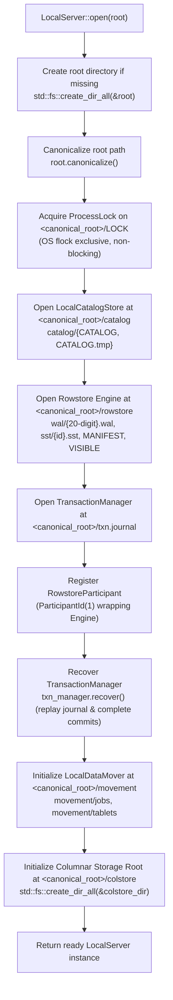

# Operational & Persistence Architecture

This document describes the on-disk storage layout, crash-recovery boundaries, and operational characteristics of `LocalServer` and `LocalCoordinator`.

---

## 1. Current Status: Hardened Local Embedded MVP

**The HTAP database engine is a hardened local embedded MVP, not a production-ready standalone database.**

The codebase operates strictly as an in-process, synchronous Rust library (`LocalServer` / `LocalCoordinator`). Core storage, transaction, and persistence paths have received critical hardening, but **production readiness is not claimed**.

### Completed Hardening Units

- **C1 — WAL-GC Transaction Identity Replay (Fixed: `f7a4975`):** Rowstore `MANIFEST` v2 records an external apply ledger of external transaction IDs and applied versions. Even after WAL prefix pruning, exact re-applies remain idempotent and conflicting identity reuse is rejected.
- **C2 — Durable Commit Reversibility (Fixed: `88cc314`):** Transaction decisions are irrevocable once the commit record is synced to `txn.journal`. Post-decision failures return `DurablePending` rather than rolling back or reporting aborts.
- **H1 — Manager Decision Serialization (Fixed: `88cc314`):** Transaction manager operations are serialized under a single lock across prepare, intent, version allocation, commit, participant apply, publish, and recovery.
- **H2 — Engine Post-WAL Failures Surface as DurablePending (Fixed: `c5ee281`):** Once a WAL commit is durable, post-decision memtable, flush, and publication errors return `DurablePending`. Committed state is retained, failed flushes are retried before new data is admitted, and reopen recovery completes visibility.
- **H5/M2 — Owned Persistence Bounds and Internal Path Validation (Fixed: `b7ff200`):** Shared bounded reader (`read_exact_bounded`) enforces size limits on all owned envelopes before allocation. Internal movement job/package IDs and conversion segment relative paths are strictly validated.
- **Exclusive Root Ownership (Fixed: `1083fbd`):** Non-blocking advisory file lock (`<root>/LOCK` via `flock`) and path canonicalization enforce single-process root ownership.

---

## 2. Important Operational Boundaries & Non-Features

The following operational facilities and production features are **explicitly not implemented or open**:

- **No Daemon Lifecycle or Supervisor Management:** No `systemd` units, init scripts, background daemon processes (`htapd`), or signal-handling shutdown infrastructure.
- **No Network Ports, Sockets, or MySQL Wire Protocol:** No TCP/IP listeners, Unix domain sockets, or MySQL client wire protocol support. All interaction is via synchronous in-process Rust method calls.
- **No Authentication, TLS, or Security Boundary:** No user credentials, authentication handshakes, TLS encryption certificates, or role-based access control (RBAC).
- **Narrow OLAP SQL, No Full SQL Analytics:** `LocalServer` executes narrow single-table analytical scans (plain projections, AND-only typed filters, `COUNT(*)`, `COUNT(col)`, `SUM(Int32/Int64/Float64)`, `MIN/MAX`, deterministic `GROUP BY` with SQL NULL grouping, and simple unqualified source/projected column `ORDER BY` with ASC/DESC and NULLS FIRST/LAST/default policy, global deterministic tie-break) over logical rowstore and base-plus-delta rows using server-root `<root>/colstore` for materialized `Column`/`Converting` partitions. For `Column` and `Converting` partitions, `LocalServer` executes projection-aware compact reads (PK + requested column union), safely pushing down one eligible predicate leaf directly into `SegmentReader::scan`, suppressing stale base rows via post-base rowstore deltas, and evaluating residual SQL logic. ScanStats/pruning is available as internal execution evidence, but SQL still uses materialized logical rows and vectorized aggregation is not implemented. Complete-PK `RowstorePointRead` remains separate and unchanged. Direct `SegmentReader` pushdown optimization is implemented for the compact base path; compound `AND` pushdown beyond one leaf, `!=` pushdown, joins, CTEs, windows, expressions, aliases if rejected, aggregate ordering in `ORDER BY`, `LIMIT`/`OFFSET`, `HAVING`, `OR`/`NOT`/arithmetic/casts, `AVG`/`DISTINCT` aggregates, broad MySQL ordering, vectorized operator pipelines, multi-tablet/distributed scans, quotas/spill/cancellation, DataFusion/Arrow, and full MySQL breadth remain unsupported.
- **No High Availability (HA) or Distributed Consensus:** No Raft (`openraft`), ZooKeeper ensemble backend, network heartbeats, ephemeral sessions, remote RPC replica serving, or active failover exists.
- **One-Owner Multiprocess-Exclusive Mode (Not Concurrent Shared-Root Writers):** Root locking (`<root>/LOCK`) enforces that only one operating system process may open a server or coordinator root. Concurrent multiprocess shared-root operations and concurrent writers are strictly unsupported. Standalone subsystem opens (`Engine::open`, `LocalCatalogStore::open`, `LocalDataMover::new`) do not acquire this lock and remain unsafe for direct concurrent use.
- **No Journal/Ledger Compaction or Coordinated Retention; Ledger Hard Cap Blocks Applies:** Neither `txn.journal` nor the rowstore `MANIFEST` v2 external ledger implements compaction or coordinated retention. The external ledger enforces a hard cap (`MAX_APPLIED_EXTERNAL_TXNS = 1_000_000`). Once full, new external applies fail with `HtapError::CapacityExceeded`.
- **Possible Later Flush-Boundary Duplicate SST Publication After Crash:** Crashes occurring after an SST is written but before reader registration, manifest update, or checkpoint advance can cause duplicate SST publication on subsequent cycles, requiring future staged flush recovery.
- **No Power-Loss Proof:** Integration crash tests prove recovery across process `SIGKILL` termination, not physical machine power loss, host kernel panics, or write cache invalidation.
- **Whole-Dataset Materialization in Conversion, Export, and Clone:** HTAP conversion (`htap-convert`), data export (`htap-movement`, where exports materialize the full logical partition before writing), and tablet snapshot cloning materialize entire datasets into memory or intermediate files without streaming.
- **External CopyOptions Paths Remain Caller-Controlled by Design:** While internal persistence files and paths are bounded and validated (`b7ff200`), external import/export paths specified via `CopyOptions` are caller-controlled by design and must be validated by the host application.
- **Table Partitioning & Multi-Partition Execution Operational Boundary:**
  - `LocalServer` supports partitioned tables defined exclusively through the native non-SQL API (`LocalServer::create_partitioned_table`) using `PartitionedTableDefinition` with finite `PartitionTopology::Range` (half-open `[lower, upper)` intervals) or `PartitionTopology::List` (disjoint value sets).
  - SQL DDL (`CREATE TABLE`) creates unpartitioned tables with a default single partition. MySQL partition DDL (`PARTITION BY RANGE/LIST`) is rejected at parse time (`HtapError::InvalidArgument`) due to `sqlparser 0.62` AST limitations.
  - Catalog validation guarantees that the partition key column is non-null and a member of the primary key, validates range bounds ordering and disjointness, verifies list value sets, and rejects duplicate partition names, type mismatches, and empty topologies.
  - Local topology invariant: Each partition currently consists of exactly one bucket-0 row tablet and one healthy local leader replica on node 1 (`NodeId(1)`). Hash buckets, tablet sharding, dynamic rebalancing, and physical multi-node sharding are not implemented.
  - Multi-row `INSERT` routes rows by partition key and commits all mutations across partitions in a single transaction payload and version step. Complete-PK `DELETE` and `SELECT` route by partition-key position; complete-PK `SELECT` strictly preserves the rowstore `Engine::get` fast path.
  - Analytic `SELECT` evaluates queries across partitions at one visible snapshot: conservative finite range/list partition pruning, bounded in-process partition scan workers, and deterministic global merge/order are implemented for narrow local OLAP; distributed fanout, disk spilling, query cancellation, and resource quotas remain deferred.
  - Format conversion (`convert_table`) is guarded to single-partition tables and strictly rejects multi-partition tables (`HtapError::Unsupported`).
  - Partition lifecycle DDL (`ALTER TABLE ... ADD/DROP/REORGANIZE PARTITION`), split/merge/drop, cross-partition movement, hash tablets, distributed serving, and replica failover remain deferred.

---

## 3. LocalServer Filesystem Layout & Initialization Flow

### Initialization Flow (`LocalServer::open`)

When opening or recovering a database instance at a given `root` path, `LocalServer::open(root)` executes an ordered, crash-safe sequence:



### Filesystem Layout

`LocalServer` manages five dedicated sub-paths and an advisory lock file under the canonical root directory:

```text
<root>/
├── LOCK                                      # Exclusive process advisory lock and diagnostic PID/start-time (1083fbd)
├── catalog/
│   ├── CATALOG                               # Durable catalog snapshot state (bounded envelope b7ff200)
│   └── CATALOG.tmp                           # Staging file for atomic replacement
├── rowstore/
│   ├── wal/
│   │   └── {20-digit}.wal                    # Framed write-ahead log segments (e.g. 00000000000000000001.wal, CRC32C)
│   ├── sst/
│   │   └── {id}.sst                          # Immutable Sorted String Tables (blocks, bloom filter, CRC32C)
│   ├── MANIFEST                              # MANIFEST v2 with external apply ledger (f7a4975, b7ff200)
│   └── VISIBLE                               # Monotonically increasing visible version watermark (b7ff200)
├── colstore/                                 # Server columnar storage root for materialized partitions (b62c705)
│   └── <tablet_id>/
│       ├── MANIFEST                          # Durable columnar tablet manifest envelope (HTAPTBM1)
│       └── *.seg                             # Columnar segment files
├── txn.journal                               # 2PC transaction manager write-ahead log (irrevocable 88cc314, bounded b7ff200)
└── movement/
    ├── jobs/
    │   └── <job-id>/
    │       ├── JOB                           # Durable movement job envelope (HTAPJOB1, bounded b7ff200)
    │       └── JOB.tmp                       # Staging file for atomic job envelope replacement
    └── tablets/
        └── <source>/<target>/<job>/
            ├── MANIFEST                      # Tablet package manifest envelope (HTAPMNF1, CRC32C)
            └── DATA                          # Tablet snapshot rowstore data
```

### Component Details

0. **`LOCK` (`ProcessLock` — `1083fbd`):**
   - **Lock Lifetime:** Acquired during `LocalServer::open(root)` (and `LocalCoordinator::open`) and held continuously by the `ProcessLock` instance for the lifetime of the server. Dropping the server instance releases the OS-level file lock (`flock unlock`).
   - **Contention Behavior:** The lock is acquired non-blockingly (`try_lock_exclusive`). If another process or thread holds an exclusive lock on the file, `open` fails immediately with `HtapError::Conflict`. The error message includes diagnostic metadata read from `<root>/LOCK` (`pid=<pid>;start_time=<epoch_secs>`).
   - **Symlink Aliases:** `ProcessLock::acquire` operates on the canonicalized root path (`root.canonicalize()`). Accessing the same root via symlink aliases resolves to the exact same physical lock file, preventing multi-process lock bypass.
   - **Low-Level Subsystem APIs Do Not Lock:** Standalone subsystem instances (`htap_rowstore::Engine::open`, `htap_catalog::LocalCatalogStore::open`, `htap_movement::LocalDataMover::new`) do **not** acquire `<root>/LOCK`. They remain unsafe for direct concurrent shared-root use.

1. **`catalog/` (`LocalCatalogStore` — `b7ff200`):**
   - Tracks table definitions, schema, partition descriptors, tablets, and replica topologies.
   - Enforces optimistic concurrency control using integer generations (`compare_and_set`).
   - Mutations stage to `catalog/CATALOG.tmp`, call `sync_all()`, and atomically rename to `catalog/CATALOG`, followed by directory `sync_all()`. Read via bounded exact reader.

2. **`rowstore/` (`htap_rowstore::Engine` — `f7a4975`, `c5ee281`, `b7ff200`):**
   - **`rowstore/wal/{20-digit}.wal`:** Framed write-ahead log files recording transactional row mutations (`Put` and `Delete`). Files are named using 20-digit zero-padded sequence numbers (e.g. `00000000000000000001.wal`). Each entry is framed with magic, length, sequence, payload, and CRC32C checksum.
   - **`rowstore/sst/{id}.sst`:** Immutable SST files containing ordered key-value pairs organized into indexed blocks with Bloom filters.
   - **`rowstore/MANIFEST`:** Manifest v2 format storing active SST sets and an external transaction apply ledger (`f7a4975`). Bounded read protects against allocation attacks (`b7ff200`). Prevents identity replay across WAL GC. Note: hard cap of 1_000_000 entries (`MAX_APPLIED_EXTERNAL_TXNS`) without compaction.
   - **`rowstore/VISIBLE`:** Tracks the monotonically advanced `visible_version`. Records applied but uncommitted/unpublished remain invisible across crashes until published. Post-WAL failures surface as `DurablePending` (`c5ee281`).

3. **`txn.journal` (`htap_txn::TransactionManager` — `88cc314`, `b7ff200`):**
   - 2-Phase Commit (2PC) coordination journal tracking transaction lifecycle: `Prepare`, `Commit`, `Abort`.
   - Irrevocable commit boundary: once the commit record is fsynced, abort is rejected.
   - Manager decision serialization: all transitions serialized under one manager lock (`88cc314`).
   - Post-commit append/sync/apply/publish failures return `DurablePending`.
   - Read via bounded streaming frame validation with fixed probe buffers (`b7ff200`).

4. **`movement/` (`htap_movement::LocalDataMover` — `b7ff200`):**
   - Tracks data movement jobs (CSV/JSONL import/export, tablet snapshot migrations).
   - **`movement/jobs/<job-id>/{JOB, JOB.tmp}`:** Individual job metadata envelopes protected by the `HTAPJOB1` envelope with bounded reading and CRC32C verification. Updates use atomic staging (`JOB.tmp` -> `JOB`).
   - **`movement/tablets/<source>/<target>/<job>/{MANIFEST, DATA}`:** Tablet snapshot clone packages containing manifest envelope (`HTAPMNF1`) and data dump.
   - Internal job IDs and package paths are strictly validated (`b7ff200`). External `CopyOptions` paths remain caller-controlled.

5. **`colstore/` (`<root>/colstore` — `b62c705`):**
   - Columnar storage root for materialized partitions.
   - Houses per-tablet directories (`colstore/<tablet_id>/`) containing immutable columnar segments (`*.seg`) and tablet manifests (`MANIFEST` in `HTAPTBM1` envelope format with CRC32C checksums).
   - Used by `LocalServer::convert_table` and `LocalServer` analytical scans (`Route::OlapScan`) over `Column` and `Converting` partitions, utilizing projection-aware compact reads with safe single-leaf predicate pushdown into `SegmentReader::scan` and rowstore base-plus-delta overlay. Manifest generation on disk is validated against catalog metadata before execution.

---

## 4. LocalCoordinator Filesystem Layout

The `LocalCoordinator` manages cluster membership, scoped leadership leases, and monotonic fencing tokens independently under its own root directory:

```text
<coord_root>/
├── LOCK                    # Exclusive process advisory lock and diagnostic PID/start-time (1083fbd)
├── COORDINATOR             # Durable coordinator state envelope (HTAPCRD1, bounded b7ff200)
└── COORDINATOR.tmp         # Staging file for atomic publish
```

### Binary Envelope Specification (`HTAPCRD1`)

Coordinator state is stored in a versioned binary envelope:
- **Header Magic (8 bytes):** `b"HTAPCRD1"`
- **Format Version (2 bytes):** `0x0001` (little-endian `u16`)
- **Payload Length (4 bytes):** Little-endian `u32` (capped at 64 MiB by bounded reader `b7ff200`)
- **Checksum (4 bytes):** Little-endian `u32` CRC32C over the payload bytes
- **Payload:** JSON-serialized state tracking registered cluster nodes, active leases, and high-water mark issued fencing tokens (HTAPCRD1 fields are little-endian JSON).

---

## 5. Backup & Recovery Boundaries

### Safe Local Backup Boundaries

Because `LocalServer` writes across multiple internal components (`catalog`, `rowstore`, and `txn.journal`):

1. **Quiescent / Offline Backup (Recommended):**
   - Completely shut down or drop the `LocalServer` instance within the host application.
   - Once all locks are released and file handles closed, take a filesystem-level copy (e.g., `tar`, `cp -a`, or filesystem snapshot) of the entire root directory.

2. **Online / Running Backup:**
   - **Do not** perform arbitrary file-by-file copies of an active server root. Doing so risks capturing torn states between `txn.journal`, `rowstore/wal/{20-digit}.wal`, and `MANIFEST`.
   - If online backup is necessary, rely on filesystem-level point-in-time snapshots (such as ZFS or LVM snapshots) that provide crash-consistent atomic snapshots across the storage volume.

### Reopen Recovery Guarantees

When reopening an existing directory via `LocalServer::open(path)`:
1. **Catalog Recovery:** Loads `CATALOG` with bounded reader validation (`b7ff200`), validates snapshot structure, and initializes optimistic concurrency control at the recorded generation. Interrupted `.tmp` files are ignored.
2. **Rowstore LSM Recovery:**
   - Reads `MANIFEST` v2 and restores the external transaction apply ledger before WAL replay (`f7a4975`).
   - Replays WAL records up to the last clean boundary, repairs torn tails caused by abrupt process death, reconstructs active memtables, and reads the `VISIBLE` version watermark.
   - Post-WAL errors returning `DurablePending` are retried and completed during recovery (`c5ee281`).
3. **Transaction Manager Recovery:**
   - Replays `txn.journal` using bounded streaming frame inspection (`b7ff200`).
   - Treats committed records as irrevocable (`88cc314`).
   - Matches prepared and committed states, re-applies committed operations across participants idempotently via the external ledger (`f7a4975`), and completes unpublished transactions.
4. **Fencing Token Monotonicity:** On reopening `LocalCoordinator`, persisted high-water tokens are restored, ensuring subsequent leadership acquisitions yield strictly greater fencing tokens than any token issued prior to restart.
