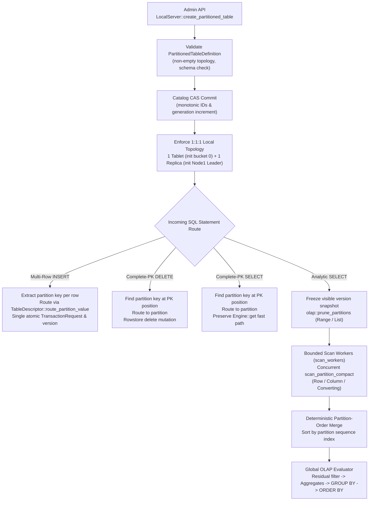

# Partition System Architecture and Execution Guide

This document provides a code-grounded, comprehensive architectural guide to the partition subsystem in HTAP. It details the creation boundaries, catalog metadata models, routing and local topology invariants, transactional DML execution, analytical query pruning and parallel scans, physical storage format interactions, crash recovery semantics (qualified as tested process-crash/reopen and atomic publication behavior; no power-loss/fsync proof), and deferred distributed features.

---

## 1. Scope and Creation Boundary

Partitioning in the local HTAP engine is accessible both through typed SQL DDL and through the native internal administrative topology API.

```text
┌────────────────────────────────────────────────────────────────────────┐
│ SQL Interface (vendored sqlparser / MySqlDialect)                      │
│                                                                        │
│   CREATE TABLE ...                 --> Unpartitioned table (p0)        │
│   CREATE TABLE ... PARTITION BY .. --> Supported typed RANGE/LIST DDL   │
│   ALTER TABLE ... ADD/DROP/REORG   --> Typed partition lifecycle DDL   │
└──────────────────────────────────┬─────────────────────────────────────┘
                                   │
┌──────────────────────────────────▼─────────────────────────────────────┐
│ Native Administrative API (LocalServer)                                │
│                                                                        │
│   LocalServer::create_partitioned_table(PartitionedTableDefinition)    │
│     ├── PartitionTopology::Range (finite [lower, upper) intervals)    │
│     └── PartitionTopology::List  (finite disjoint value sets)          │
│   LocalServer::alter_partitions(table_name, PartitionAlteration)       │
│     ├── PartitionAlteration::Add (checked bounds & ID allocation)      │
│     ├── PartitionAlteration::Drop (empty-source rowstore check)        │
│     └── PartitionAlteration::Reorganize (contiguous empty reorg)       │
└────────────────────────────────────────────────────────────────────────┘
```

### SQL DDL: Default Single-Partition (`p0`) Behavior

Standard SQL DDL executed through `LocalServer::execute` or `LocalServer::execute_create_table` without a `PARTITION BY` clause creates an **unpartitioned** table. In the catalog model:
- `TableDescriptor.partitioning` is set to `None`.
- The table contains exactly one default partition named `"p0"`.
- The partition is assigned a single tablet (`bucket = 0`) and a single local leader replica on node 1 (`NodeId(1)`).
- All DML mutations and queries route to this single partition automatically.

### Supported SQL Partition DDL Grammar and Constraints

MySQL partitioning syntax is supported for finite RANGE and LIST partitioning:
- **`PARTITION BY RANGE (col)` / `PARTITION BY RANGE COLUMNS (col)`:**
  Defined with partition definitions using `PARTITION name VALUES LESS THAN (value)` and optional final `PARTITION name VALUES LESS THAN MAXVALUE`. Values must be strictly increasing (`v0 < v1 < ... < vN`).
- **`PARTITION BY LIST (col)` / `PARTITION BY LIST COLUMNS (col)`:**
  Defined with partition definitions using `PARTITION name VALUES IN (val1, val2, ...)`. Values must be non-empty, non-null, and mutually disjoint across all partitions.
- **Partition Key Constraints:**
  The partition key must be a single column, must exist in the schema, must be non-null, and must be included in the primary key (`table.primary_key.contains(&key_column)`).

### Supported SQL Partition Lifecycle DDL Grammar and Restrictions

Typed MySQL `ALTER TABLE` partition lifecycle operations are supported:
- **`ALTER TABLE <table> ADD PARTITION (PARTITION <name> VALUES LESS THAN (<val> | MAXVALUE))`:**
  Appends a new range partition. The bound must be strictly greater than all existing partition bounds. If the table already contains a `MAXVALUE` partition, `ADD PARTITION` is rejected; `REORGANIZE PARTITION` must be used instead.
- **`ALTER TABLE <table> ADD PARTITION (PARTITION <name> VALUES IN (<val1>, <val2>, ...))`:**
  Appends a new list partition with non-empty, non-null values that must be disjoint from all existing list partitions.
- **`ALTER TABLE <table> DROP PARTITION <name> [, <name> ...]`:**
  Drops one or more named partitions.
- **`ALTER TABLE <table> REORGANIZE PARTITION <source1> [, <source2> ...] INTO (PARTITION <target1> ... [, ...])`:**
  Replaces a contiguous range or subset of list partitions with replacement definitions covering the exact same span.

#### Strict Lifecycle Safety Rules & Rejections
1. **Empty-Source Safety Check:** Dropping or reorganizing partitions is gated by rowstore snapshot collapse checks (`alter_partitions_internal`). If any source partition contains one or more visible rows, the operation fails immediately with `HtapError::InvalidArgument` without mutating the catalog or allocating IDs. Populated data migration is not performed.
2. **No-Last-Partition Guard:** Dropping all partitions of a table is rejected; at least one partition must remain.
3. **Contiguity Invariant for REORGANIZE:** For RANGE tables, reorganized source partitions must form a contiguous sequence in the table's partition order, and replacement target partitions must strictly preserve the combined lower bound of the first source partition and upper bound of the last source partition. For LIST tables, the replacement partitions must cover exactly the union of values from the source partitions without gaps or new values.
4. **Unsupported Syntax Rejections:**
   - Partition options (`ENGINE`, `COMMENT`, `TABLESPACE`, `DATA DIRECTORY`) are rejected at parse time.
   - Subpartitioning (`SUBPARTITION BY ...`, `SUBPARTITION ...`) is rejected at parse time.
   - `IF EXISTS` / `IF NOT EXISTS` on ALTER operations are rejected at parse time.
   - Hash/key partitioning, expressions in partition keys or bounds, and multi-column definitions are rejected.
   - Unrelated ALTER statements (`ADD COLUMN`, `DROP COLUMN`, `RENAME TABLE`, etc.) are rejected with `HtapError::Unsupported`.

### Native Administrative API: Partition Creation and Alteration

Partitioned tables can also be created and altered via the native in-process API:
```rust
pub fn create_partitioned_table(
    &self,
    definition: PartitionedTableDefinition,
) -> Result<StatementResult>

pub fn alter_partitions(
    &self,
    table_name: &str,
    alteration: impl Into<PartitionAlteration>,
) -> Result<StatementResult>
```

1. **Creation (`create_partitioned_table`):**
   `PartitionedTableDefinition` (`crates/htap-server/src/lib.rs`) requires `name`, `schema`, `primary_key`, and `topology`:
   - `PartitionTopology::Range { key_column: usize, partitions: Vec<RangePartitionDefinition> }`: ordered half-open intervals `[lower, upper)`.
   - `PartitionTopology::List { key_column: usize, partitions: Vec<ListPartitionDefinition> }`: disjoint explicit value sets.
   Attempting to create an empty topology is rejected with `HtapError::InvalidArgument` before lock acquisition or catalog mutation (`test_partitioned_empty_topology_rejection_no_catalog_mutation`).

2. **Alteration (`alter_partitions`):**
   Accepts [`PartitionAlteration`](crates/htap-catalog/src/model.rs):
   - `PartitionAlteration::Add { partitions }`
   - `PartitionAlteration::Drop { partitions }`
   - `PartitionAlteration::Reorganize { sources, targets }`
   - **Candidate Validation & No ID Burn:** Candidate validation runs on an in-memory candidate snapshot before ID generation or state mutation. If validation fails, no IDs or generations are allocated.
   - **Empty-Source Validation:** Prior to applying catalog mutations for DROP or REORGANIZE, `LocalServer` scans each source partition at the current visible snapshot, collapsing rowstore entries. If populated, it returns `HtapError::InvalidArgument`.
   - **Atomic Catalog CAS:** On successful validation, the new `CatalogSnapshot` is committed atomically via `catalog.compare_and_set`.

### Strict Rejection of Unsupported Partitioning Forms

To maintain data integrity and avoid lossy dialect workarounds, non-supported partition syntax is strictly rejected:
- **Partition Options:** Options such as `ENGINE = ...`, `COMMENT = ...`, `TABLESPACE = ...`, or `DATA DIRECTORY = ...` in partition definitions are rejected at parse time with `HtapError::InvalidArgument`.
- **Subpartitioning:** `SUBPARTITION BY ...` or `SUBPARTITION` clauses are rejected at parse time with `HtapError::InvalidArgument`.
- **LIST DEFAULT:** `VALUES IN (DEFAULT)` or `VALUES IN DEFAULT` are rejected with parse or binder errors.
- **Expressions:** Partition expressions such as `PARTITION BY RANGE (id + 1)` are rejected by the binder with `HtapError::Unsupported("expressions in PARTITION BY are not supported, only column identifiers")`.
- **Multi-column COLUMNS:** Multi-column keys like `RANGE COLUMNS (a, b)` or `LIST COLUMNS (a, b)` are rejected by the binder with `HtapError::Unsupported("multi-column partitioning is not supported")`.
- **Malformed / Non-Final MAXVALUE:** Non-final `MAXVALUE` partitions are rejected by the binder with `HtapError::InvalidArgument`. Malformed MAXVALUE syntax (e.g. within compound tuples) fails at parse time.
- **Generic AST partition_by:** Generic non-MySQL AST `partition_by` is rejected by the binder with `HtapError::Unsupported`.
- **Deferred Lifecycle & Physical Capabilities:** Physical data migration for populated partition reorganization, physical storage reclamation (space of dropped partitions or demoted column files), delete vectors, background compaction, autonomous background conversion scheduler, hash/key partitioning, and distributed lifecycle coordination remain deferred.

---

## 2. Catalog Model and Strict Validation

The catalog (`htap-catalog`) models partitioned tables hierarchically:
`TableDescriptor` -> `PartitionDescriptor` -> `TabletDescriptor` -> `ReplicaDescriptor`.

```text
TableDescriptor
├── id: TableId
├── name: String
├── schema: Schema
├── primary_key: Vec<usize>
├── partitions: Vec<PartitionId>  [preserves deterministic sequence order]
├── generation: u64
└── partitioning: Option<PartitioningDescriptor>
      ├── key_column: usize
      └── method: PartitioningMethod (Range | List)
            │
            ├── Range: PartitionDescriptor.range = Some(RangeBound { lower, upper })
            └── List:  PartitionDescriptor.list_values = Vec<Value>
```

### Entity Descriptors (`crates/htap-catalog/src/model.rs`)

1. **`TableDescriptor`:**
   - Holds table identity, schema, primary key indices, schema generation, and `partitioning: Option<PartitioningDescriptor>`.
   - `partitions: Vec<PartitionId>` explicitly defines the deterministic partition sequence used for routing, scanning, and merging.
2. **`PartitioningDescriptor`:**
   - `key_column: usize`: Zero-based column index in `schema`.
   - `method: PartitioningMethod`: `PartitioningMethod::Range` or `PartitioningMethod::List`.
3. **`PartitionDescriptor`:**
   - `id: PartitionId`, `table_id: TableId`, `name: String`.
   - `storage: StorageDescriptor`: Current storage format (`Row`, `Column`, or `Converting { from, to, generation }`).
   - `tablets: Vec<TabletId>`: Tablets belonging to this partition.
   - `range: Option<RangeBound>`: Half-open bound `[lower, upper)` for range partitioning.
   - `list_values: Vec<Value>`: Explicit value list for list partitioning.
   - `conversion: Option<ConversionDescriptor>`: In-flight conversion state if converting.
4. **`RangeBound`:**
   - `lower: Value`: Inclusive lower bound.
   - `upper: Value`: Exclusive upper bound (`lower <= value < upper`).
5. **`TabletDescriptor`:**
   - `id: TabletId`, `partition_id: PartitionId`, `bucket: u32`.
   - `replicas: Vec<ReplicaId>`: Replicas of this tablet.
   - `column_manifest: Option<ColumnManifestRef>`: Reference to columnar manifest (`HTAPTBM1`) if in `Column` or `Converting` storage.
6. **`ReplicaDescriptor`:**
   - `id: ReplicaId`, `tablet_id: TabletId`, `node_id: NodeId`.
   - `is_leader: bool`, `healthy: bool`, `generation: u64`.

### Catalog Validation Rules (`CatalogSnapshot::validate()`)

Every catalog snapshot must pass strict integrity validation before being committed or loaded on reopen:

1. **Partition Key Constraints:**
   - `partitioning.key_column` must be within schema bounds (`key_column < schema.len()`).
   - **Key in Primary Key:** The partition key must be an explicit member of the primary key (`table.primary_key.contains(&key_column)`). Tables with partition keys outside the PK are rejected.
   - **Non-Null Constraint:** The partition key column cannot be nullable (`!key_col.nullable`).
   - A partitioned table must declare at least one partition (`!table.partitions.is_empty()`).
2. **Bidirectional Ownership Invariants:**
   - Tables reference partitions, and every referenced partition must reference the table back (`part.table_id == table.id`).
   - No orphan partitions, duplicate partition IDs, or partition name collisions within a table.
   - Partitions reference tablets, and tablets reference back (`tablet.partition_id == part.id`).
   - Tablets reference replicas, and replicas reference back (`replica.tablet_id == tablet.id`).
3. **Range Partition Validation:**
   - Lower bound must be strictly less than upper bound (`range.lower < range.upper`).
   - Bound data types must match the partition key column type (`range.lower.data_type() == Some(expected_type)` and `range.upper.data_type() == Some(expected_type)`).
   - Bounds cannot be null.
   - **Non-Overlapping Ranges:** Partitions within the same table cannot overlap. Overlap is checked pairwise via `std::cmp::max(l1, l2) < std::cmp::min(u1, u2)`. Any overlap returns `HtapError::InvalidArgument`.
   - Partitions in range tables must have `range.is_some()` and empty `list_values`.
4. **List Partition Validation:**
   - List values vector cannot be empty (`!part.list_values.is_empty()`).
   - All values must match the partition key column type and cannot be null.
   - **Uniqueness & Disjointness:** List values must be unique within each partition and mutually disjoint across all partitions of the table (no duplicate values allowed).
   - Partitions in list tables must have empty `range` and non-empty `list_values`.
5. **Unpartitioned Table Consistency:**
   - Partitions belonging to unpartitioned tables (`table.partitioning == None`) must have `range.is_none()` and empty `list_values`.
6. **Storage & Conversion Consistency:**
   - Converting storage requires valid conversion descriptors with differing formats (`from != to`).
   - Column manifest references require generation > 0, base_version > 0, valid relative paths (`colstore/tablet-<tablet_id>/MANIFEST`), and cannot be present during the `SnapshotPinned` conversion phase. Columnar storage manifests use the `HTAPTBM1` envelope format (`crates/htap-convert/src/lib.rs:31-32`), which is distinct from tablet snapshot clone packages that use the `HTAPMNF1` movement manifest format (`crates/htap-movement/src/tablet.rs:50-51`).

### Test Coverage

The catalog model and validation rules are proven in `crates/htap-catalog/tests/catalog_recovery.rs`:
- `test_partitioning_legacy_decode_and_reopen`: Verifies backward compatibility when deserializing legacy catalog snapshots lacking partition fields.
- `test_range_partitioning_routing_and_boundaries`: Proves half-open `[lower, upper)` routing, edge-boundary inclusion/exclusion, and out-of-bounds rejection.
- `test_list_partitioning_routing`: Proves exact list routing and unmatched value rejection.
- `test_partitioning_duplicate_violations`: Validates rejection of duplicate partition names, overlapping range bounds, and duplicate list values.
- `test_partitioning_type_and_null_violations`: Validates rejection of nullable partition keys, null values, and type mismatches between bounds and schema.
- `test_partitioning_ownership_and_method_consistency`: Validates rejection of orphan partitions, mismatched parent IDs, and cross-method configurations.
- `test_partitioning_cas_and_reopen_lifecycle`: Proves atomic CAS updates and crash recovery of partitioned catalog snapshots.

---

## 3. Partition Routing and Local Topology Invariants

### Exact Routing Semantics (`TableDescriptor::route_partition_value`)

Partition routing determines which partition owns a row given its partition key value:

1. **Unpartitioned Tables:**
   - If `partitioning` is `None`, the table must have exactly one partition (`partitions.len() == 1`).
   - Returns `partitions[0]`.
2. **Range Partitioning:**
   - The value is evaluated against partitions in the order of `table.partitions`.
   - A partition matches if `range.lower <= *value && *value < range.upper`.
   - Returns the first matching `PartitionId`.
3. **List Partitioning:**
   - The value is evaluated against partitions in the order of `table.partitions`.
   - A partition matches if `part.list_values.iter().any(|v| v == value)`.
   - Returns the first matching `PartitionId`.
4. **Error Conditions:**
   - Null value: Partition keys cannot be null; returns `HtapError::InvalidArgument("partition key value cannot be null...")`.
   - Type mismatch: Value type must match key column type; returns `HtapError::InvalidArgument("partition key value type mismatch...")`.
   - Unmatched value: If no partition matches, returns `HtapError::InvalidArgument("partition key value <val> does not match any partition in table '<name>'")`.

### Monotonic ID and Generation Allocation

When creating a partitioned table in `LocalServer::create_partitioned_table`:
- Acquires `self.execution_lock`.
- Loads current catalog snapshot; computes `next_generation = catalog.generation + 1`.
- Table ID, partition IDs, tablet IDs, and replica IDs are allocated monotonically using checked addition:
  ```rust
  let next_id = max_existing_id.checked_add(1).ok_or(HtapError::CounterOverflow { counter: "..." })?;
  ```
- Submits the new `CatalogSnapshot` atomically via `self.catalog.compare_and_set(current_gen, next_snapshot)`.

### LocalServer 1:1:1 Local Topology Invariant and Validation

To ensure deterministic single-node execution, `LocalServer` maintains a 1:1:1 local topology invariant, distinguishing creation-time initialization defaults from runtime validation:

```text
1 Partition  <===>  1 Tablet (init bucket = 0)  <===>  1 Replica (init NodeId(1), Leader, Healthy)
```

1. **Creation Initialization (`LocalServer::create_partitioned_table`, `crates/htap-server/src/lib.rs:432-447`):**
   When a partitioned table is created, each partition is explicitly initialized with:
   - Exactly one tablet initialized with `bucket = 0` (`TabletDescriptor::new(tablet_id, partition_id, 0, vec![replica_id], next_generation)` at line 444).
   - Exactly one replica assigned to node 1 (`NodeId::new(1)`) marked as healthy leader (`ReplicaDescriptor::new(replica_id, tablet_id, NodeId::new(1), true, true, next_generation)` at lines 432-439).
   (The same `bucket = 0` and `NodeId(1)` defaults are used for the default `"p0"` partition in `LocalServer::execute_create_table`, `crates/htap-server/src/lib.rs:735-750`.)

2. **Runtime Topology Validation (`LocalServer::validate_partition`, `crates/htap-server/src/lib.rs:511-579`):**
   Before executing DML mutations, point lookups, analytical scans, or conversion steps, `LocalServer::validate_partition` verifies the structural integrity of every referenced partition:
   - **Partition Existence & Backlink:** The partition exists in the catalog (`lines 517-522`) and matches the table backlink (`partition.table_id == table_desc.id`, `lines 524-529`).
   - **One Tablet:** The partition contains exactly one tablet (`partition.tablets.len() == 1`, `lines 531-536`; returns `HtapError::Unsupported` otherwise).
   - **Tablet Existence & Backlink:** The tablet exists in the catalog (`lines 538-543`) and matches the partition backlink (`tablet.partition_id == partition.id`, `lines 545-550`).
   - **One Replica:** The tablet contains exactly one replica (`tablet.replicas.len() == 1`, `lines 552-557`; returns `HtapError::Unsupported` otherwise).
   - **Replica Existence & Backlink:** The replica exists in the catalog (`lines 559-564`) and matches the tablet backlink (`replica.tablet_id == tablet.id`, `lines 566-571`).
   - **Healthy Leader:** The replica is a healthy leader (`!replica.healthy || !replica.is_leader`, `lines 573-577`; returns `HtapError::Internal` otherwise).
   - **No Bucket or NodeId Checks:** `validate_partition` does **not** validate that `tablet.bucket == 0` or that `replica.node_id == NodeId(1)`. Those settings are construction-time initialization defaults established during table creation, not dynamic assertions checked during runtime partition validation.

### Test Coverage

- `test_partitioned_native_range_topology_catalog_reopen_continuation`: Proves range creation, 1:1:1 topology setup, catalog reopen, and subsequent ID continuation.
- `test_partitioned_native_list_topology_catalog_reopen_continuation`: Proves list creation, reopen, and continuation.
- `test_partitioned_boundary_unmatched_null_type_errors`: Proves runtime rejection of out-of-range keys, boundary conditions, null keys, and mismatched types.

---

## 4. Transactional DML and Point Read Routing

### Execution Lifecycle

All queries entering `LocalServer` follow a synchronized lifecycle:
1. Acquire `self.execution_lock.lock()`.
2. Load current catalog snapshot (`self.catalog.load()`).
3. Bind SQL statement against the catalog snapshot (`htap_sql::bind`).
4. Route statement based on its classified execution path (`classify_route`).

### Multi-Row `INSERT`: Single-Transaction Multi-Partition Routing

When inserting rows into a partitioned table (`LocalServer::execute_insert`):
1. **Per-Row Routing:** For each row in `insert.rows`, the partition key value is extracted from `row[partitioning.key_column]`.
2. **Partition Resolution:** Evaluates `table_desc.route_partition_value(catalog, val)`.
3. **Partition Validation:** Calls `self.validate_partition` to verify the local 1:1:1 topology and format route.
4. **Key Encoding:** Extracts primary key columns and encodes the LSM key (`encode_key`).
5. **Mutation Batching:** Creates `Mutation::Put { partition_id, key, row }`.
6. **Single Atomic Commit:**
   - All mutations spanning different partitions are encoded into a single payload: `RowstoreParticipant::encode_payload(&mutations)`.
   - A single `TransactionRequest` is committed through the 2PC manager via `commit_or_buffer`, which builds
     `Transaction::new(next_txn_id, statement_snapshot.version)` and calls `TransactionManager::commit`
     directly against the statement's own read snapshot (not `TransactionManager::commit_request`, since
     Phase 10 — see ADR-018 — so a concurrent writer that already advanced the visible version past this
     statement's snapshot is caught as a first-writer-wins conflict instead of silently overwritten).
   - **One Commit Version:** All rows across all touched partitions are committed atomically under a single transaction version step. No multi-version split or partial commits occur.

### Complete-PK `DELETE` and `SELECT`: Fast Path Preservation

When a statement specifies a complete primary key:
1. **Partition Key Position Resolution:** The partition key position within the primary key tuple is resolved dynamically:
   ```rust
   let pk_pos = table_desc.primary_key.iter()
       .position(|&col_idx| col_idx == partitioning.key_column)
       .ok_or_else(...)?;
   let part_val = pk_key.get(pk_pos).ok_or_else(...)?;
   let partition_id = table_desc.route_partition_value(catalog, part_val)?;
   ```
2. **Composite Primary Keys:** The partition key is not required to be the first column in a composite primary key. As long as it is part of the PK, its position within `pk_key` is correctly located (verified in `test_partitioned_composite_pk_partition_key_not_first`).
3. **Point `DELETE`:** Routes to `partition_id` and commits a single `Mutation::Delete` via `txn_manager`.
4. **Point `SELECT` (`Route::RowstorePointRead`):**
   - Obtains snapshot at `visible_version`.
   - Calls `self.engine.get(partition_id.as_u64(), &key, snapshot)` directly on the LSM rowstore.
   - **Rowstore Fast Path:** Completely bypasses analytical query planning, column scans, and conversion checks. Returns directly from the rowstore.

### Test Coverage

- `test_partitioned_multi_row_insert_spanning_partitions_one_version_point_delete`: Proves multi-row INSERT across 3 partitions in 1 version, followed by point reads and point deletes.
- `test_partitioned_composite_pk_partition_key_not_first`: Proves correct routing when the partition key is the second column in a composite PK `(tenant_id, id)`.

---

## 5. Analytical Execution: Pruning, Parallel Scans, and Global Merge

Analytical queries (`Route::OlapScan`) scan tables across multiple partitions while maintaining transactional snapshot consistency.

```text
AnalyticSelect (WHERE filter)
         │
         ▼
olap::prune_partitions (Snapshot-Frozen Catalog)
         │  Conservative pruning against partition key bounds
         ▼
Selected Partitions: [p0, p2] (preserves catalog sequence order)
         │
         ▼
Bounded Concurrent Workers (std::thread::scope, max scan_workers)
  Worker 0: scan_partition_compact(p0) -> (0, rows_p0)
  Worker 1: scan_partition_compact(p2) -> (1, rows_p2)
         │
         ▼
Deterministic Partition-Order Merge
  Sort results by partition index -> Concat rows in catalog order
         │
         ▼
Global OLAP Evaluator (olap::execute_analytic_select_compact)
  ├── Remap compact column indices
  ├── Residual filter evaluation (non-key or complex predicates)
  ├── Global aggregations (COUNT, SUM, MIN, MAX)
  ├── Grouped aggregation (GROUP BY with SQL NULL grouping)
  └── Global ORDER BY (ASC/DESC, NULLS FIRST/LAST, tie-breaking)
```

### Snapshot Freeze

At the start of `LocalServer::execute_analytic_select`:
- Catalog state is pinned from the current snapshot.
- MVCC snapshot is frozen: `snapshot = Snapshot::new(self.txn_manager.visible_version())`.
- All partition scans observe this exact snapshot version, guaranteeing point-in-time cross-partition consistency.

### Conservative Partition-Key Pruning (`htap-server::olap::prune_partitions`)

Pruning inspects `AnalyticFilter` leaves targeting `partitioning.key_column`. Pruning is strictly conservative: partitions are pruned only when provably impossible to match.

1. **Null and Comparison with Null:**
   - `IsNull`: Because partition keys are catalog-enforced non-null, `key IS NULL` prunes **all** partitions (returns empty).
   - `IsNotNull`: Retains all partitions.
   - Comparison with `NULL` (e.g. `key = NULL`): SQL 3-valued logic yields UNKNOWN/false; prunes **all** partitions.
2. **Type Safety:** Comparisons with mismatched data types retain all partitions conservatively.
3. **Range Partition Pruning:**
   - `Eq`: Retains partition if `lower <= value && value < upper`; prunes otherwise.
   - `Lt`: Retains partition if `lower < value`; prunes if `lower >= value`.
   - `Lte`: Retains partition if `lower <= value`; prunes if `lower > value`.
   - `Gt`: Retains partition if `upper > value`; prunes if `upper <= value`.
   - `Gte`: Retains partition if `upper > value`; prunes if `upper <= value`.
   - `NotEq`: Retains all partitions conservatively.
4. **List Partition Pruning:**
   - `Eq`: Retains partition if `list_values.contains(value)`; prunes otherwise.
   - `Lt`: Retains partition if any value in `list_values < value`.
   - `Lte`: Retains partition if any value in `list_values <= value`.
   - `Gt`: Retains partition if any value in `list_values > value`.
   - `Gte`: Retains partition if any value in `list_values >= value`.
   - `NotEq`: Retains all partitions conservatively.
5. **Conjunctions and Residual Non-Key Filters:** Non-partition-key leaves alone do not prune (evaluating conservatively to retaining all partitions), but partition-key leaves within an `AND` conjunction can still prune conservatively alongside residual non-key filters. Any non-key predicates or unsupported expressions are preserved as residual filters and evaluated post-scan (`evaluate_filter` during global OLAP evaluation).
6. **Order Preservation:** Retained partitions strictly maintain their original catalog order.

### Bounded In-Process Parallelism and Deterministic Merge

1. **Worker Count:**
   - Bounded by `self.scan_workers` (default `DEFAULT_SCAN_WORKERS = 4`):
     ```rust
     let num_workers = self.scan_workers.max(1).min(n_parts.max(1));
     ```
   - If `n_parts <= 1` or `num_workers <= 1`, execution runs sequentially on the calling thread.
2. **Scoped Thread Execution:**
   - Uses `std::thread::scope` to spawn worker threads without heap allocation of thread handles.
   - Partitions are distributed round-robin: `idx % num_workers == worker_id`.
   - Each worker produces indexed results `(idx, Result<Vec<Row>>)`.
3. **Deterministic Partition-Order Merge:**
   - Worker results are sorted by partition index (`indexed_results.sort_by_key(|(idx, _)| *idx)`).
   - Rows are concatenated in partition order into `all_compact_rows`.
   - Verified across varying worker counts (`1, 2, 4, 8`) in `test_scan_worker_count_equivalence`.

### Global Post-Scan OLAP Evaluation (`execute_analytic_select_compact`)

After rows are merged across partitions:
- **Projection Remapping:** Compact row columns (union of primary key and requested columns) are mapped to projected positions.
- **Residual Filters:** Evaluates complex or non-pushdown filters (`evaluate_filter`).
- **Global Aggregations:** Computes `COUNT(*)`, `COUNT(col)`, `SUM(int/float)`, `MIN`, and `MAX` across the combined dataset.
- **Grouped Aggregation:** Evaluates `GROUP BY` with deterministic key sorting and SQL NULL grouping.
- **Global `ORDER BY`:** Sorts merged rows by unqualified columns with ASC/DESC, NULLS FIRST/LAST, and deterministic tie-breaking.

### Test Coverage

- `test_partition_pruning_range_and_list_and_conservative_cases`: Validates pruning for Eq, Lt, Lte, Gt, Gte, IsNull, NotEq, and range/list boundaries.
- `test_scan_worker_count_equivalence`: Validates identical output across worker counts 1, 2, 4, and 8.
- `test_multi_partition_global_aggregates_and_groups`: Proves cross-partition COUNT, SUM, MIN, MAX, and GROUP BY.
- `test_multi_partition_order_by_directions_nulls_and_tie_breaking`: Proves cross-partition ORDER BY with NULL handling.
- `test_partitioned_olap_across_partitions_and_empty_aggregate`: Validates cross-partition empty table aggregates and post-insert results.

---

## 6. Storage Behavior and Conversion Boundary

### Per-Partition Storage Handling (`scan_partition_compact`)

Each partition is scanned according to its `StorageDescriptor`:

```text
StorageDescriptor
├── Row
│     └── engine.scan_partition(partition_id, snapshot)
│           └── collapse_entries_to_rows(&entries)
│
├── Column
│     ├── Validate catalog manifest against colstore/tablet-<tablet_id>/MANIFEST
│     └── read_column_partition_compact_core
│           ├── Scan base columnar segments (pushdown predicate leaf)
│           ├── Scan rowstore delta entries
│           └── Overlay deltas, suppress deleted/updated base rows
│
└── Converting
      ├── If column manifest present: read_column_partition_compact_core
      └── If no manifest and phase == SnapshotPinned: rowstore scan fallback
```

1. **`StorageDescriptor::Row`:**
   - Scans partition entries from rowstore memtable and SSTs (`engine.scan_partition`).
   - Collapses versions into visible rows (`htap_convert::collapse_entries_to_rows`).
   - Extracts compact requested columns.
2. **`StorageDescriptor::Column`:**
   - Verifies tablet has a valid `column_manifest` in catalog.
   - Opens `<root>/colstore/tablet-<tablet_id>/MANIFEST` (in `HTAPTBM1` envelope format) and validates that disk generation matches catalog generation.
   - Executes `htap_convert::read_column_partition_compact_core`:
     - Reads columnar base segments with single-leaf predicate pushdown into `SegmentReader::scan`.
     - Scans rowstore for post-base mutations (`engine.scan_partition`).
     - Suppresses stale base rows and overlays delta mutations in deterministic PK order.
3. **`StorageDescriptor::Converting`:**
   - If manifest is published: Reads columnar base plus rowstore deltas via `read_column_partition_compact_core`.
   - If manifest is absent and phase is `ConversionPhase::SnapshotPinned`: Safely falls back to full rowstore scan (`engine.scan_partition`).
   - If manifest is absent in any later phase: Returns `HtapError::InvalidArgument`.

### Table-Wide Conversion, Demotion, and Explicit Policy Ticks

Storage format conversion can be driven per partition or across all partitions of a table:
1. **Single-Partition Conversion (`LocalServer::convert_table`):**
   Converts a single-partition table from `Row` to `Column` format, returning the published [`TabletColumnManifest`]. Enforces that `partitions.len() == 1` and returns `HtapError::Unsupported` if called on a multi-partition table.
2. **Table-Wide Conversion (`LocalServer::convert_table_to_column`):**
   Converts all partitions of a table to columnar storage, returning a [`TableConversionReport`]. Each partition transitions through the four-phase state machine (`SnapshotPinned -> SegmentsWritten -> ReadyToPublish -> Column`) and receives an individual [`PartitionConversionReport`] recording the outcome (`ConversionAction::Converted`, `AlreadyAtTarget`, `Resumed`, `Blocked`, or `Failed`).
3. **Column-to-Row Metadata Demotion (`LocalServer::convert_table_to_row`):**
   Demotes all partitions of a table from `Column` back to `Row` storage.
   - **Catalog CAS Demotion:** Executes a single catalog CAS update setting `StorageDescriptor::Row`, clearing the tablet `column_manifest` reference, and incrementing catalog generation.
   - **Artifact Retention:** Demotion retains all rowstore data (which remained authoritative for all writes throughout) and leaves existing columnar segment files on disk; no physical deletion, garbage collection, or reverse data transcoding occurs.
   - **Safety:** In-flight `Converting` partitions cannot be demoted; demotion is blocked with `ConversionAction::Blocked` and `ConversionErrorCategory::Conflict`.
4. **Explicit Policy Ticks (`LocalServer::conversion_tick` / `LocalServer::tick`):**
   Synchronously evaluates a [`ConversionPolicy`] containing explicit table or partition targets (`ConversionTarget::Table`, `ConversionTarget::Partition`).
   - `LocalServer::tick()` executes `ConversionPolicy::manual()`, which discovers and resumes existing in-flight `Converting` partitions without initiating new conversions; `tick` resumes persisted jobs only, with no autonomous background scheduling.
   - **No Background Scheduler:** There is no autonomous background worker, periodic thread, or scheduler daemon running conversions. Conversion advances solely through explicit synchronous method calls.
5. **Fail-Closed Storage Validation on Reopen:**
   During `LocalServer::open`, `validate_storage_state_on_open` inspects all catalog partitions:
   - For `Column` partitions, verifies that `<root>/colstore/tablet-<id>/MANIFEST` exists, matches the catalog manifest reference (generation, base version, segment count, row count), and that segments exist.
   - For `Converting` partitions, validates phase and disk manifest consistency.
   - For `Row` partitions, verifies no lingering `column_manifest` reference exists.
   Any mismatch or corrupted manifest immediately halts startup with `HtapError::Corruption` or `HtapError::Io` (depending on the cause, such as missing files vs malformed data).

### Test Coverage

- `test_partition_storage_format_row_column_converting_equivalence`: Proves query equivalence across partitions with mixed storage formats (`Row`, `Column`, `Converting`).
- `test_convert_table_multi_partition_guard`: Verifies rejection of `convert_table` on multi-partition tables.
- `test_server_convert_table_multi_partition_reports_and_demotion_equivalence`: Verifies table-wide Row->Column conversion, Column->Row metadata demotion, and query results.
- `test_server_conversion_tick_idempotent_and_resume_snapshot_pinned`: Verifies manual conversion ticks and resuming in-flight snapshot-pinned conversions.
- `test_server_open_fail_closed_missing_or_corrupt_manifest`: Verifies fail-closed storage validation on reopen when manifests are missing or corrupted.
- `test_demote_partition_to_row_clearing_manifest_and_retained_data`: Verifies catalog CAS clearing, rowstore authority retention, and colstore file retention during demotion.

---

## 7. Reopen, Recovery, and Persistence

Partition state is persistent and crash-safe across server restarts, qualified as tested process-crash, abrupt termination (`SIGKILL`), reopen recovery, and atomic publication behavior (e.g. atomic staging `.tmp` -> fsync -> rename and catalog CAS updates). As documented in [`docs/LIMITATIONS.md`](LIMITATIONS.md), process-crash testing proves replay integrity across abrupt process death but does not prove fsync durability or power-loss resilience, as the OS page cache survives process death; there is currently **no power-loss or fsync durability proof** (machine-level power-loss and storage fault injection such as `dm-flakey` are deferred from the local MVP).

### Server Reopen Lifecycle (`LocalServer::open`)

When `LocalServer::open(root)` is called:
1. **OS Process Lock:** Acquires non-blocking exclusive advisory lock on `<root>/LOCK` (`ProcessLock`).
2. **Catalog Recovery:** Opens `LocalCatalogStore` at `<root>/catalog`. Reads durable snapshot from `<root>/catalog/CATALOG`, verifying integrity and deserializing partition metadata. Calls `CatalogSnapshot::validate()` to ensure no corrupted or orphaned entities exist.
3. **Rowstore Recovery:** Opens `htap_rowstore::Engine` at `<root>/rowstore`. Replays WAL segments (`wal/*.wal`), mounts immutable SSTs (`sst/*.sst`), and reads visible version watermark.
4. **Transaction Journal Recovery:** Opens `TransactionManager` at `<root>/txn.journal`. Re-registers `RowstoreParticipant` (wrapping `Engine`), recovers 2PC transaction states, and republishes committed versions.
5. **Columnar Storage Root:** Ensures `<root>/colstore/` directory exists for tablet columnar manifests (`<root>/colstore/tablet-<tablet_id>/MANIFEST`) and segment files.

### Monotonic ID Continuation

Upon recovery, `LocalServer` calculates current maximum IDs across all existing tables, partitions, tablets, and replicas in the catalog:
```rust
let max_partition_id = catalog.partitions.iter().map(|p| p.id.as_u64()).max().unwrap_or(0);
```
Subsequent table or partition creation operations increment from `max_partition_id + 1`, guaranteeing that partition IDs never collide or regress across crash/reopen cycles (`test_partitioned_native_range_topology_catalog_reopen_continuation`).

For detailed operational procedures, disk layouts, and disaster recovery commands, see [`docs/OPERATIONS.md`](OPERATIONS.md).

---

## 8. Architectural Boundaries and Deferred Scope

To maintain rigorous production invariants, HTAP explicitly delineates implemented capabilities from deferred distributed architecture:

| Capability / Area | Status in Local Server | Architectural / Deferred Status |
|---|---|---|
| **SQL Partition DDL** | Supported for finite `RANGE [COLUMNS]` (including `MAXVALUE`) and `LIST [COLUMNS]`; unpartitioned creates `p0` | Options, subpartitioning, expressions, multi-column COLUMNS, and non-final MAXVALUE rejected |
| **Partition Lifecycle DDL** | Supported via SQL `ALTER TABLE <table> ADD/DROP/REORGANIZE PARTITION` and native `LocalServer::alter_partitions` on empty sources | Data migration for populated reorganization, physical storage reclamation, and automatic split/merge deferred |
| **Topology Specification** | Finite `PartitionTopology::Range` (with optional unbounded upper) and `List` via SQL DDL or `LocalServer::create_partitioned_table` | Catch-all `DEFAULT` options deferred |
| **Tablet Sharding / Hashing** | Exactly 1 bucket-0 tablet per partition | Hash bucket rings, sub-partitioning, and dynamic tablet splitting deferred |
| **Replica Topology** | Exactly 1 local leader replica on `NodeId(1)` | Multi-node replica placement, Raft consensus groups, and failover deferred |
| **Multi-Partition DML** | Multi-row INSERT committed in 1 transaction payload and version step | Cross-partition row movement on partition key UPDATE deferred |
| **Point Reads / Deletes** | Partition-routed point read (`Engine::get`) and delete | Distributed point lookup RPC fanout deferred |
| **OLAP Execution** | Conservative range/list pruning; bounded local workers; deterministic merge | Distributed scan fanout across remote nodes deferred |
| **OLAP Resource Controls** | Bounded in-process worker pool (`scan_workers`) | Disk spilling, query cancellation tokens, and CPU/memory quotas deferred |
| **Storage Conversion** | Partition-scoped Row->Column conversion (`convert_table_to_column`); Column->Row metadata demotion (`convert_table_to_row`) retaining rowstore and column files; explicit ticks; fail-closed validation | Background compaction, autonomous scheduler, delete vectors, physical storage reclamation, and distributed conversion deferred |

### Catalog Metadata vs. Physical Serving

A fundamental architectural distinction in HTAP is the difference between catalog representation and local physical serving:
- **Catalog Model (`htap-catalog`):** Generalized and forward-compatible. Represents arbitrary partitions, multiple tablet buckets per partition, and multiple replica nodes per tablet with health and leadership flags.
- **Physical Serving (`htap-server`):** Constrained to single-node local invariants. Specifically, creation logic (`create_partitioned_table`, lines 432–447) initializes each partition with exactly one bucket-0 tablet and one `NodeId(1)` leader replica. At runtime, `LocalServer::validate_partition` (lines 511–579) enforces that each partition has exactly one tablet and one healthy leader replica with valid bidirectional backlinks, but does not validate `bucket == 0` or `node_id == NodeId(1)`.

---

## 9. Architecture and Execution Flowchart

The following flowchart illustrates the lifecycle of partitioned tables, from native administrative creation to transactional DML routing and analytical evaluation:


